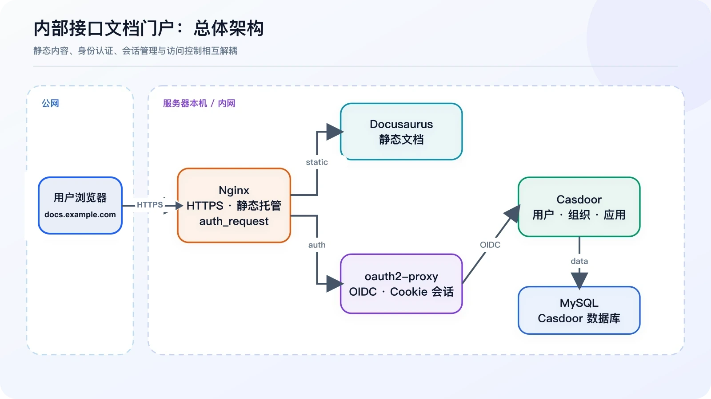
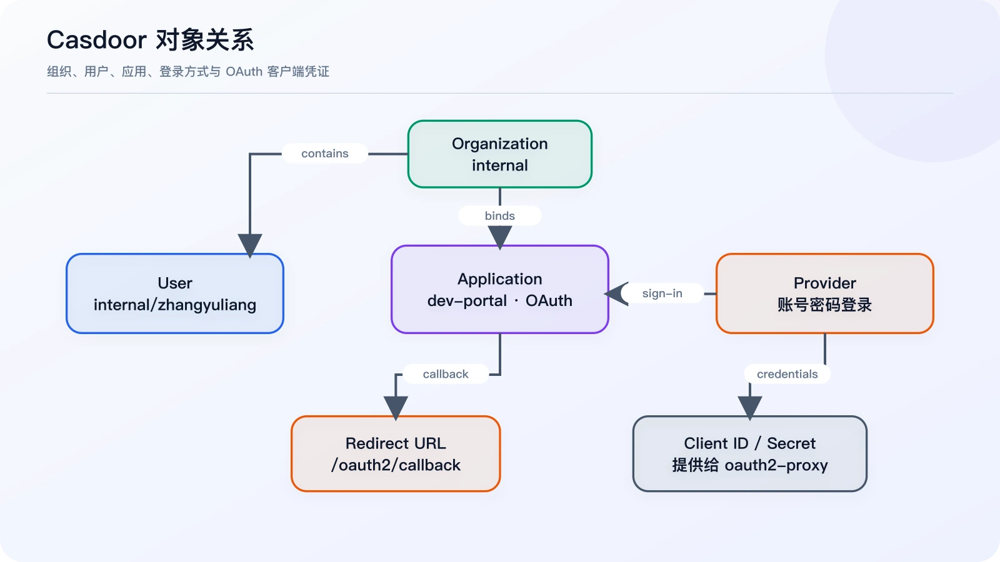
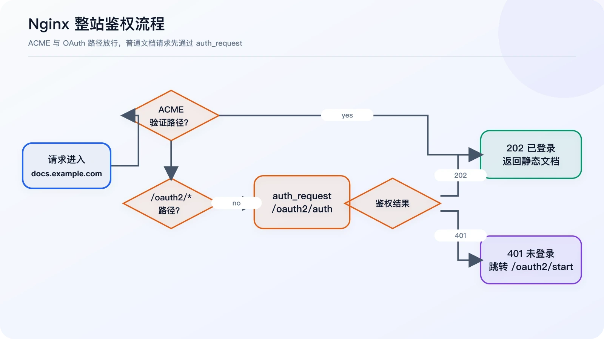
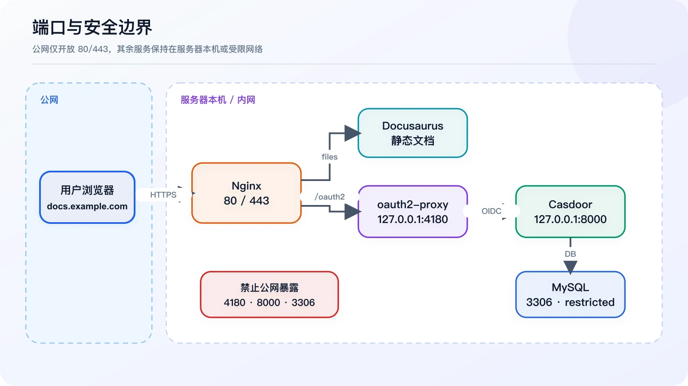
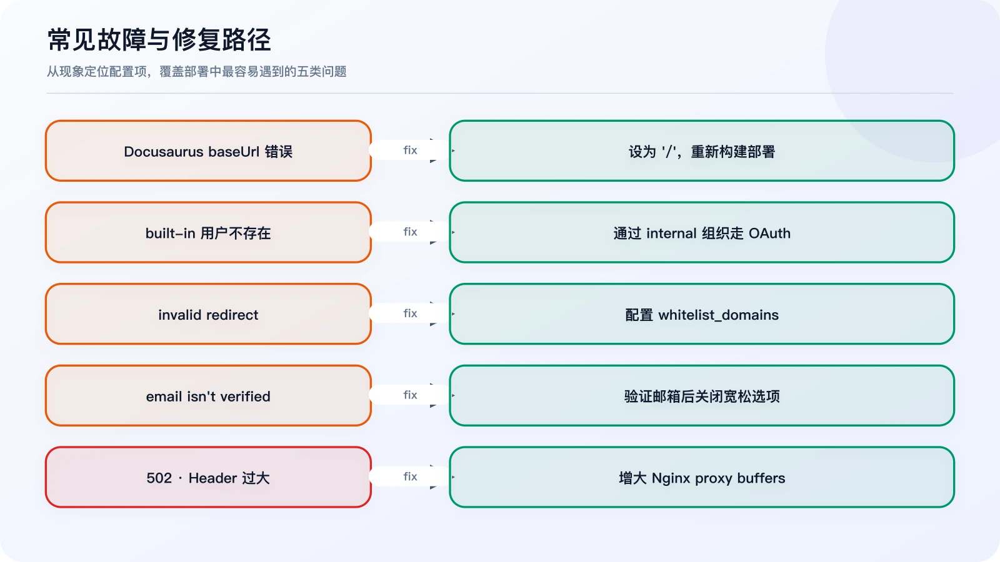
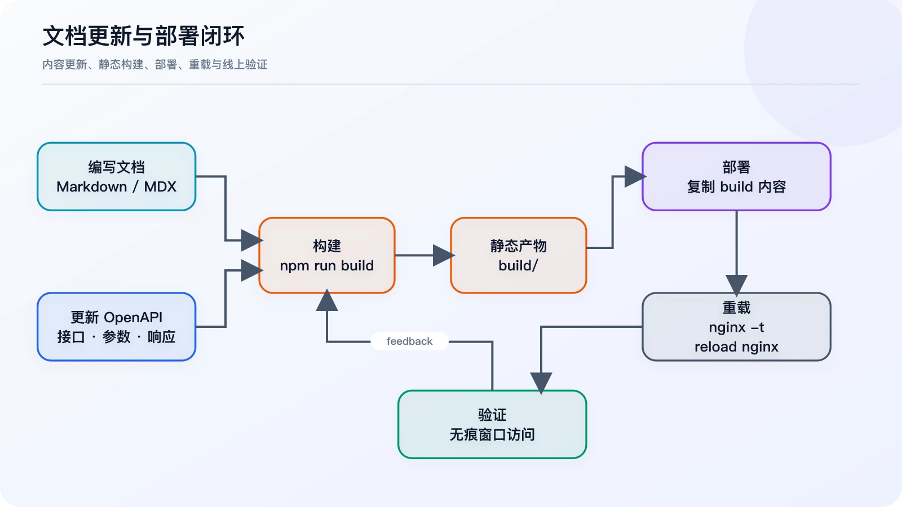

我们希望搭建一个长期可维护的内部接口文档站，用来沉淀 HTTP API、Kafka 消息、登录认证、错误码、部署手册、排查经验和版本更新记录。

Docusaurus 很适合生成和维护静态文档，但静态站本身没有服务端鉴权能力。把登录逻辑写进前端既不安全，也会让文档项目承担不该承担的职责。因此，我最终把系统拆成四层：

| 组件 | 职责 |
| --- | --- |
| Docusaurus | 生成并展示静态文档 |
| Casdoor | 管理组织、用户、应用与登录认证 |
| oauth2-proxy | 处理 OIDC 登录、回调和 Cookie 会话 |
| Nginx | HTTPS、反向代理、静态托管和整站鉴权 |



*图 1：总体架构。浏览器只访问 Nginx，文档静态文件、认证代理和身份服务位于服务器侧。*

最终访问链路如下：

```text
用户访问 https://docs.example.com
  ↓
Nginx 发起 auth_request
  ↓
oauth2-proxy 检查登录状态
  ↓ 未登录
跳转到 https://auth.example.com，由 Casdoor 完成登录
  ↓
回调 https://docs.example.com/oauth2/callback
  ↓
oauth2-proxy 写入 Cookie，Nginx 放行 Docusaurus 静态文件
```

这套方案使用两个子域名：`auth.example.com` 是 Casdoor 登录中心，`docs.example.com` 是受保护的 Docusaurus 文档站。

## 一、部署 Docusaurus

Docusaurus 执行 `npm run build` 后会生成 `build/`。部署时要复制 **build 目录里的内容**，而不是把整个目录再套一层：

```text
/var/www/openapi-docs/index.html
/var/www/openapi-docs/404.html
/var/www/openapi-docs/assets/
/var/www/openapi-docs/docs/
```

不要部署成 `/var/www/openapi-docs/build/index.html`。

因为站点直接挂在域名根路径，`docusaurus.config.ts` 应配置为：

```ts
export default {
  url: "https://docs.example.com",
  baseUrl: "/",
};
```

如果写成 `baseUrl: '/openapi/'`，浏览器会提示当前 base URL 与访问路径不一致。修改后重新构建和部署：

```bash
npm run build

rm -rf /var/www/openapi-docs/*
cp -r build/* /var/www/openapi-docs/
chown -R www-data:www-data /var/www/openapi-docs
nginx -t
systemctl reload nginx
```

执行清空命令前，请先确认目标目录准确，并按你的生产环境策略做好备份或原子切换。

## 二、部署与配置 Casdoor

Casdoor 负责统一认证。本次只启用账号密码登录，暂不接入微信、企业微信等第三方登录，以降低第一阶段的复杂度。

Casdoor 的公网地址是 `https://auth.example.com`，容器端口只绑定本机 `127.0.0.1:8000`，再由 Nginx 反向代理。管理后台需要完成以下配置：

1. 创建组织 `internal`。
2. 在组织下创建用户，例如 `internal/zhangyuliang`。
3. 创建 OAuth 应用 `dev-portal`，并绑定 `internal` 组织。
4. 启用账号密码 Provider。
5. 将 Redirect URL 设置为 `https://docs.example.com/oauth2/callback`。
6. 保存应用生成的 Client ID 和 Client Secret，供 oauth2-proxy 使用。



*图 2：Casdoor 对象关系。用户属于组织，应用绑定组织与登录 Provider，并把回调地址和客户端凭证提供给 oauth2-proxy。*

Redirect URL 不能写成 `https://auth.example.com/oauth2/callback`，因为登录完成后，真正处理回调的是文档域名下的 oauth2-proxy。

还有一个容易误解的点：直接访问 `https://auth.example.com/login` 会进入 `built-in` 组织的登录页。输入 `zhangyuliang` 时，Casdoor 查找的是 `built-in/zhangyuliang`，而不是 `internal/zhangyuliang`。

如需单独测试 internal 组织用户，可以访问：

```text
https://auth.example.com/login/internal
```

正式使用文档站时不需要手动打开这个地址，oauth2-proxy 会发起正确的 OAuth 登录流程。

## 三、配置 oauth2-proxy

oauth2-proxy 连接 Nginx 与 Casdoor。这里将部署目录设为 `/opt/oauth2-proxy/`，配置文件为 `/opt/oauth2-proxy/oauth2-proxy.cfg`：

```toml
http_address = "0.0.0.0:4180"
provider = "oidc"
provider_display_name = "Casdoor"

client_id = "替换为 Casdoor Application 的 Client ID"
client_secret = "替换为 Casdoor Application 的 Client Secret"

oidc_issuer_url = "https://auth.example.com"
redirect_url = "https://docs.example.com/oauth2/callback"
scope = "openid email profile"

email_domains = [ "*" ]
whitelist_domains = [ "docs.example.com" ]

# 仅作为邮箱尚未完成验证时的临时兼容选项
insecure_oidc_allow_unverified_email = true

cookie_name = "_oauth2_proxy_docs"
cookie_secret = "替换为随机生成的 cookie secret"
cookie_secure = true
cookie_httponly = true
cookie_samesite = "lax"

reverse_proxy = true
skip_provider_button = true
set_xauthrequest = true

upstreams = [
  "static://202"
]
```

生成 Cookie secret：

```bash
openssl rand -base64 32 | tr -- '+/' '-_'
```

Docker Compose 配置：

```yaml
services:
  oauth2-proxy:
    image: quay.io/oauth2-proxy/oauth2-proxy:v7.15.3
    container_name: oauth2-proxy
    restart: unless-stopped
    ports:
      - "127.0.0.1:4180:4180"
    volumes:
      - ./oauth2-proxy.cfg:/etc/oauth2-proxy/oauth2-proxy.cfg:ro
    command:
      - --config=/etc/oauth2-proxy/oauth2-proxy.cfg
```

启动并查看日志：

```bash
cd /opt/oauth2-proxy
docker compose up -d
docker logs -f oauth2-proxy
```

验证服务：

```bash
curl -I http://127.0.0.1:4180/oauth2/auth
```

未登录时返回 `HTTP/1.1 401 Unauthorized` 是正常现象，说明鉴权端点已经工作。

## 四、配置 docs.example.com 的 Nginx 鉴权



*图 3：Nginx 鉴权流程。ACME 和 OAuth 路径直接转发，普通页面通过 auth_request 判断返回 202 还是 401。*

核心路由规则只有三条：

- `/.well-known/acme-challenge/` 直接放行，用于证书验证；
- `/oauth2/` 转发给 oauth2-proxy；
- `/` 先通过 `/oauth2/auth` 做内部鉴权，成功后再读取 Docusaurus 静态文件。

完整配置如下，证书路径请按实际环境替换：

```nginx
upstream docs_oauth2_proxy_backend {
    server 127.0.0.1:4180;
    keepalive 32;
}

server {
    listen 80;
    server_name docs.example.com;

    location ^~ /.well-known/acme-challenge/ {
        root /www/server/stop;
        allow all;
    }

    location / {
        return 301 https://$host$request_uri;
    }
}

server {
    listen 443 ssl http2;
    server_name docs.example.com;

    ssl_certificate /etc/ssl/example.com_bundle.pem;
    ssl_certificate_key /etc/ssl/example.com.key;
    ssl_protocols TLSv1.2 TLSv1.3;
    ssl_session_cache shared:SSL:10m;
    ssl_session_timeout 10m;
    ssl_prefer_server_ciphers on;
    ssl_ciphers HIGH:!aNULL:!MD5;

    add_header Strict-Transport-Security "max-age=31536000" always;
    error_page 497 https://$host$request_uri;

    access_log /var/log/nginx/docs.example.com.access.log;
    error_log /var/log/nginx/docs.example.com.error.log;

    root /var/www/openapi-docs;
    index index.html;
    client_max_body_size 50m;

    proxy_buffer_size 256k;
    proxy_buffers 16 256k;
    proxy_busy_buffers_size 512k;

    location ^~ /.well-known/acme-challenge/ {
        root /www/server/stop;
        allow all;
    }

    location ^~ /oauth2/ {
        proxy_pass http://docs_oauth2_proxy_backend;
        proxy_http_version 1.1;
        proxy_set_header Host $host;
        proxy_set_header X-Real-IP $remote_addr;
        proxy_set_header X-Scheme $scheme;
        proxy_set_header X-Forwarded-Proto $scheme;
        proxy_set_header X-Forwarded-For $proxy_add_x_forwarded_for;
        proxy_set_header X-Auth-Request-Redirect $scheme://$host$request_uri;

        proxy_buffer_size 256k;
        proxy_buffers 16 256k;
        proxy_busy_buffers_size 512k;
    }

    location = /oauth2/auth {
        internal;
        proxy_pass http://docs_oauth2_proxy_backend;
        proxy_http_version 1.1;
        proxy_set_header Host $host;
        proxy_set_header X-Real-IP $remote_addr;
        proxy_set_header X-Scheme $scheme;
        proxy_set_header X-Forwarded-Proto $scheme;
        proxy_set_header X-Forwarded-For $proxy_add_x_forwarded_for;
        proxy_set_header X-Forwarded-Uri $request_uri;
        proxy_set_header Content-Length "";
        proxy_pass_request_body off;

        proxy_buffer_size 256k;
        proxy_buffers 16 256k;
        proxy_busy_buffers_size 512k;
    }

    location / {
        auth_request /oauth2/auth;
        error_page 401 = @oauth2_start;

        auth_request_set $auth_user $upstream_http_x_auth_request_user;
        auth_request_set $auth_email $upstream_http_x_auth_request_email;
        add_header X-Auth-User $auth_user;
        add_header X-Auth-Email $auth_email;

        try_files $uri $uri.html $uri/ /404.html;
    }

    location @oauth2_start {
        return 302 /oauth2/start?rd=$scheme://$host$request_uri;
    }

    location ~ ^/(\.user\.ini|\.htaccess|\.git|\.env|\.svn|\.project|LICENSE|README\.md|package\.json|package-lock\.json|yarn\.lock|pnpm-lock\.yaml)$ {
        return 404;
    }

    location ~ ^/\.well-known/.*\.(php|jsp|py|js|css|lua|ts|go|zip|tar\.gz|rar|7z|sql|bak)$ {
        return 403;
    }
}
```

应用配置：

```bash
nginx -t
systemctl reload nginx
```

安全边界上，公网只开放 Nginx 的 80/443。oauth2-proxy 的 4180、Casdoor 的 8000 都只监听本机，MySQL 的 3306 也应通过安全组或防火墙限制来源。



*图 4：端口与安全边界。公网只暴露 80/443，4180、8000 和 3306 不直接对公网开放。*

## 五、本次踩到的 5 个坑



*图 5：五类访问异常及其对应修复措施。*

### 1. Docusaurus baseUrl 配错

**现象**：页面提示 `Current configured baseUrl = /openapi/`。

**原因**：构建路径是 `/openapi/`，实际却从域名根路径访问。

**解决**：改为 `baseUrl: '/'`，重新构建并覆盖静态目录。

### 2. Casdoor 默认登录页只查 built-in 组织

**现象**：提示用户 `built-in/zhangyuliang` 不存在。

**原因**：`/login` 默认属于 `built-in` 组织。

**解决**：管理后台继续使用 `built-in/admin`；文档站用户放在 `internal` 组织。正式登录由 oauth2-proxy 发起，不手动访问 `/login`。

### 3. oauth2-proxy 报 invalid redirect

日志：

```text
Rejecting invalid redirect "https://docs.example.com/": domain / port not in whitelist
```

在配置中加入：

```toml
whitelist_domains = [ "docs.example.com" ]
```

### 4. oauth2-proxy 拒绝未验证邮箱

日志：`email in id_token (...) isn't verified`。

原因是 Casdoor 返回了 `email_verified=false`。临时可设置 `insecure_oidc_allow_unverified_email = true`，长期方案是在 Casdoor 中将邮箱标记为已验证，然后移除这一宽松选项。

### 5. 登录回调后 Nginx 返回 502

错误日志：

```text
upstream sent too big header while reading response header from upstream
```

oauth2-proxy 回调写入的 Cookie/Header 较大，超过了 Nginx 默认缓冲区。在全局以及 `/oauth2/`、`/oauth2/auth` 两个 location 中配置：

```nginx
proxy_buffer_size 256k;
proxy_buffers 16 256k;
proxy_busy_buffers_size 512k;
```

## 六、部署后的验证流程

先验证 Casdoor 的 OIDC discovery：

```bash
curl -I https://auth.example.com/.well-known/openid-configuration
```

正常应返回 200。再验证 oauth2-proxy：

```bash
curl -I http://127.0.0.1:4180/oauth2/auth
```

未登录时应返回 401。最后用无痕窗口访问 `https://docs.example.com`，完整流程应当是：

```text
跳转到 auth.example.com
  ↓
输入 internal 组织的用户账号和密码
  ↓
登录成功并回到 docs.example.com
  ↓
正常看到 Docusaurus 文档站
```

## 七、后续维护

登录链路稳定后，日常维护只需要关注 Docusaurus 内容。推荐将流程封装成部署脚本：



*图 6：文档维护流程。从内容更新、构建、部署到线上验证形成完整闭环。*

```bash
#!/usr/bin/env bash
set -e

APP_DIR="/opt/openapi-docs"
WEB_DIR="/var/www/openapi-docs"

cd "$APP_DIR"
npm run build

rm -rf "$WEB_DIR"/*
cp -r build/* "$WEB_DIR"/
chown -R www-data:www-data "$WEB_DIR"

nginx -t
systemctl reload nginx

echo "Docusaurus docs deployed."
```

生产环境可以进一步改为带时间戳的 release 目录和软链接切换，从而保留上一版本并快速回滚。

## 总结

这套架构让文档站继续保持纯静态，同时把身份、会话和访问控制交给专门的组件：Casdoor 统一管理用户，oauth2-proxy 负责 OIDC 会话，Nginx 保护整站。它不要求在 Docusaurus 内编写登录逻辑，认证层也可以继续复用到 n8n、ShowDoc、Hoppscotch、RuoYi 等内部系统。

第一阶段完成后，未登录用户无法访问文档，登录用户可以正常阅读，访问控制与内容系统彼此解耦。后续的重点不再是反复折腾登录，而是持续补充内容，把它建设成真正可复用的内部开发者门户。
