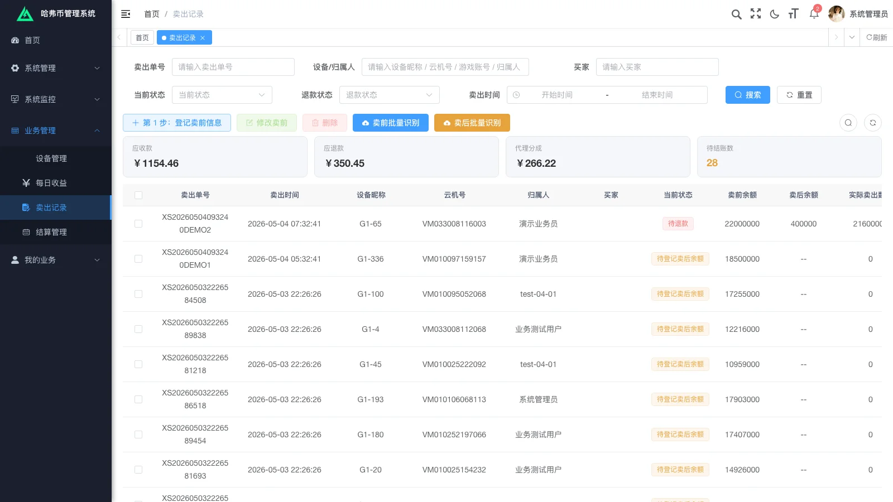

# 半个月、5 轮迭代、0.29 元 OCR：一个被平台政策杀死的全栈项目复盘

## 一、项目讣告

上个月帮朋友定制了一套内部管理后台，跨度半个多月，前后 5 轮需求迭代，主力开发是 Claude Code，集成阿里百炼的视觉模型做图片识别。

第五轮交付完成的第二天，朋友的腾讯账号被全面封禁，10 年老号，项目当天彻底关停。

一行代码没改，系统就死了。

这篇复盘想讲三件事：

1. 2026 年的 AI 编码到底强到什么程度
2. 5 轮口语化反馈，怎么管成可执行的需求
3. 工程做对了，但商业判断做错了，会发生什么

---

## 二、系统是什么

业务定位很简单：**游戏账号收益的内部管理后台**。

每天，业务员要面对一堆第三方软件吐出来的截图——账号余额、产出明细——人肉抄到 Excel 再对账，错漏率高、时效性差。我们做的事情就是把这件事系统化：设备、账号、每日产出、卖出记录、结算单，五张主表打通；截图自动识别成结构化数据，自动入库、自动对账。

抽象一下数据模型，差不多是这样：

```
device ──┬── account ──┬── daily_income
         │             └── sale_record ── settlement
         └── operator
```

技术栈一句话：**若依（RuoYi-Vue）二开 + 阿里百炼 qwen-vl-max + Claude Code 主力开发**。



---

## 三、技术栈选型与取舍

### 为什么选若依

客户预算紧、交付窗口短。若依自带权限、字典、代码生成器、菜单、日志，开箱可用。从零写一套权限体系再做业务，时间至少多花 60%。这个项目没有任何理由不复用。

二开的代价是每次升级若依底座要小心，但客户后续不打算大版本升级，权衡之后选若依完全成立。

### 为什么选阿里百炼 qwen-vl-max

候选有 GPT-4V、Gemini、阿里百炼、智谱 GLM-4V 几家。最终选阿里百炼的理由：

- **国内合规**：客户场景是国内 toB，数据走境内通道是硬要求
- **中文截图准**：第三方软件截图大量中文文本和数字，qwen-vl-max 在这种场景下识别率高
- **计费便宜**：按 token 计费，单次截图大概 800–900 tokens，单价友好
- **接入简单**：DashScope SDK 一行调用，不需要复杂 prompt 工程

### 为什么不上 Spring AI / LangChain

这个项目里 AI 只承担一个明确的单点能力：把图片转成结构化字段。包一层 RestTemplate 调 DashScope HTTP 接口就够。引入 Spring AI 的好处主要在多模型路由、agent 编排、向量检索——这些功能在本项目里全都用不上。引入大框架等于增加无效复杂度。

工程取舍的原则是：**能少一层就少一层**。

### 影刀 RPA MCP（备用未启用）

仓库里有一份 `yingdao_mcp_server/`。原计划是把第三方软件操作也自动化掉（Claude Code 通过 MCP 直接驱动影刀做点击/截图），但客户最终反馈"业务员每天点点就行不用全自动"，没启用。这部分代码留着备用。

---

## 四、AI 开发力压测：0.29 元跑完 150 次识别

这是整个项目最反直觉的部分。


**阿里百炼后台数据**：
- 调用模型数：1（qwen-vl-max）
- 调用成功总次数：150 次
- Token 总数：127K
- 平均单次请求：849 tokens

**阿里云月账单**：
- 应付金额：**¥0.29**
- 优惠抵扣：¥0
- 命中优惠：否

整整 150 次多模态图像识别，全栈联调期间反复回归测试，**总共花了 0.29 元**。token 经济学已经被打到了"对中小项目几乎免费"的水平。

Claude Code 在这次的角色更直接：

- 设计阶段：和我对话拆需求、写设计文档草稿
- 编码阶段：写 Service、Mapper、XML、Vue 组件、Element Plus 表单
- 联调阶段：复现客户截图里的 bug、读 Mapper SQL 改时间筛选精度
- 文档阶段：生成《操作手册-用户篇》《操作手册-管理员篇》两份带截图的手册（管理员篇 4 万字+）

我的角色更多是"产品 + 架构 + 客户接口人"，**写代码这件事在这个项目里几乎不再是瓶颈**。

但代码生成快，不等于项目交付快。真正的瓶颈在下一节。

---

## 五、5 轮需求迭代怎么管

客户反馈的形态长这样：

- **语音**："这版改的有点乱，其它不重要，现在要统计总数量，根据勾选的统计出卖前总余额和卖后总余额"
- **文字**："新增设备加一个录入人员，默认是当前登陆用户，也可以修改"
- **截图**：3 张错误状态截图 + 一句"结算状态没有跟着变"

无结构、有歧义、混合载体。**直接照着做就是返工。**

我自己定的处理流程是：每一轮收到反馈，先把客户原话**逐条抄录到一份确认稿里**，然后给每条拆出三栏：

| 我方理解 | 当前实现现状 | 待客户拍板的细节（Q&A 选项） |

让客户在每个 Q 下面**勾选**，而不是凭印象描述。

举两个真实案例。

### 案例 1：勾选汇总

客户原话："**最重要、最重要**的就是根据勾选显示出代币总数，这个我们要给老板报。"

直接照做，会做出"勾选行的余额合计"。但拆细之后发现至少 3 个待定项：

- **Q1.1**　原有 4 张汇总卡怎么处理？全部保留 / 全部替换 / 只留几张（具体留哪几张要客户指明）
- **Q1.2**　没有勾选任何行时，显示什么？显示 0 / 灰色提示 / 自动汇总当前页
- **Q1.3**　翻页之后勾选状态要保留吗？保留（跨页累加） / 不保留（翻页清空）

每一个 Q 都是真实分歧点。如果不在确认稿里逼出来，等开发完了客户一句"不是我想要的"就要返工。


### 案例 2：字段命名歧义

客户截图反馈"卖出记录的结算状态没有根据结算管理同步改变"。

我读源码发现：后端 `BizSettlementServiceImpl.syncSettlementBizRecords()` 逻辑是对的，根据 `BizSettlementItem.bizType='SALE'` 把对应 `BizSaleRecord.settle_status` 置 1，绑定 `settlement_id`。**但**前端列表展示的列叫"结账状态"，prop 是 `settledFlag`（手工标记字段），**不是** `settleStatus`（自动同步字段）。两个字段命名相近、语义不同，看起来"没变"实际上是显示了错的字段。

如果直接照客户说的"修后端同步逻辑"去改，就是错的修法。**真正的 bug 是前端列展示了错误的字段，或者两个字段的命名/语义本身就该重构。**

这种歧义如果不在确认稿里把"客户说的没变"和"代码里到底哪条逻辑没跑"对齐，就会反复返工。

### 教训

AI 让写代码快了 10 倍。但**把客户的口语反馈翻译成确定的需求**，AI 帮不上。这一步还是只能靠人——靠你强迫客户在选项里勾选，而不是靠脑补。

这件事也是 AI 时代外包/接活的真正护城河。代码人人都能让 AI 写出来，需求确定性和产品判断不是。

---

## 六、工程做完了，但业务死了

5-07 上午，第五轮交付收口。`CHANGES.md` 列了 6 项主要变更 + 1 项优化，全部完成并通过编译：

1. 时间筛选支持时分秒精度
2. 列名调整（云机号 → 设备编号）
3. 退款流程自动化（移除手动确认按钮）
4. 操作员奖励口径从"比例"改为"固定金额"
5. 设备管理默认奖励口径同步调整
6. OCR 批量识别支持手动编辑
7. OCR 识别精度优化（小额阈值过滤）


同一周，朋友的腾讯账号被批量封禁，10 年老号。项目当天关停。

一行代码没改，系统下线。

### 真正的反思

技术评估之外，必须做**平台风险评估**。

接外包、做朋友的项目，大家容易盯着技术可行性、预算、工期。但有一类风险被反复忽略：**这个业务在它依赖的渠道（微信、抖音、支付宝、应用市场）那边，是合规的吗？是灰区吗？是政策窗口随时会关的吗？**

这一项不过关，AI 写得再快也是埋单。

我下次会做的：项目启动会增加一个环节，**平台依赖清单 + 政策稳定性自评**：

- 列出业务赚钱链路上所有依赖的平台
- 对每个平台标注：白 / 灰 / 黑
- 灰区以上的项目，要么不接，要么定金一次付清、合同里写清楚平台风险归属
- 约定平台政策变化时双方的退出机制

这不是法务问题，是**项目可行性评估的一部分**。

---

## 七、结语

AI 开发力 = 加速器。
平台政策 = 刹车 + 急停按钮。

两件事没有先后——**刹车永远先于加速器**。

2026 年再说"开发太贵"基本上是借口。但说"项目失败是因为技术没做完"，更像是借口。

这次不是技术失败，是商业判断失败。

下次先做后者。
