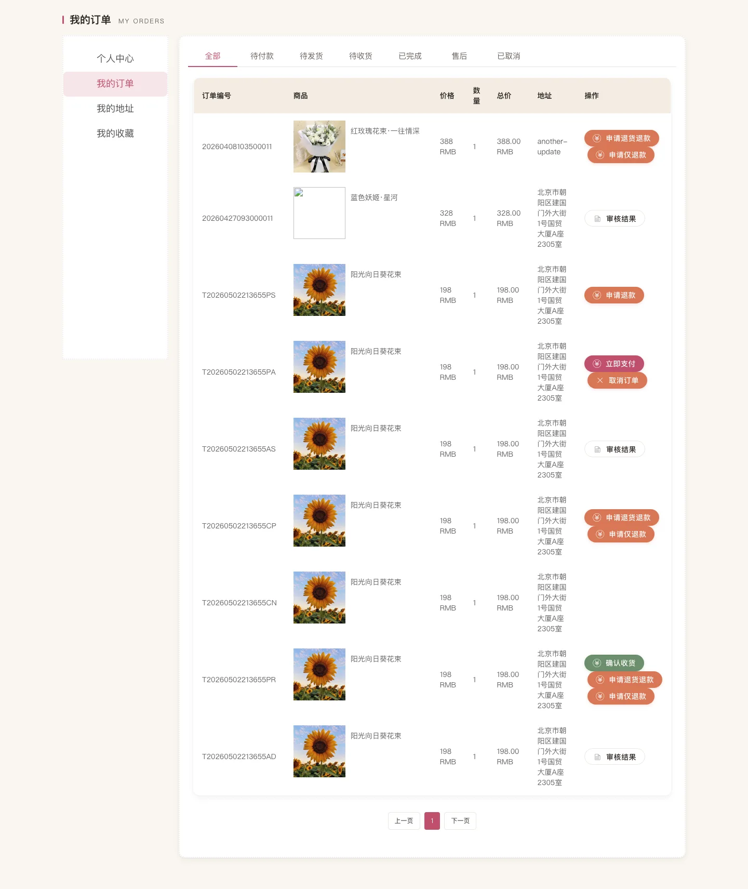
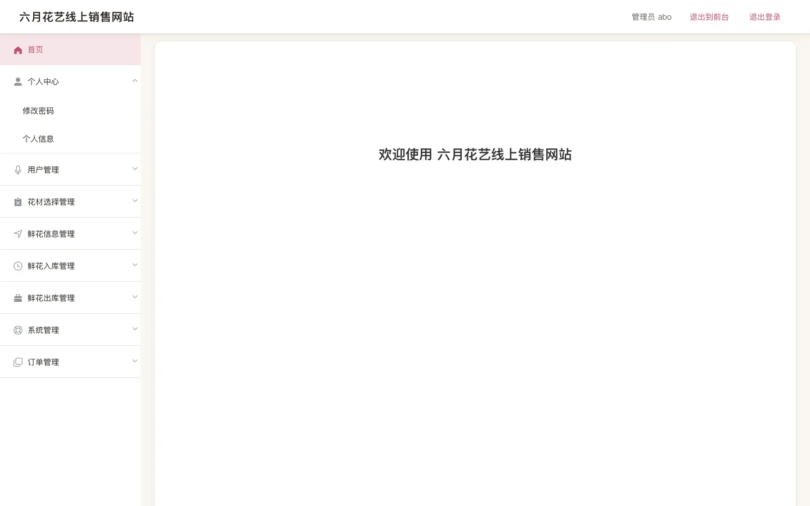
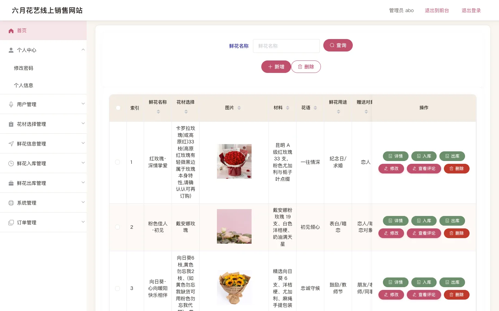
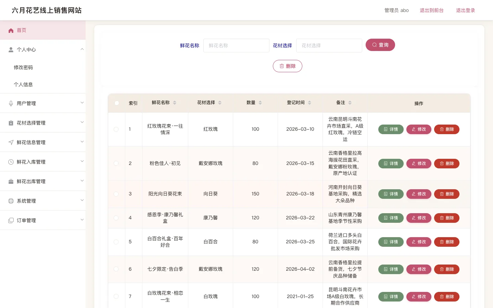
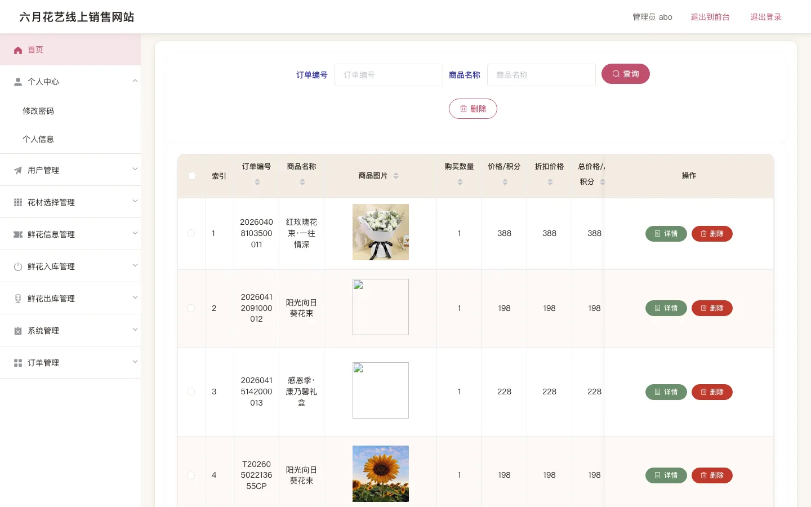

> TL;DR — 五一前接的一个毕设外包，主题是鲜花商城。**前后端全程 Claude Code 托管，4-5 天 4-5 轮迭代，最终交付：可运行系统 + 论文 30+ 张配图 + 答辩 PPT。** 客户回头介绍了下一单。

这是一篇"我是怎么用 AI 做完外包"的复盘。不是教程，是观察 + 方法论。

## 一、单子长什么样

五一节前，朋友给我推了一个毕业设计外包，主题叫「六月花艺线上销售网站」。技术栈：

- **后端**：Spring + SpringMVC + MyBatis-Plus（标准 SSM），Druid 连接池，MySQL 5.7
- **前台**：jQuery + Layui + Vue 2，老式三件套混搭
- **后台**：Vue 2 + Vue Router + Element UI，标准管理 SPA
- **认证**：Token-based，自定义拦截器把 `userId / role / tableName / username` 注入 session

业务上是个鲜花商城：商品（鲜花 / 花材 / 永生花）、订单（含退款 / 退货）、库存（入库 / 出库联动）、客服 chat、新闻、用户中心。

打开仓库的第一感觉是：**这玩意儿是个半成品**。

- 前台首页是 2015 风灰底 + 宋体
- 后台一半的按钮点了 500
- 订单状态流转是断的
- 退款功能根本没写
- 文档（用户手册、ER 图、PPT）一份没有

正常思路是要么推掉，要么从头重做。但我手上有 Claude Code，所以我接了。

## 二、改造路径：为什么我先改前端，最后才动后端

我做的第一个反直觉决定：**前台 UI → 后台 UI → 后端代码**，反过来。

教科书会告诉你应该先把数据模型对齐再写前端。但跟 Claude Code 一起干活，这个顺序是错的。

**原因 1：可即时验证的范围更小，AI 出错少。**

让 Claude Code 改一个 `Home.vue`，它做完我打开浏览器就能看见对错。让它改一个跨三个表的事务方法，它做完我得跑 mvn 打 war 部署到 Tomcat 才能看见对错。前者验证耗时 5 秒，后者 5 分钟。当 AI 还会犯错的时候，**让验证回路尽可能短**比什么都重要。

**原因 2：先把 UI 做出来，后续描述需求成本更低。**

后端的业务字段和逻辑大多是对的，只是被烂 UI 遮住了。先不动它。先把 UI 做漂亮——做完之后，再描述新需求时，我可以指着具体的页面说"这个购物车要支持批量结算"，而不是抽象地讲"购物车实体加一个 selected 字段"。**让对话锚定在用户能看见的东西上**，AI 误解的概率会降一个数量级。

**原因 3：心理收益。**

前台改完是立竿见影的——丑变好看，需要不到一天。这种正反馈对接外包的人来说是必要的，因为接下来还要打硬仗。

## 三、第一阶段：前台改造（Day 1）

我直接把前台首页和 Claude Code 的对话起手是这样的：

> "这是一个鲜花商城网站的前台。技术栈是 jQuery + Layui + Vue 2。当前 UI 太老了。请重做整个前台风格：参考小红书、花点时间的视觉调性，柔粉/米白主色，整体感觉精致、年轻、像精品。先做首页（Home.vue），其他页面后面分批做。要求：
> 1. 不动后端接口和数据结构
> 2. 不引入新的 UI 库（只用现有的 Layui + Vue 2）
> 3. 保留现有路由和数据绑定
> 4. 用 SCSS 抽 skin 文件，便于后续整体换肤"

第三、第四条是关键。**它给 Claude Code 设了边界**——不准动 schema、不准引入新依赖。这两条是后面所有页面改造的隐性前提。

Claude Code 第一轮交付的首页就直接能看：


后面用同样的对话模板做了商品列表、详情页、购物车、订单页：




整个前台 14 个页面，**一天搞完**。

## 四、第二阶段：后台改造（Day 2）

后台的活是体力活。十几个 CRUD 模块（鲜花信息 / 鲜花入库 / 鲜花出库 / 花材选择 / 订单 / 用户 / 评论 / 新闻 / 客服），每个都是 Element UI 的标准三段：搜索栏 + 表格 + 操作按钮。

策略很简单：**改一个当样板，剩下让 Claude Code 照着改。**

我先把 `admin-flower.vue` 改成定稿版本（粉色系 skin、表格圆角、按钮分组），然后告诉 Claude Code：

> "用 admin-flower.vue 当样板，把 admin/src/views/ 下所有列表页都按这个风格改一遍。要求：
> 1. 不改路由，不改 API 调用
> 2. 抽 mixin / 抽组件能抽就抽，但不要过度
> 3. 改完每个文件给我列出来，让我抽几个验证"

它在一个上下文里把十几个页面全改了。我抽样验证了 4 个，全过。







后台改造，**第二天结束**。

## 五、第三阶段：后端补完（Day 3-4）

到这里 UI 已经像个能上线的产品了，但很多功能还是断的。最严重的几个：

1. **订单状态流转**：从「待付款 → 已付款 → 待发货 → 已发货 → 已完成」整条链路有断点
2. **退款 / 退货退款**：根本没写
3. **库存联动**：鲜花信息表的 `kucun` 字段不会随着入库 / 出库自动调整
4. **支付**：原代码硬编码了"扣余额"，没有支付模拟流程

这一阶段就开始动后端代码了。Spring MVC controller、MyBatis-Plus mapper、service 层。

我跟 Claude Code 的协作方式变了——前面是"按样板做"，这里变成"按业务逻辑做"。我会先用一段中文描述完整的业务流程：

> "用户下单的流程是：购物车 → 选地址 → 提交订单（生成订单号、扣库存、不扣余额、状态=待付款）→ 模拟支付（扣余额、状态=待发货）→ 后台发货（状态=待收货）→ 用户收货（状态=已完成）。
>
> 退款流程：用户在「待发货」或「待收货」状态可以发起仅退款 / 退货退款；后台审核通过后，状态变成 已退款，库存回滚。
>
> 库存联动：入库单审核通过 → kucun += quantity；出库单审核通过 → kucun -= quantity；订单生成 / 退款回滚都要联动。
>
> 现在告诉我：当前代码里这套流程哪些已经写了、哪些缺、哪些是错的。先不要改，先列清单。"

让它先**审计**再**实现**，是这种复杂业务的关键。Claude Code 会列出来：

```
- OrderController#createOrder：缺库存扣减、缺事务
- OrderController#refund：根本没有这个方法
- XianhuarukuService#audit：写了，但没触发库存联动
...
```

清单出来后，我一项项去描述要怎么改，Claude Code 一项项实现。每改完一项，我开浏览器跑一遍，验证通过再走下一项。

第三天和第四天，做完了订单全链路 + 退款 + 库存联动。



这一阶段最大的体会是：**Claude Code 不会魔法。** 你描述得越清楚，它做得越准；你含糊，它就猜，猜错就要回滚。所以这阶段最值钱的不是 prompt 工程花式，而是把业务逻辑写清楚的能力——这是经验，不是话术。

## 六、第四阶段：文档 + 论文 + PPT（Day 5）

毕设要交的不只是代码，还有论文和答辩。

论文里要改一堆图——ER 图、业务流程图、交互图——一共三四十张。这部分代码做不了，我用的是 **Claude Cowork**（Anthropic 另一个产品形态，专门做内容协作）。

> **Claude Code vs Claude Cowork 的分工**：
> - 写代码、读代码、跑命令、改文件 → Claude Code
> - 画图、做 PPT、写论文段落、内容创作 → Claude Cowork
>
> 这两年我的经验是这两个工具不要混用。Code 不擅长视觉创作；Cowork 不擅长跑环境。各干各的，效率最高。

论文的 ER 图、业务流程图、补充图（drawio 格式）、数据库表结构（docx）、用户手册（md + html）都是 Cowork 出。我做的是把它们 review 一遍，调整不合理的字段命名和流程箭头方向。

最后还要一份答辩 PPT。Cowork 直接按论文章节生成大纲 → 我修一遍 → 渲染成 pptx。

第五天结束，所有交付物齐活：

- 一个能跑的 SSM + Vue 鲜花商城
- 一份 1.0 版的用户手册（HTML + 截图）
- 30+ 张论文配图（ER / 流程 / 交互）
- 一份数据库表结构 docx
- 一份答辩 PPT

## 七、买家回头又介绍了一单

交付后一周内，买家又给我推了一个小单子——**只要答辩 PPT，不要代码**。我就更省事了，全程 Claude Cowork，半天搞完。

这件事让我想到一个商业层面的观察：**用 AI 做交付，复购率高得离谱**。原因不在于价格——AI 对价格压力的影响其实没那么大；原因在于"快"和"稳"。买家一旦发现你能在他们要的时间内交付他们要的东西，他们会反复找你。

## 八、几个 Claude Code 实操小经验

把这次踩到的坑提炼出来，方便下次复用：

**1. 让 AI 先审计，再实现。** 复杂业务别让它直接改，先让它列清单"哪些缺 / 哪些错 / 哪些已经对"，你 review 完再让它动手。

**2. 给硬约束，比给软偏好有用十倍。** "不要动 schema""不要引入新依赖""不要修改 API 契约"——这种硬约束 Claude Code 遵守得非常好。"代码风格优雅一点"这种就经常飘。

**3. 用样板传播风格。** 改完一个页面让它当样板，比口头描述"风格是怎样的"快得多。

**4. 验证回路要短。** 让 AI 在能 5 秒看到结果的范围里干活——前端、配置、文档；不要让它一次性改完跨三个表的事务方法再去看效果。

**5. Code 和 Cowork 分工。** 代码用 Code，文档 / 图表 / PPT 用 Cowork。两者都是 Claude，但工具形态不同，硬切的成本反而最低。

**6. 描述业务流程的能力，决定上限。** 一旦上升到"实现复杂业务"，AI 不会替你思考。你描述得清楚，它做得准；你含糊它就猜。

## 九、一个观察

做完整个项目，我最大的感受是：

> **现在做这种"标准化的简单开发"，AI 已经比绝大多数人做得好了。**

毕设这种活——业务不复杂、技术栈成熟、有明确交付物——本来就是给学生练手的。但 Claude Code 干这事的下限，已经超过了大多数学生的上限。

这意味着评估一个开发者的标准变了。**从前看的是写代码的速度、质量、风格；现在更值得看的是他能不能用好 AI**。

会用 AI 的人，五天交付一个能上线的鲜花商城；不会用的，五天还在 debug 一个 NPE。

差距已经不在"会不会写代码"，而在"会不会用 AI 写代码"。

---

我感觉，现在做这种简单的开发和任务，AI 已经比绝大多数人做得好了——我们要做的，是用好 AI。

如果你也在接外包 / 做毕设 / 做副业开发，可以留言聊聊你怎么用 Claude Code。我后面打算多接几个类似单子，做完会再写一篇更细的方法论。
