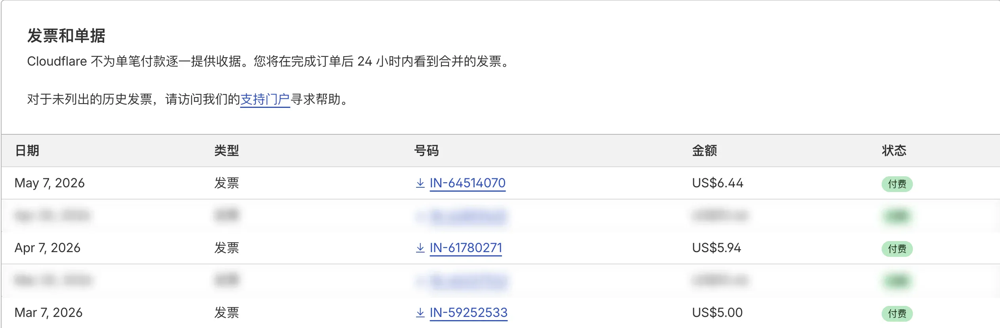
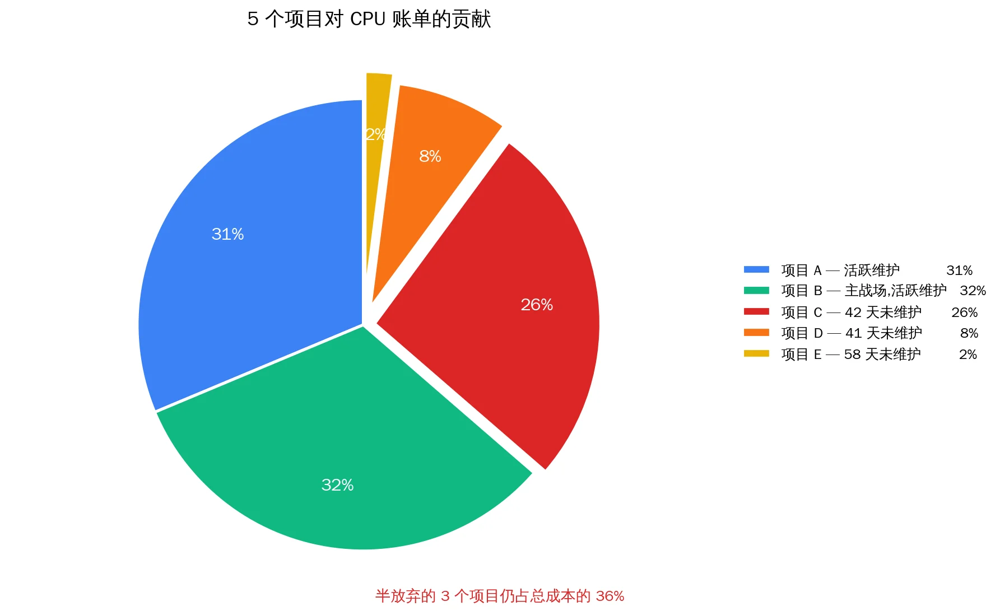
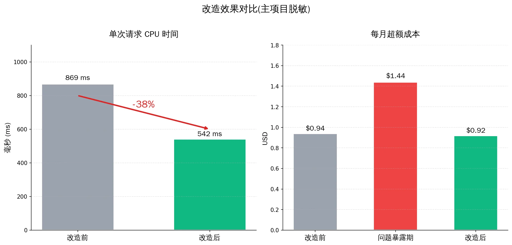
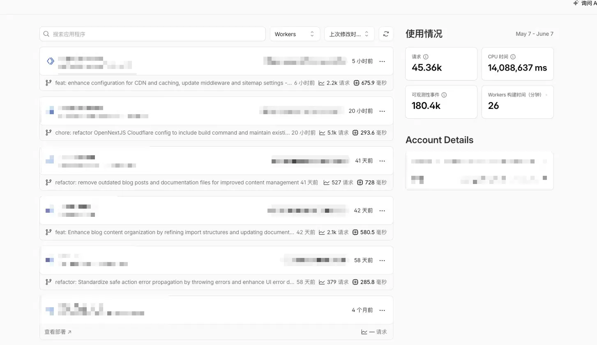

> 这不是一篇省钱教程。这是一份"5 个项目共用同一个模板，撞了同一个坑"的复盘——以及关于"几十个项目规模化时，优化的真正杠杆在哪里"的思考。

## 起点

事情起源于 5 月初某个工作日早上，我打开 Cloudflare 账单收件箱，发现这张：

```
Invoice IN-64514070
Date of issue: May 7, 2026
Amount due: $6.44 USD
```



不是大钱，但走势让我警觉：

| 月份 | 总账单 | 其中 CPU 超额 |
|---|---|---|
| 3 月（开通月） | $5.00 | $0.00 |
| 4 月 | $5.94 | $0.94（46.2M ms 超额） |
| **5 月** | **$6.44** | **$1.44（72M ms 超额）** |

环比 +56%。如果只看绝对金额，$1.44 没什么。但我同时维护着几个 SaaS 项目，且打算今年开几十个站——按这个增长率，一年后这条曲线会很难看。

更关键的是：**我根本不知道这些 CPU 是怎么花掉的。**

## 第一次摸排：5 个项目均分了账单

打开 Workers 控制台，5 个项目最近 24 小时：

| 项目 | 域名 | 请求 | 单次 CPU | 总 CPU | 状态 |
|---|---|---|---|---|---|
| tomodachi-life | islebuddies.com | 2.2k | 675.9 ms | ~1.49M | 活跃 |
| crimsondesert | crimsondeserthq.com | 5.0k | 293.6 ms | ~1.50M | 活跃 |
| curve-rush-2 | curverush2.net | 2.1k | 580.5 ms | ~1.22M | 42 天没动 |
| aimotiongen | aimotiongen.com | 527 | 728.0 ms | ~0.38M | 41 天没动 |
| seo-os | seo.frency.me | 379 | 285.8 ms | ~0.11M | 58 天没动 |



**前三个项目几乎平分账单**。这是个反直觉的发现：你不能只优化"流量最大的那个"——三家对账单的贡献几乎相等，但**优化路径完全不同**：

- tomodachi-life 单次 CPU 偏高 → 可能是 SSR 重型路径
- crimsondesert 单次 CPU 已经低 → 主要是请求量大
- curve-rush-2 单次 CPU 中等 + 42 天没维护 → 该问的是"值不值得救"

## 关键瞬间：从指标到根因

tomodachi-life 的 P90 CPU 是 1810ms，但 P50 只有 303ms——典型双峰分布，说明有一类"重型请求"在拉高均值。让 Claude Code 进项目分析，报告核心发现：

```
🔴 根因: open-next.config.ts 没启用 R2 incremental cache
   所有 marketing 页面默认 dynamic = 'auto'，因为里面调了 getTranslations()，
   Next 把它当动态页 → 每个请求都跑一次完整 SSR

🔴 H2: getRelatedGuidePosts 每次请求扫描所有 45 篇博客
🟠 H3: middleware 里 9 条 console.log，且 RegExp 每次重新编译
🟠 H4: 中文请求每次都 deepmerge 240KB 的 i18n JSON
```

我让 Claude Code 改了配置，部署，然后……**指标没什么变化**。

## 第一个陷阱：`x-nextjs-cache: HIT` 也可能没省钱

我写了个 bash 脚本，用 curl 检测每个 URL 的真实缓存状态：

```bash
URL="https://islebuddies.com/zh/guides/personality-types-guide"
for i in 1 2 3 4 5; do
  curl -sI "$URL" | grep -iE "cf-cache-status|x-nextjs-cache|age|cache-control"
done
```

结果让我重新思考：

```
Run 1: 6.31s  | cf=NA  nextjs=HIT  age=NA
Run 2: 0.81s  | cf=NA  nextjs=HIT  age=NA   ← 偶尔快一次
Run 3: 5.01s  | cf=NA  nextjs=HIT  age=NA
Run 4: 5.00s  | cf=NA  nextjs=HIT  age=NA
Run 5: 1.28s  | cf=NA  nextjs=HIT  age=NA

cache-control: s-maxage=2, stale-while-revalidate=2592000
cf-ray: ...-SIN
```

`x-nextjs-cache: HIT` 看起来缓存命中，但响应时间在 1-6 秒之间剧烈波动。**为什么？**

仔细看 header：
- `cache-control: s-maxage=2` —— Cloudflare 边缘只缓存 **2 秒**
- `cf-ray: ...-SIN` —— 请求落在新加坡 POP
- R2 bucket 在美国

意思是：**每次请求都打到 Worker，Worker 跨太平洋读 R2，然后返回大 HTML**。`HIT` 只是省了 SSR 渲染时间，**没省网络往返**。

这是优化黑盒系统的典型陷阱：**header 显示成功 ≠ 真的省钱**。

## 第二个发现：同一份模板，5 个项目都中招


更让人警醒的是，跑 `verify-cache.sh` 测不同 URL，出现了"分组失败"的模式：

```
✅ /zh/guides/personality-types-guide  → x-nextjs-cache: HIT
❌ /zh/guides                          → cache-control: no-store
❌ /zh                                 → cache-control: no-store
✅ /en/guides                          → 无 x-opennext header (走纯静态!)
✅ /en                                 → 无 x-opennext header
```

**英文版纯静态（完美），中文版列表页被强制 dynamic（灾难）**。

同一个页面模板，只因为 locale 不同，行为天差地别。这是 `next-intl` 的 `localePrefix: 'as-needed'` 配合 Next.js App Router 的一个微妙交互——默认语言不带前缀走静态路径，非默认语言带前缀进 Worker。

而这个配置，**5 个项目都从 mksaas 模板复制过来，5 个都中招**。

## 真正的转折点：用 Cloudflare API 连上去查配置

后来我把 Cloudflare 的 MCP connector 接到 Claude，用 API 直接列我账号里的所有配置：

```
Hyperdrive 配置:
  - ai-motion-gen (aimotiongen 用)
  - seo-os (seo-os 用)

[完]
```

**只有 2 个 Hyperdrive 配置**。但 5 个项目里有 4 个用了同一份模板，模板代码里写着：

```typescript
const sql = postgres(env.HYPERDRIVE.connectionString, ...)
```

也就是说，**tomodachi-life 和 crimsondesert 这两个最活跃的项目，根本没有 Hyperdrive 绑定**——但代码在尝试访问它。

打开 Observability 日志，果然看到：

```
TypeError: Cannot read properties of undefined (reading 'connectionString')
GET /api/auth/get-session [error]
```

`/api/auth/get-session` 是 Better Auth 客户端的自动 polling endpoint——**每个访客的浏览器每隔一段时间就调用一次**，每次都触发完整 Worker 启动 → createAuth → 抛 TypeError → 返回 500。

我对着错误日志看了 30 秒，意识到一件事：**这个 endpoint 在每个真实访客身上烧 CPU，而且我从来没用过登录功能**。

## 决策时刻：不是所有 CPU 都值得省

这时面前出现两条路：

**路 A**：配置好 Hyperdrive，让 Better Auth 不报错——保留可能未来用得上的登录功能
**路 B**：直接删掉 Better Auth、(protected) 路由组、所有 auth 相关 API——反正没用过

我选了 B。islebuddies.com 是 SEO 内容站，我做这个项目从头到尾就没指望谁来登录注册。

但更有意思的是 curve-rush-2 这个项目。它占了 26% 的账单，42 天没维护——sitemap 显示这是一个 168 URL 的 SEO 内容站，跟"curve rush 2"这个游戏相关。我让 Claude Code 做了一份"全站静态化可行性扫描"：

> 能改。所有阻断项都是 mksaas 模板留下的、本项目实际未使用的脚手架（auth/dashboard/payment），删掉它们 + 改 next.config 加 `output: 'export'` + 替换搜索方案，就能产出 168 个纯 HTML，扔上 Cloudflare Pages。预计工作量半天到一天。

我看了报告，然后……**直接把这个项目删了**。

理由很简单：42 天没维护说明我心里已经放弃了。**改造成静态化也要半天工作量**，这半天的边际价值——这一刻——还不如再开个新项目实验。**域名钱花就花了，沉没成本认了**。

DNS 摘掉，Worker 删掉，**瞬间省 26% 的账单 CPU**。比写任何代码都干净。

## 结果

| 时间点 | 单次 CPU（tomodachi-life） | 5 月预估账单 |
|---|---|---|
| 改造前 | 868.8 ms | $7-8（按当时增长率） |
| 修完 + 删项目后 | 542 ms（**-38%**） | **$5.92** |



但有件事我必须诚实说：**优化效果被流量增长稀释了**。同期总请求从 9k/天涨到 13k/天（+47%）。如果不是清理掉了那条 Better Auth TypeError 流，5 月账单大概会冲到 $7-8。

## 不值钱的省钱 vs 值钱的洞察

如果只看账单，这次操作省了大概 $1-2。按时薪算，这是世上最不划算的事情之一。

但**真正的产出不是省下的 $1**，是这几条：

### 1. 模板修复 > 项目修复

我有 5 个项目用同一个 mksaas 模板，5 个都有相同的 4 类问题：
- R2 incremental cache 默认注释掉
- middleware 在生产环境跑 console.log
- Better Auth 假设 Hyperdrive 存在
- localePrefix: 'as-needed' 在非默认 locale 下被强制 dynamic

**这些是模板缺陷，不是项目 bug**。意味着我应该 fork 这个模板，把所有发现修一次，以后新项目从 fork 起步。**修一次，几十个项目自动受益**——这才是规模化的杠杆。

### 2. AI 协作的关键不是"写代码"，是"扫项目"

整个过程，Claude Code 的最大价值不是替我写代码，是在我**完全不知道项目长什么样**的前提下，精确定位每个文件的每一行。例如：

> 🟠 H4 — deepmerge(en, zh) 在每个中文请求里跑
> `src/i18n/messages.ts:35-37`：zh locale 每次调 getMessagesForLocale('zh') 都对 121KB+120KB 的 JSON 做一次完整 deepmerge

文件:行号 + 精确数据。我从来没打开过这个文件，但 Claude Code 找到了。

后来我接了 Cloudflare 的 MCP connector，Claude 直接通过 API 查我账号里的 Hyperdrive / R2 / Workers 配置——**几秒钟内确认了 2 个项目缺 Hyperdrive 配置**。这种"机器协助调查"，比人翻 dashboard 快 100 倍。

### 3. 删项目比改项目值钱

curve-rush-2 是这次最大的发现。我准备了半天的提示词、可行性扫描报告、迁移步骤……最后选择直接删除。

**沉没成本是真实的，但不能让它绑架未来时间**。如果一个项目你 42 天没碰，它的未来价值大概率已经被你身体先意识到了——理智只是迟到了点。

### 4. "header 显示成功"不等于"省钱"

`x-nextjs-cache: HIT` 配上 `s-maxage=2`，看起来缓存生效，实际 wall time 还是 4-5 秒。优化黑盒系统时，**指标和钱之间常常有鸿沟**。最后还是要看账单——这是唯一不会骗人的反馈。

## 下一步

CPU 这条线先停在这里。$5.92 我能接受，继续深挖收益边际了。



更值钱的事情：

1. 把这次修复反向 merge 到 mksaas-template fork，以后每个新项目自动健康
2. 完成 crimsondesert 的同款清理（同模板必然同病）
3. 继续观察账单趋势——优化的真实效果只有在 30 天后看才能看清

如果一年后我开了 30 个项目，账单还能维持在 $10-20 区间，这次复盘的真实价值才会显现。

而如果一年后我只开了 3 个项目，账单 $8——那么这次复盘的最大价值，是教会我**早一点知道：有些项目不该开，有些项目该早点关**。

---

**附：技术细节速查**

| 问题 | 文件 | 修法 |
|---|---|---|
| R2 cache 注释 | `open-next.config.ts` | 启用 `r2IncrementalCache` |
| Better Auth 错误 | `src/lib/auth.ts` + Worker 缺 Hyperdrive | 删除整个 auth 模块 |
| localePrefix dynamic | `src/i18n/routing.ts` | 待解决，可能要改成 `'always'` |
| middleware console.log | `src/middleware.ts` | next.config 启用 `removeConsole` |
| 模板自带的 auth/payment 脚手架 | `(protected)/`、`api/auth/` 等 | 不用就删干净 |

**附：有用的工具**

- `verify-cache.sh` —— 自动判定 URL 缓存状态的 bash 脚本（检测 `cf-cache-status` / `x-nextjs-cache` / `cache-control`）
- Cloudflare MCP connector —— 让 AI 直接通过 API 查你的账号配置，比 dashboard 快 100 倍
- Cloudflare Observability —— Workers Logs 页面，看真实错误流量
