> CrimsonDesertHQ 项目复盘，核心数据截至 2026 年 8 月 1 日，文章整理于 2026 年 8 月 22 日。本文结合 Git 记录、网站内容、GSC、GA、Bing、Similarweb、Semrush、Ahrefs、AdSense 审核结果以及竞品页面进行分析。

**预计阅读时间：20–25 分钟；正文包含 38 张原始截图与证据图。**

这不是一篇“AI 建站 134 天拿到 39 万曝光”的增长教程，也没有一个藏在结尾的 SEO 秘密。

我会公开关键词 `crimson desert`、域名 `crimsondeserthq.com`、主要竞品、第三方流量估算、仓库里的脏数据、被撤下的内容，以及我具体在哪些地方自欺欺人。原因很简单：这是我自己的项目、自己的博客，也是一次已经错过窗口的失败实验。把名字遮住，只会让复盘失去意义。

如果只想看结论，可以先记住下面这句话：

> **我验证了搜索流量，却没有验证内容可信、产品有用、用户会回来，更没有验证它能成为一门生意。**

| 验证层 | 我当时拿到的信号                               | 复盘结论                 |
| --- | -------------------------------------- | -------------------- |
| 流量  | 390,614 次 Google 展示、5,700 次点击          | 通过：搜索需求真实存在          |
| 内容  | 245 篇内容中 59 篇后来被永久重定向                  | 失败：规模增长快于证据和编辑能力     |
| 产品  | 379 条结构化记录中 354 条为 `legacy-unverified` | 失败：数据库外形存在，可信数据资产不存在 |
| 商业  | AdSense 以“低价值内容”拒绝                     | 失败：没有形成可被认可的持续价值     |

这四层验证里，我只完成了第一层。后面所有图表，都只是解释这件事为什么发生。

## 先把最劝退的数据摆出来

如果今天有人问我：“`crimson desert` 这个词还值不值得做？”说实话，我不会先拿 39 万次曝光说事，而是会先展示下面四张图。

### 现在入场，关键词已经不便宜了

Semrush 在 8 月 1 日给出的美国月搜索量约为 55 万、全球约 190 万，关键词难度为 65，属于“困难”。


*Semrush 的 8 月快照：美国月搜索量约 55 万、全球约 190 万、KD 65。*

Ahrefs 的算法没有给出相同数字，但结论并不轻松：KD 39，难度为 Hard，并估算进入前十需要大约 53 个网站提供跟随链接。

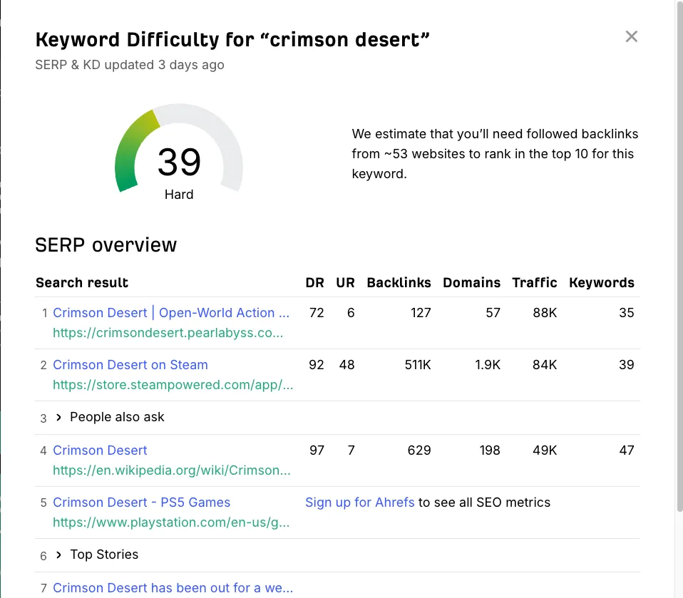

*Ahrefs 的 8 月快照：KD 39，并估算进入前十约需 53 个网站提供跟随链接。不同平台的 KD 不能直接换算。*

这两张图都是 8 月 1 日前后的快照，反映的并不是我 3 月选词时的难度。我把它们放在开场，主要想说明一个现实：至少在今天，对于一个没有品牌、外链和产品能力的新手，照着我的域名重新做一遍已经走不通了。

### 竞争变难的同时，搜索热度还在持续下降

Google Trends 的美国区数据更加劝退。`crimson desert` 在 3 月下旬发售窗口达到 100，之后一路回落。

为了避免“100 到底算不算热”这种没有参照系的讨论，我后来又把它和一个全年都有稳定搜索需求的词 `steam` 放在一起比较。发售周（3 月 22 日至 29 日），`crimson desert` 的相对热度是 77，短暂超过 `steam` 的 65；但到 7 月末，前者已经降到约 5，后者仍在约 60。


*Google Trends 美国区网页搜索对比。它说明发售事件曾经非常强，也说明事件性需求消退得非常快。两个词放在同一张图时会共同归一化，因此这里只看相对变化，不把指数当搜索量。*

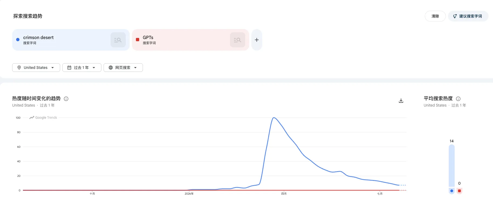

如果只看最近三个月，周期性的小高峰仍然存在，但基线已经从 5 月初接近 100，下降到 7 月底约 15 至 20。


Google Trends 的 0 至 100 是归一化指数，不代表具体搜索次数；Semrush 的月搜索量同样是模型估算。所以搜索总量看起来大和热度持续下降并不矛盾。我们真正需要留意的是这个趋势：

> 竞争成本在上升，新增需求却在下降。

对后来者而言，这种局面比单纯的“难词”更棘手。你得投入更多内容、建设更多外链，还要拿出更好的产品，去争夺一个正在萎缩的增量市场。

***

说到这里，也解释一下为什么我可以直接公开 `crimson desert` 和 `crimsondeserthq.com`——不是大方，是这个项目已经没有值得保密的套利空间。最佳时间窗口结束了，竞争格局定型了，精确匹配域名不构成壁垒，现有网站被 AdSense 判了低价值内容。我公开的不是蓝海词，是一张过期的船票。后面的 39 万次曝光之所以不能当结果炫耀，也是同一个原因：它发生在一个已经过去的窗口里，没有沉淀成产品壁垒。

***

## 一、3 月入场：发售窗口和低难度关键词

3 月 15 日之后，我开始每天查看 Google Trends 中的游戏词，并结合 Claude 和 ChatGPT 的建议筛选题目，最后选中了 `crimson desert`。

当时想的是三点：

* 游戏计划在 3 月 20 日发售，需求即将集中爆发。
* 3 月中旬看到的第三方关键词难度基本很小，搜索结果还没有完全定型。
* 当时有通用攻略站的子路径和平台子域名，但很少有人用独立主域名围绕整款游戏建站。

遗憾的是，我没有保存 3 月选词时的 Semrush 或 Ahrefs 快照，因此无法给出当时准确的 KD。能确认的只有：当时看到的难度基本很小，而前面展示的 KD 65 和 KD 39 是四个多月之后的状态。

2026 年 3 月 20 日，我注册了 `crimsondeserthq.com`，用 Google Stitch 生成设计稿，再用 Claude Code 在 MkSaaS 模板上完成网站。第二天，我把站点提交到 Google Search Console、Google Analytics 和 Bing Webmaster Tools。

当时的生产链路非常“2026”：

```text
Google Trends 找需求
        ↓
Claude / ChatGPT 辅助选词与搜索
        ↓
Google Stitch 生成产品视觉
        ↓
Claude Code + MkSaaS 完成实现
        ↓
Cloudflare 部署，GSC / GA / Bing 接数据
```

这条链路最大的优点是快，最大的危险也是快。传统开发流程里，错误会被设计、开发、编辑和测试的成本拖慢；AI 把这些摩擦拿掉后，我可以在没有验证数据源、没有玩透游戏、没有找到产品楔子的情况下，直接制造出一个“看上去已经完整”的网站。

这里没有所谓的无辜工具。Claude、ChatGPT、Stitch、Claude Code 和 MkSaaS 都完成了我交给它们的任务；真正的问题是我把“能够交付”误判成了“值得交付”。

134 天后，Google Search Console 记录了 390,614 次展示和 5,700 次点击；Google Analytics 记录了 9,133 名活跃用户；Bing 又带来了 1,055 次点击。

如果只拿这几个数字做标题，它很像一个“AI 建站 + SEO 冷启动”的成功案例。但 Google AdSense 给出的结论是“低价值内容”；竞争对手已经做出了地图、数据库、计算器、进度追踪和社区分发网络；仓库里大量页面与数据也缺少一手验证。

所以，用更苛刻的眼光看，这是一次抓住了需求窗口却没建立起长期价值的失败实验。

| 数据源                   | 时间范围               | 结果                            | 它能证明什么          | 它不能证明什么        |
| --------------------- | ------------------ | ----------------------------- | --------------- | -------------- |
| Google Search Console | 3 月 20 日至 7 月 31 日 | 5,700 点击、390,614 展示、CTR 1.46% | 搜索结果中存在真实需求     | 内容准确、用户满意或形成品牌 |
| Google Analytics      | 3 月 20 日至 8 月 1 日  | 9,133 活跃用户、平均互动 35 秒          | 用户确实进入了网站       | 用户解决了问题或愿意回来   |
| Bing Webmaster        | 3 月 24 日至 7 月 28 日 | 1,055 点击、40,725 展示、CTR 2.59%  | Google 之外也有搜索流量 | 已建立多渠道分发能力     |
| Similarweb            | 4 月至 6 月估算         | 17,589 次访问、月均 5,863 次         | 规模和竞品差距的粗略方向    | 精确访问量          |
| Semrush               | 8 月 1 日快照          | 400 个自然关键词、23 个引荐域名、38 条反向链接  | 覆盖在增长，权威与外链仍弱   | 第一方流量          |
| AdSense               | 8 月 1 日前           | 低价值内容，审核未通过                   | 网站价值与流量不是一回事    | 具体是哪一页导致拒绝     |

一句话概括：我只完成了流量验证，内容、产品和商业验证都失败了。

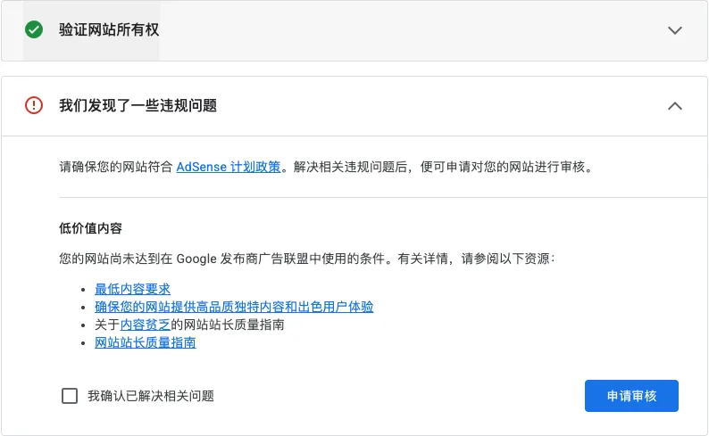

*网站所有权已经验证，但 AdSense 仍以“低价值内容”拒绝审核。它是这次复盘中最重要的反向指标。*

## 二、Git 记录里的真实时间线

仓库包含 MkSaaS 模板更早的上游提交，因此不能把最早的 commit 当成项目开始时间。真正属于 CrimsonDesertHQ 的连续改动，从 3 月 20 日开始。

第一个属于这个项目的大改动是 `6301e1b1`。这一次提交直接修改了 145 个文件，新增 6,740 行、删除 8,511 行：模板身份、首页、导航、内容分类、Boss、坐骑、武器、作者信息和部署配置几乎在一天内一起换掉。单看 diff，它很壮观；站在四个月后的角度看，它也暴露了问题——我还没有建立任何事实核验流程，就已经同时启动了内容站、数据库和工具产品三条战线。

从 3 月 20 日到 7 月 26 日，仓库一共有 106 次提交。前五天就产生了 23 次提交；3 月 27 日一天有 10 次。Git 记录当然不能测量有效工作，但它能非常诚实地显示我的注意力：早期大量提交都围绕“增加条目、增加页面、换图、修描述和补 SEO”，而不是玩家任务、数据证据和回访机制。

| 阶段                 | 关键记录                    | Git 中发生了什么                                             | 当时的想法       | 后来暴露的问题                |
| ------------------ | ----------------------- | ------------------------------------------------------ | ----------- | ---------------------- |
| 3 月 20 日至 24 日     | `6301e1b1` 至 `da928df6` | 更换站点身份、补 sitemap、上线 Boss/Mount/Weapon 数据和第一批攻略         | 先赶上发售窗口     | 数据验证几乎追不上交付速度          |
| 3 月 28 日至 4 月 16 日 | `cce8fe36` 至 `018ed781` | 连续补武器、Boss、坐骑，并多次修正图片和描述                               | 尽快做出“完整数据库” | 修改频繁本身说明初始数据不稳定        |
| 5 月 10 日           | `58778c30`              | 新增 291 行的 `All Pailune Bosses` 主题中心                    | 用完整页面承接一组长尾 | 方向正确，但仍依赖二手信息整理        |
| 5 月 11 日           | `c491daa7`              | 下线 `/ja/`、`/ko/`，旧页面返回 410；重定向 `/regions`，统一 canonical | 修复索引膨胀      | 说明早期多语言是规模优先，而非质量优先    |
| 6 月 6 日至 20 日      | `a4bc35b0` 至 `a1b2d1d5` | 几乎每天批量提交内容                                             | 用数量覆盖更多查询   | 形成大量微型文章、重叠主题和核验债务     |
| 7 月 15 日           | `e92c45ec`              | 按 GSC 高展示页面优化 Pailune、Camp 等攻略                         | 用数据提高 CTR   | 只是优化入口，没解决原创证据不足       |
| 7 月 26 日           | `515afe0c`              | 上线 editorial publication 逻辑，永久重定向 59 篇薄内容              | 开始主动收缩      | 证明早期 URL 数量不是资产，反而成了负债 |

截至 7 月 26 日，仓库中有 245 篇内容文件：181 篇继续公开、59 篇被永久重定向、5 篇保持未发布。也就是说，接近四分之一的内容后来被判断为不应该继续独立存在。

更严重的是结构化数据库。仓库里有 259 条武器、92 条 Boss 和 28 条坐骑记录，共 379 条。按代码中的核验状态统计：

| 状态                  | 条目数 |    占比 |
| ------------------- | --: | ----: |
| `legacy-unverified` | 354 | 93.4% |
| `partial`           |  23 |  6.1% |
| `verified-external` |   2 |  0.5% |

这组数据或许比 GSC 更能定义项目的真实面貌：**网站看似是个数据库，实际上 93.4% 的核心数据被我们自己的代码标记为“未经验证”的遗留状态。**

把两个比例放在一起看更刺眼：

* 245 篇内容里，59 篇后来被撤下或合并，占 **24.1%**。
* 379 条数据库记录里，354 条未验证，占 **93.4%**。

这不是“后期正常优化”的规模，而是生产系统本身没有把证据当成准入条件。发布按钮比核验流程先存在，于是所有速度最终都变成了返工。

## 三、看起来像产品，其实只有壳

Stitch 给出的方向其实不差：统一品牌、突出搜索、Boss 筛选、武器数据库、攻略中心、可操作的卡片元数据。视觉上，它已经把网站包装成一个游戏知识产品。


当前首页和设计稿也确实很接近：深色视觉、游戏主图、搜索框、分类入口、知识中心都落地了。

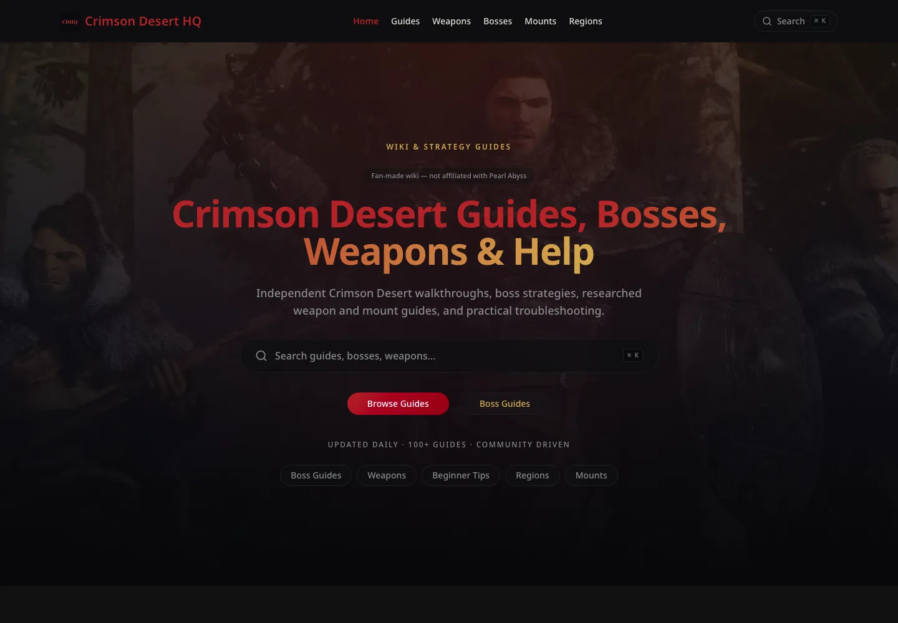

为了方便直接比较，下面是设计承诺、线上首页与正文证据放在一起的版本。它最能说明这次项目的错位：视觉语言在说“数据库与工具”，用户真正进入的却主要是一组文章。

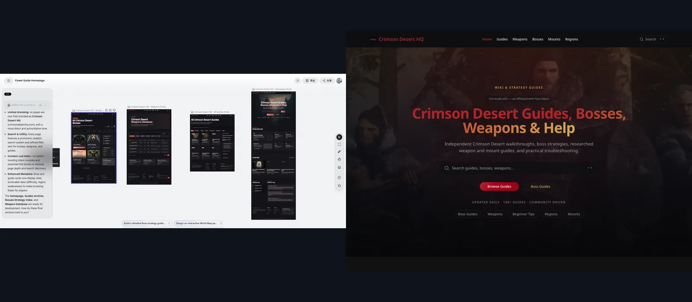

问题在于，视觉完成度掩盖了产品完成度。

设计稿中最有价值的部分是“数据库和工具”：可筛选的 Boss、武器属性、地区、掉落、路线和状态。然而当前线上 `/weapons`、`/bosses`、`/mounts`、`/regions` 都被永久重定向到博客分类页。代码里仍保留数据库组件和 JSON 数据，但用户最终得到的主要是文章目录。

回顾当时的做法，这实际上是一次产品退化：

```text
Stitch 设想：可检索、可筛选、可复用的结构化工具
                    ↓
早期实现：数据库页面 + 批量攻略文章
                    ↓
当前线上：数据库入口重定向到博客分类
```

| 设计承诺         | 实际交付       | 为什么不够                 |
| ------------ | ---------- | --------------------- |
| Boss 筛选与策略索引 | Boss 文章分类  | 能浏览标题，不能按地区、弱点和版本完成任务 |
| 武器数据库        | 武器文章分类     | 没有可靠属性、获取方式和可比较数据     |
| 地区与路线        | 攻略文章       | 缺少坐标图、路线图和过程截图        |
| 全站搜索         | 博客搜索       | 能找到页面，不等于能找到答案        |
| 结构化卡片        | 大量未核验 JSON | 形式结构化，事实却没有稳定来源和维护责任人 |

我过去会把这种情况叫作“先做 MVP，以后再补数据”。现在我更愿意叫它**视觉信用透支**：页面先借用了成熟产品的可信外观，却没有同时交付成熟产品所需的数据、验证和维护。

流量最高的 Pailune 页面也很有代表性。页面有漂亮封面、作者和后期补上的编辑标准，但正文没有公开的来源列表，也没有路线图、坐标图或步骤截图；仓库文件里还留有 3 处“待复核”注释。

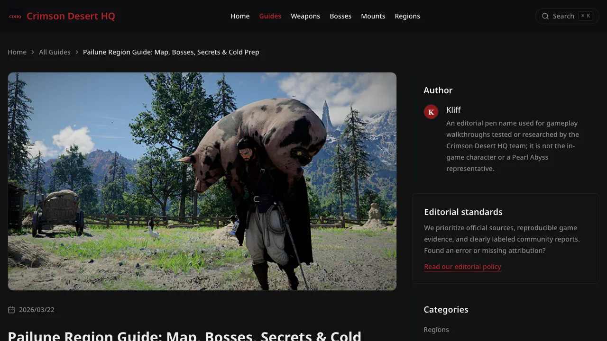

对 245 篇内容文件做仓库扫描，还能看到几个问题：

* 101 篇存在 `SOURCES`、`SOURCE` 或 `FACT CHECK` 一类来源痕迹，但很多只是代码注释，不是读者能看到的引用。
* 7 篇仍保留 35 处“待复核”标记。
* 没有发现正文中的标准 Markdown 图片引用。它不代表所有文章绝对没有图片，但至少说明“用原创过程截图证明结论”没有成为统一的内容规范。
* 大量页面依赖 AI 对官方说明和其他攻略的搜索、归纳与改写，而不是自己的游戏过程、测量、录像和可复现测试。

AI 确实帮我极大提升了页面产出速度，但这也掩盖了一个隐患：内容能读通，并不代表内容值得信赖。

## 四、自己的网站数据：流量是真实的，但价值不能由流量代替

### 4.1 GSC：大盘下降时，点击出现了第二轮增长

| 月份             |    点击 |      展示 |   CTR | 加权平均排名（近似） |
| -------------- | ----: | ------: | ----: | ---------: |
| 3 月 20 日至 31 日 | 1,183 |  57,756 | 2.05% |       7.94 |
| 4 月            |   865 |  48,492 | 1.78% |       9.19 |
| 5 月            |   560 |  44,812 | 1.25% |      10.75 |
| 6 月            | 1,429 | 121,446 | 1.18% |       8.74 |
| 7 月            | 1,663 | 118,108 | 1.41% |       8.23 |

3 月只有 12 天，又正好处在发售峰值，不能和完整月份直接比较。但 6 月、7 月的第二轮增长是真实的：即使游戏热度下降，更多长尾页面仍然进入了搜索结果。


最近 28 天与此前 28 天相比，展示下降约 4.0%，点击却增长约 13.8%，CTR 从 1.19% 提升到 1.41%。这说明标题、排名和页面匹配度有所改善。

但必须把结论限制在它真正能证明的范围里：GSC 证明用户愿意点进来，不证明答案准确，也不证明用户完成了任务。

### 4.2 真正带流量的是问题集合，不是主词

GSC 前 1,000 个查询中，Pailune/Pauline 相关变体有 145 个，贡献 487 次点击；Camp 相关查询有 137 个，贡献 205 次点击。

| 查询                                           | 点击 |    展示 |    CTR | 平均排名 |
| -------------------------------------------- | -: | ----: | -----: | ---: |
| `pailune bosses`                             | 68 |   790 |  8.61% | 6.04 |
| `crimson desert classic vs default controls` | 44 |   610 |  7.21% | 3.09 |
| `pauline bosses crimson desert`              | 34 |   296 | 11.49% | 6.11 |
| `crimson desert cloudcart failed to summon`  | 21 | 1,326 |  1.58% | 8.89 |
| `crimson desert camp upgrades`               | 21 |   561 |  3.74% | 8.84 |

长尾策略本身没有错。错误在于把“一个页面覆盖一组问题”继续扩张成“每一个问题都应该快速生成一个页面”。前者是主题中心，后者很容易成为搜索结果的二次摘要。

### 4.3 GA：用户来了，但任务完成了没有？

GA 记录了 9,133 名活跃用户、9,141 名新用户、约 4.4 万次事件，平均每位活跃用户互动 35 秒。

Google Organic 带来 4,254 名活跃用户，Direct 3,169 名，Bing Organic 926 名，DuckDuckGo 346 名，Yahoo 90 名。GA 中 `google / organic` 为 5,506 次会话，与 GSC 的 5,700 次点击只相差约 3.4%，两套第一方数据在方向上能对上。


GA 也记录到了 ChatGPT 推荐流量。但当前埋点没有统一记录攻略完成、站内搜索是否成功、相关攻略点击、滚动深度和回访原因，因此 35 秒既可能是“快速解决”，也可能是“看了一眼就发现没用”。

### 4.4 Bing 和第三方工具：补充视角

Bing 在 3 月 24 日至 7 月 28 日带来 1,055 次点击、40,725 次展示，CTR 2.59%。

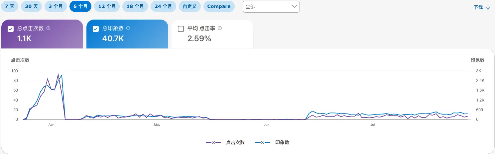

Bing 的规模远小于 Google，接入成本也很低，它的数据反映出一个问题：全站增长仍然高度依赖搜索引擎，我们并没有通过社区、视频或合作渠道形成稳定的回访。

再来看看第三方估算工具。Similarweb 估算 4 月至 6 月总访问为 17,589、月均 5,863、每次访问 1.79 页、平均时长 21 秒、跳出率 42.74%。


Semrush 的 8 月 1 日快照则显示 Authority Score 为 8、自然流量估算 88、自然关键词 400、引荐域名 23、反向链接 38。


第三方估算的绝对流量通常偏低，但它们在衡量“关键词增长、权威度及外链状况”的相对位置上仍然很有参考价值。

## 五、竞争对手不是一种，而是三种完全不同的生意

比较之前先统一口径：Method 和 Questlog 的 Similarweb 报告是整个主域名，包含其他游戏，不能与 CrimsonDesertHQ 直接比较；`crimsondesert.gaming.tools` 和 `crimsondesert.th.gl` 是目标子域名；`crimsondesert.app`、`crimsoncompanionapp.us` 与我们一样是独立域名。

### 5.1 先看体量：这不是略输，而是差了两个数量级

先只比较可以直接对齐的独立域名和目标子域名。Similarweb 的 2026 年 4 月至 6 月总访问估算里，我们是 17,589，`crimsondesert.gaming.tools` 是 523.9 万，约为我们的 **298 倍**。Semrush 的 8 月 1 日快照里，对方自然流量估算为 9.1K、自然关键词 17.2K，分别约为我们的 **103 倍**和 **43 倍**。

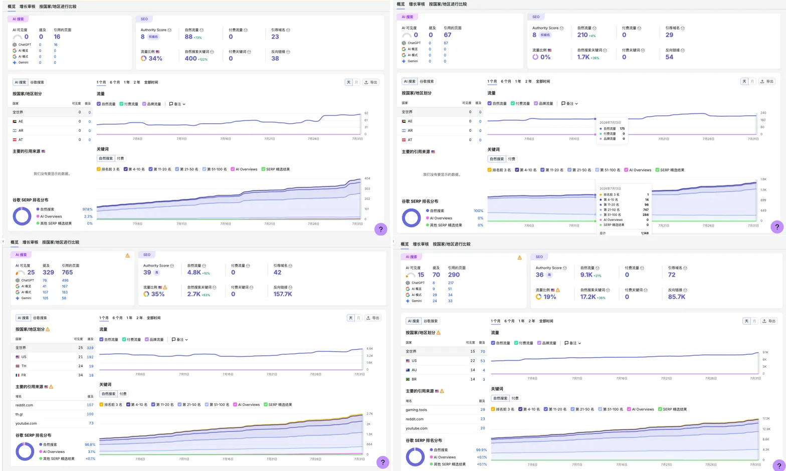

*四张 Semrush 原始截图的拼图，仅用于快速查看数量级；具体数字以各站点的独立截图和下表为准。*

| 站点                         | 4–6 月总访问 |    月均访问 | 平均时长 | Authority | 自然流量 | 自然关键词 | 引荐域名 |   反向链接 |
| -------------------------- | -------: | ------: | ---: | --------: | ---: | ----: | ---: | -----: |
| CrimsonDesertHQ            |   17,589 |   5,863 | 0:21 |         8 |   88 |   400 |   23 |     38 |
| crimsoncompanionapp.us     |   18,620 |   6,207 | 0:16 |         6 |    4 |    71 |   21 |     26 |
| crimsondesert.app          |  655,247 | 218,416 | 0:54 |         8 |  210 |  1.7K |   29 |     54 |
| crimsondesert.th.gl        |  372,825 | 124,275 | 1:56 |        39 | 4.8K |  2.7K |   42 | 157.7K |
| crimsondesert.gaming.tools |   5.239M |  1.746M | 4:29 |        36 | 9.1K | 17.2K |   72 |  85.7K |

这里必须强调三次：Similarweb 和 Semrush 都是第三方估算；两家的“流量”不是同一个指标；绝对值可能偏差很大。把它们放在一起的用途不是算收入，而是看相对方向。访问深度、停留时长、自然关键词和渠道结构同时拉开差距时，“工具站比我们更有复用价值”就不只是主观观感。

而 `crimsoncompanionapp.us` 是很有价值的反例：它有比我们更多的功能入口，第三方估算却与我们处于同一量级。这说明“做成 Dashboard”本身也不是答案；没有真实数据、任务闭环和分发，工具界面照样可能是另一种空壳。

### 5.2 成熟内容平台：Method 与 Questlog

[Method 的 Crimson Desert 专区](https://www.method.gg/crimson-desert)仍然以编辑型攻略为主，但它拥有清晰的分类、真实游戏截图、发布日期，以及 Method 品牌已有的用户、社交账号、作者体系和站内分发。


Similarweb 估算 Method 全域 4 月至 6 月总访问 1,046 万、月均 348.8 万、每次访问 2.09 页、平均 1 分 17 秒；自然搜索占 63.47%，直接访问占 22.84%，引荐占 6.59%，社交占 6.13%。这些流量不是 Crimson Desert 专区单独贡献的，但它说明 Method 发布一个新游戏专区时，已经站在成熟平台上。

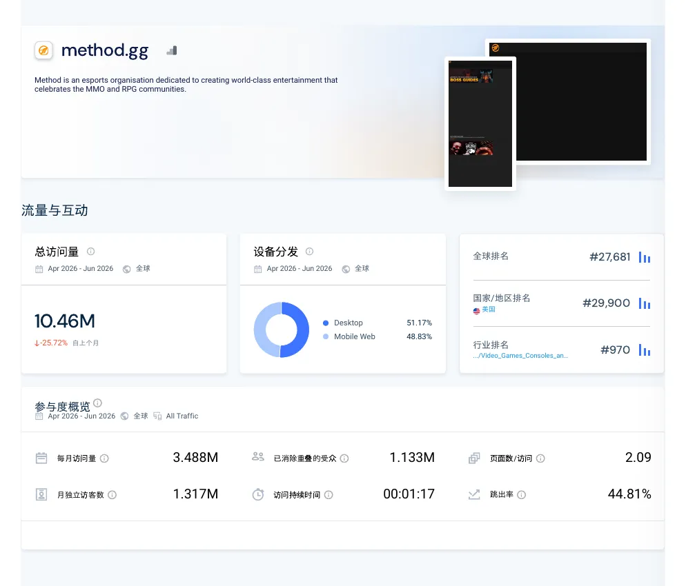

[Questlog 的 Crimson Desert 专区](https://questlog.gg/crimson-desert/en)更接近工具型 Wiki：首页把 Database、Items、Equipment、Character Builder、Knowledge 和 Map 直接放在主导航中。搜索不是博客检索，而是产品的核心入口。

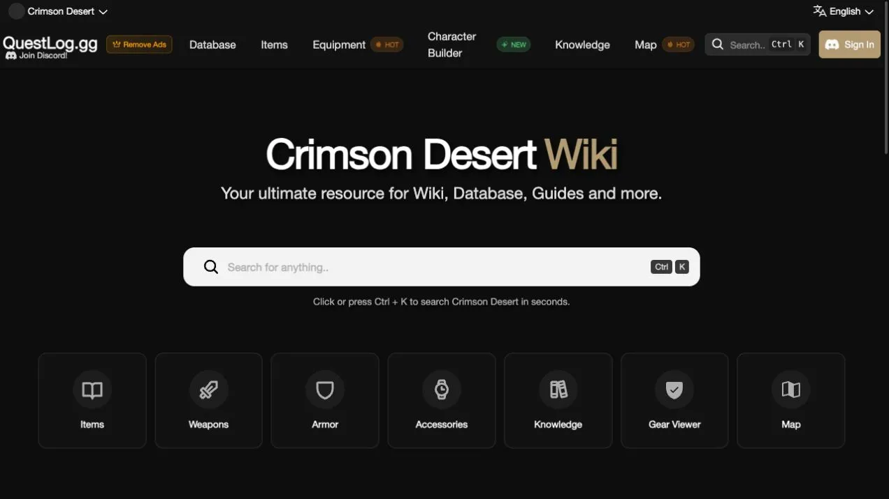

Similarweb 估算 Questlog 全域 4 月至 6 月总访问 795.1 万、月均 265.0 万、每次访问 6.23 页、平均 3 分 55 秒。流量结构也比纯搜索站均衡：自然搜索 42.42%、直接访问 37.22%、社交 12.60%、引荐 7.04%。


这两家带来的启发截然不同：Method 靠的是品牌和完整的编辑体系来支撑内容质量，而 Questlog 则把搜索内容纯粹作为工具产品的入口。

### 5.3 工具生态：gaming.tools 与 th.gl

[crimsondesert.gaming.tools](https://crimsondesert.gaming.tools) 不是一批攻略文章，而是结构化游戏数据库。Items、Characters、Quests、World、Game Info 都是可浏览实体，并且直接把 Interactive Map 链接到 `crimsondesert.th.gl`。

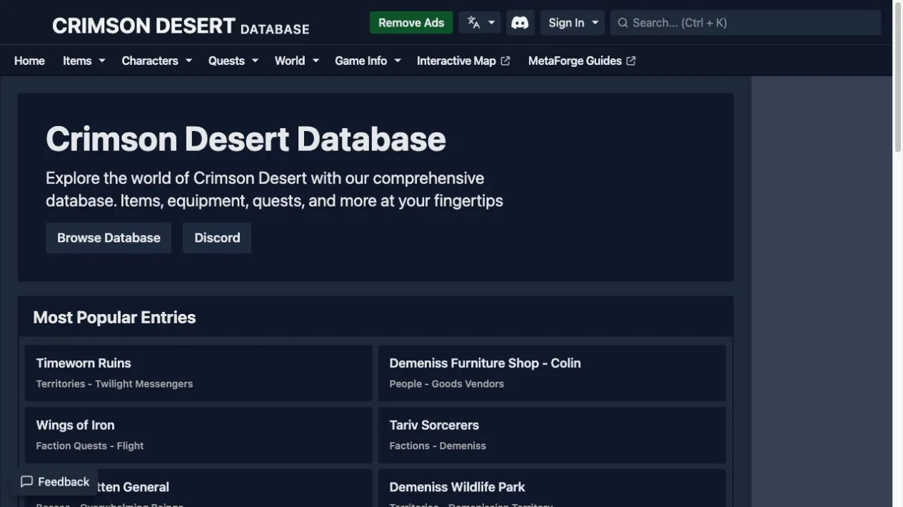

Similarweb 估算这个子域名 4 月至 6 月总访问 523.9 万、月均 174.6 万、每次访问 4.24 页、平均 4 分 29 秒。自然搜索占 67.20%，但它并不只靠搜索：引荐占 7.84%，社交占 6.93%。


Semrush 的同日快照显示，它的 Authority Score 为 36、自然流量估算 9.1K、自然关键词 17.2K、引荐域名 72、反向链接 85.7K。关键词数量约是我们的 43 倍，说明数据库里的实体、关系和查询入口本身就在不断生成可索引页面，而不是靠编辑每天决定“再写一篇什么”。

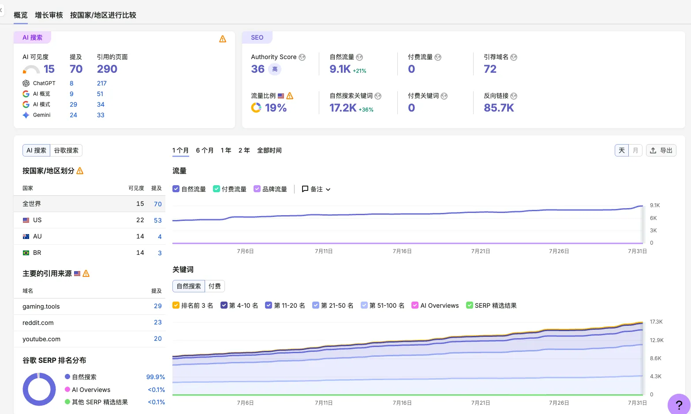

[crimsondesert.th.gl](https://crimsondesert.th.gl) 的核心则是互动地图：2 张地图、102,665 个位置、类别筛选、玩家追踪、自动发现和更新日志。用户打开它不是为了阅读一篇文章，而是为了在游戏过程中持续使用。

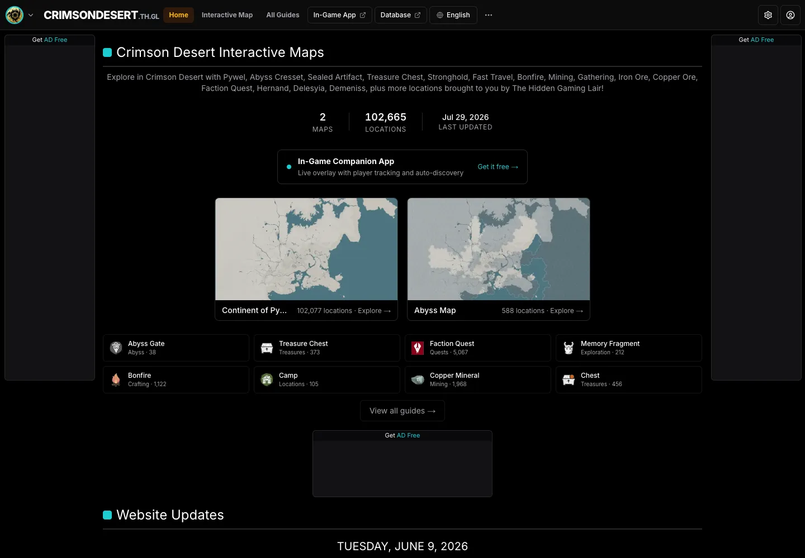

Similarweb 估算 th.gl 子域名三个月总访问 372,825、月均 124,275、每次访问 2.62 页、平均 1 分 56 秒。自然搜索只占 33.31%，直接访问占 27.37%，社交占 22.44%，引荐占 15.75%。这比我们的“几乎全靠搜索”健康得多。

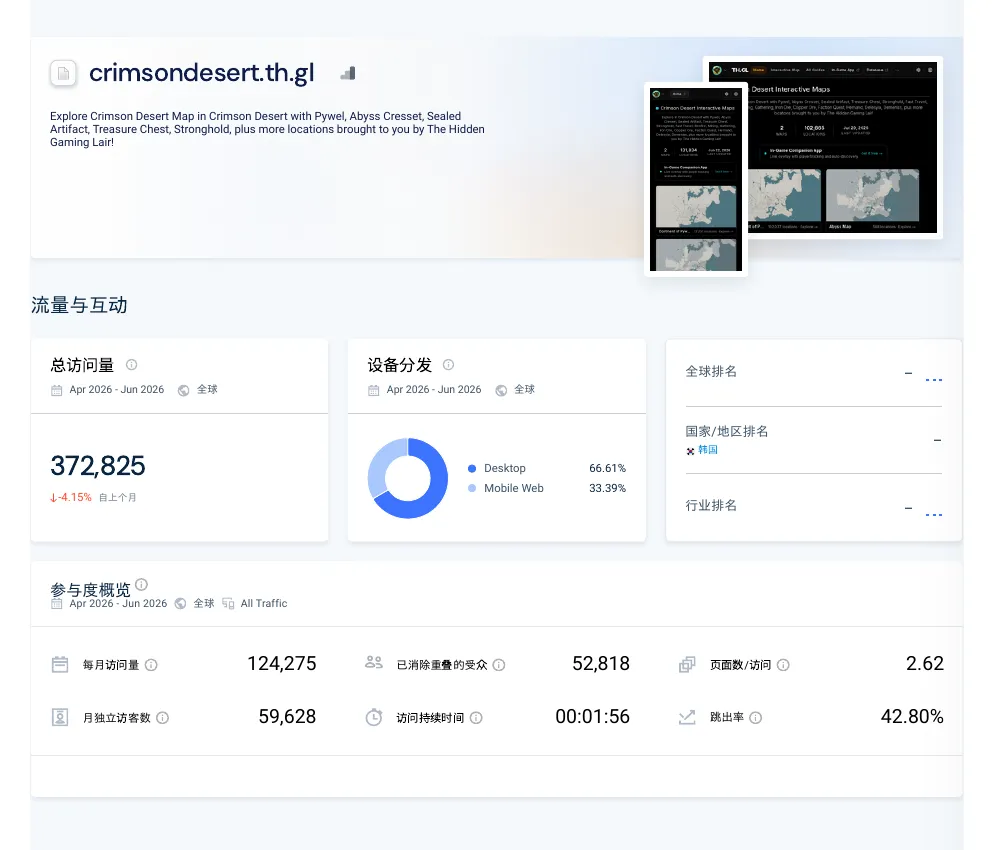

两者之间形成了一种自然的产品网络，数据库解释“这是什么”，地图标明“它在哪里”。这样的外链产生于玩家的真实使用流程中，远比为了提高 DR 人工堆叠的链接健康。


Semrush 的快照进一步放大了这个差异：th.gl 的 Authority Score 39、自然流量估算 4.8K、关键词 2.7K、引荐域名 42、反向链接 157.7K，还显示 765 个 AI 引用页面。这里有明显的平台主域与站群图谱加成，不能把 157.7K 条链接简单理解成 157.7K 个高质量推荐；但它仍然说明我们面对的不是一个孤立小站，而是一个已有权威和互链能力的工具生态。

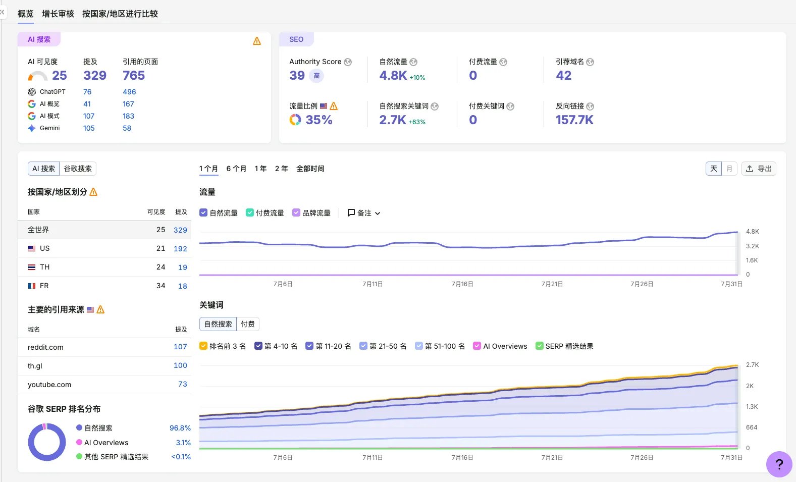

### 5.4 独立工具站：crimsondesert.app 与 crimsoncompanionapp.us

[crimsondesert.app](https://crimsondesert.app) 与我们一样使用独立域名，但它把首页价值放在互动地图、Wiki、制作计算器和进度追踪上。实际地图页面显示 9,323 个标记，并提供地区与类别筛选。

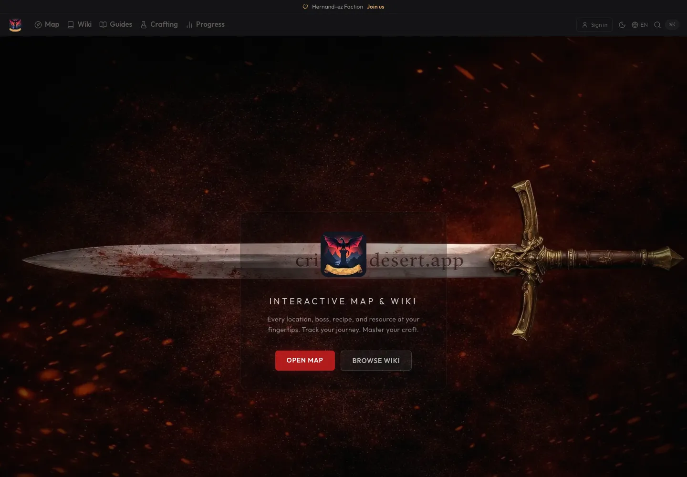


Similarweb 估算其三个月总访问 655,247、月均 218,416、每次访问 3.15 页、平均 54 秒；自然搜索占 64.92%，直接访问占 20.45%，引荐占 7.06%，社交占 6.94%。

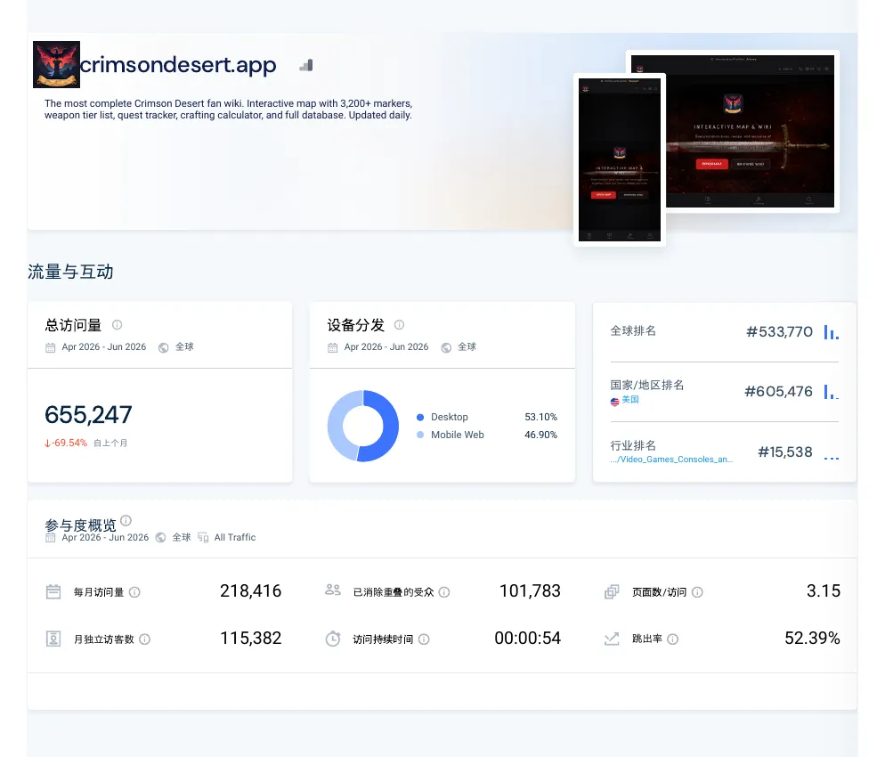

Semrush 给它的 Authority Score 同样是 8，却估算有 1.7K 个自然关键词、210 自然流量、29 个引荐域名和 54 条反向链接；关键词覆盖约为我们的 4.25 倍。这说明即使外链规模差距不大，结构化工具仍然可以自然产生更多可索引实体和搜索入口。

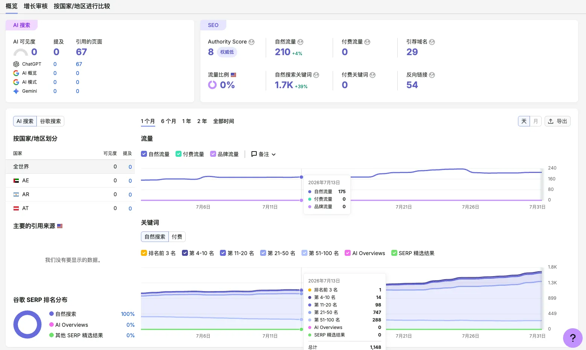

[crimsoncompanionapp.us](https://crimsoncompanionapp.us) 做得更像一个后台产品：世界地图、角色、坐骑、营地、技能树、收集品、任务日志、Boss、图鉴、武器、制作、笔记和 Build Planner 都有独立入口。

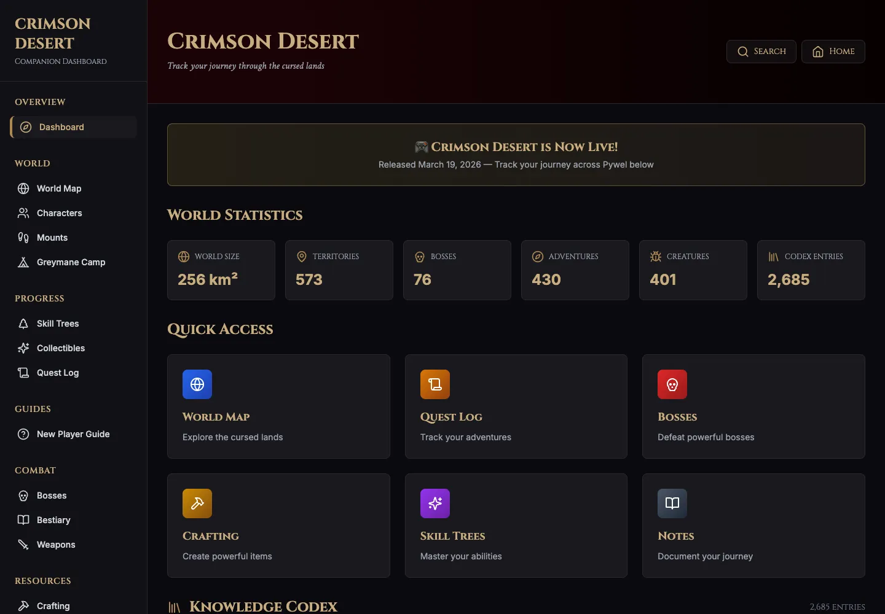

但“功能看起来很多”也不等于成功。Similarweb 估算它三个月只有 18,620 次访问、月均 6,207 次，几乎和我们的 5,863 次处于同一量级；每次访问 2.16 页、平均仅 16 秒。Semrush 也只估算 71 个自然关键词和 4 的自然流量。

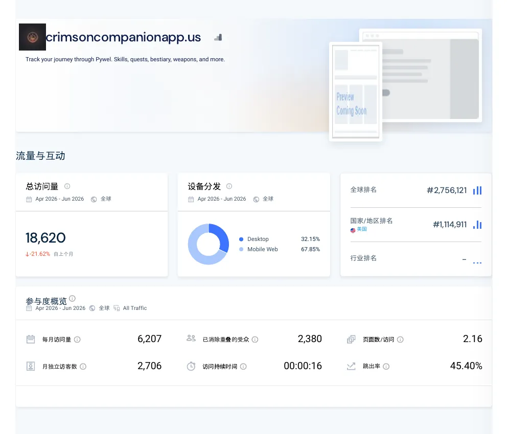

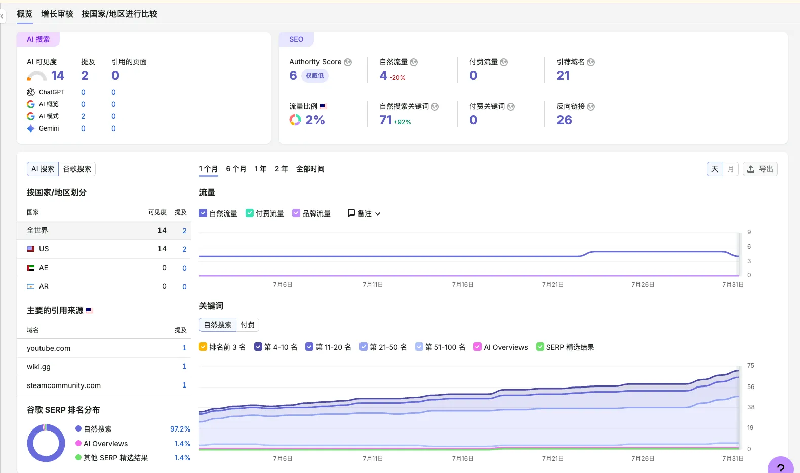

这个竞品对我同样重要：它说明做出很多界面、统计卡片和功能入口，也可能只是“更像产品的空壳”。如果数据不可信、功能不能完成真实任务、用户没有理由持续回来，再完整的 Dashboard 也不会自动获得分发。

## 六、竞品真正领先的，不只是流量

只看访问量，很容易把结论写成“他们域名强、资源多，所以我打不过”。这句话没有错，但几乎没有行动价值。真正值得拆解的是，用户为什么会第二次打开它，同行又为什么愿意链接它。

| 站点                | 用户来完成什么任务           | 为什么可能回来         | 为什么别人愿意引用           |
| ----------------- | ------------------- | --------------- | ------------------- |
| Method            | 阅读编辑验证过的攻略          | 作者、品牌和更新体系稳定    | 成熟媒体身份、可引用的编辑内容     |
| Questlog          | 查物品、装备、角色、Build 与地图 | 玩家档案和数据库持续积累    | 数据实体和工具入口可以嵌入工作流    |
| gaming.tools      | 搜索任务、物品、角色与世界数据     | 游戏过程里反复查询       | 数据库页面天然是事实节点        |
| th.gl             | 找坐标、筛标记、记录地图进度      | 地图状态与玩家进度持续存在   | 坐标和地图是其他攻略的基础设施     |
| crimsondesert.app | 地图、Wiki、计算器和进度追踪    | 多个任务在同一产品内衔接    | 结构化标记与计算结果可被分享      |
| CrimsonDesertHQ   | 从搜索结果进入一篇文章         | 缺少持久状态和明确的第二次任务 | 多数信息来自相同公开来源，新增证据不足 |

我们的流程基本是一条直线：

```text
搜索结果 → 文章 → 离开
```

而成熟工具站形成的是循环：

```text
数据库解释“这是什么”
        ↓
地图回答“它在哪里”
        ↓
追踪器记录“我完成了吗”
        ↓
社区和攻略继续引用这些数据
        ↺
```

所以外链差距不是单纯因为我没有发 outreach 邮件。更根本的原因是，我们没有创造一个处在别人工作流里的对象。AI 汇总文章可以回答一次问题，地图、数据集和计算器却能成为其他产品、视频和讨论的基础设施。

## 七、四个核心错误

### 7.1 把 AI 搜索与整理能力误当成内容能力

AI 擅长快速搜索、归纳、改写和补结构，却无法自动提供亲手玩过、亲自测过、亲自截图的证据。项目里大量内容来自 AI 对官方补丁、其他攻略和搜索结果的再组织，信息源与竞争对手高度重合。

即使文字没有明显错误，用户也没有充分理由选择我们的二手总结，而不是原始来源、成熟媒体或互动工具。这正是“低价值内容”最值得反思的地方：低价值不一定意味着字少或页面丑，往往意味着我们没有提供任何新增信息。

### 7.2 把数据行数和页面数量当成了资产

379 条记录听起来像资产，但其中 354 条被标记为 `legacy-unverified`。如果武器位置、Boss 弱点、掉落率或坐骑属性无法复现，数据越多，维护与信任风险越大。另外，6 月我们几乎每天批量提交内容，短期内确实扩大了展示。但 7 月最终撤下 59 篇，大量 URL 反而成了负债。每一个薄页面都在消耗抓取预算和维护精力。

回头看，真正的资产应该随着时间变得更可信；如果页面越多，你越不敢更新，那就是纯粹的负债。

### 7.3 完成了视觉交付，没有找到产品楔子

Stitch 设计稿、首页和 Dashboard 都容易让人产生“产品已经完成”的错觉。但用户真正需要的是一个具体任务：找到某个物品、规划一条路线、判断一个 Build 或者记录收集进度。

我们的定位一直在“Wiki、数据库、攻略、新闻、故障排查”之间摇摆，最后没有任何一个部分做到不可替代，这跟竞争对手清晰的产品楔子形成了鲜明对比。

### 7.4 没有建设外链，更没有创造值得引用的东西

Semrush 只识别到 23 个引荐域名和 38 条反向链接。项目没有系统做社区分发，但根本问题在于我们没有创造出值得别人引用的对象。原创地图、公开数据集、可嵌入计算器会自然产生链接，而 AI 汇总文章很难做到这一点。

当时 39 万次展示让我们误以为取得了进展，把搜索点击当成了成功指标。但搜索展示只是需求信号，真正缺失的指标是任务完成度、主动回访、品牌搜索以及非搜索流量。如果当时能盯着这些指标，我们就会更早停下堆页面的脚步，转而打磨真正的数据和产品。

### AI 不是根因，没有验证闭环才是

把责任全部推给 AI 也很方便：“因为内容是 AI 生成的，所以失败了。”但如果把 Claude 和 ChatGPT 换成一群没有游戏经验、只会搜索和改写的外包编辑，结果大概率一样。

真正的问题是生产系统缺了四个关卡：

1. **来源关**：这个事实来自哪里，版本和日期是什么？
2. **复现关**：我或可信的人能否在游戏中重复得到同样结果？
3. **产品关**：它解决的是一个真实任务，还是只多了一个 URL？
4. **分发关**：除了搜索引擎，谁会主动把它交给下一个用户？

AI 把没有关卡的流水线加速了。它不是唯一病因，却让病灶在 134 天内扩张到 245 篇文章和 379 条数据。

## 八、哪些事情其实做对了

失败复盘如果只写错了什么，也很容易变成事后诸葛亮。下面几件事本身是成立的，只是我把它们外推得太远。

### 8.1 选中了真实的事件窗口

3 月 20 日前后确实存在新站窗口。发售周的 Trends 峰值、12 天内 1,183 次 GSC 点击，以及随后出现的大量问题型查询，都证明选题不是凭空想象。问题不是“做了一个没人搜的词”，而是把短期事件需求误当成长期资产。

### 8.2 上线速度足够快

从选词、买域名、设计到提交搜索引擎只用了几天。在热点项目里，速度有真实价值。下一次我仍然会快，但会把“快速上线”限制为一个可验证楔子的上线，而不是同时铺开整个 Wiki、数据库和内容矩阵。

### 8.3 长尾主题中心比抢主词有效

真正带来点击的不是首页去硬抢 `crimson desert`，而是 Pailune、Camp、控制方式、召唤失败等具体问题。`All Pailune Bosses` 这样的主题中心方向是对的；错误是后来把主题中心继续拆成大量缺少独立价值的微型文章。

### 8.4 第一方数据接得够早

上线第二天就接入 GSC、GA 和 Bing，让我最终有条件推翻自己的乐观判断。虽然埋点缺少任务完成、站内搜索成功和回访原因，但至少项目没有停留在“我觉得 SEO 有效果”。

这些正确动作值得保留，但它们只能提高实验效率，不能替代产品价值。

## 九、下一次我会做的三件事

### 9.1 停止扩张，清理可信度

首先我会暂停 AI 的批量发布，不再把增加 URL 数量作为目标。同时下线或合并那些没有独立价值的薄页面。在此基础上，给全部数据库记录增加版本、来源、核验人和置信度，并且建立一套严格的证据标准——比如必须包含自己录制的视频截图、明确的交叉验证或者官方来源，公开显示更新时间和已知的不确定项，让“待复核”内容真正下线而不是藏在代码里。

### 9.2 只选一个工具楔子

我不会再试图包揽完整地图、Wiki、数据库和攻略站，而是会选一个竞争对手还没解决好、且能自己验证的任务。比如做一个“补丁前后机制差异的可检索数据库”，或者“带证据截图的 Boss 招式变更记录”。工具不需要庞大，但必须给用户第二次打开它的理由。

### 9.3 把分发当成产品的一部分

分发策略需要前置，比如在 Reddit 或 Discord 发布原始发现，而不仅仅是扔个文章链接；给创作者提供可引用的图表组件；与外部工具形成任务链互链。在内容具备一手证据、工具具有复用价值、用户愿意回访并形成非搜索流量之前，不要去碰 AdSense，因为那只是给低留存产品生硬地增加广告位。

## 十、如果回到 3 月 20 日，我会怎样重做

我不会放弃这个窗口，但会把范围缩到原来的十分之一。

### 第 0 至 2 天：先验证一个任务，不先建“完整站”

* 从 Reddit、Discord、Steam 社区和搜索建议里收集 30 个玩家原话，而不是先让 AI 生成栏目。
* 只选一个能亲自验证的问题，例如 Boss 招式变更、补丁前后机制差异或一个地区的收集路线。
* 建立字段标准：来源、游戏版本、采集日期、截图、核验人、置信度、已知争议。
* 首页只承诺这一件事，不出现地图、Wiki、数据库、Build Planner 等尚未交付的入口。

### 第 3 至 7 天：做出一个值得第二次打开的楔子

* 发布 10 至 20 条高可信记录，而不是 100 条 AI 补全记录。
* 每条记录必须带一手截图或可核查的官方来源。
* 让用户可以筛选、收藏、比较或查看版本变化，至少存在一种“文章读完后仍有用”的状态。
* 埋点不只记录 page view，还要记录搜索成功、筛选使用、复制、收藏、相关任务跳转和 7 日回访。

### 第 2 周：先做分发实验，再做内容扩张

* 把原始发现发到社区，观察讨论的是数据本身还是文章标题。
* 邀请攻略作者或视频作者指出错误，并允许他们引用图表或数据。
* 如果没有人主动保存、引用或回来，就继续改产品，不新增 50 个页面掩盖问题。

### 三个停止条件

在第一行规模化代码、第一批批量文章和第一次 AdSense 申请之前，我会要求项目通过三道门：

1. **用户必须回来**：至少一部分用户在没有新搜索的情况下再次使用。
2. **同行愿意引用**：至少出现真实创作者、社区帖或工具站对数据的主动引用。
3. **我敢为数据负责**：关键记录都有来源、版本、证据和明确维护责任。

如果三道门一扇都没开，搜索展示越高，越应该提醒自己：我可能只是站在流量入口上，并没有建成产品。

## 十一、如果你仍然想照着做

关键词和域名已经全部公开，我不担心被抄。但公开不等于推荐。

* 不要根据 8 月的 KD 反推我 3 月的决策。当时第三方难度基本很小，但我没有保存截图，这是这份复盘无法弥补的证据缺口。
* 不要把 190 万全球月搜索量当成可分配给新站的流量池。品牌站、Steam、Wikipedia、PlayStation、媒体和成熟工具已经占据结果页。
* 不要觉得换一个精确匹配域名就能复现。域名没有解决权威、内容证据、工具数据和分发问题。
* 不要把 AI 生成数量当成竞争优势。竞争对手同样能用 AI，真正稀缺的是一手数据、维护能力和用户关系。
* 不要因为 `crimsoncompanionapp.us` 的界面比我们完整，就认为“加功能”一定成功。任务完成和分发仍然是硬门槛。

如果还想做，更合理的机会可能不是重做一个完整 Crimson Desert 站，而是找一个已有站点仍没解决好的小任务，用可验证数据把它做到最好。

***

回头看，这次实验不算一无所获。它验证了热门游戏发售期确实存在新站窗口，长尾比主词更适合冷启动，AI 能大幅压缩设计和开发时间。但它也用更昂贵的方式证明了：交付速度不是内容可信度，页面数量不是数据资产，搜索曝光不是产品壁垒。

**失败不是没有流量，而是流量来了以后，仍然没有建成一个用户必须回来、同行愿意引用、自己敢为数据负责的产品。**

## 数据口径与来源

* Google Search Console：`crimsondeserthq.com-Performance-on-Search-2026-08-01`，网页搜索，2026-03-20 至 2026-07-31。
* Google Analytics：`GA-用户行为.pdf`，2026-03-20 至 2026-08-01。
* Bing Webmaster：`crimsondeserthq.com_SearchPerformanceOverview_All_2026_8_1.csv` 与 `bing数据.png`，2026-03-24 至 2026-07-28。
* Similarweb：7 份 `网站分析与洞见.Apr_2026_-_Jun_2026` PDF，时间范围均为 2026 年 4 月至 6 月，属于第三方模型估算。
* Semrush、Ahrefs：2026-08-01 前后的截图快照，属于第三方估算。
* Google Trends：美国区网页搜索，过去一年与过去三个月，数值为归一化指数。
* 站点页面截图：2026-08-01 访问各网站时截取。页面中的条目数量和营销文案只用于分析产品表达，不代表本文已验证其真实性。
* Git 与仓库统计：基于 2026-08-01 本地仓库。文章数按 `content/blog` 内容文件统计；结构化数据按 `data/weapons.json`、`data/bosses.json`、`data/mounts.json` 的 `verification.status` 统计。
* “加权平均排名”为根据 GSC 每日展示和每日平均排名计算的近似值，不等同于 GSC 官方汇总排名。
