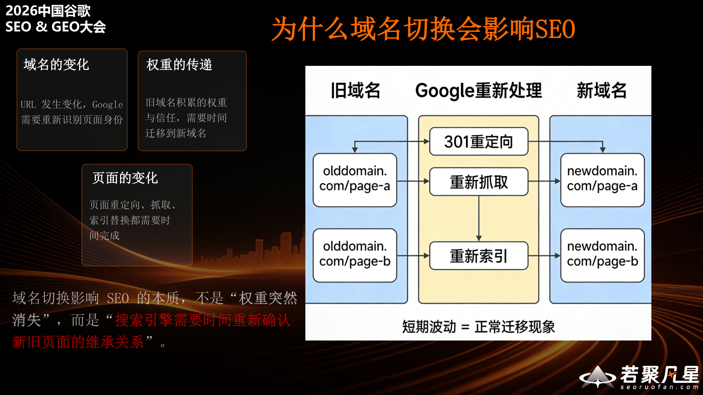
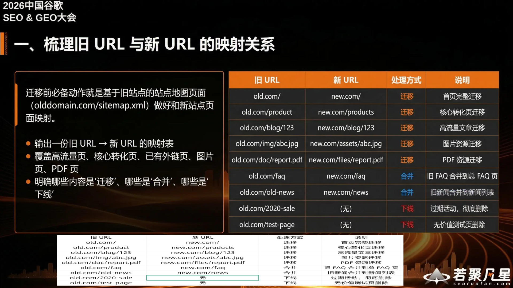
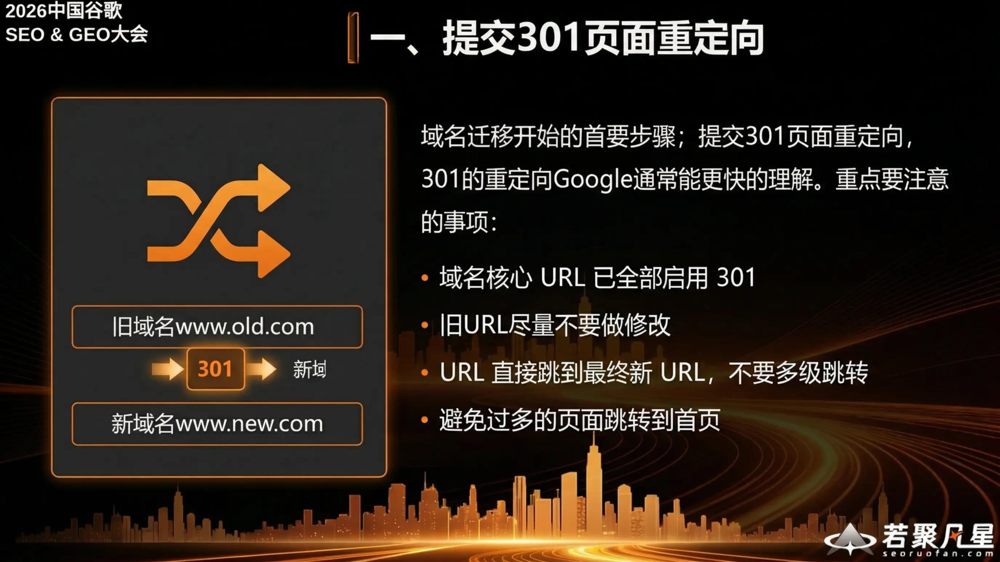
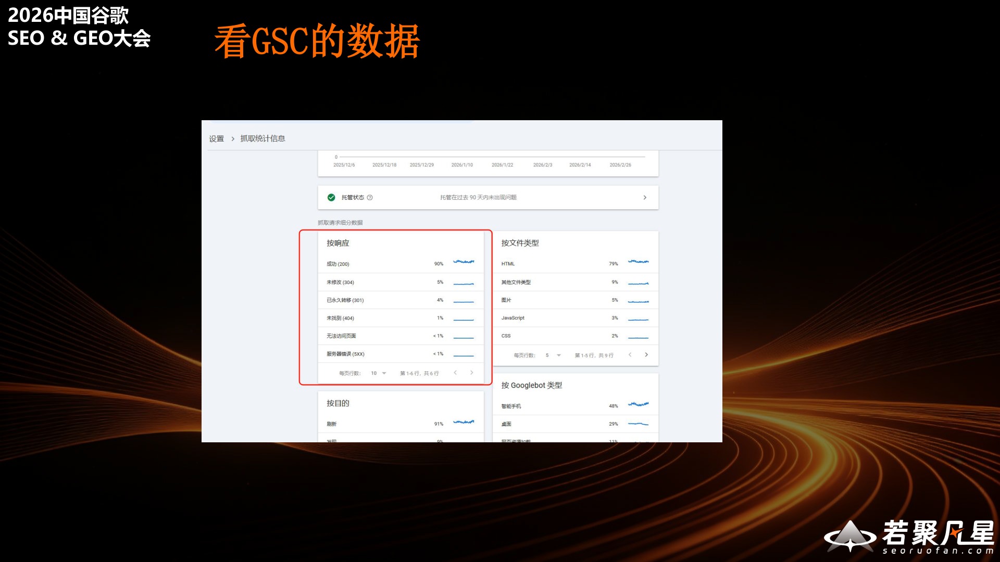

> 本文整理自王丰（若聚凡星）在2026中国谷歌SEO & GEO大会上的演讲"如何降低域名切换对SEO的效果影响"。域名迁移是许多企业在品牌升级、业务重组过程中都会面临的问题。本文将从原理、准备、执行和监控四个维度，系统梳理如何将SEO损失降到最低。

---

## 一、为什么域名切换会影响SEO

域名切换影响SEO的本质，不是"权重突然消失"，而是**搜索引擎需要重新理解和处理新旧页面的关系**。

当域名发生变化时，Google需要经历以下过程：

- **域名的变化**：URL发生变化，Google需要识别旧域名对应的新域名，重新迁移和建立新域名的信任
- **页面的变化**：页面地址变了，需要通过301重定向告知Google，Google会重新抓取并重新索引
- **权重的传递**：旧域名的权重通过301重定向传递到新域名

整个过程中，Google会对旧URL进行301重定向发现、重新抓取、重新索引，最终将排名转移到新域名。**短期的排名波动是正常的迁移现象**，关键在于如何缩短这个过渡期。

### 常见错误 vs 正确做法

**真正造成大的SEO损失的，往往不是域名切换本身，而是迁移过程中的错误操作。**

常见错误做法包括：
- **重定向错误**：旧URL随机跳转、返回404，或未匹配旧站点URL、未添加旧站robots规则
- **索引请求被拒**：站点使用了noindex、canonical指向错误，或同时大改版
- **信号说明错误**：canonical（权威标记）使用不当、URL参数混乱
- **大幅修改**：在域名迁移的同时进行网站大改版

正确的迁移方式应该是：
- **一对一重定向**：每个旧URL对应一个新URL
- **可抓取可索引**：确保新站点对搜索引擎完全开放
- **信号统一**：重定向、canonical、内链、sitemap等信号一致
- **分阶段迁移**：不要同时做太多变动

---

## 二、降低SEO影响的四大核心原则

王丰总结了域名迁移的四大核心原则：

1. **旧URL与新URL的继承关系要清晰**——建立完整的URL映射表，确保每个旧URL都有对应的新URL
2. **用301永久重定向明确传递迁移信号**——301是告诉Google"这个页面已经永久搬家"的最明确方式
3. **canonical、内链、sitemap等站内信号必须配套**——所有信号统一指向新域名
4. **迁移是持续监控与修正的过程，不是一次性动作**——上线后需要持续观察和调整

---

## 三、迁移前：必须完成的准备工作

### 1. 梳理旧URL与新URL的映射关系

迁移前的必备动作就是基于旧站点的站点地图页面（olddomain.com/sitemap.xml），做好新站点页面映射。

关键步骤：
- **输出一份旧URL → 新URL的映射表**
- **覆盖所有重要页面**：高流量页面、核心转化页、已有外链页、图片页、PDF页
- **明确每个URL的处理方式**：迁移、合并、下线、保留等
- **明确哪些内容是"迁移"，哪些是"合并"，哪些是"下线"**

映射表应包含：旧URL、新URL、处理方式和说明。例如首页完整迁移、核心转化页迁移、旧FAQ合并到新FAQ、过时内容标记为下线等。

### 2. 新站环境搭建与测试

将完整站点复制到新环境进行测试。测试内容包括网页访问、图片、表单、下载文件等。如果使用临时测试域名，需在测试环境中添加`rel=noindex`，以避免测试环境被搜索引擎误收录。

测试要点：
1. **所有页面可正常访问、展示、跳转**
2. **图片、素材、附件、下载文件可正常加载与下载**
3. **表单提交、UI交互、加购下单等流程正常**
4. **测试需涵盖移动端/PC端**

### 3. 确认新站可抓取、可索引、Googlebot可访问

测试完成后，在迁移前检查Googlebot能否访问新环境。开发阶段测试用的noindex或robots屏蔽，在迁移开始前须移除。

关键检查项：
- **robots.txt按需求配置**：明确允许/禁止抓取路径，无错误屏蔽
- **移除noindex**：首页、集合页、产品页、功能页移除rel=noindex，确保可索引

### 4. 迁移前事项小结

迁移前的Checklist：
1. 梳理旧URL与新URL的映射关系
2. 新站功能测试
3. 确认新站可抓取、可索引、Googlebot可访问
4. 准备Google Search Console、sitemap

---

## 四、迁移中：上线当天的关键动作

### 1. 提交301页面重定向

域名迁移开始的首要步骤是提交301页面重定向。301的重定向Google通常能更快地理解。

重点注意事项：
- **域名核心URL已全部启用301**
- **旧URL尽量不要做修改**
- **URL直接跳到最终新URL，不要多级跳转**
- **避免过多的页面跳转到首页**（这会被Google视为soft 404）

### 2. 确保新站可抓取索引

上线后立即确认：
1. **源码检测确保noindex已经移除**
2. **robots.txt没有阻拦抓取的规则**
3. **用GSC后台对页面进行抓取测试**
4. **提交新的sitemap**

### 3. 访问验证

sitemap等都已经完成设置或者提交后进行验证：
1. **测试核心页面的301跳转是否正常**
2. **测试是否存在404、页面跳转错误**
3. **测试网站访问速度、交互响应速度**
4. **验证GSC后台抓取成功率**：设置 → 抓取统计信息 → 成功几率

### 4. 新信息替换

域名上线后，需要同步更新所有外部渠道的信息：
1. **社交平台信息更新**：FB、INS、X、YouTube、Reddit等账号简介联系信息更新为新域名
2. **权威媒体链接更新**：KOL、上下游供应商官网等内容信息链接更新
3. **外链站长联系**：SC外链联系站长进行新老域名的替换

---

## 五、迁移后：排名恢复与效果监控

### 看GSC的数据

迁移上线后，第一时间通过Google Search Console监控抓取数据。关注抓取频率、抓取响应、Googlebot的活动情况，确保Google正在正常发现和处理新域名的页面。

### 追踪数据表现

迁移后首要优先级不是关注"关键词有没有立刻回来"，而是确认Google是否正常发现和处理新域名URL。

监控重点：
- **检查提交的站点地图收录状态**（数量是提升还是下降）
- **检查响应状态中的异常数据**
- **通过GSC查看品牌词和核心非品牌关键词的曝光和点击趋势**

Google Search Console的抓取统计信息中，关注按响应分类的数据：
- 成功（200）应该占绝大部分（90%）
- 永久跳转（301）约占5%
- 未找到（404）应控制在极低水平（1%以下）

---

## 六、总结：少改动、准跳转、强信号、强监控

域名切换的SEO损失无法做到完全为0，但可以通过**「少改动、准跳转、强信号、强监控」**把损失压到最低：

- **少改动**：优先只换域名，不同步大改结构、内容和模板
- **准跳转**：确保旧URL一对一继承到最相关的新URL
- **强信号**：重定向、canonical、内链、sitemap必须统一指向新域名
- **强监控**：上线后持续看索引替换、跳转错误和流量恢复，而不是只盯排名

> 域名迁移的本质，不是"换一个网址"，而是"让搜索引擎正确认知到新域名已经完整接替旧域名的页面价值与搜索信号"。
