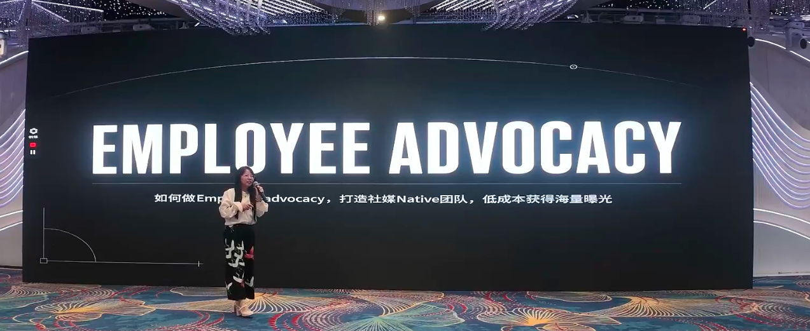
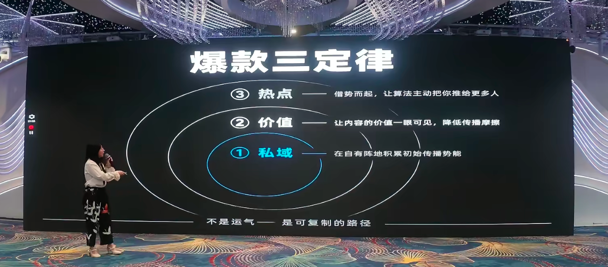
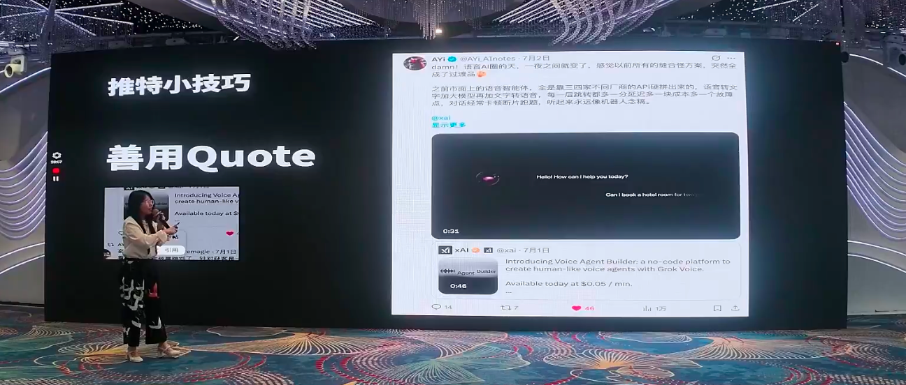
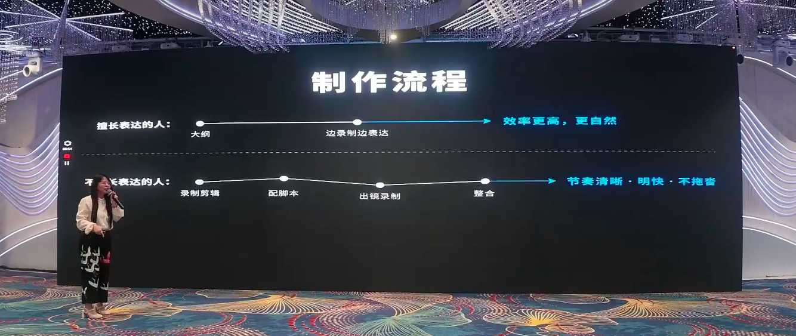

# 全员上阵做内容：哥飞社群大咖拆解 Employee Advocacy 低成本获海量曝光术

> 在「**哥飞的朋友们·年中分享交流会·深圳站**」上，优曼（YouMind）社区运营负责人 **Nicole（口辰）**，带来了一场主题为《**如何做 Employee Advocacy，打造社媒 Native 团队，低成本获得海量曝光**》的分享。
>
> Employee Advocacy 听上去很"高大上"，实际上就是大家更熟悉的说法——**团队矩阵号**。Nicole 从证券行业转型到出海工具赛道，凭借对内容的极致追求和一套可复制的激励机制，带领优曼全员做号，半年多全网积累近 **13.5 万粉丝**，用亲身实践证明了：社媒 × SEO 才是小团队低成本获客的黄金搭档。

---

## 一、为什么要做 Employee Advocacy？——社媒与 SEO 的黄金搭档

Nicole 开场就抛出了一个现实问题：**流量越来越贵，红人的价格逐年攀升，广告成本也在持续增加。** 有没有一种比较适合 OPC（一人公司）或小团队、低成本找流量的方法？

SEO 可能是大家已经找到的一个答案，但 Nicole 认为，她要分享的 Employee Advocacy（团队矩阵号）**与 SEO 是一个黄金搭档**。

她以优曼的"N拉起词集合站"为例：这种集合站现在已经变成行业常规打法，而它最早其实是**从社媒里面长出来的**——

- 在社媒上做一个大家喜欢分享、喜欢传播的内容，就是要一个**有价值的内容**；
- 像"起始词集合站"这类内容，用户觉得很有价值、能收藏、能用到，天然适合传播；
- 网站发布后，第一波就是团队矩阵号大家一起转发，再叫用户（UGC）、KOL 朋友一起转发，**发站第一天就有流量**——比传统 SEO 可能要两三个月才能看到效果，更有优势。

> Nicole 特别指出，社媒不只是引流工具，它还有三大隐藏价值：**第一天就有流量**、**训练你对热点的感知力**、**快速测款验证需求**。

**测款逻辑**尤其巧妙：假如要做一个新站，先在社媒上发一个帖子告诉大家"我要做这个东西，大家感不感兴趣"，看帖子流量和评论量——流量低就说明需求不成立，流量高、评论多就说明需求有价值。**确认需求 OK 再做站，能省掉非常多的时间。**

---

## 二、Nicole 的成长经历：从证券公司到优曼运营负责人

Nicole 自我介绍时提到了一条有趣的职业路径：

1. **UI 设计 & 交互设计出身**——对用户体验有极致追求，对细节有极致的把控；
2. **转型到证券公司做内容**——把每一个内容当成一个产品去做，关注是否真的给用户带来了价值。当时做的南部（内部栏目）特别火，很多用户甚至从别的券商消户，来到她所在的券商开户，**给公司带来了十几亿的转化**（按获客价值的人民币计算）；
3. **加入优曼，成为第一个运营**——从做 0.4、0.5 版本的宣传视频和教程视频开始。

**转折点：KOL 推广的局限性**

在推特上做过一场 CT（Content Tour），邀请大 V 推广优曼。作为品牌方审核人员，Nicole 发现了一个问题：**大 V 要在很短时间内体验产品，然后讲优势，很容易讲得浅。** 这不是大 V 不优秀，而是这种模式的天然局限。

> 她由此得出结论：如果是自己的团队矩阵号去推广产品，就可以讲得很深入，持续宣传产品的多方位优点。**对于长期品牌和产品来说，这是非常非常重要的。**

于是她下定决心——开始做自己的账号，并推动全员做号。

---

## 三、全员做矩阵号的激励机制——可复制的操作手册

很多人问 Nicole：你们公司为什么全员矩阵号做得这么好？我怎么才能让我团队的小伙伴去做内容？

她大方分享了优曼内部的激励机制：

### 粉丝激励

| 阶段 | 国内 | 海外（推特等） |
| --- | --- | --- |
| **1000 粉以内** | 1 元/粉丝 | 1 美刀/粉丝 |
| **超过 1000 粉** | 0.2 元/粉丝 | 0.2 美刀/粉丝 |

Nicole 自己是公司里拿激励最多的人——**拿了约 9 万块**。

**这套机制的设计巧思**：

- 前 1000 粉激励更高，因为**做账号最难的就是前一千粉**；
- 超过一定量后激励递减，避免一个人暴涨后拿走过多奖金，让分配更平均；
- 做到"激励 + 保底"双驱动。

### 产出保底

- **运营团队**：一周产出一个视频；
- **研发团队**：一个月产出两个视频；
- **不能完成？请全组喝奶茶！**

### "人都是希望被看见的"

Nicole 坦言最初也担心同事们不擅长做内容、不愿意做。但实际沟通后发现，**团队每个同学都是愿意的**——关键是公司要有鼓励机制。

> 她解释道：如果公司不鼓励，员工会担心老板觉得自己"不够聚焦在本职工作上"，反而是个负分。当公司有了激励机制，大家才会觉得"原来公司是鼓励我去做账号的"，然后就愿意去做了。

**真实案例**：优曼的一位研发同学，完全不擅长做内容，但照样能录制视频——精选 25 位 AI 领域的 Feed、播客节目、Vlog 放入 Skill 当中。**即使是研发同学，照样可以产出宣传产品的视频、给产品带来曝光。**

### 成果

全团队做到现在，**全网接近 13.5 万粉**。虽然和大博主比不算特别多，但很多人反馈"在各个地方都能刷到优曼"——因为全队都在做内容。

---

## 四、内容选题三板斧

Nicole 分享的选题策略非常适合小白上手：

### 1. 产品功能

- 上了什么新功能、新模型
- 有多少 Use Case
- 任何小事都可以说

### 2. 行业热点

- 什么火就发什么——MCP 很火就发 MCP，GPT-4o 减 2 很火就发 GPT-4o 减 2
- **和打词逻辑一模一样**：出现趋势后大家都需要这样的内容，这样的内容就是刚需，非常容易爆

### 3. 个人向内容

- 没有必要让账号完全发产品内容，那会让账号变得很无聊
- **个人号会比官号更容易长粉**——用户关注官号觉得是关注了广告，关注真人有血有肉的人才感兴趣
- 自我介绍是个"宝藏选题"：把高光时刻和能给大家带来的价值说清楚，会让账号的转粉率变高

> Nicole 特别强调一条心态建议：**刚开始做内容不要追求爆款，而是追求数量。** 从月更做到周更，从周更做到日更，先发 100 条再说。建立手感比追求爆款更重要——否则很容易因为"发了没人看"而产生焦虑、放弃。

---

## 五、爆款三定律：私域 × 价值 × 热点

Nicole 将出爆款的方法论收敛为三个同心圆：**不是运气，是可复制的路径。**

### 定律 1：私域加热

优曼是少数全团队都在私域里面的产品——**老板、所有工程师、产品同学全部都在群里面**，用户提出的问题都会快速响应。

- 建立私域后，和付费用户的黏性非常高；
- 做了内容发到群里让用户加热，**用户非常愿意给你加热**——因为你做的内容是满足他们需求、解决他们疑惑的；
- 用户在私域里给你点赞、收藏、评论，平台看到你的内容数据好，**又会推到更大的流量池**。

> 对于做产品的人来说：如果有私域，一定要建私域，这对出爆款至关重要。

### 定律 2：价值前三秒可见

Nicole 举了两个案例：

- **"教矩阵号——十万加"**：标题直接点明"十万加"，用户看到就觉得有价值；
- **"23.7 万粉，年收入近 900 万"**：前三秒说出"900 万"，用户甚至都不会看完就立刻收藏。

**核心要点**：把内容的价值在前三秒直接传递给用户，降低传播摩擦。

### 定律 3：热点借势而起

Nicole 分享了自己的超级爆款案例：

- **农历新年龙虾热点**：过年期间比别人多玩了几天龙虾游戏，想学习却发现全网没有系统化教程，于是用优曼**半小时写了一篇教程文章**，花一小时发到推特上——总共 1.5 小时，获得 **7000 多个赞**，排上推特前十名。
- **DeepSeek 热点**：百度期间的访谈内容，全球用户都好奇，赶紧剪辑配字幕发上去，果然爆了。

> 她还补充了推特新算法的变化：推特现在是"全球优先"——只要目标用户把目标语言设置成母语，即使你发中文，海外用户看到的也是他的母语翻译版。因此**全球人都知道的东西在新算法下更容易爆**。

---

## 六、推特实战技巧

### 爆款公式

**大 V 的互动 + 可复制的干货 + 互动加热 = 爆款**

推特是一个比视频更容易做的平台——发文字配个图就行，更适合平时有工作的人。

### 发推前预热 & 发推后加热

Nicole 透露了一个"千万人完全不知道"的小技巧：

**发推前——预热**：
- 发推前半小时开始和大 V、朋友互动评论；
- 让账号从不活跃状态变为活跃状态，获得基础权重；
- 很多人持续发推却没流量，不是被平台崩了，而是**没有跟别人互动**，账号不活跃就没有基础流量池。

**发推后——加热**：
- 发推后 30 分钟内叫朋友来互动四连：**点赞 · 转发 · 收藏 · 评论**；
- 团队矩阵号的小伙伴互相加热；
- 在大 V 的群里发红包，请群友帮忙加热。

> 这些都是不花钱的打法。

### 善用 Quote（引用）

Nicole 提到了一位叫"阿义"的推特玩家（5 万多粉），其核心打法就是善用 Quote：

- **转发 vs 引用**：转发是给别人带流量，引用是**分一波别人的流量**；
- 团队小伙伴发的内容用**转发**（给队友带量），其他爆款帖子用**引用**（给自己带量）；
- **技巧**：引用时带上一个视频，因为推特算法对视频有额外加权重。

---

## 七、视频制作流程——不擅长表达也能做

Nicole 将视频制作分为两条路径：

### 擅长表达的人
1. 写一个大纲（不用写逐字稿）
2. 对着大纲边录制边表达
3. 效率更高，更自然

### 不擅长表达的人（Nicole 自称属于这类）
1. 先**录屏**——录制你的工具教学、产品亮点
2. 再**配脚本**——这个镜头到哪，该说什么
3. 然后**出镜念稿录制**
4. 最后**后期整合**

> 虽然第二种方式比较费时间，但产出的视频**节奏清晰、明快、不拖沓**，前三秒的黄金开头想好、价值想好，用户就不会跳出，数据就会比较好。

### 推荐工具

| 环节 | 工具 | 说明 |
| --- | --- | --- |
| 脚本 + 素材 + 配音 | **YouMind** | Nicole 自家产品，"还是要打个广告" |
| 录屏 | **ScreenStudio** | 很多人问她"你用什么录的"，就是这个 |
| 录屏（平替） | **ScreenSage** | Nicole 朋友做的，价格更划算、功能更多 |
| 后期剪辑 | **剪映** | 大家都知道 |

---

## 八、内容规划 Benchmark

Nicole 给出了一个适合"一边工作一边做"的内容节奏：

| 内容类型 | 更新频率 | 目的 |
| --- | --- | --- |
| **短文字**（推特帖） | 日更 | 保持高频触达，持续建立存在感 |
| **长文** | 周更 | 深度沉淀思考，构建专业影响力 |
| **15s 无声功能展示** | 每周 2 条 | 产品功能可视化，降低理解门槛 |
| **人物露脸长视频** | 每月 2 条 | 建立信任连接，放大品牌势能 |

> 长文其实可以变成露脸长视频的脚本，一份内容多次复用。15s 无声视频是最简单的——录了屏，不需要配任何声音、不需要出镜，海外很多做 Employee Advocacy 的公司都在用这种方式。

---

## 九、总结：全员做号，不是运气，是可复制的路径

Nicole 把整套逻辑收敛为几个关键点：

| 原则 | 含义 |
| --- | --- |
| **激励是起点** | 公司鼓励 + 粉丝激励 + 保底机制，让全员愿意上场 |
| **私域是基础** | 建立付费用户私域，内容发布即有加热、即有数据 |
| **价值是核心** | 前三秒传递价值，让用户看到就想收藏 |
| **热点是杠杆** | 借势而起，让算法主动推给更多人 |
| **数量先于质量** | 先发 100 条建立手感，不要一开始就追求爆款 |

这套方法论底层完全依托社交媒体算法逻辑与真实用户运营，无任何"偏门加速"。Nicole 也提到，无论做 SaaS、做工具还是做电商，逻辑一模一样——**一个人做是赌运气，全团队做是赌概率，大数定律之下，发得越多，出爆款的概率就越大。**

> 祝大家一路长虹，产品爆红。

---

> 本文根据「哥飞的朋友们·年中分享交流会·深圳站（2026.07.04~07.05，深圳御景国际酒店）」上 Nicole（口辰）的分享《如何做 Employee Advocacy，打造社媒 Native 团队，低成本获得海量曝光》整理，内容仅为现场观点的转述与提炼，供哥飞社群伙伴及出海同行参考交流，不代表平台立场。如需转载或引用，请注明来源并联系原讲师授权。
