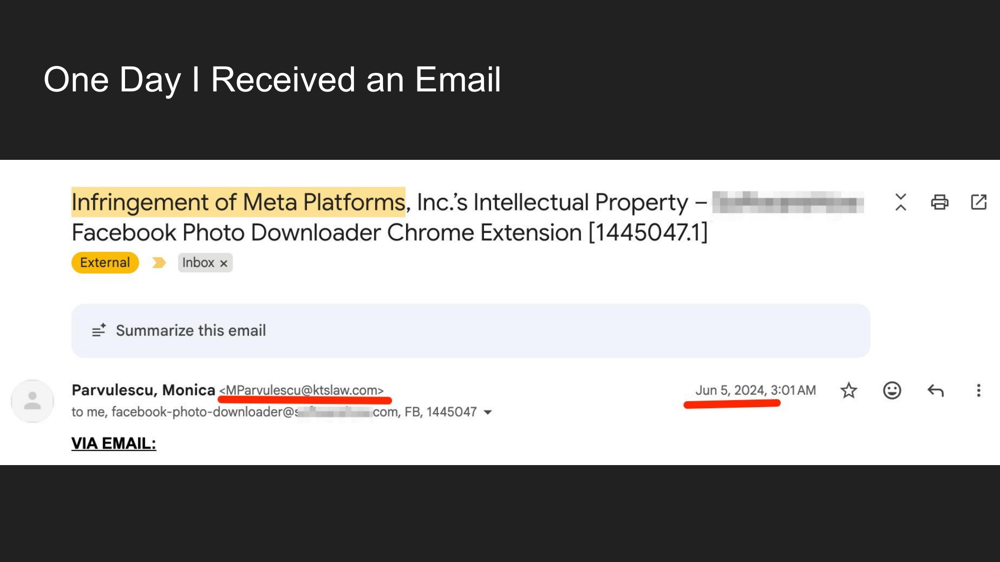
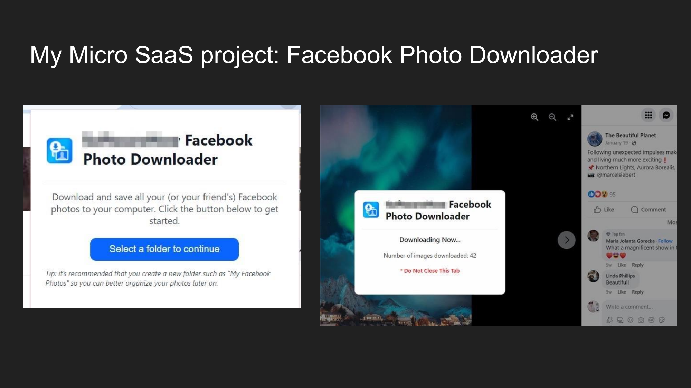
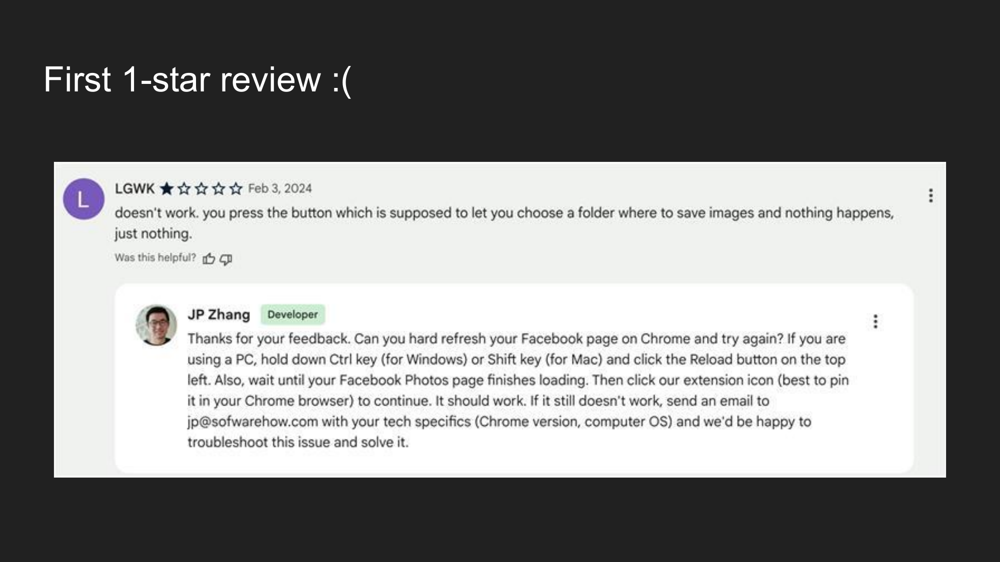
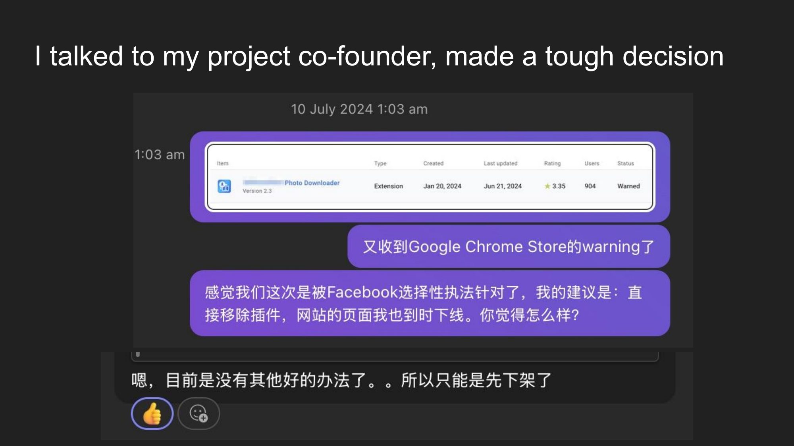
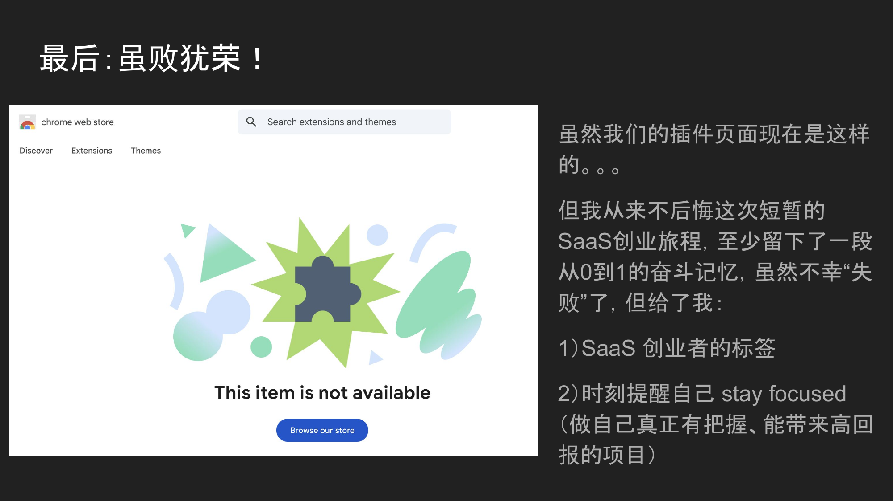

> 本文根据 John 在深圳 SEO 大会上的分享整理。一个从立项到被 Meta 律师函"劝退"的 Micro SaaS 创业故事，虽然最终项目关停，但留下的经验教训，或许比一个成功案例更有价值。

---

## 开篇：一封改变一切的邮件

故事的开头，不是某个灵感迸发的瞬间，而是一封邮件。

某天，John 打开邮箱，赫然看到一封来自 Kilpatrick Townsend & Stockton LLP 律师事务所的邮件，主题写着：**Infringement of Meta Platforms, Inc.'s Intellectual Property — Facebook Photo Downloader Chrome Extension**。

这不是钓鱼邮件，也不是某个恶作剧。发件人来自一家在知识产权领域声名显赫的律所，而 Meta（也就是 Facebook 的母公司）正是他们的重量级客户。

邮件的要求非常明确且严肃：

**第一，立即从 Chrome Web Store 及所有渠道下架"Facebook Photo Downloader"插件；第二，今后不得再提供任何使用类似名称或品牌标识、具有类似未授权功能的扩展程序。**

这封邮件，直接宣告了一个运营了8个月的 Micro SaaS 项目的终结。

但在讲"怎么死的"之前，让我们先回到起点——这个项目是怎么诞生的，以及它曾经承载了怎样的期待。

---

## 什么是 Micro SaaS？

在正式讲故事之前，有必要先聊聊什么是 Micro SaaS。

Micro SaaS 的核心不是做一个很复杂的产品，而是：**找到一个真实存在的小问题，然后开发出一个微型 SaaS 作为解决方案，并把产品做到极致。**

它不需要庞大的团队、不需要烧钱融资，甚至可以是一个人或两三个人的小团队就能搞定的事情。关键在于——你找到的那个"小问题"是不是真的有人愿意为之付费。

用一句话总结：**The essence of Micro SaaS isn't about technical complexity; it's about finding a friction point in a real-world workflow and solving it perfectly.**（Micro SaaS 的本质不在于技术复杂性，而在于找到工作流中的摩擦点并完美地解决它。）

---

## 项目起源：Facebook Photo Downloader

John 做的这个 Micro SaaS 项目，叫做 **Facebook Photo Downloader**——一个 Chrome 浏览器扩展插件，用来批量下载 Facebook 上的照片。

### 目标用户是谁？

Facebook 有 **30 亿**用户。在这个庞大的用户群体中，有相当一部分人有这样的需求：

- 正在注销 Facebook 账号，想把照片备份下来
- 账号被封禁，想抢救自己的照片记忆
- 想保存已故家人的 Facebook 照片作为纪念
- 想批量下载朋友相册里的照片

这些都是非常真实、带有强烈情感驱动的使用场景。

### 市场痛点在哪？

John 在调研中发现了一系列清晰的痛点：

**首先**，Facebook 自带的"下载你的信息"功能非常鸡肋——不能选择特定相册下载，忽略被标记的照片，也不支持批量下载朋友的照片。大多数用户只能一张一张地手动保存，体验极差。

**其次**，市面上已有的第三方工具，要么已经失效、要么过时、要么臃肿（需要下载安装桌面端软件、注册账号），要么收费高昂。而且下载的照片质量往往很差。

**一定有更好的解决方案**——这就是 John 立项的初衷。

### 解决方案

John 和他的开发搭档设计了一款 Chrome 插件，核心功能包括：

- **一键批量导出**：无缝下载整个照片库
- **双来源支持**：既能下载自己的照片，也能下载朋友的照片
- **精细化控制**：可以按相册或被标记的照片来选择
- **无损画质**：保持原始高分辨率元数据

### 为什么敢做这个项目？

John 选择这个方向并不是拍脑袋决定的，而是基于三个关键条件：

**第一，他有流量。** 他运营的一个内容站点上，有一篇关于"下载 Facebook 照片"的高流量文章，可以直接为插件导流。

这篇文章的 Google Search Console 数据相当亮眼：3550次点击、26.4万次展示、平均排名10.7。排名靠前的关键词包括"facebook album downloader"、"facebook photo downloader"等高意图搜索词。

**第二，有直接竞争对手在赚钱。** 一个叫 ESUIT | Photos Downloader for Facebook™ 的竞品，拥有 7万用户、4.6星评分（941条评价），而且是 Chrome Web Store 的 Featured 推荐插件。竞对能做到这个规模，说明市场需求是被验证过的。

**第三，有靠谱的技术搭档。** John 有一个做开发的朋友，对这个项目很感兴趣，愿意以技术入股的方式合作。

这三个条件叠在一起——有流量、有市场验证、有技术搭档——在 Micro SaaS 领域，这几乎是一个梦幻开局。

### 商业模式

John 设计了一套分层的变现模型：

**免费增值模式（Freemium）：** 免费用户最多可以下载300张照片——比竞品多100张，以此降低用户进入门槛，然后通过"无限量"付费计划来转化。

**增值服务：** 与"照片书"制作商合作，把用户下载的电子照片变成实体纪念册——利用用户下载照片时的情感诉求来做转化。

**订阅制云备份（SaaS化）：** 提供自动同步服务，定期将 Facebook 新照片备份到用户指定的云存储中。

### 市场潜力

John 在演讲中半开玩笑地说：Facebook 有 30 亿用户，哪怕只有 0.01% 的人需要这个功能，那也是 30 万潜在用户——对于一个 Micro SaaS 来说，这绝对不是一个"微"生意。

用他自己的话说：**"我们做的其实不是一个复杂产品，而是把 Facebook 没做好的备份功能补上，顺便赚点钱 :)"**——当时内心确实有点嘚瑟。

---

## 项目时间线：从0到关停的8个月

让我们来看看这个项目的完整时间线：

- **2023年11月19日**：正式立项
- **2023年12月27日**：插件 v1.0 诞生
- **2024年1月23日**：提交插件到 Chrome Web Store
- **2024年1月25日**：插件审核通过，正式上线
- **2024年2月3日**："喜提"第一个真实用户评价——1星
- **2024年2月26日**：累计500个下载（但卸载率高达50%）

### 第一个1星评价

上线不到10天就收到了第一个差评。用户反馈说"点击按钮后什么都没发生"。

John 以开发者身份认真回复了这条评价，提供了详细的排障步骤，并留下了技术支持邮箱。这个态度是对的——但问题在于，产品本身的稳定性确实不够。

### 差评接踵而至

随后，更多的1星评价涌来。

有用户直接说"Not Working!"，还有用户质疑"为什么这个插件要读取我的浏览记录？是不是骗子？"——后面这条评价还获得了2/2的"有帮助"投票，说明其他用户也有同样的顾虑。

### Chrome Web Store 数据

从后台数据来看，安装量虽然在稳步增长，总计达到了487次安装：

但卸载量也触目惊心——225次卸载，卸载率接近50%：

这意味着每两个安装用户中，就有一个很快就把插件卸载了。产品留存出了大问题。

### 时间线继续推进

- **2024年4月6日**：终于迎来了第一个5星真实用户评价

一位用户写道：**"I am using v2 and it's outstanding! Kudos to the developers!"**——经过几个月的迭代，v2版本终于让一些用户满意了。

- **2024年5月20日**：上线了 "Buy Me a Coffee"（请我喝咖啡）捐赠功能，测试用户的付费意愿

在用户完成照片下载后，会弹出一个提示，告诉用户这个工具花了开发者数周时间来制作，如果觉得有帮助，可以请他们喝一杯咖啡。

- **2024年6月5日**：Meta 律师团队发来第一封侵权函——**但 John 当时没空看邮件，错过了！**
- **2024年6月13日**：Meta 律师团队发来跟进邮件——这次 John 看到了
- **2024年7月24日**：决定关闭项目

---

## 为什么说它"失败"了？

John 在演讲中特意区分了**失败**和**"失败"**：

**如果不带引号——**

- 持续时间：8个月
- 成果：获取了1000+用户
- 赚到的钱：$0

从商业结果来看，这确实是一个失败的项目。投入了时间和精力，但一分钱没赚到。

**如果带上引号——**

- 它是 John 的 SaaS 创业旅程的重要一环
- 积累了大量的经验教训

---

## 深度复盘：为什么会被 Meta 盯上？

很多人可能会好奇：Chrome Web Store 上做 Facebook 相关工具的插件那么多，为什么偏偏是 John 的产品被盯上了？

John 总结了四个主要原因：

### 1. 产品核心功能稳定性不够

不同操作系统、不同 Chrome 版本、不同的插件环境……各种排列组合下，Bug 极难复现。而他们的小团队（两个人）根本没有足够的技术实力去做全面的兼容性测试和修复。当产品频繁出问题，用户的差评就会急剧增加。

### 2. 用户体验不佳

尽管团队制作了使用教程，但很多欧美用户仍然反馈不知道怎么使用这个插件。产品的上手门槛太高，这对于一个面向大众的 B2C 工具来说是致命的。

### 3. 上线太早，口碑受损

v1.0 版本在功能、UI/UX 和稳定性都不成熟的情况下就匆忙上架了 Chrome Web Store。结果就是：第一批用户的体验很差，留下了大量1星评价。在 Chrome Web Store 这样的平台上，早期差评的杀伤力是巨大的——它直接影响后续用户的安装决策。

### 4. Meta 有专业的品牌监控团队

Facebook 有专门的品牌公关团队，他们时刻监控品牌关键词，并做 Online Reputation Management（在线声誉管理）。当一个差评多、用户投诉多的第三方工具频繁出现在与 "Facebook" 相关的搜索结果中时，被关注和被追责只是时间问题。

换句话说：**如果你的产品做得足够好、用户体验足够丝滑、负面评价足够少，Meta 可能根本不会注意到你。** 但一旦你的产品在他们的品牌关键词下产生了大量负面噪音，你就自动进入了他们的雷达范围。

---

## 艰难的告别

收到律师函、又收到 Chrome Web Store 的 warning 之后，John 和他的搭档进行了一次认真的对话。

对话内容大意是：John 觉得他们可能是被 Facebook 选择性执法针对了，建议直接下架插件，同时把网站上的相关页面也下线。搭档回复说：目前确实没有其他好的办法了，只能先下架。

就这样，一个曾经承载了各种美好计划的项目，在一封律师函面前戛然而止。

---

## 复盘：做对了什么？

即便项目最终关停了，John 认为有几件事是做对的：

**找到了一个合拍的开发搭档。** 双方都没有掏钱，都是以技术和资源入股，这种轻量级的合作方式非常适合早期 Micro SaaS 项目。

**快速出产品、验证了市场需求。** 虽然理想客户画像（ICP）不够清晰，但至少通过快速上线证明了这个需求是真实存在的。

**几乎零成本获取了第一批用户。** 依靠自己内容站的流量加上一点点 SEO 优化，就完成了冷启动。对于独立开发者来说，这种用内容驱动增长的方式是最健康的。

**面对差评快速响应、快速迭代。** 每收到一条1星评价，团队都会认真分析问题并在下一个版本中修复。正是这种态度，才有了后来 v2 版本获得5星好评的转折。

---

## 复盘：做错了什么？

接下来才是真正有价值的部分——那些踩过的坑和犯过的错。

### 1. 没有清晰的定位

**理想客户画像是谁？使用场景是哪些？我们提供什么价值？绝对不能服务哪些人群或场景？** 这些问题在立项时都没有想清楚。

结果就是产品描述和 messaging 都很模糊，试图定位所有 Facebook 用户。30亿用户听起来很诱人，但一个两人小团队想服务"所有人"，就等于谁都服务不好。

**太贪心了。**

### 2. v1.0 不该上线

v1.0 的功能、UI/UX 和稳定性都不过关，其实不应该急着上架 Chrome Web Store。更好的做法是扩大内测范围、多做几轮迭代，等产品质量达到一定水准后再正式发布。

早期在公开平台上积累的差评，会像滚雪球一样越来越难逆转。**第一印象只有一次机会。**

### 3. 没有准备应对侵权风险的预案

做一个以"Facebook"命名的第三方工具，居然没有想过可能收到 Meta 的律师函——这是最大的战略盲点。收到律师函的时候，John 自己也承认"有点懵"。

后来他们确实做了一些补救措施：移除了 Facebook 的字眼、改了名字等等。但对方紧盯着违反 TOS（服务条款）不放，他们的小团队也没有能力和 Meta 的法务团队周旋。

---

## 七条核心经验教训

这是 John 整个分享中最精华的部分——七条血泪总结：

### 第一，个人小团队做 SaaS，尽量往 Micro B2B 方向靠，不要做 B2C

B2C 意味着你要面对海量的用户支持需求、极高的产品稳定性要求、以及被大公司碾压的风险。而 B2B 场景下，客户数量更少但付费意愿更强，且大公司通常不会去做那些细分垂直领域的小工具。

### 第二，想好离开策略（Exit Strategy）

万一项目无法继续，你依然可以把产品出手，拿到一定的现金回报——而不是让所有的投入都烂在手里。一个有用户基础的产品，即便你不想继续做了，在 Flippa 或 MicroAcquire 这样的平台上可能也能卖出去。

### 第三，没有 All In 的决心，很难成功

这一点 John 说得非常坦诚。当时他不仅仅在做这一个 Micro SaaS，还同时在搞其他项目。当遇到 Meta 律师函这种大问题的时候，"放弃"这个念头立刻就冒出来了——因为他有其他退路。但最终的结果是，所有项目都没有赚到钱。

**精力分散是独立创业者最大的敌人之一。**

### 第四，TOS 侵权问题是可以解决的

这是一个很重要的信息：他们的直接竞品 ESUIT | Photos Downloader for Facebook™ **也曾经遇到过同样的问题**，但人家解决了。目前竞品拥有7万次下载，而且在持续盈利。

这说明什么？被律师函吓退并不是唯一的选择。如果团队有足够的技术实力、法律意识和应对策略，这个坎是完全可以迈过去的。**问题不在于障碍本身，而在于你有没有准备好翻越它。**

### 第五，SaaS 创业的软技能门槛越来越高

虽然 AI 降低了技术门槛——写代码、做设计、搞运营都可以借助 AI 加速——但对创始人的**商业嗅觉、产品定位、风险预测和应对能力**等软技能的要求反而越来越高。

工具越来越强，意味着竞争壁垒不再是"能不能做出来"，而是"能不能做对方向、防住风险、活得够久"。

### 第六，不要孤独创业，一定要找互补的搭档

1 + 1 > 2。John 虽然在商业和 SEO 方面有丰富经验，但他不是开发者。有一个互补的技术搭档，才让这个项目能够在不到两个月内从立项走到上线。

独立开发者固然也有成功的案例，但对于大多数人来说，有一个信任且互补的搭档，能大大提高创业的成功率和抗风险能力。

### 第七，记得每周至少检查一次邮箱

这一条听起来可能有点搞笑，但却是血的教训。

Meta 的律师团队在 6 月 5 日就发了第一封侵权函，但 John 当时没有看邮件——直到 6 月 13 日收到跟进邮件才发现。**整整错过了 8 天的响应时间。**

在商业世界里，特别是涉及法律事务的时候，及时响应是非常重要的。**特别是要检查 Spam box**，很多重要邮件可能被误分类到垃圾邮箱里。

---

## 最后：虽败犹荣

现在，John 的插件在 Chrome Web Store 上的页面已经变成了这样：

一个灰色的拼图图标，下面写着 **"This item is not available"**（此项目已不可用）。

看到这个画面，难免有些唏嘘。8个月的时间、无数个深夜的 debug、与搭档的反复讨论、对每一条用户评价的认真回复……最终定格在了这样一个冰冷的页面上。

但 John 说，**他从来不后悔这次短暂的 SaaS 创业旅程**。

至少，这段经历留下了一段从0到1的奋斗记忆。虽然不幸"失败"了，但它给了 John 两样东西：

**第一，SaaS 创业者的标签。** 他不再只是一个 SEO 从业者或内容站运营者，而是一个真正动手做过产品、经历过市场验证、也被现实狠狠教育过的创业者。

**第二，时刻提醒自己 stay focused。** 做自己真正有把握、能带来高回报的项目，而不是什么机会都想抓、什么方向都想试。

---

## 写在最后

John 的故事，是无数 Micro SaaS 创业者的缩影。

在这个 AI 降低了一切技术门槛的时代，"做一个产品"变得前所未有的容易，但"做成一个生意"依然困难重重。市场定位、法律风险、产品稳定性、用户体验、团队协作、精力管理……每一个环节都可能成为压垮骆驼的最后一根稻草。

但每一次"失败"都不是白费的。那些踩过的坑、交过的学费、积累的认知，会在下一个项目中成为你最宝贵的资产。

正如 John 所说：**虽败犹荣。**

如果你也在 Micro SaaS 的路上，希望这篇复盘能让你少走一些弯路。而如果你正在犹豫要不要开始，也许 John 的经历告诉你：**去做吧，最差的结果不过是收获一段故事和一堆教训——而这些，远比停留在原地值钱。**

---

*本文整理自 John 在深圳 SEO 大会（英文 SEO 实战派）上的分享演讲。感谢 John 的坦诚分享。*