# 出海路上如何更快拿到正反馈：前AI产品经理的实战经验分享

> 在「**哥飞的朋友们·年中分享交流会·深圳站**」上，从纯素人前 AI 产品经理到 14 个月实现月入万刀的出海实战派分享了主题为《**出海路上如何更快拿到正反馈**》的经验。
> 
> 在竞争越来越激烈、红利越来越短的当下，新手的首要目标绝不是去卷代码和技术，而是如何找到“鱼多人少”的池塘，并以极快的速度完成验证。下面是本次分享的精华整理。

---

## 一、第一步：选对池塘

如果你想出海捕鱼，第一件事绝对不是打磨你的渔具，而是找到有鱼的池塘。

**找词 > 运营 > 开发**。不同池塘的胜率截然不同，选对高胜率的池塘能事半功倍。

什么样的池塘胜率高？总结四个字：**鱼多、人少**。

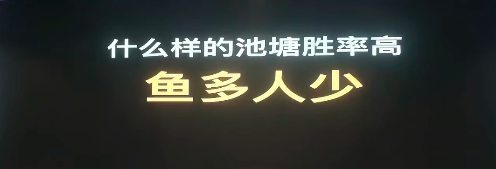

---

## 二、向大佬学习：抄什么？

当你发现了一个好方向，或者作为新手不知如何下手时，去学习（“抄”）同领域跑得最快的大佬是最稳妥的策略。

### 1. 抄外链：看操盘手法
只要有动作，就必然会在网上留下痕迹。利用 Ahrefs 等工具分析反向链接，特别是大佬建站早期发的外链，能帮助你还原他们从 0 到 1 的起盘推流手法。
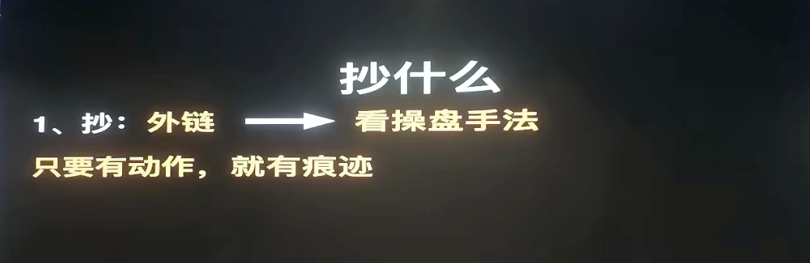

### 2. 抄内页：监控对手动向
关注对手做了哪些词？用工具监控他们的 Sitemap，每天对比新增了哪些内页和关键词（注意不要只看更新日期，要看实际的新增）。

### 3. 抄 On-Page SEO
大段的 SEO 指南看不完怎么办？把排在前面的网址直接发给 Gemini 等大模型，让 AI 帮你分析他们 SEO 做得好的点，提炼核心要素直接复用。

### 4. 抄网站交互设计
交互做得好，用户信任感强且停留时间长。让带有内置浏览器的 AI (如 Claude / Codex) 直接去打开网站点点按按，分析其交互机制。
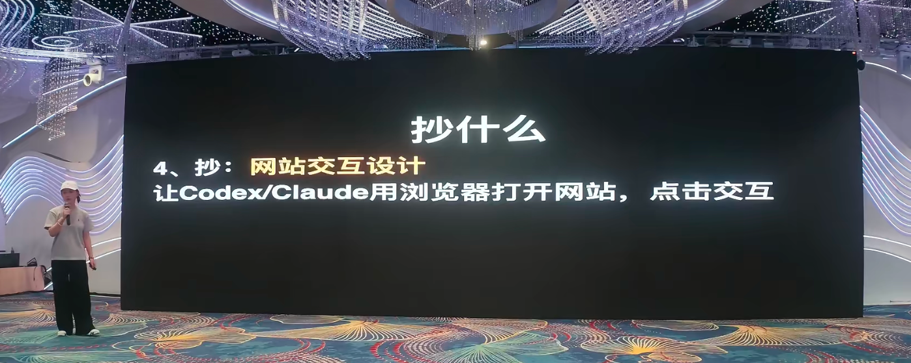

---

## 三、顺藤摸瓜：如何判断鱼多，如何找大佬？

### 1. 去哪里找大佬？
通过大词、新词顺着搜索结果去找（词找站）；或者通过昂贵的外链追踪（链找站）。能在短时间用“老词新站”跑到搜索第一页的人，绝对是值得盯紧的大佬。
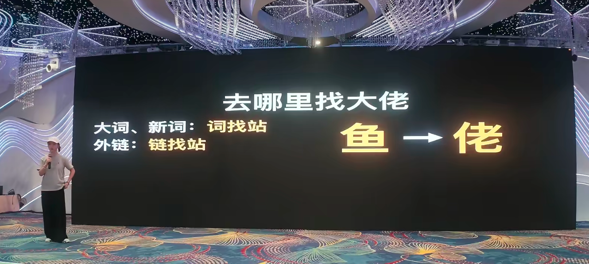
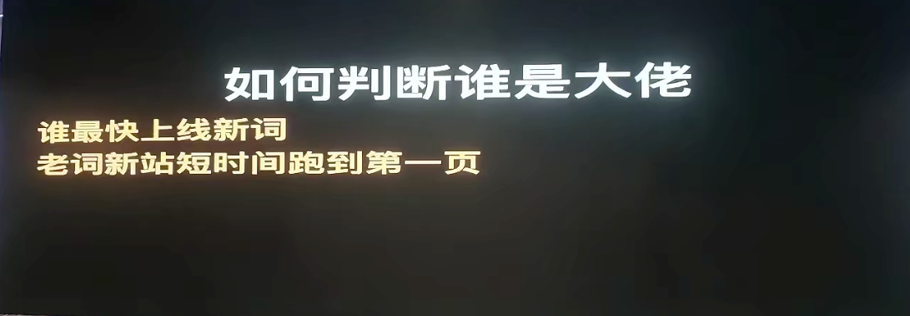

### 2. 如何判断“鱼多”？
- **看钱在哪**：谁在大量投广告？谁在买几百美金一条的高级外链？花得越多，说明挣得越多。
- **看榜单转移**：如果某个功能在 App Store 收入榜排名前列赚到了钱，那么必然也会有人在搜索引擎找，说明做成网站同样能赚钱。
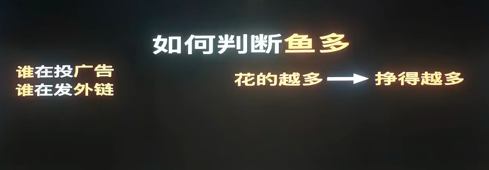
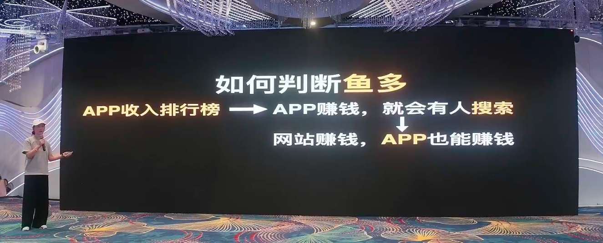

### 3. 如何捕捉早期红利（判断鱼即将变多）？
对于新手而言，最好的池塘是“鱼即将变多”但“人还少”的地方。
- **Trends 找词**：利用推荐算法的“相关查询”发掘词根、新词和热词。
- **搜索结果数量变化**：利用 `intitle:` 搜索，观察最近一周/一天/一小时的网页收录数，如果是指数级增长，说明有爆的潜质。
- **去源头找词**：盯紧第一手信息源（如 X/Twitter、TikTok 爆款、AI 模型榜单）。
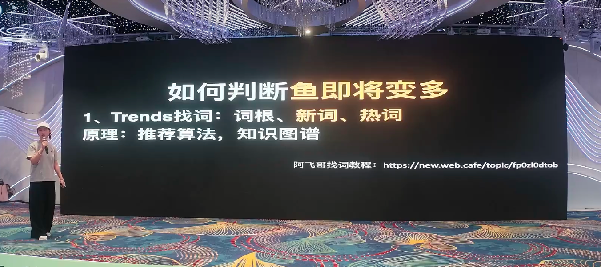
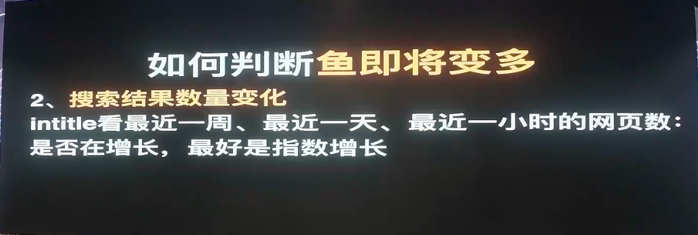

---

## 四、如何避开人多？

1. **不要和大佬硬刚**：大家都知道的大通用词（特别是火热的大模型词）不要无脑追，打不赢的仗坚决不打。
2. **学会预判**：采用“新词 + 常见组合词 / 版本号 / 多语言”的策略（例如预判出 v2、v3 或者 xxx generator）提前卡位，或者打时间差做小语种。
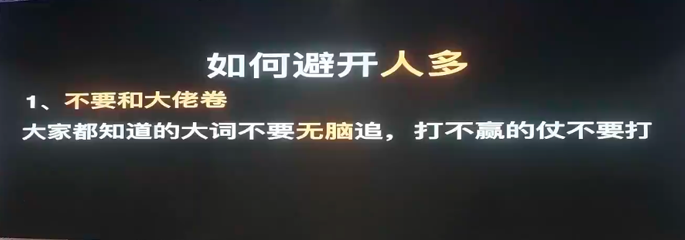
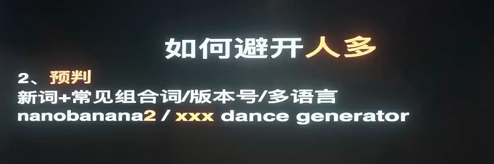

---

## 五、长期存活的心法

我们不仅需要技巧，还需要概率学的视角看待出海这件事：
- **大数定理**：哪怕每个站只有 10% 的成功率，连上 10 个站总能爆一个。不要等万事俱备再动手，**做中学**才是正道！
- **贝叶斯定理**：快速上站试错，但必须保证每次迭代都有复盘和进步，不断叠加你的单次胜率，最后实现万里挑一。
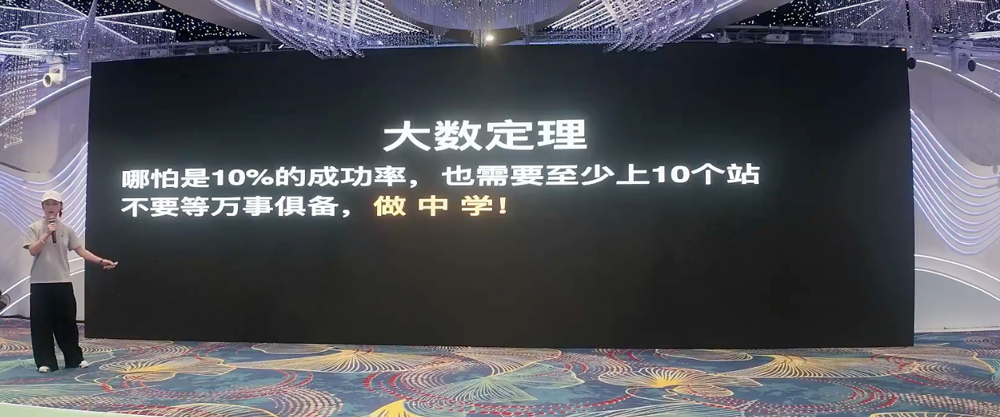
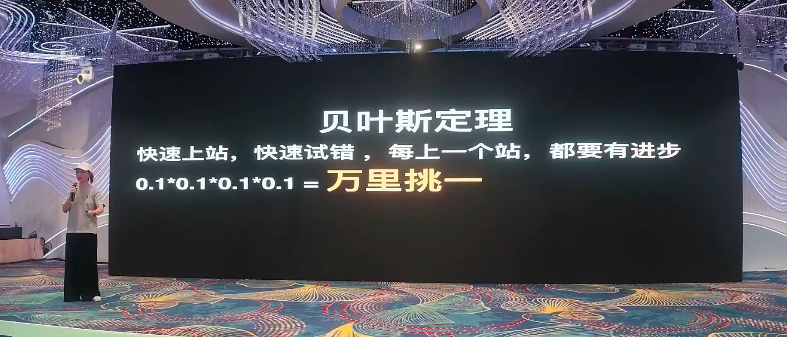

---

## 六、流量策略：造势、截流与冷启动

1. **造势**：主动制造需求。通过社媒爆款、Build in public (公开构建) 或红人营销，或者利用信息源头如 Reddit 和 FB Group 获取第一波用户。
2. **截流**：已有明确搜索意图时的打法。主要对象为需求词、竞品品牌词、新工具词、模型词（尤其是模型词，用户搜索时已有很强的使用和付费意愿，转化极高）。
3. **冷启动**：前期获取精确流量后，想尽办法延长用户的停留时间。例如通过每日打卡送积分，甚至刻意把生成速度变慢一点、加上好看的动效。

---

## 七、我们在赚谁的钱？

想清楚我们在赚谁的钱，本质上出海产品都是在做**服务**，满足深层需求：
- **帮用户省时间**：效率工具，节省的时间就是金钱。
- **帮用户赚钱**：尤其在 ToB 领域，帮助企业提高利润。
- **让用户爽**：提供情绪价值（如 AI 陪伴、游戏），这部分用户的对比竞品意愿低、退费率极低。
- **赚信息差的钱**：如赚取廉价 API 的差价，或是国内外的功能搬运。

---

## 八、成为合格的“AI 时代一人公司 CEO”

在 AI 时代，你是公司的 CEO，而 AI 是你的 CTO。
1. **代码不值钱，找词才是核心竞争力！** 不要陷入程序员思维去死磕代码底层的完美，`ship fast, ship more`。

2. **必须足够快。** 找到新词，当天（24小时内）必须上线！用模板，不要从头开发。
如果功能实在做不完怎么办？**放一个假排队！** 让用户以为在处理，这不仅能收集意向，还能延长停留时间，其效果远超直接让用户看到没功能的白板跳出，甚至有的假排队站因此冲到了排名第一。

3. **做一个乐观的“AI 降临派”。** AI 的迭代以毫秒计，在技术上人很难永远卷赢机器。但我们可以利用 AI 来战胜其他还没行动的人。无论红利窗口如何收窄，机会永远留给减少精神内耗、立刻动手去做的乐观主义者。

