*原作者：Daniel Johnson，We Scale Startups 创始人 | 分时CMO*

---

## 一、引言：全球SaaS最难的问题，不是做产品

如果你是一名SaaS创始人，你大概率已经在产品上投入了无数个日夜。你打磨功能、优化体验、迭代版本……然后你满怀期待地推向市场，结果发现——

**没有人在乎。**

这不是因为你的产品不好。而是因为在今天的SaaS市场里，产品本身已经不是最大的瓶颈。真正的瓶颈是**分发**——也就是，如何让目标客户知道你、信任你、并最终选择你。

这个问题对所有SaaS公司都存在，但对于那些试图进入新市场的公司来说尤其致命。你没有品牌认知，没有信任基础，没有人脉网络——你从零开始。

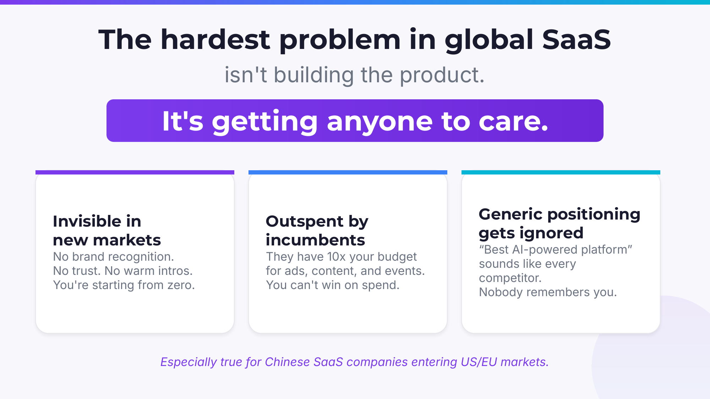

Daniel Johnson 在他的演讲中精准地总结了三个核心挑战：

**第一，你在新市场里是隐形的。** 没有品牌认知度，没有信任，没有温暖的引荐。你就像一个刚搬到新城市的陌生人，谁都不认识你。

**第二，你被大公司碾压。** 那些老牌竞争对手的广告预算是你的十倍甚至百倍。他们可以砸钱做内容、做活动、做投放，而你根本没法在花钱这件事上跟他们比。

**第三，同质化的定位让你被遗忘。** "最好的AI驱动平台"——这句话听起来跟市场上每一个竞争对手的口号一模一样。当所有人都在说同样的话，就没有人会记住你。

这些挑战对于中国SaaS出海的公司尤为突出。进入美国或欧洲市场时，你面对的不仅是产品竞争，还有文化鸿沟、信任缺失和品牌空白。

那么，破局之道在哪里？

答案是：**创始人主导的分发（Founder-Led Distribution）。**

---

## 二、为什么创始人主导的分发能奏效？

在B2B领域，有一个被反复验证的真理：**买家信任的是人，而不是品牌。**

这在高客单价的SaaS采购中尤其明显。当一家企业要花几万甚至几十万美元购买一个软件时，决策者需要的不只是产品演示和功能对比，他们需要信任——对卖方的信任，对方案的信任，对"这个人懂我的问题"的信任。

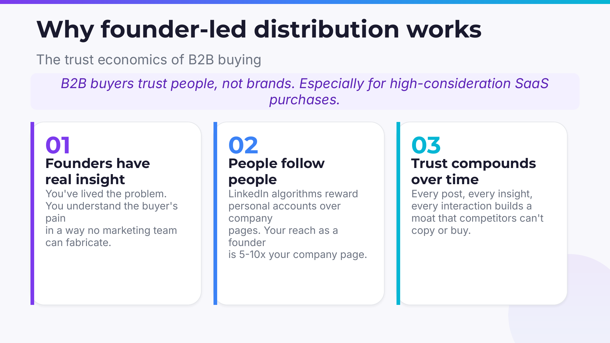

Daniel Johnson 提出了三个关键论点：

### 创始人拥有真实的洞察

作为创始人，你亲身经历过客户面临的问题。你不是从市场报告里读到的，而是在无数次客户对话、产品迭代和失败中体会到的。这种深度理解是任何营销团队都无法"制造"出来的。

当你在LinkedIn上分享一个关于行业痛点的思考时，你的ICP（理想客户画像）能立刻感受到——"这个人真的懂我的处境。"这种共鸣是花钱买不到的。

### 人们追随的是人，而不是公司

这是一个被数据反复验证的现象：在LinkedIn上，创始人的个人账号获得的触达量是公司主页的5到10倍。算法天然偏好个人内容——因为人们就是更愿意跟"人"互动，而不是跟一个没有面孔的企业Logo互动。

想想你自己刷LinkedIn的习惯：你更可能停下来读一个创始人分享的创业心得，还是一个公司官方账号发布的产品更新？答案不言自明。

### 信任是可以复利增长的

这是创始人主导分发最强大的特性：**它是一种复利游戏。**

每一篇帖子，每一次互动，每一个分享的洞察，都在为你积累一种竞争对手无法复制、也无法购买的护城河——**个人权威和信任。** 三个月后，你的每一篇帖子的影响力都会比第一篇大得多，因为你已经建立了受众基础和信誉资产。

---

## 三、权威→需求飞轮：创始人内容如何变成销售管线

理解了"为什么"之后，我们来看"怎么做"。Daniel Johnson 提出了一个非常优雅的模型——**权威→需求飞轮（Authority → Demand Flywheel）。**

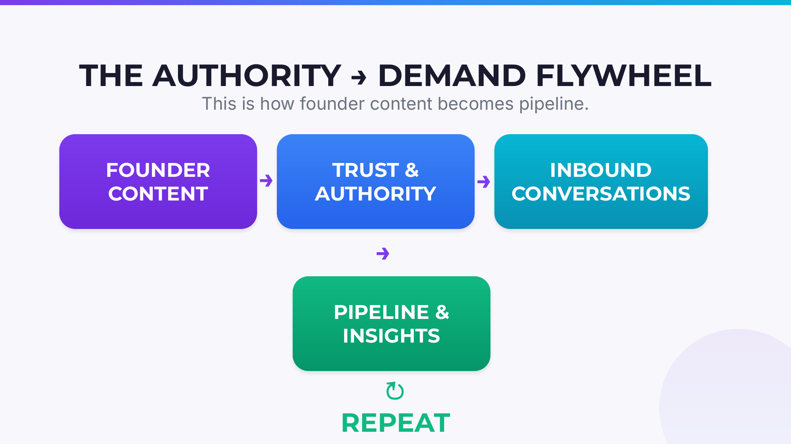

这个飞轮的运转逻辑是这样的：

**创始人内容 → 信任和权威 → 入站对话 → 销售管线和洞察 → 循环往复**

你发布内容，内容建立信任，信任带来对话，对话产生商机，同时商机中的客户反馈又成为你下一篇内容的素材。这不是一个线性过程，而是一个越转越快的飞轮。

关键在于：**这个飞轮的每一次循环成本都是零。** 你不需要花一分钱广告费。你用的是自己的经验、洞察和时间——而这些恰恰是你作为创始人最独特的资产。

---

## 四、LinkedIn：B2B创始人的最高杠杆渠道

在所有可以做创始人分发的渠道中，LinkedIn目前是回报率最高的。

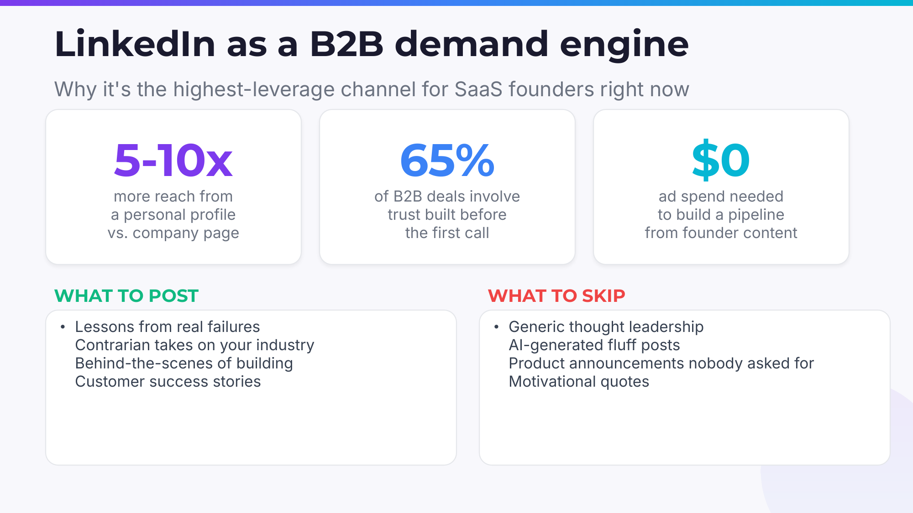

几个关键数据：

- **个人主页的触达量是公司主页的5-10倍**——算法就是这么设计的
- **65%的B2B交易中，信任在第一次通话之前就已经建立了**——买家在联系你之前，已经通过你的内容"认识"了你
- **$0广告费就能建立销售管线**——纯粹靠创始人内容驱动

那么，具体应该发什么内容呢？

**应该发的：** 从真实失败中学到的教训、对行业的逆向思考、创业幕后的故事、客户成功案例。这些内容的共同特征是——**真实、具体、有洞察。**

**应该避免的：** 泛泛而谈的"思想领导力"、AI生成的水文、没人关心的产品发布公告、心灵鸡汤式的励志名言。这些内容的共同特征是——**空洞、通用、没有信息量。**

简单来说，你的内容要让读者觉得"这个人真的经历过这些事"，而不是"又一个在网上刷存在感的人"。

---

## 五、从一篇帖子到一条商机：实操中的转化循环

让我们把飞轮具体化，看看一篇LinkedIn帖子是如何一步步变成销售管线的。

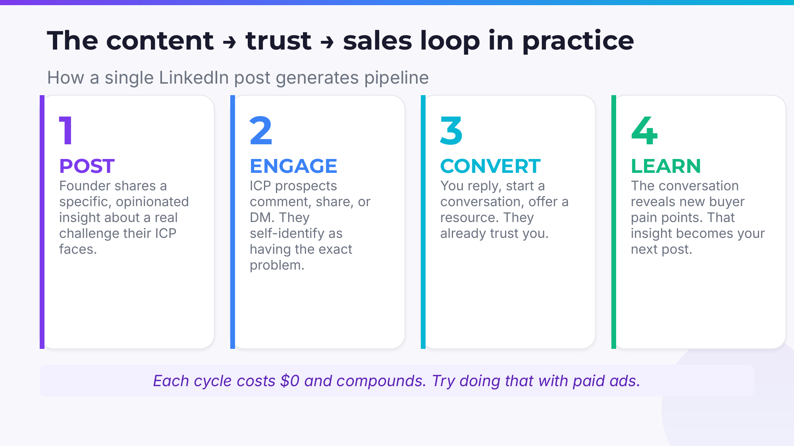

**第一步：发帖（POST）。** 创始人针对目标客户群体面临的一个具体挑战，分享一个有观点、有深度的洞察。注意关键词：具体、有观点。不是泛泛而谈"数字化转型很重要"，而是"我们在帮客户做X的时候发现，90%的人在Y这个环节卡住了，原因是Z。"

**第二步：互动（ENGAGE）。** ICP中的潜在客户看到后，开始评论、分享或发私信。他们主动暴露了自己——"我们也遇到了一模一样的问题！"这是最宝贵的信号：潜在客户自己找上门来了。

**第三步：转化（CONVERT）。** 你回复评论，开始一对一对话，分享一个有用的资源。这时候你不需要"销售"，因为对方已经通过你的内容建立了对你的信任。

**第四步：学习（LEARN）。** 在这些对话中，你发现了新的买家痛点和需求。这些洞察成为你下一篇帖子的素材。

**每一次循环成本为零，而且效果是复利累积的。** 试试用付费广告做到这一点？

---

## 六、"内向型创始人"的行动手册

很多创始人一听到"LinkedIn分发"就退缩了："我不是那种喜欢在网上高调发言的人。"

好消息是：**你不需要高调。你只需要持续和具体。**

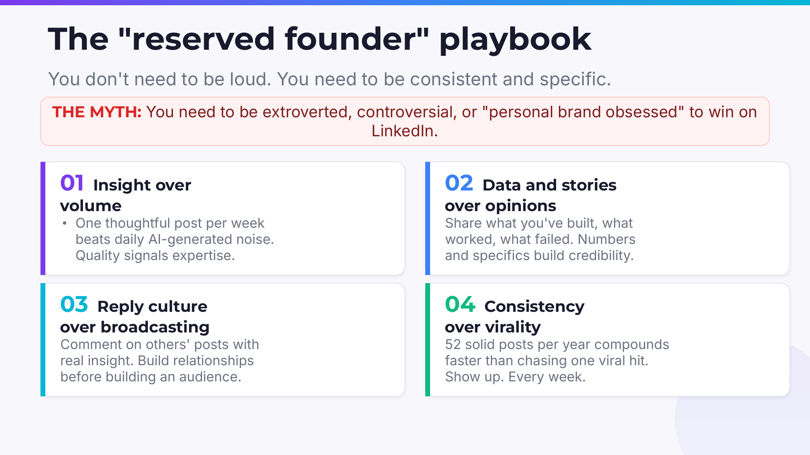

Daniel Johnson 专门为那些不喜欢"网红化"的创始人设计了一套方法论，他称之为"内向型创始人手册"。核心原则有四个：

### 原则一：洞察大于数量

一周发一篇经过深思熟虑的帖子，远胜于每天发一篇AI生成的水文。质量是专业能力的信号。你不需要每天都在LinkedIn上出现，但每次出现都要让人觉得"这篇值得读"。

### 原则二：数据和故事大于空泛观点

不要发"我认为SaaS公司应该注重客户成功"——这种话谁都会说。要发"我们上季度把客户续约率从72%提高到了89%，核心改变是X和Y"。数据和具体经历建立可信度，空泛观点只会让人滑过去。

### 原则三：回复文化大于单向广播

与其只是自己发帖，不如花时间去其他人的帖子下面留有深度的评论。先建立关系，再建立受众。这种方式尤其适合"社交能量"有限的内向型创始人——你不需要站在舞台中央，只需要在对的对话中出现。

### 原则四：持续性大于爆款

一年发52篇扎实的帖子，比追逐一个病毒式爆款的效果好得多。不要想着"万一这篇没火怎么办"——重要的是每周都出现。持续性本身就是一种信号：你是认真的，你不会消失，你值得被关注。

---

## 七、如何系统化而不失真实感？

有些创始人会问："我理解要做内容，但我每天已经被产品、融资、团队管理占满了，哪有时间写LinkedIn帖子？"

这是一个合理的问题。答案不是"挤出更多时间"，而是**建立一套系统，让创始人只需要做最有价值的环节——提供洞察——其他一切交给系统。**

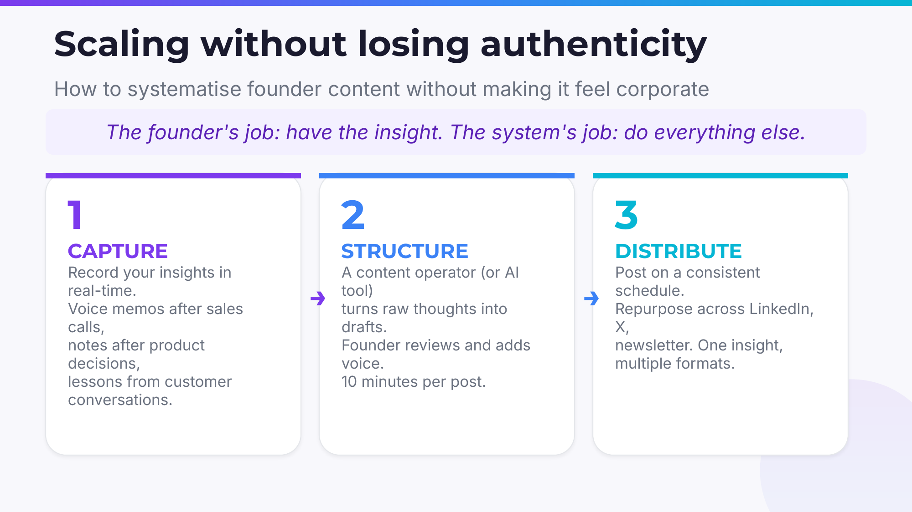

Daniel Johnson 提出了一个三步流程：

**第一步：捕获（CAPTURE）。** 在日常工作中实时记录你的想法和洞察。做完一个销售电话后录一条语音备忘录，做完一个产品决策后写两句笔记，和客户聊完后记下他们提到的痛点。这些原始素材就是你的"内容矿藏"。

**第二步：结构化（STRUCTURE）。** 一个内容运营人员（或AI工具）把你的原始想法转化成帖子草稿。创始人做最后的审阅，加上自己的语气和风格。每篇帖子只需要10分钟的创始人时间。

**第三步：分发（DISTRIBUTE）。** 按照一个固定的时间表发布内容。同一个洞察可以在LinkedIn、X（Twitter）、邮件通讯等多个渠道复用。一个想法，多种格式。

核心理念是：**创始人的工作是提供洞察，系统的工作是做所有其他事情。** 这样你既保持了内容的真实感和个人特色，又不会因为内容创作而耽误本职工作。

---

## 八、AI时代：创始人权威更重要了，而不是更不重要

你可能会想："现在AI都能批量生成内容了，个人品牌还有意义吗？"

恰恰相反。**在AI时代，创始人的个人权威比以往任何时候都更重要。**

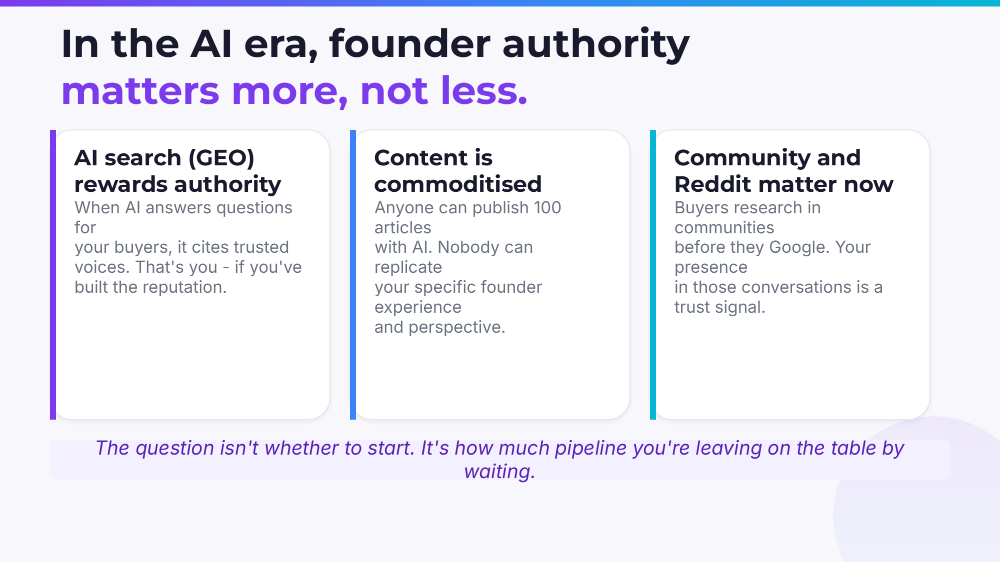

三个原因：

### AI搜索（GEO）奖励权威

当AI为你的买家回答问题时，它引用的是那些被认为可信和权威的声音。如果你在你的领域建立了声誉，AI会在推荐答案中提到你。这是一种全新的分发方式——被AI系统"推荐"为行业专家。

这也意味着，那些没有建立个人权威的公司，在AI搜索时代会更加隐形。你的竞争对手如果比你先建立起创始人品牌，AI就会先推荐他们，而不是你。

### 内容已经被商品化了

任何人都可以用AI在一天之内发布100篇文章。但没有人能复制你作为创始人的具体经历、独特视角和真实故事。当所有人都能批量生产"还不错"的内容时，**有真实经验背书的内容反而变得更加稀缺和珍贵。**

这就像在一个到处都是合成宝石的市场里，天然宝石反而更值钱了。你的创始人经验就是那颗天然宝石。

### 社区和Reddit的重要性在上升

越来越多的买家在做采购决策之前，会先去Reddit、Hacker News、微信群组等社区里做调研，然后才去Google搜索。你在这些社区中的存在感和参与度，是一种强烈的信任信号。

这三个趋势叠加在一起，结论很明确：**在AI时代，不做创始人分发的机会成本越来越高。**

---

## 九、实战案例：从Seed到Series B，他们是怎么做到的

理论讲完了，让我们看看真实的案例。

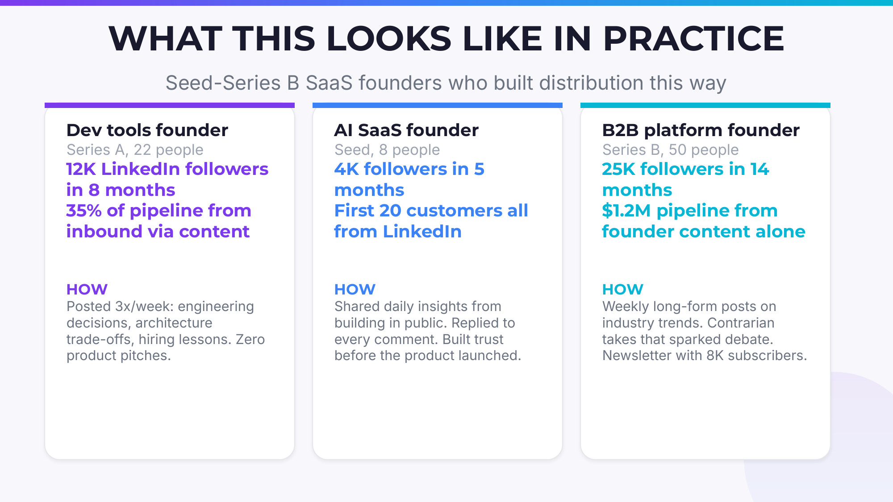

### 案例一：开发工具创始人

- **阶段：** Series A，22人团队
- **成果：** 8个月内LinkedIn粉丝达到12,000；35%的销售管线来自内容驱动的入站商机
- **方法：** 每周发3篇帖子，内容全是工程决策、架构选择的权衡、招聘经验教训。零产品推销。

这个案例的关键启示是：**你不需要"卖"产品。** 当你持续分享有价值的专业洞察时，客户会自己找上门来。

### 案例二：AI SaaS创始人

- **阶段：** Seed轮，8人团队
- **成果：** 5个月内4,000粉丝；最初的20个客户全部来自LinkedIn
- **方法：** 每天分享"在公众面前构建"（Build in Public）的日常洞察，回复每一条评论，在产品上线之前就建立了信任。

这个案例证明：**即使在最早期，还没有成型产品的时候，创始人分发就已经可以开始发挥作用了。** 你不需要等到产品完善了再开始——事实上，越早开始越好。

### 案例三：B2B平台创始人

- **阶段：** Series B，50人团队
- **成果：** 14个月内25,000粉丝；仅从创始人内容就产生了120万美元的销售管线
- **方法：** 每周发长篇行业趋势分析，用逆向思考引发讨论，同时运营一个有8,000订阅者的邮件通讯。

120万美元，零广告费。这就是创始人分发的杠杆效应。

---

## 十、30天启动计划：立刻开始行动

如果你被以上内容说服了，下面是一个可以立刻执行的30天启动计划。

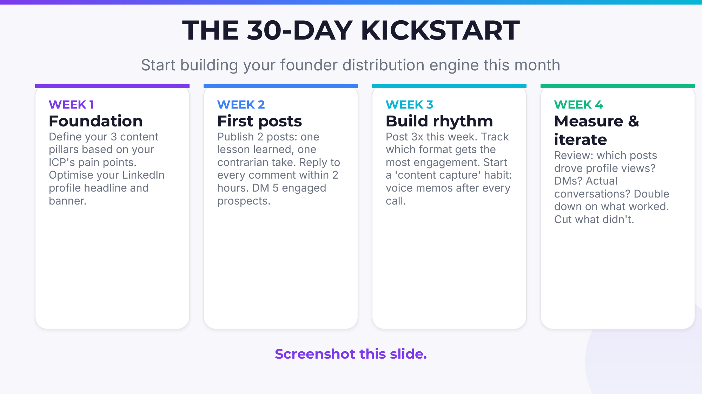

### 第一周：打好基础

- 根据你的ICP的痛点，确定3个内容支柱（比如：行业趋势分析、创业经验教训、技术架构决策）
- 优化你的LinkedIn个人资料——重点是头衔和横幅图。头衔不要写"XX公司CEO"，而要写"帮助[目标客户]解决[核心问题]"
- 研究你的ICP在LinkedIn上关注了谁，他们在讨论什么话题

### 第二周：发出第一批帖子

- 发布2篇帖子：一篇是你从失败中学到的教训，一篇是你对行业某个主流观点的逆向思考
- 在2小时内回复每一条评论——这对算法和关系建设都至关重要
- 主动私信5个互动过的潜在客户，开始真正的对话

### 第三周：建立节奏

- 这周发3篇帖子，逐渐提高频率
- 追踪哪种格式（纯文字、图片、轮播图）获得了最多互动
- 开始建立"内容捕获"习惯：每次打完电话或开完会后，用语音备忘录记录一个想法

### 第四周：复盘与迭代

- 回顾数据：哪些帖子带来了最多的个人主页访问？哪些带来了私信？哪些带来了真正的商业对话？
- 加倍投入有效的做法，果断砍掉没效果的
- 制定接下来一个月的内容计划

---

## 结语：你的产品是你的产品，你的分发是你自己

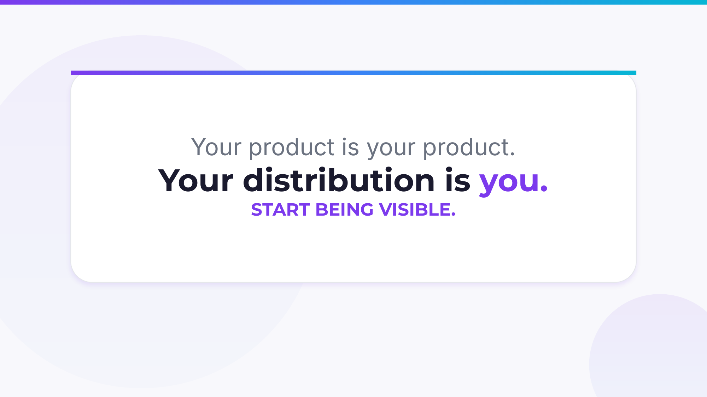

在SaaS行业，我们花了太多时间讨论产品功能、技术架构和融资策略，却忽视了一个最基本的问题：**当你的产品准备好了的时候，有没有人在等着用它？**

创始人主导的分发不是一个可选项，而是在今天这个注意力稀缺、信任稀缺的市场环境中，最高效、最可持续的增长策略之一。

它不需要你成为网红，不需要你每天花几个小时泡在社交媒体上，也不需要你花一分钱广告费。它只需要你做一件事：**把你已经拥有的真实经验和洞察，系统性地分享出来。**

正如Daniel Johnson所说：问题不是你要不要开始做，而是你每天不做，到底在丢失多少潜在的商机。

**开始被看见吧。**

---

*本文根据Daniel Johnson（We Scale Startups创始人）的演讲内容整理改编。如需进一步交流，可通过LinkedIn联系：linkedin.com/in/danieljohnsonxyz*
