# 19 条技巧拆到底：哥飞现场手把手教你 SEO 实战怎么落地

> 在「**哥飞的朋友们·年中分享交流会·深圳站**」上，哥飞社群创始人**哥飞**作为当天最后一位分享嘉宾，带来了一场主题为《**SEO 实战技巧落地指南**》的压轴分享。
>
> 不讲理论、不灌鸡汤，全程技巧直给——从怎么找新词、怎么判断值不值得做、怎么看竞品赚没赚到钱，到页面 SEO 怎么做、外链怎么发、用户行为数据怎么用、定价怎么涨，一共 **19 条可直接复用的技巧**，每一条都来自哥飞自己和群友的实战验证。

---

## 一、找新词：新词就是新机会，关键是去源头找

### 技巧 1：不同类型的新词，有不同的源头

哥飞开场就指出，大家都知道要找新词——新词就是新机会，做了就能赚钱。但**谷歌趋势并不是新词的第一现场**。一个词一定是在别的地方先火起来、先被讨论了，导致很多人感兴趣、去谷歌搜索，谷歌趋势才开始有热度。等你在谷歌趋势里刷到它的时候，可能已经晚了一两天甚至两三天。

那怎么去找到更源头的信息？**不同类型的词，有不同的来源。**

| 新词类型 | 源头在哪里 | 怎么找 |
| --- | --- | --- |
| **游戏新词** | 游戏资讯网站、游戏讨论社区、游戏主播视频 | 用过去火过的游戏倒推，找出哪些主播/网站更早推荐了，关注他们 |
| **AI 模型新词** | AI 科技公司的官网、博客、官方推特、YouTube 频道 | 关注模型公司的官方账号，他们有时候会提前预告 |
| **AI 玩法新词** | 刷屏的推特、Higgsfield 等能自创玩法的网站 | 关注宝玉等博主的推特，看他们分享的最新玩法 |

**核心方法：用"已知答案"倒推信息源。** 我们对过去一两年发生过的新词是知道的——拿着这份答案，去全网搜索，看看哪些主播、哪些网站是在比较早的时间就做了推荐的，把他们关注起来。这样你就相当于有了**几十双甚至上百双眼睛**帮你发现新词。

**程序化找词：** 哥飞还提到他在社群里写过一篇文章，讲如何利用推特 API 定时抓取——筛选出最近半年点赞超过一定数量的、带链接的推文，同时调用网站流量接口和域名注册日期接口，**每隔一个小时自动跑一次**，找出正在流行的、全新的、有流量的网页。

> 如果 Similarweb API 只能查上月流量怎么办？哥飞的建议是：让 AI 帮你做一个浏览器插件，从后端发送域名给插件前端，自动打开 Similarweb 页面查看最近 28 天的流量。**所有门槛其实都有解决办法。**

### 技巧 2：多刷社媒，保持敏锐——别人刷屏时你该上站

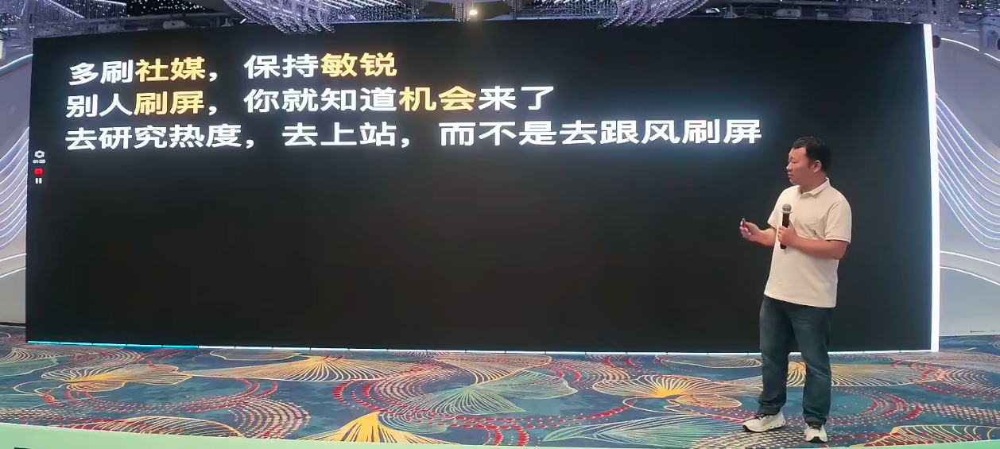

哥飞举了一个鲜活的例子：昨天有个网页火了——有人开源了一个 GitHub 仓库，提供多维度检测当前访客是否是中国人的方法，然后有人在此基础上**包装了一个玩法**叫 "F*** Cloud"，加了趣味动效和卡通形象，一下子全网传播。

> **你看到一个仓库觉得很有用，去传播一下，传播力度是不大的；但你把它包装成一个有趣的玩法，全网所有人都会帮你传播。**

哥飞的核心观点是：**别人刷屏的时候，你就知道机会来了。** 你应该去研究热度、去上站，而不是跟着别人嘻嘻哈哈转发一下就完了。

---

## 二、判断词：新词和老词分开看

### 技巧 3：全新的词——不管热度大小，先做了再说

如果在谷歌趋势里看到一个**全新出现的关键词**，不管它出现了两个月、两周还是昨天才出现——**直接上，不做他想。**

- 不用管有没有别人已经上了站；
- 不用管域名是否都被注册了——你总能找到能注册的域名；
- 两个月、三个月都还有机会——因为很多人只是注册了域名没上站，或者上了但网页 SEO 没做好、外链不够、体验差。

> **不用担心有人比你先上线。做了就有机会。**

### 技巧 4：老词——看有没有人从这个词赚到钱

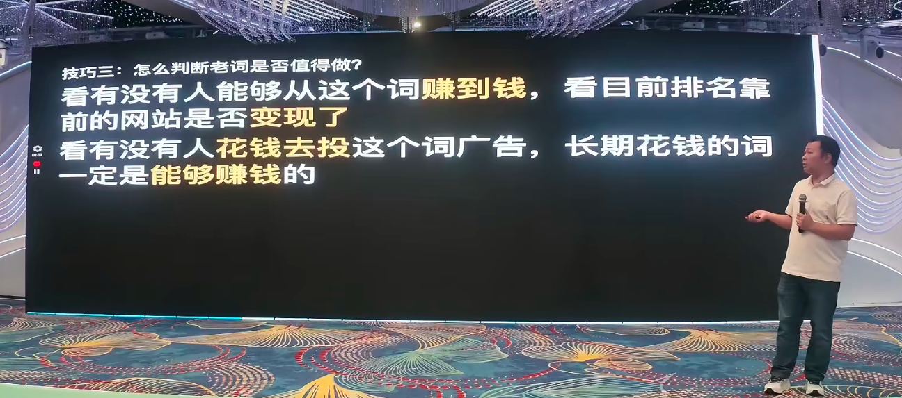

对于老词，关键是验证这个市场/需求**是否已经被验证过**能赚到钱：

- **看排名靠前的网站是否已变现**——接了什么支付、卖什么套餐；
- **看有没有人长期投这个关键词的广告**——如果有人一直花钱投某个词，大概率能从中赚到钱。即使不是通过网站付费变现，也一定有更后端的变现逻辑。

> "不然不可能直接去撒钱，是吧。"

---

## 三、看竞品：从定价页面到收入估算

### 技巧 5：怎么看网站是否变现了

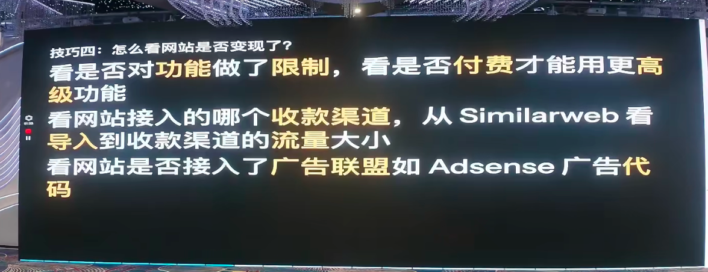

三个维度判断：

| 判断维度 | 具体方法 |
| --- | --- |
| **功能限制** | 看是否对功能做了限制——付费才能用高级功能 |
| **收款渠道** | 看接入了哪个支付（Stripe、Paddle 等），从 Similarweb 看导入到收款页面的流量 |
| **广告联盟** | 看是否接入了 Adsense 等广告代码——有些站不靠会员变现，靠广告变现 |

### 技巧 6：看定价页面 = 看核心卖点

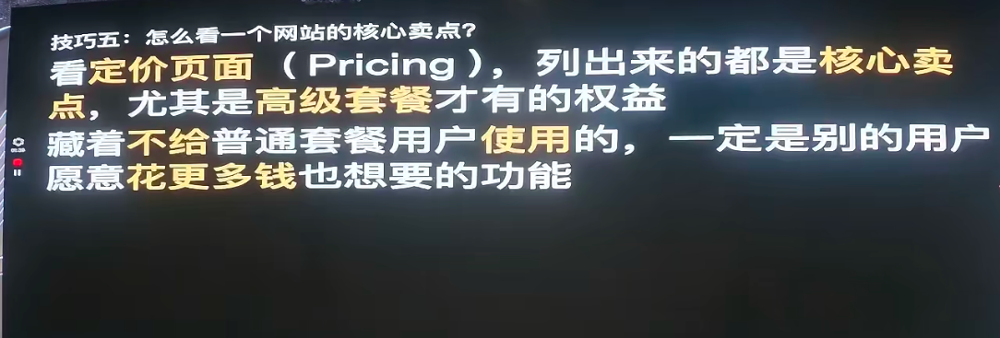

哥飞特别强调：**每一个收费网站、每一个排名靠前的网站、每一个正在投广告的网站——其他页面可以不看，定价页面一定要看。**

- 看它的 ABC 三个套餐分别给了什么权益；
- **高级套餐才有的功能，就是用户愿意花更多钱也要买的核心卖点**；
- 把这一两个核心卖点拿出来，单独做一个网站只打这个点，做到比它更好——**这个方法是可行的**，哥飞自己和旁边几个群友都复刻验证过。

### 技巧 7：粗算网站收入——一个极简公式

哥飞给出了一个"特别特别简单粗暴"的估算方法：

| 变现模式 | 估算公式 | 说明 |
| --- | --- | --- |
| **广告变现** | Similarweb 月访问量 ÷ 1000 × 5 美金 | 每千次访问约 5 美金 |
| **用户付费** | Similarweb 月访问量 ÷ 1000 × 100 美金 | 每个访问平均贡献 0.1 美金 |

> 他用群友的网站和自己的网站都验证过，**实际收入往往比估算更高**——因为还有长期订阅等算不到的收入。

---

## 四、判断竞争：关键词到底能不能打

### 技巧 8：判断关键词竞争程度

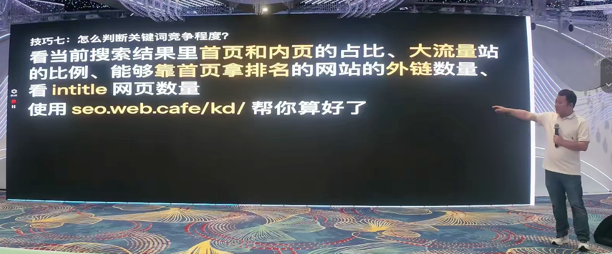

综合看四个指标：

1. 搜索结果前十中**首页 vs 内页的占比**；
2. **大流量站**的比例；
3. 靠首页拿排名的网站**外链数量**；
4. **intitle 网页数量**。

> 哥飞推荐了自己做的工具 `seo.web.cafe/kd/`，已经把这些指标综合起来帮大家自动估算——群友一天可以用 500 次，非群友一天也能用 100 次。

---

## 五、做页面：On-Page SEO 的核心原则

### 技巧 9：用户要什么，你就给什么

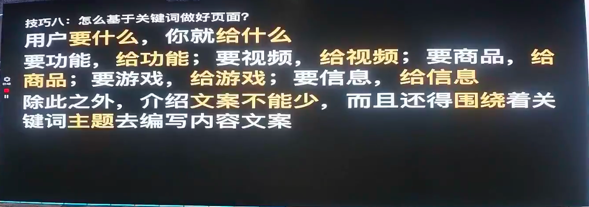

做页面的第一原则：**理解用户搜索意图，用户要什么就给什么。**

- 要功能，给功能；要视频，给视频；要游戏，给游戏；要信息，给信息；
- **不能不管什么需求一股脑给一个落地页**；
- 页面的介绍文案不能少，而且必须围绕关键词主题来编写。

### 技巧 10：判断关键词意图——问 AI 是最快的方式

哥飞分享了他现在每天最常做的两件事：

1. 看到一个陌生网站，打开 Claude 问它：**这个网站是干嘛的？**
2. 问完后接着问：**这个网站靠什么变现？主要流量来源是什么？**

> "基本上把这几个问题问完，你就对一个网站有大概的了解了。而且你还能并行——同时问 N 个网站都行。"

他甚至建议可以做一个浏览器插件，对每个网站自动问这几个问题，在右侧面板直接显示分析结果。

### 技巧 11：关键词密度——不是让你堆积，是让你聚焦

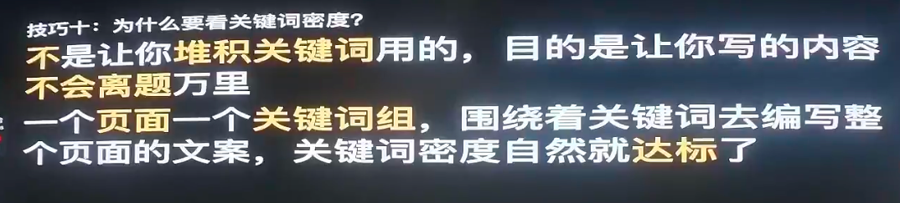

很多人问：谷歌不是说不要堆积关键词吗，为什么还要看密度？

哥飞解释：**看密度是为了间接保证你的页面内容聚焦在核心关键词上**，防止 AI 编辑偏题或发散。

- **核心原则：一个页面一个关键词组**；
- 只要围绕关键词去编写整个页面的文案，密度自然就会达标。

### 技巧 12：On-Page SEO 的关键指标

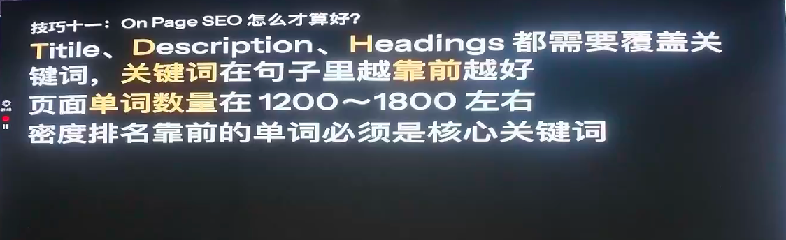

不管是做自己的网页还是分析竞争对手：

| 指标 | 要求 |
| --- | --- |
| **Title / Description / Headings** | 必须覆盖关键词，关键词在句子里越靠前越好 |
| **页面单词数量** | 1200~1800 左右 |
| **密度排名靠前的单词** | 必须是核心关键词 |
| **Headings** | 主要看 H1 和 H2 |

### 技巧 13：用 CSS Content 去除无意义重复单词

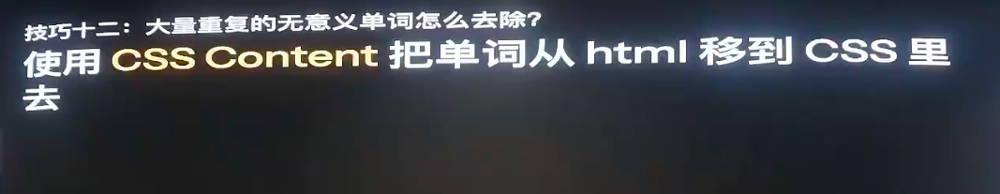

一个实用小技巧：如果页面有 50 个提示词卡片，每个都有一个 "Copy" 按钮，就会出现 50 个 "copy" 文案——这跟当前页面的核心主题无关，会稀释关键词密度。

**解决方法：** 用 CSS 的 `content` 属性来显示 "Copy" 这几个字，而不是放在 HTML 里。这样谷歌爬虫就不会把这些无意义的重复词纳入页面文案分析。

---

## 六、外链：评论外链依然有用，但要聪明地发

### 技巧 14：博客评论外链还是有用的

哥飞承认评论外链"的确就是在给互联网制造垃圾"，但他在社群里专门写过文章论证——**它有用。**

逻辑很简单：不同的外链带来不同的权重提升，不同的关键词竞争度不同，所需权重也不同。在竞争激烈的词上，评论外链可能不够用；但在新词、游戏站等领域，仍然有效。

**进阶技巧——找评论最少的页面发：**

- 别人都盯着同一篇文章发，越多人发、每条外链分到的权重越低；
- 去扒整个博客的文章列表，找出**评论数量最少的文章**去发；
- 更进一步：找该网站中**内链最多的页面**（尤其是包含首页链接的），那就是整站最有价值的页面——在那里发外链效果最好。

> "这些技巧你不要只是听了就这样用。当所有人都这样用的时候，你就应该再往前思考一步。"

### 技巧 15：外链既看质量也看数量——预算少时优先提数量

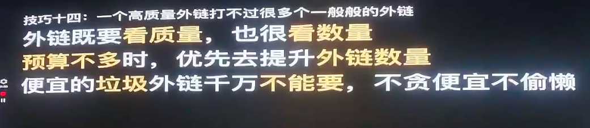

哥飞的经验与"一定要求质"的主流说法不同：

- 除了最低端的垃圾外链（咸鱼/淘宝/Fiverr 上 5 美金几百个外链那种）不要买；
- 其余**自己发的，不管是导航、评论还是别的地方，只要发了就有效果**；
- **预算有限时，优先提升外链数量而非质量。**

> **举例：** 2000 美金预算，A 方案是 4 篇 × 500 美金的软文，B 方案是 60 天 × 30 美金/天的外链。**一定选 B——60 个外链域名一定大于 4 个。**

---

## 七、策略：抄作业、多语言、行为数据、免费与涨价

### 技巧 16：抄作业依然是很有用的方法

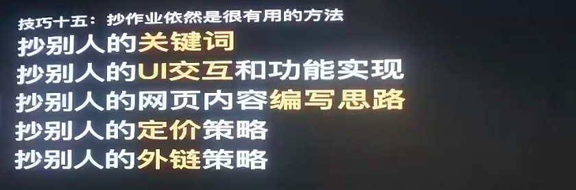

**能排到靠前的网站，它的每一个操作、每一个细节都值得研究：**

- 关键词策略
- UI 交互和功能实现
- 网页内容编写思路
- 定价策略
- 外链策略
- 广告投放（投了哪些词、哪些国家、落地页长什么样）
- 社媒运营方式

> **但请注意：抄的是思路、思想，而不是偷懒抄文案。** 重复页面谷歌是不喜欢的。

### 技巧 17：多语言依然是个大坑——不要盲目一键翻译

哥飞梳理了多语言的三个阶段演进：

| 阶段 | 做法 | 问题 |
| --- | --- | --- |
| **初级** | 一个网页 + JS 翻译插件，同一网址不同语言 | 爬虫只能爬到一种语言，SEO 不友好 |
| **中级** | 每个语言一个页面，用子目录或子域名 | 一键翻译导致内容不本地化 |
| **高级** | 每个语言/国家独立建站（纯血版小语种） | 成本更高但效果最好 |

> 哥飞透露，他从 2025 年开始陆续听到群友报喜——**英文做不下去的关键词，专门做韩语站、日语站却拿到了流量**。他把这个消息藏了半年本想自己用，到了 2026 年 6 月才决定请小平来社群分享。

**核心原则：用做英文页面的方法去做别的语言——单独调研关键词、单独写文案、适配当地 UI 风格——而不是一键翻译。**

### 技巧 18：用户行为数据是以弱胜强的制胜法宝

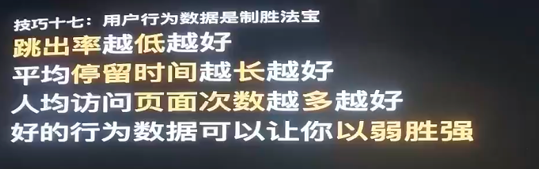

哥飞指出，有些网站外链很少，却能排在外链很多的竞争对手前面——**原因就是用户行为数据更好。**

三个核心指标：

| 指标 | 目标 |
| --- | --- |
| **跳出率** | 越低越好 |
| **平均停留时间** | 越长越好 |
| **人均访问页面次数** | 越多越好（很多人忽略这一点） |

**提升人均访问页面次数的技巧：**

- 生成器生成的图片只显示小图，点大图时跳转到新页面；
- 专门做一个"生成结果"页面，以列表形式展示历史所有结果（小图列表）；
- 点击某张图时，URL 变化（用 `pushState`），弹出大图图层；
- 关闭图层后看到的是所有历史图片列表——体验更好，访问页面数也上去了。

**哥飞的核心假设：** 每个关键词有一个"优秀用户行为数据门槛"——比如 1000 个优秀行为数据才能进首页。只靠 SEO 来的自然流量积累太慢，但**通过免费传播、投广告等方式可以加速积累**。

> 这也解释了为什么"投广告能把自然流量带起来"——不是谷歌偏袒广告主，而是精准用户在你网站上产生了优秀的行为数据，帮你更快跨过了那个门槛。

### 技巧 19：免费是个好策略 + 涨价是最快多赚钱的方法

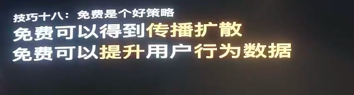

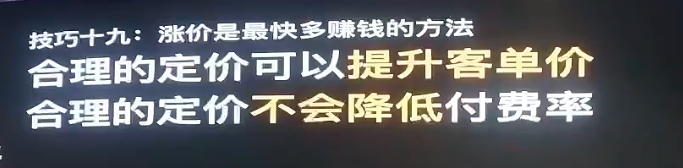

**免费的两大价值：**
1. 得到传播扩散；
2. 积累用户行为数据——谷歌从中判断你的网页能否更好地满足用户需求。

**涨价的逻辑：** 哥飞引用了一位群友的经验——"赚钱最好的方法就是涨价"。涨价后：

- 原先的订阅用户并不会大范围流失——极少数会降级套餐，大部分人继续用；
- **合理的定价可以提升客单价，同时不会降低付费率。**

> 哥飞自己也给好几个网站涨过价，"真的是有效的"。

---

## 八、结语：更多技巧，跟 GeFei.ai 聊

哥飞在分享结尾推荐了社群专属的 AI 助手 **GeFei.ai**——里面训练了社群过去几年所有的群聊记录、公众号教程文章、社群教程文章、以及群聊里开过的所有"哥飞小课堂"的内容。

> 他还特意提到 API 费用由他个人先承担，社群成员免费使用，未来也不会对社群成员收费。

19 条技巧看起来朴素，但每一条都是哥飞和群友在实战中验证过的。正如他开场所说：**每个人学的是同一份资料，但理解、实践、总结出来的经验各不相同——不要跟最强的人比，今天比昨天更强就足够了。**

---

> 本文根据「哥飞的朋友们·年中分享交流会·深圳站（2026.07.04~07.05，深圳御景国际酒店）」上哥飞的分享《SEO 实战技巧落地指南》整理，内容仅为现场观点的转述与提炼，供哥飞社群伙伴及出海同行参考交流，不代表平台立场。如需转载或引用，请注明来源并联系原讲师授权。
