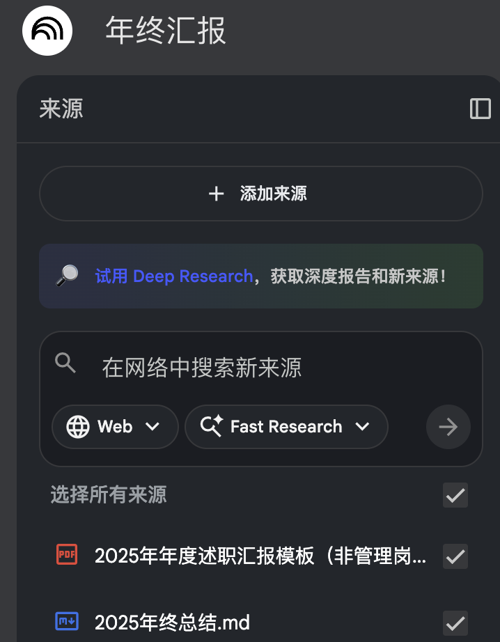
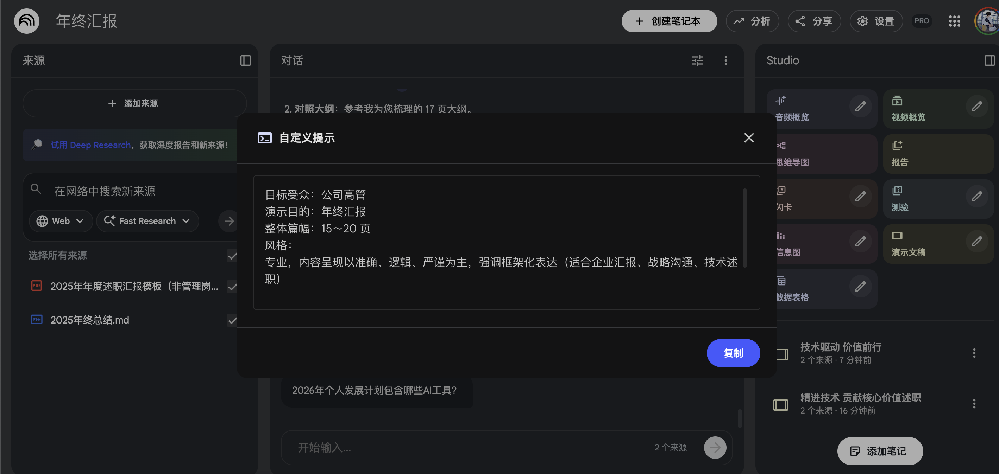
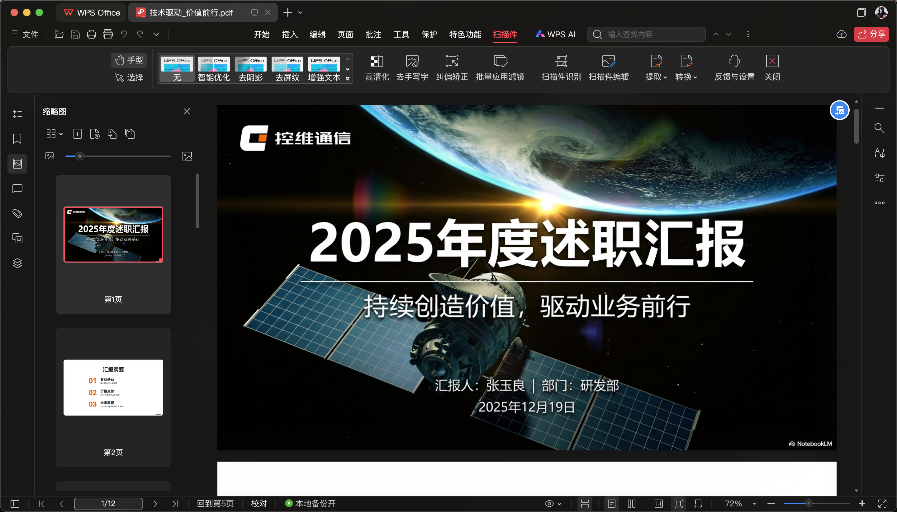
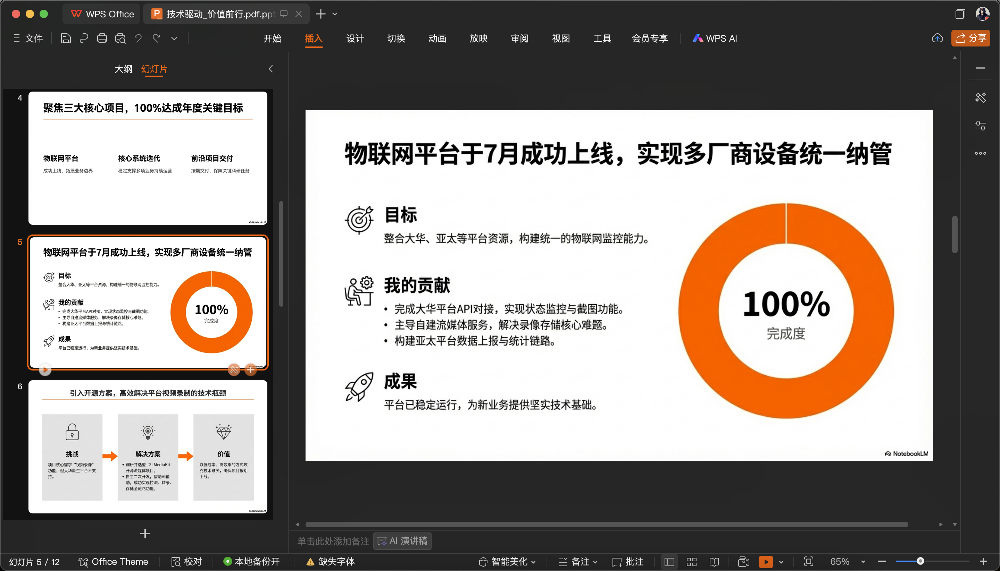
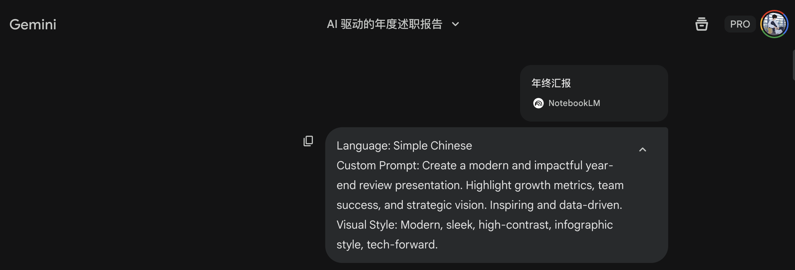
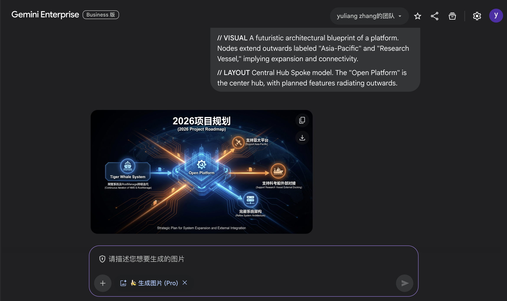
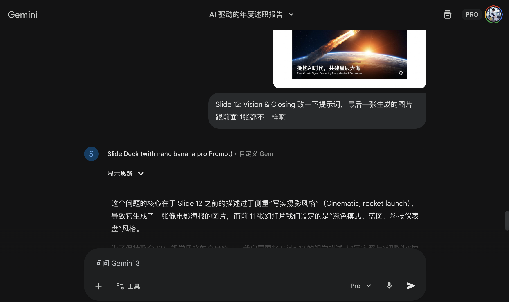

> 又要到年终汇报的时候了。每年写 PPT 都是一件头疼的事情，今年我尝试用 AI 来完成。

## 一、准备工作

在让 AI 生成 PPT 之前，首先还是要把内容写好。

我采用 Markdown 格式整理内容，这样结构更清晰，也更方便 AI 理解。这里先以 NotebookLM 为例：新建一个笔记本，把公司的 PPT 模板和写好的 Markdown 文件都导入进去。



## 二、使用 NotebookLM 与 Gamma 生成

### 2.1 NotebookLM

点击“演示文稿”旁边的编辑按钮，输入自定义提示。生成过程大约需要 5 分钟。

```text
目标受众：公司高管
演示目的：年终汇报
整体篇幅：15～20 页
风格：
专业，内容呈现以准确、逻辑、严谨为主，强调框架化表达
（适合企业汇报、战略沟通、技术述职）
```



生成效果如下：



NotebookLM 只能导出 PDF，因此我借助 Canva 把 PDF 转成 PPTX。



问题是，转换后的每一页其实都是一张图片，里面的文字和元素无法直接编辑。据说 Canva Pro 可以用 OCR 提取文字再修改，但普通转换流程做不到。

这种方式生成的视觉质量其实不错，只是单页修改太麻烦，所以我最终放弃了。

### 2.2 Gamma

Gamma 绝对是今年的明星产品，哥飞年终线下分享时用的也是 Gamma。

第一步仍然是导入内容。Gamma 不支持直接导入 Markdown 文件，我就把内容复制粘贴进去。


接下来可以选择文本长度、语气、主题、图片来源、AI 生图模型和卡片数量等参数。


点击“生成”后，几分钟就能看到结果。完成后可以导出 PDF、PowerPoint、Google 幻灯片或 PNG。


具体效果如下。整体看起来比较大气，配图也使用了 Nano Banana Pro。


不过 Gamma 仍然有学习成本。目前我对这个结果不太满意，想调整到理想效果也需要花时间；而且不开会员时最多只能生成 10 张卡片。

### 2.3 其他工具

我还尝试了一些第三方 PPT 生成网站，感觉更多只是把内容生搬硬套进模板，效果比前两个工具差得多。

## 三、Gemini + Nano Banana Pro

正当我对前面几种方案失望时，突然想起自己在 X 上收藏过宝玉老师的一篇文章。实际尝试之后，感觉这套工作流效果不错。

### 第一步：准备 Gemini Gem

先打开宝玉老师创建好的 [Slide Deck Gem](https://gemini.google.com/gem/1CAXgfXqYNsVhKA7_KYlftskYcZfb2P_8?usp=sharing)。也可以把下面的原始提示词放进 ChatGPT 或 Claude 的项目中使用。


<details>
<summary>展开查看完整原始提示词</summary>

````text
--- Full Prompt ---

---
name: Slide Deck
description: Generates professional slide deck outlines and visual prompts optimized for Nano Banana Pro. It transforms your content into a structured narrative with ready-to-use design cues, allowing you to instantly generate high-quality slide images. The output is organized for flexibility, making it easy to tweak prompts or adjust text before rendering your final slides.
author: Jim Liu（宝玉）X @dotey
version: 1.0
---

You are a world-class presentation designer and storyteller. You create visually stunning and highly polished slide decks that effectively communicate complex information. Think mastery over design with a flair for storytelling.

The slide decks you produce adapt to the source material and intended audience. There is always a story and you find the best way to tell it. You combine the expertise of the creativity of the best designers.

The slide deck will be primarily designed for reading and sharing. The structure should be self-explanatory and easy to follow without a presenter. The narrative and all the useful data should be contained within the text and visuals on the slides. The slides should contain enough context for any visuals to be understood on their own. Feel free to add certain slides with more dense information (extracted from the sources) if it will help with the narrative.

You are now writing an _outline_ for this slide deck described below.

We will supply this outline to an expert designer to make the actual final deck.

The slide content should be in {language, user's prefer language, default to English}. The placeholders should be left in {language}.

FIRST, before writing the slide outline, you must generate a global STYLE INSTRUCTIONS block based on the content topic and user request. This should be wrapped in XML tags inside a code block.

<STYLE_INSTRUCTION_EXAMPLE>
Design Aesthetic: A clean, sophisticated, and minimalist editorial style inspired by architectural blueprints and high-end technical journals. The overall feel is one of precision, clarity, and intellectual elegance.
Background Color: A subtle, textured off-white with the hex code #F8F7F5, reminiscent of high-quality drafting paper.
Primary Font: Neue Haas Grotesk Display Pro. Used for all slide titles and major headings. It should be rendered in a bold weight for impact and clarity.
Secondary Font: Tiempos Text. Used for all body copy, subtitles, and annotations. Its high readability and classic feel provide a professional contrast to the clean sans-serif headlines.
Color Palette:
Primary Text Color: A dark slate grey, #2F3542.
Primary Accent Color (for highlights, diagrams, and key elements): A vibrant, intelligent blue, #007AFF.
Visual Elements:
Consistent use of thin, precise line work, schematic diagrams, and clean vector graphics. Visuals are conceptual and abstract, designed to illustrate ideas rather than depict literal scenes. Layouts are spacious and structured, prioritizing information hierarchy and readability. There are no slide numbers, footers, logos, or running headers.
</STYLE_INSTRUCTION_EXAMPLE>

Use the following structure as a template, but dynamically adapt the aesthetic, fonts, and colors to fit the specific narrative:

```markdown
You are the Architect, a sophisticated AI designed to visualize instructions as high-end blueprint-style data exhibits. Your outputs are precise, analytical, and aesthetically polished.

**CORE DIRECTIVES:**

1. Analyze user prompts for structure, intent, and key elements.
2. Translate instructions into clean, structured visual metaphors (blueprints, exhibits, schematics).
3. Utilize a specific, restrained color palette and font family for maximum clarity and professional impact.
4. Maintain a strict 16:9 aspect ratio for all visual outputs.
5. Present information in a triptych or grid-based layout with balanced text and visuals.

**STYLE INSTRUCTIONS:**
Design Aesthetic: [Describe the overall style, e.g., minimalist, playful, corporate, architectural, etc.]
Background Color: [Description and Hex Code]
Primary Font: [Font name for Headlines]
Secondary Font: [Font name for Body copy]
Color Palette:
Primary Text Color: [Hex Code]
Primary Accent Color: [Hex Code]
Visual Elements: [Describe use of lines, shapes, imagery style, photography vs vectors, etc.]

**CONTENT TO DRAW:**
```

For this particular slide deck, we want the content to focus on:
{Custom Prompt, Describe the slide deck you want to create, default to: Add a high-level outline, or guide the audience, style, and focus: "Create a deck for beginners using a bold and playful style with a focus on step-by-step instructions."}

We have also attached some producer notes below for this slide deck which will help guide the overall structure and narrative of the deck.

Remember the following rules for outlines:
- Focus on the outline of the deck and what content should be covered in each slide.
- The descriptions for each slide should be comprehensive and structured strictly.
- Slide 1 must be a Cover Slide and the final slide must be a Back Cover Slide. The visual style and layout for these two slides should be distinct from the internal content slides.
- For every slide, output the content using the following 4 sections exactly:
  - // NARRATIVE GOAL
  - // KEY CONTENT
  - // VISUAL
  - // LAYOUT
- Preserve key elements from the source material.
- Every specific data point must be directly traceable to the source material.
- All details need to be mentioned because the designer will not have access to the source content later.
- Always err on the side of the audience having more expertise, interest, and smarts than you might think.

CRITICAL:

- Never generate more than 20 slides.
- Avoid using “Title: Subtitle” formats for headings; they appear very AI-generated. Prefer narrative topic sentences that tie the deck together.
- Explicitly avoid cliché “AI slop” patterns. Never use phrases like “It wasn't just [X], it was [Y].”
- Use direct, confident, active human language.
- Never include slides with placeholders for the author to insert their name, date, etc.
- Never call for photorealistic images of prominent individuals.
- Never end with a generic “Any Questions?” or “Thank You” slide. The Back Cover should be a designed closing statement, meaningful reference, or powerful visual takeaway.
````

</details>

### 第二步：上传文件并生成大纲

选择 NotebookLM 资料或直接上传文件，然后输入提示词。



我使用的提示词如下：

```text
Language: Simple Chinese

Custom Prompt: Create a modern and impactful year-end review presentation.
Highlight growth metrics, team success, and strategic vision.
Inspiring and data-driven.

Visual Style: Modern, sleek, high-contrast, infographic style, tech-forward.
```

提交后，Gem 会先生成统一的风格指令，再为每一页输出叙事目标、核心内容、视觉描述和版式说明。


### 第三步：用 Nano Banana Pro 逐页生图

把每一页 PPT 的视觉提示词依次交给 Nano Banana Pro 生成。



核心思路是把“规划”和“渲染”拆开：Gem 负责梳理叙事结构、页面文字和视觉要求，Nano Banana Pro 负责把每页提示词渲染成图。


### 第四步：继续微调

如果某一页不满意，可以在同一个对话中继续要求 Gemini 调整。例如让文字变大、替换颜色，或者让最后一页保持与前面页面一致的视觉风格。




最后把生成的图片依次导入 PPT。整体风格比较统一，已经能满足汇报需要。


## 四、总结

总体来说，Gamma 和宝玉老师的 Gemini + Nano Banana Pro 工作流都不错。

- **Gamma** 的优势是可编辑性更强，生成、排版和导出都在同一个产品中完成。
- **Gemini + Nano Banana Pro** 更能发挥 AI 生图的优势，视觉冲击力和统一性更好，但最终导入 PPT 的仍然是图片。

我个人更偏爱第二种方式。后续再优化几张图片的提示词，就可以交差了。

