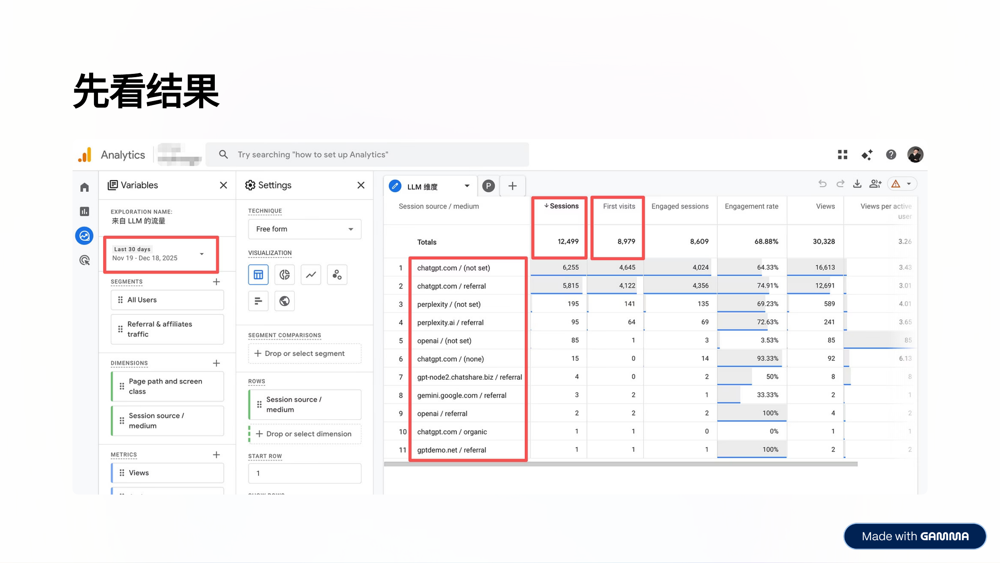
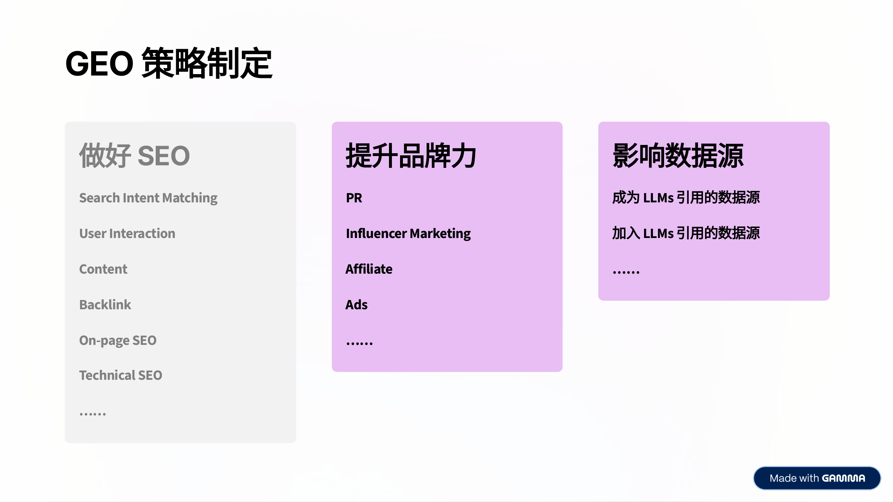
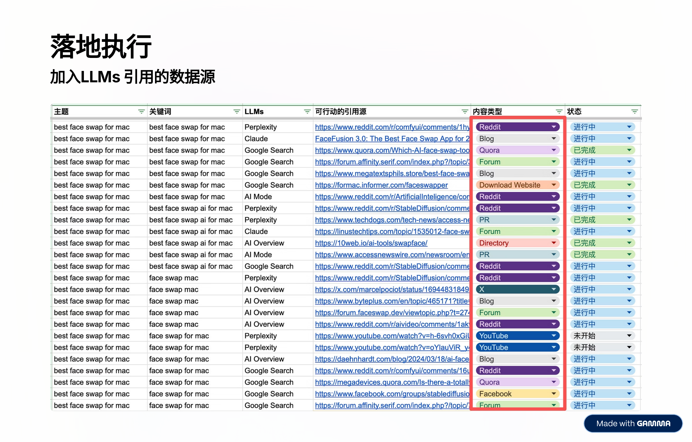
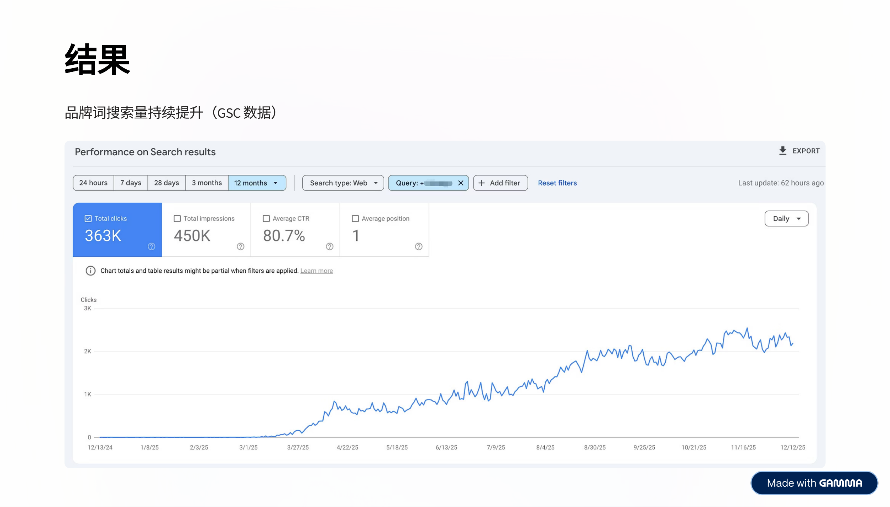

> 本文根据陈攀（Span）在「英文SEO实战派 · 2026 SaaS & AI 出海增长专题分享会」上的分享整理。Span 拥有 7 年互联网产品经理经验、6 年 Google SEO 经验，曾担任全球化 AI 代表性公司 SEO 负责人，同时也是多家出海 SaaS 的 SEO 咨询顾问。

---

## 先看结果：每月 12,000+ 来自 LLM 的真实流量

在正式展开之前，先给大家看一组数据。

这是 GA4 后台的数据截图，时间窗口为 2025 年 11 月 19 日至 12 月 18 日（近 30 天）。在「Session source / medium」维度下，来自 LLMs 的总 Sessions 达到了 **12,499**，First visits 为 **8,979**，Engaged sessions 为 **8,609**，整体 Engagement rate 接近 **69%**。

其中流量来源的分布非常有意思：chatgpt.com 占据了绝对主导地位，包括 chatgpt.com / (not set) 贡献了 6,255 个 sessions，chatgpt.com / referral 贡献了 5,815 个 sessions，两者合计占总 LLM 流量的 **96%以上**。Perplexity 紧随其后但差距悬殊，只有约 290 个 sessions。OpenAI、Gemini 等其他平台的贡献更是微乎其微。

到了 2026 年 2 月至 3 月的数据窗口，LLM 流量依然保持在 **11,433** sessions 的高位水平，Total users 达到 8,347，说明这并不是一波昙花一现的流量，而是可持续的稳定增长。

这组数据背后，是一个从零开始的新 SaaS 品牌——一款 AI Face Swap 工具，通过系统化的 GEO（Generative Engine Optimization）策略，在不到一年的时间内实现的成果。

接下来，我将从 GEO 认知、策略制定、落地执行、获得结果四个层面，完整还原整个过程。

---

## 一、GEO 认知：理解大模型推荐的底层逻辑

在动手做任何事之前，首先需要建立对 GEO 的正确认知。很多人把 GEO 看作一种全新的、独立于 SEO 的东西，但事实并非如此。

### 1. GEO 是 SEO 的延伸，SEO 是 GEO 的基础

GEO 不是替代 SEO 的东西，而是建立在 SEO 之上的一层新能力。如果你的网站连基本的 SEO 都没做好，在搜索引擎上都没有存在感，那指望 LLMs 来推荐你几乎是不可能的事情。搜索引擎的排名、内容质量、反向链接等传统 SEO 要素，同样是 LLMs 判断一个品牌是否值得推荐的重要信号。

### 2. LLMs 对大品牌情有独钟，头部效应明显

这是一个非常现实的问题。大模型在生成推荐时，天然倾向于推荐那些它在训练数据中更频繁看到的品牌。品牌知名度越高、在互联网上的提及越多，被 LLM 推荐的概率就越大。这意味着对于新品牌来说，你需要刻意去增加自己在各种数据源中的存在感。

### 3. LLMs 的信息来源 = 预训练知识 + 实时检索增强（RAG）

理解这一点至关重要。LLMs 的回答并不完全依赖于其预训练时学到的知识，越来越多的模型（尤其是 ChatGPT 的联网模式、Perplexity、Google AI Overview 等）会在生成回答时实时检索互联网上的信息。这就意味着，你发布的内容如果能被这些检索系统抓取到，就有机会被 LLM 引用和推荐。

### 4. 用户问题会被大模型拆解为多个子查询（Query Fan-out 机制）

当用户问 LLM 一个复杂问题时，模型不会只做一次搜索，而是会将问题拆解成多个子查询，分别检索后再综合生成答案。比如用户问「best face swap for mac」，模型可能会分别搜索「face swap mac app」「best AI face swap 2025」「face swap mac review」等多个变体。理解这个机制，有助于我们在内容布局时覆盖更多潜在的子查询。

### 5. 不同 LLMs 使用不同的信息源与检索策略

ChatGPT 会引用 Reddit、YouTube、新闻网站、博客等；Perplexity 更依赖结构化的搜索结果和学术类内容；Google AI Overview 则大量引用 Google 自家搜索结果中排名靠前的内容。这意味着你不能只针对一个平台做优化，而需要多渠道布局。

### 6. ChatGPT 占整个 LLMs 流量 80%+ 的市场份额

从实际数据来看，ChatGPT 在 LLM referral traffic 中占据了压倒性的市场份额，超过 80%。这告诉我们一个很实际的策略优先级：如果资源有限，优先搞定 ChatGPT 的推荐。

---

## 二、GEO 策略制定：三管齐下的系统工程

基于上述认知，Span 制定了一套三个维度并行推进的 GEO 策略框架。

### 第一个维度：做好 SEO

这是最基础的一环，也是最不能跳过的一环。具体包括：

- **Search Intent Matching**：确保每一篇内容都精准匹配用户的搜索意图
- **User Interaction**：优化用户体验，提升页面停留时间和互动率
- **Content**：产出高质量、有深度的内容
- **Backlink**：建立高质量的外链体系
- **On-page SEO**：做好标题、描述、结构化数据等页面优化
- **Technical SEO**：确保网站的技术基础扎实，加载速度快、可抓取性好

### 第二个维度：提升品牌力

LLMs 偏爱有知名度的品牌，因此需要主动提升品牌在互联网上的声量：

- **PR**：通过新闻稿发布提升品牌的权威性
- **Influencer Marketing**：借助 KOL 的影响力扩大品牌触达
- **Affiliate**：通过联盟营销增加品牌曝光
- **Ads**：适当投放广告增加品牌认知度

### 第三个维度：影响数据源

这是 GEO 策略中最关键、也最有技术含量的一环：

- **成为 LLMs 引用的数据源**：让你的官网内容本身被 LLMs 直接引用
- **加入 LLMs 引用的数据源**：在 LLMs 已经在引用的第三方平台上植入你的品牌信息

具体来说：

**发布 PR**：在知名 PR 平台上发布含有目标 Topic/Keyword 意图的新闻稿。比如在 Yahoo Finance、PR Newswire 等平台发布产品发布的新闻稿，这些内容会被 Google AI Overview 和其他 LLMs 的检索系统抓取。

**开展 Influencer Marketing**：找 Niche 相关的 YouTuber 发布视频。关键的技巧是——在被 LLMs 引用的 YouTube 视频描述里面插入品牌相关的描述，并做评论置顶。这里有一个很重要的思维转变：Influencer Marketing 的主要目的不是直接的 ROI，而是**品牌词搜索量的提升**。

**加入 LLMs 引用的数据源**：这是执行工作量最大的一环。核心方法是——收集目标 prompt/topic/keyword，找出对应 LLMs 引用的所有信息源，针对不同信息源采用不同方法来影响信息源。

---

## 三、落地执行：12 个月的系统作战

策略制定完毕后，执行被划分为三个阶段：

- **1 月 - 3 月**：打磨产品、做常规 SEO 工作
- **4 月 - 6 月**：PR、Influencer Marketing、加入 LLMs 引用的数据源
- **7 月 - 12 月**：跟随产品功能新增内容、常规维护

下面展开讲讲 4 月到 6 月这个关键阶段的执行细节。

### 执行动作一：发布 PR

在 Yahoo Finance（通过 ACCESS Newswire）和 PR Newswire 等平台上发布了产品新闻稿，内容围绕产品的核心功能和差异化卖点展开。

PR 的效果立竿见影。在 Bing 的 AI Mode 中搜索「best face swap ai for mac」，产品已经出现在推荐列表中，引用的信息源正是 PR Newswire 上的新闻稿。

更惊喜的是，Google AI Overview 中搜索「best face swap for mac」，同样出现了该品牌的推荐，右侧引用源列表中清晰可见来自多个新闻媒体的 PR 内容。

这说明 PR 不仅对传统 SEO 有帮助，对于 AI 搜索时代的可见性同样至关重要。

### 执行动作二：YouTube Influencer 合作

通过与 Niche 相关的 YouTuber（以印度 Influencer 为主）合作，发布了产品评测和教程类视频。在 ChatGPT 中搜索「best face swap ai」，模型直接展示了一条 YouTube 视频作为推荐依据。

同时，在 Google 搜索「best face swap ai」时，视频结果同样占据了 SERP 的显眼位置。YouTube 内容在 SEO 和 GEO 两条线上都发挥了重要作用。

### 执行动作三：加入 LLMs 引用的数据源

这是整个执行过程中工作量最大、也最需要精细化运营的环节。

**第一步：建立追踪表格**

团队建立了一份详尽的追踪表格，记录每一个目标主题/关键词，对应在不同 LLMs（Perplexity、Claude、Google Search、AI Mode、ChatGPT 等）上被引用的所有信息源 URL，标注内容类型（Reddit、Blog、Quora、Forum、YouTube、Directory、Download Website、PR 等），并追踪执行状态。

这份表格的核心逻辑是：**你不是在猜测 LLMs 会引用什么，而是实际去查验每一个 prompt 下 LLMs 正在引用什么，然后针对性地去影响这些已经被引用的数据源。**

**第二步：具体执行**

以 ChatGPT 搜索「best face swap for mac」为例，可以看到其引用的 Sources 包括 Reddit 帖子、博客文章、评测网站等多种类型。

针对不同类型的数据源，采取不同的操作方式：

- **Reddit**：在相关 Subreddit 中发布帖子和评论，推荐产品
- **Blog**：与博客作者合作，在已有的测评文章中加入产品链接或提及
- **Quora**：在相关问题下发布包含产品推荐的回答
- **Forum**：在技术论坛中参与讨论，自然地提及产品
- **Directory / Download Website**：在 AI 工具目录网站中提交产品信息

**第三步：使用工具追踪效果**

团队使用 Ahrefs 的 Brand Radar 功能获取产品相关的 Prompts 数据，然后将这些 Prompts 放到 Profound 平台进行持续的数据追踪。

通过 Profound 可以看到产品在 230 个相关 prompts 中的表现，包括每个 prompt 的可见性百分比、排名变化、情感分析等，实现了从执行到效果的完整闭环。

### Quora 运营实战

Quora 虽然在国内不太受重视，但在海外 SEO 和 GEO 领域仍然有不小的价值。特别是 Google AI Overview 会引用 Quora 上的回答内容。

实战中，团队在 Quora 上针对「best face swap ai」「best face swap for video」等相关问题发布了约 20 条 Post 和 Comments。效果是 Google AI Overview 在回答相关问题时，直接引用了 Quora 上的推荐内容，将品牌列为首选推荐。

### Reddit 运营实战

Reddit 是 ChatGPT 最重要的第三方数据源之一。在 ChatGPT 中搜索「best face swap ai」，可以看到 Citations 中 Reddit 帖子占据了重要位置。ChatGPT 甚至会直接引用 Reddit 用户的评价作为推荐依据。

### 4-6 月执行量总结

在 4 月至 6 月这三个月内，团队完成了以下执行工作：

- 发布 PR **3 篇**
- 合作发布 YouTube 视频 **16 个**（以印度 Influencer 为主）
- 发布 Reddit Post **~150 篇**
- 做 Reddit Comments **~150 条**
- 发布 Quora Post 和 Comments **~20 条**
- Blog 插入链接合作 **3 条**

这些数字看起来并不夸张，但关键在于**精准**——每一次操作都是基于实际的 LLM 引用数据来执行的，而不是盲目地批量生产内容。

---

## 四、获得结果：数据说话

### 品牌词搜索量持续提升

从 Google Search Console 的数据来看，品牌词的搜索量在 2025 年全年呈现出清晰的上升趋势。12 个月内，品牌词累计获得了 **363K 次点击**，**450K 次展示**，平均 CTR 高达 **80.7%**，平均排名第 **1** 位。

从趋势图上可以看到，品牌搜索量从 2025 年初的近乎为零，在 3 月开始出现明显增长，4-6 月（正好是 PR + Influencer + 数据源影响的执行期）出现了跳跃式增长，7 月之后虽然进入常规维护阶段，搜索量仍然持续攀升，到年底稳定在每日 1500-2000 次点击的水平。

### GEO 可见性排名第三

在 Profound 平台的数据中，该品牌在同品类竞品中 GEO 可见性已经上升至**第 3 位**，Visibility Score 达到 **19.2%**，仅次于 Reface（34.1%）和 Pixlr（20.9%）这两个成熟品牌，而排在其后的 YouCam（18.2%）和 Fotor（17.2%）都是耳熟能详的老牌工具。

作为一个成立不到一年的新品牌，能在 LLM 推荐中与这些老牌产品同台竞技，充分说明了 GEO 策略的有效性。

### 月均 12K+ LLM 流量

最终成果回到开头的数据——近 30 天来自 LLMs 的流量达到了 **12,000+** sessions，其中 **8,900+** 为 First visits，说明这些流量大部分是全新用户，是真正的增量。

---

## 五、Bonus：Reddit 运营实战手册

Reddit 在整个 GEO 策略中扮演了非常重要的角色，Span 在分享中专门拿出来做了详细的经验分享。

### 1. 找到高价值的 Post

第一步是找到那些已经有搜索流量的 Reddit 帖子。可以通过两种方式：

**方式一：Google 搜索** — 在 Google 中搜索「关键词 site:reddit.com」，查看哪些 Reddit 帖子已经在 Google 排名靠前，拥有搜索流量（可以通过 SEO 工具查看 Search Traffic 数据）。

**方式二：Ahrefs Site Explorer** — 在 Ahrefs 中查看 reddit.com 的 Top Pages，按关键词过滤，找出与你的产品相关的高流量帖子。

找到这些帖子后，有两种操作路径：去做 Comments（在已有帖子中评论推荐产品），或者模仿帖子结构发布新的 Post。

### 2. 让自己的 Comments 排在前面

在 Reddit 中，评论的排序主要由 Upvote 数量决定。因此需要：

- 给自己的评论做 Upvote
- 在其他高赞评论下面做 Comment 的 Comment（子评论）

这样可以让你的产品推荐内容在帖子中获得更高的可见度。

### 3. 在 Upwork/Fiverr 上招聘 Reddit Freelancer

Reddit 运营是一项需要专业技能的工作——你需要有养号过程、了解各个 Subreddit 的规则、知道怎样自然地推荐产品而不被删帖。因此，最高效的方式是在 Upwork 或 Fiverr 上招聘专业的 Reddit Marketing Freelancer 或 Agency。

### 4. 筛选候选人

选择标准包括：有经验、高评分、有成功案例。建议同时合作几个 Freelancer，通过实际效果来做筛选，最终保留表现最好的 1-2 个长期合作。

### 5. 按结果付费

推荐采用按结果付费的模式，参考价格：

- 一条成功的 Comment = **$3 - $10**
- 一条成功的 Post = **$10 - $15**
- 一个成功的 Upvote = **$1**

这里的「成功」指的是评论/帖子没有被删除，且保持可见状态。

---

## 六、观点总结

最后，Span 分享了四个核心观点：

### 1. SEO 是 GEO 的地基，而不是可选项

不要因为 AI 搜索的兴起就放弃传统 SEO。恰恰相反，SEO 做得越好，你在 GEO 中获得推荐的概率也越高。两者是互相增强的关系。

### 2. GEO 是跨渠道/跨平台的协同工程

GEO 不是在某一个平台上做一件事就能搞定的，而是需要 PR、YouTube、Reddit、Quora、Blog、Directory 等多个渠道协同推进。每个渠道影响的是不同 LLMs 的不同数据源，只有形成合力才能产生显著效果。

### 3. 长期做你真正相信的事情，结果自然呈现

GEO 和 SEO 一样，都不是短期就能看到效果的事情。从开始做到看到明显的流量增长，这个案例经历了大约 6 个月的时间。需要耐心和持续的投入。

### 4. GEO 接下来怎么做：一切围绕品牌提及展开

未来 GEO 的核心竞争力，归根到底还是**品牌力**。你的品牌在互联网上被提及得越多、越正面，LLMs 就越有可能在相关场景中推荐你。一切策略和执行，最终都应该围绕「增加品牌提及」这个核心目标来展开。

---

## 写在最后

这个案例最让我印象深刻的地方，不是最终 12K 月流量的数字，而是整套方法论的系统性和可复制性。

总结下来，GEO 的核心方法论可以归纳为三步：

1. **搞清楚 LLMs 在引用什么** — 对你的目标关键词，逐一查验各个 LLM 平台的引用源
2. **有针对性地影响这些引用源** — PR、Reddit、Quora、YouTube、Blog，根据实际引用情况精准出击
3. **持续追踪和迭代** — 用 Ahrefs Brand Radar、Profound 等工具持续监控效果，动态调整策略

在 AI 搜索日益普及的今天，LLM referral traffic 正在成为继 Google organic traffic 之后的下一个重要流量来源。对于出海 SaaS 品牌来说，越早布局 GEO，就能越早吃到这波红利。

希望这篇实战案例能够给正在做出海 SaaS 的朋友们一些启发。如果你也在做 GEO 相关的工作，欢迎在评论区分享你的经验和心得。
