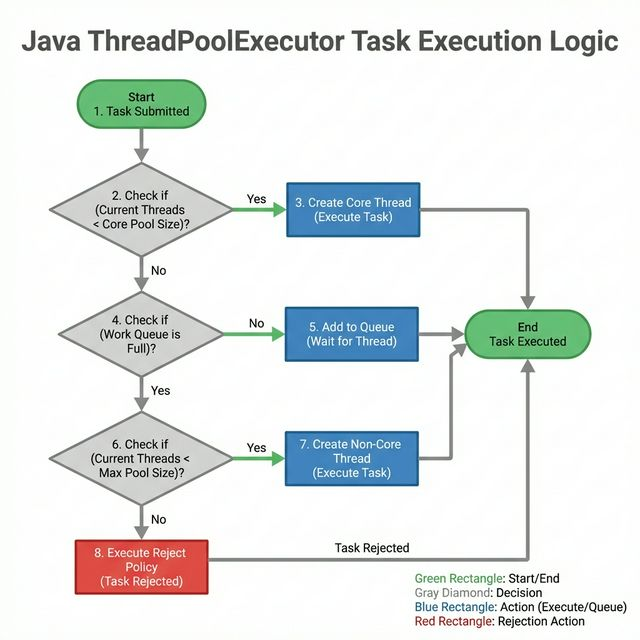
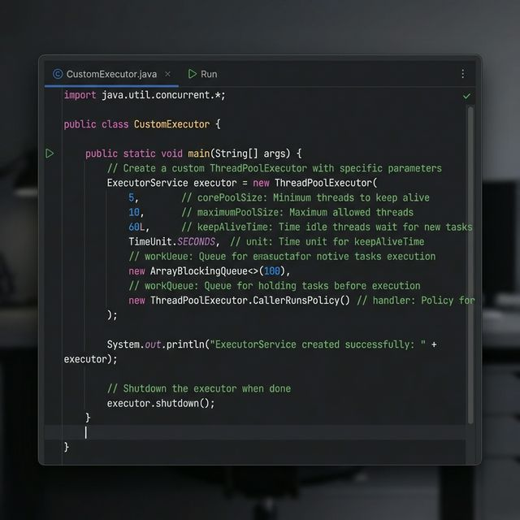
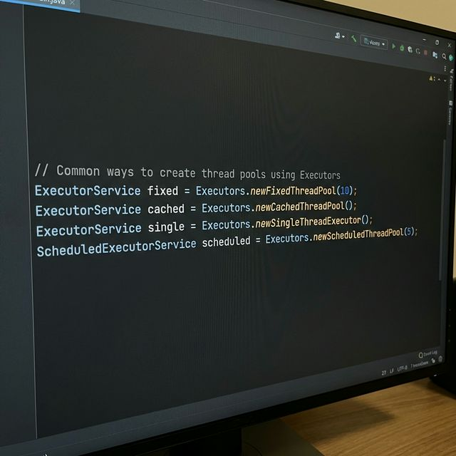

> 梳理线程池的核心参数和两种创建方式，便于在项目中正确地选择、配置与调优 `ThreadPoolExecutor`。

### 一、线程池介绍

顾名思义，线程池就是管理一系列线程的资源池，其提供了一种限制和管理线程资源的方式。每个线程池还维护一些基本统计信息，例如已完成任务的数量。

使用线程池的好处：

- **降低资源消耗**。通过重复利用已创建的线程降低线程创建和销毁造成的消耗。
- **提高响应速度**。当任务到达时，任务可以不需要等到线程创建就能立即执行。
- **提高线程的可管理性**。线程是稀缺资源，如果无限制的创建，不仅会消耗系统资源，还会降低系统的稳定性，使用线程池可以进行统一的分配、调优和监控。

### 二、ThreadPoolExecutor 类介绍

`ThreadPoolExecutor` 类中提供的四个构造方法。我们来看最长的那个，其余三个都是在这个构造方法的基础上产生。

```java
/**
 * 用给定的初始参数创建一个新的 ThreadPoolExecutor。
 */
public ThreadPoolExecutor(int corePoolSize, // 线程池的核心线程数量
                          int maximumPoolSize, // 线程池的最大线程数
                          long keepAliveTime, // 当线程数大于核心线程数时，多余的空闲线程存活的最长时间
                          TimeUnit unit, // 时间单位
                          BlockingQueue<Runnable> workQueue, // 任务队列，用来储存等待执行任务的队列
                          ThreadFactory threadFactory, // 线程工厂，用来创建线程，一般默认即可
                          RejectedExecutionHandler handler // 拒绝策略，当提交的任务过多而不能及时处理时，我们可以定制策略来处理任务
                           ) {
    if (corePoolSize < 0 ||
        maximumPoolSize <= 0 ||
        maximumPoolSize < corePoolSize ||
        keepAliveTime < 0)
        throw new IllegalArgumentException();
    if (workQueue == null || threadFactory == null || handler == null)
        throw new NullPointerException();
    this.corePoolSize = corePoolSize;
    this.maximumPoolSize = maximumPoolSize;
    this.workQueue = workQueue;
    this.keepAliveTime = unit.toNanos(keepAliveTime);
    this.threadFactory = threadFactory;
    this.handler = handler;
}
```

`ThreadPoolExecutor` 3 个最重要的参数：

- `corePoolSize`：任务队列未达到队列容量时，最大可以同时运行的线程数量。
- `maximumPoolSize`：任务队列中存放的任务达到队列容量的时候，当前可以同时运行的线程数量变为最大线程数。
- `workQueue`：新任务来的时候会先判断当前运行的线程数量是否达到核心线程数，如果达到的话，新任务就会被存放在队列中。

`ThreadPoolExecutor` 其他常见参数：

- `keepAliveTime`：线程池中的线程数量大于 `corePoolSize` 的时候，如果这时没有新的任务提交，核心线程外的线程不会立即销毁，而是会等待，直到等待的时间超过了 `keepAliveTime` 才会被回收销毁。
- `unit`：`keepAliveTime` 参数的时间单位。
- `threadFactory`：executor 创建新线程的时候会用到。
- `handler`：拒绝策略。

下面这张图可以加深你对线程池中各个参数的相互关系的理解（图片来源：《Java 性能调优实战》）：



### 三、线程池创建的两种方式

**方式一：通过 `ThreadPoolExecutor` 构造函数来创建（推荐）。**



通过构造方法实现。

**方式二：通过 `Executor` 框架的工具类 `Executors` 来创建。**

`Executors` 工具类提供的创建线程池的方法如下图所示：



《阿里巴巴 Java 开发手册》强制线程池不允许使用 `Executors` 去创建，而是通过 `ThreadPoolExecutor` 构造函数的方式，这样的处理方式让写的同学更加明确线程池的运行规则，规避资源耗尽的风险。

