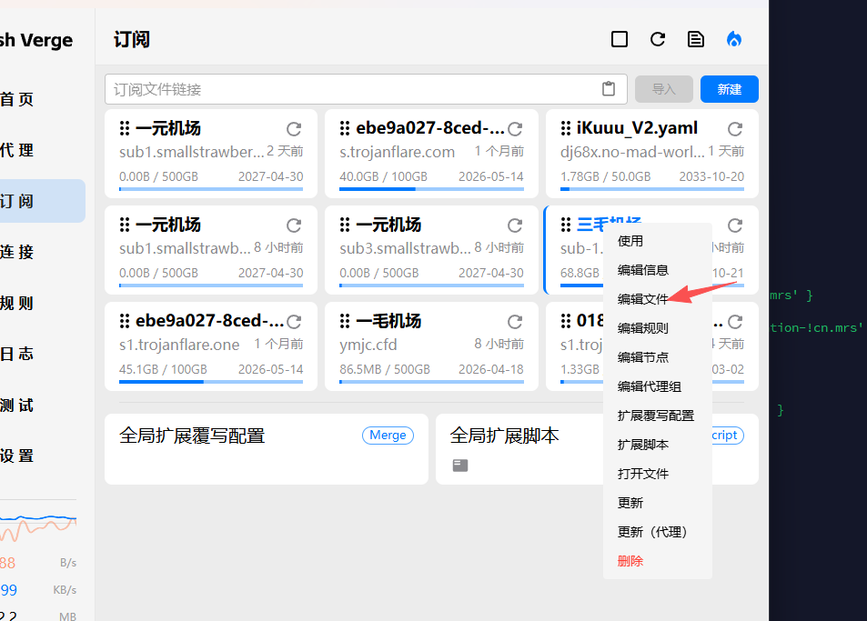
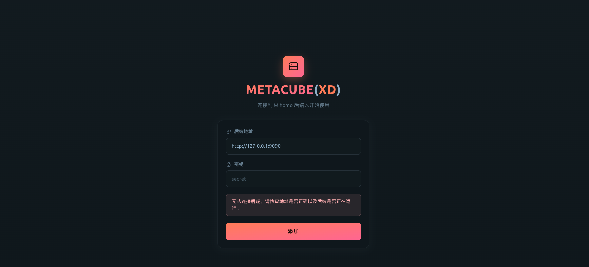
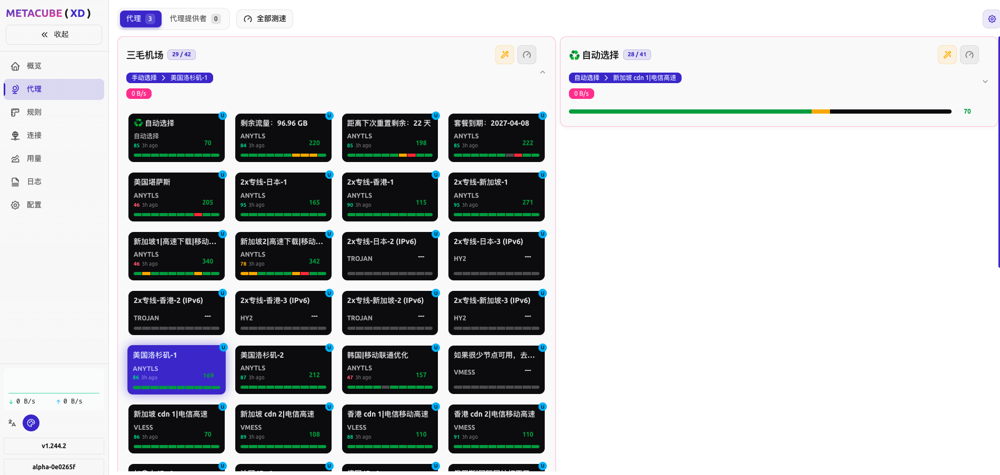

### 一、概述

由于最近翻墙查得比较严重，导致我之前使用的 `v2rayA` 无法正常使用。之前我也写过一篇[Ubuntu 安装翻墙软件](/zh-cn/blog/ubuntu-install-v2ray/)，当时用的是 `v2ray + v2rayA` 的组合；但在当前环境下，这套方案的稳定性已经不太理想了。

后来在朋友推荐下，我换成了 `mihomo + metacubexd`，整体感觉还不错，使用体验有点像 `Clash Verge`，但更适合放在 Linux 服务器上长期运行。

在 Linux 服务器上安装翻墙工具，核心目标通常有两个：

1. 让服务器本身能够稳定访问 GitHub、OpenAI、Docker Hub 等海外服务；
2. 为开发工具、命令行程序或容器环境提供统一的代理能力。

相比桌面端，服务器环境更强调稳定性、可维护性以及开机自启能力。因此在方案选择上，除了关注是否能正常联网，还要考虑配置方式、日志排查、服务管理和后续升级是否方便。

目前常见方案很多，例如传统的命令行代理、`v2ray` 系工具链，以及基于 Clash / Mihomo 内核的方案。结合最近一段时间的使用体验，`mihomo + metacubexd` 是一个比较适合 Linux 服务器的组合：前者负责核心代理能力，后者提供可视化管理界面，既能满足日常使用，也方便查看节点、切换策略、观察连接状态和排查问题。

本文将以 Linux 服务器为目标环境，介绍如何安装并配置 `mihomo + metacubexd`，包括基础安装思路、服务启动方式、订阅或配置文件导入、Web 管理界面访问，以及几个常见问题的简单说明。完成后，你可以让服务器具备更稳定的科学上网能力，并为后续的 `Codex CLI`、`OpenAI API`、`GitHub` 拉取代码等场景提供网络支持。

### 二、安装

我这里采用 `docker-compose` 安装。中间遇到了跨域问题，后面又加了一个 `Nginx` 做转发，参考了这个讨论：

https://github.com/MetaCubeX/metacubexd/discussions/638

`docker-compose.yml` 配置如下：

```yml
version: '3'

services:
  nginx:
    container_name: nginx-proxy
    image: nginx:latest
    restart: always
    ports:
      - "8383:80"
    volumes:
      - ./nginx.conf:/etc/nginx/nginx.conf
    depends_on:
      - metacubexd
      - meta
    networks:
      - proxy_net

  metacubexd:
    container_name: metacubexd
    image: ghcr.io/metacubex/metacubexd
    restart: always
    expose:
      - "80"
    networks:
      - proxy_net

  meta:
    container_name: meta
    image: docker.io/metacubex/mihomo:Alpha
    restart: always
    pid: host
    ipc: host
    network_mode: host
    cap_add:
      - ALL
    volumes:
      - ./config.yaml:/root/.config/mihomo/config.yaml
      - /dev/net/tun:/dev/net/tun

networks:
  proxy_net:
    driver: bridge
```

这里的思路是：

- `mihomo` 负责真正的代理和 API 服务；
- `metacubexd` 负责 Web 管理界面；
- `Nginx` 负责把前端页面和 `mihomo` 的 API 统一到一个入口，避免浏览器跨域访问失败。

对应的 `nginx.conf` 配置如下：

```nginx
worker_processes 1;
events { worker_connections 1024; }

http {
    include       mime.types;
    default_type  application/octet-stream;

    server {
        listen 80 default_server;
        server_name _;
        absolute_redirect off;

        add_header 'Access-Control-Allow-Origin' '*' always;
        add_header 'Access-Control-Allow-Methods' 'GET, POST, OPTIONS' always;
        add_header 'Access-Control-Allow-Headers' 'Content-Type, Authorization' always;
        add_header 'Access-Control-Allow-Credentials' 'true' always;

        if ($request_method = 'OPTIONS') { return 204; }

        # 根路径代理到 metacubexd，避免 SPA 子路径资源 404
        location / {
            proxy_pass http://metacubexd/;
            proxy_set_header Host $host;
            proxy_set_header X-Real-IP $remote_addr;
            proxy_set_header X-Forwarded-For $proxy_add_x_forwarded_for;
            proxy_set_header X-Forwarded-Proto $scheme;
        }

        # mihomo 的 RESTful API
        location /meta/ {
            proxy_pass http://YOUR_SERVER_IP:9090/;
            proxy_set_header Host $host;
            proxy_set_header X-Real-IP $remote_addr;
            proxy_set_header X-Forwarded-For $proxy_add_x_forwarded_for;
            proxy_set_header X-Forwarded-Proto $scheme;
        }
    }
}
```

上面 `YOUR_SERVER_IP` 换成你的服务器公网 IP 或内网 IP 即可。由于我的 `mihomo` 使用的是 `host` 网络模式，所以这里直接反代宿主机上的 `9090` 端口。

配置完成后，执行下面的命令启动：

```shell
docker compose up -d
```

如果后面修改了配置，也可以直接重启：

```shell
docker compose restart
```

### 三、配置

`mihomo` 的配置文件这里使用 `config.yaml`。如果你之前已经在桌面端使用过 `Clash Verge`，很多情况下可以直接把那边的配置复制过来，再根据服务器环境做一点调整。

例如我就是直接参考 `Clash Verge` 的订阅和配置内容，再补上服务器场景需要的控制接口配置。



需要注意的地方主要有两个：

1. `external-controller` 之前如果是 `127.0.0.1`，这里要改成 `0.0.0.0`；
2. 最好配置一个 `secret`，因为控制接口通常会暴露到服务器网络环境中。

配置示例如下：

```yaml
mixed-port: 7890
allow-lan: true
bind-address: '*'
mode: rule
log-level: info
external-controller: '0.0.0.0:9090'
external-controller-cors:
  allow-origins:
    - '*'
  allow-private-network: true
secret: "your-secret"
unified-delay: true
tcp-concurrent: true
```

这里最关键的是 `external-controller: '0.0.0.0:9090'`。如果还是写成 `127.0.0.1:9090`，那 `metacubexd` 或 `Nginx` 在外部访问的时候就连不上接口。

另外，`secret` 强烈建议设置，不然控制面板暴露出去之后风险会比较大。第一次登录时，前端面板也会要求你输入这个密钥。

### 四、浏览器登录及配置

启动完成后，可以通过 `http://YOUR_SERVER_IP:8383/` 访问前面 `Nginx` 暴露出来的统一入口。

第一次进入时，需要填写后端地址和你在 `config.yaml` 中设置的 `secret`。



如果你使用的是上面这套 `Nginx` 转发方案，后端地址建议直接填写反向代理后的地址，例如：

```text
http://YOUR_SERVER_IP:8383/meta
```

这样浏览器始终只和同一个入口通信，跨域问题也更少。如果你没有额外做反向代理，而是直接暴露 `mihomo` 控制接口，那也可以直接填写 `http://YOUR_SERVER_IP:9090`。

登录成功后，就可以在面板里查看代理组、测试延迟、切换节点以及观察当前连接状态。



整体体验和 `Clash Verge` 比较接近：

- 可以直接切换节点；
- 可以查看策略组当前命中的节点；
- 可以测试延迟；
- 可以通过日志和连接信息排查问题。

如果你平时主要是在服务器上跑开发工具、脚本或者 API 请求，那么这套方式已经足够用了。

### 五、常见问题

#### 5.1 metacubexd 无法连接后端

优先检查下面几个地方：

- `mihomo` 是否已经正常启动；
- `external-controller` 是否设置成了 `0.0.0.0:9090`；
- `secret` 是否和登录时输入的一致；
- 服务器防火墙或安全组是否放通了 `9090` 和 `8383` 端口。

#### 5.2 页面能打开，但接口请求失败或报跨域错误

这类问题通常和反向代理有关，重点检查：

- `Nginx` 是否正确代理了 `/meta/`；
- `metacubexd` 中填写的后端地址是否和反向代理路径一致；
- CORS 响应头是否已经带上；
- `proxy_pass` 指向的 IP 和端口是否正确。

如果你是 `host` 网络模式，`proxy_pass` 一般要指向宿主机可以访问到的地址，而不是 `127.0.0.1` 这种只在容器内部有意义的写法。

#### 5.3 修改了 config.yaml 但没有生效

通常可以先重启容器：

```shell
docker compose restart meta
```

如果还是不生效，再检查一下宿主机挂载路径是否正确，尤其是：

```text
./config.yaml:/root/.config/mihomo/config.yaml
```

这类文件挂载一定要带上完整文件名，不然容易出现“以为挂上了，实际上路径不对”的情况。

### 六、写在最后

对我来说，这套 `mihomo + metacubexd` 的组合，目前在 Linux 服务器上的体验还是比较满意的。它既保留了桌面端常见代理工具那种可视化操作方式，又兼顾了服务器环境需要的稳定性和可维护性。

如果你最近也遇到 `v2rayA` 不太稳定，或者只是想在服务器上找一套更顺手的方案，可以试试这个组合。
