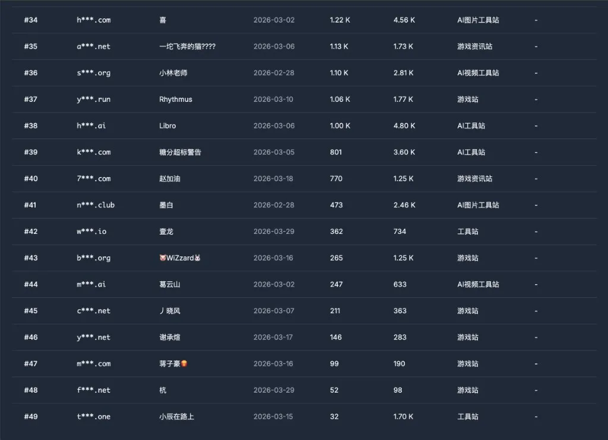
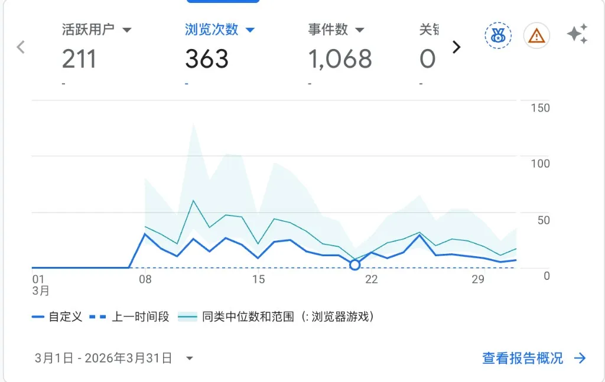
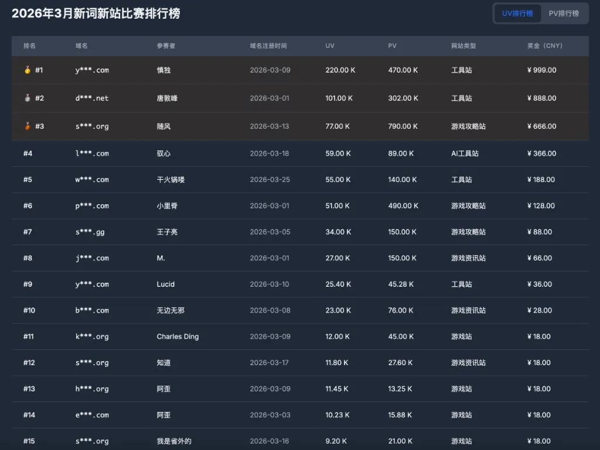

> 第一次参加月度比赛，排了个倒数第五，但总算是完整跑了一遍。

---

## 一、成绩

3月新词新站比赛结果出来了，一共 **49 个网站**报名参赛，我的网站排在 **第 45 名**。

3月全月数据：**UV 211，PV 363**。和前几名动辄几万、几十万的 UV 相比，差距悬殊。

---

## 二、我做的是什么站

我做的是一个**网页游戏站**。

选这个方向的原因很简单：感觉这类站有积累价值，内容可以慢慢沉淀，不依赖单一关键词。

但问题也很明显：这个细分词的**搜索量本身就比较小，而且不是新词**。新词新站比赛的核心优势是竞争低、容易起量，我选的方向从一开始就少了这个加成。

---

## 三、3月做了什么

说实话，3月做得比较懒：

| 项目 | 数量 |
|------|------|
| 内页数量（堆的） | 约 66 篇 |
| 外链 | 22 个 |
| 被收录页面 | 8 个 |

收录只有 8 个，说明内容质量或网站权重还不够，内页堆得多但产出低。外链 22 个算是有做，但转化效果一般。

---

## 四、Top 15 长什么样

前三名 UV 分别是 220K、101K、77K，都是工具站或游戏攻略站，差距很大。

第一名是工具站，UV 22 万，奖金 999 元；第二名工具站，UV 10 万，奖金 888 元；第三名游戏攻略站，UV 7.7 万，奖金 666 元。前几名都选了搜索量更大、更适合做新站起量的赛道。

和我同类的游戏站，基本上都在 10 名以后——游戏站的流量天花板相对低一些，但也不是不能做，关键是词的选择和内容的质量。

---

## 五、反思

这次比赛暴露了几个明显问题：

**1. 词没选好**。新词新站的核心是选一个有搜索量且竞争小的词，我选的词搜索量偏小，本身就吃亏。

**2. 内容质量不够**。堆了 66 篇，收录只有 8 个，比例太低，说明大量内容对搜索引擎来说没什么价值。

**3. 整体投入太少**。3月的参与度就是"参加了"而已，没有认真去优化，拿到这个名次也算合理。

---

## 六、4月计划

起点低倒没关系，进步空间还很大。

4月的目标是**进入前30名**，重点会放在：

- 改善内容质量，减少低质页面，提升收录率
- 更认真地做外链，提升权重
- 复盘一下哪些内页有流量，集中优化

第一次参赛就是来感受节奏的，4月继续。
