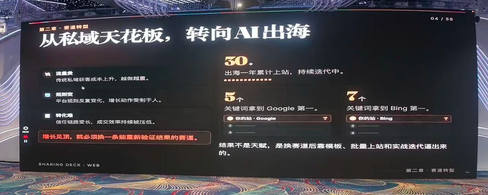
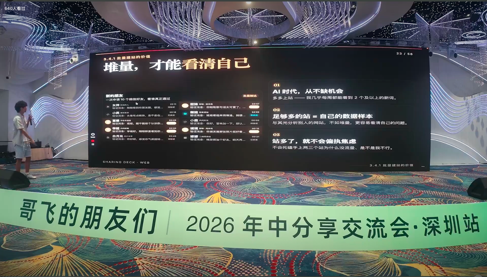

# 心态是最好的风水：哥飞社群小羊的 AI 出海"求生"方法论

> 在「**哥飞的朋友们·年中分享交流会·深圳站**」上，连续创业者、独立开发者 **小羊** 带来了一场很不一样的分享。主题叫《**心态是最好的风水**》——用他自己的话说，"标题听不听得懂无所谓，主要是来听我吹吹牛"。
>
> 但吹的其实是干货。出海这件事，方法很重要，但**能不能在不确定里持续往前走，更取决于一个人的心态、认知和节奏**。他把经典哲学思维和 AI 出海的一线实战揉在一起，前半段照顾新手调心态，后半段直接上强度讲转化。

---

## 一、先认识小羊：高中没毕业，一年上了 30 多个站

小羊在现场做了个很坦诚的自我介绍：高中没毕业就出社会，一路都在创业。家里做实体，他早年干过电商，也做过房产销售、送过外卖，还干过半年夜场营销。

2024 年底，他从私域转向 **AI 出海**——因为私域流量越来越贵、跑不动了。结果一年时间内差不多上了 **30 多个站**，拿到了十几个关键词的收益。

> 他反复强调一句话：**做出海最重要的就是执行力，方法其实哥飞社群里都有了。**很多东西哥飞公众号上就能看到，"只是我去做了，而大家可能没做"。

---

## 二、心态篇：先把"面子"和"包袱"放下

### 1. 从实践中来：先搭框架，让真实用户帮你测

小羊建议新手先**搭框架、做母版**：一整套响应式设计的母版做好后，无论做什么站都能快速"换壳"，效率高很多。站上完之后，事情其实就几件——放外链、站内优化，然后不停积累外链。

> **外链是可以复用的固定资产。**无论你之后做什么站，这些外链资源都一直是你的。

他还分享了一个新手常见的困惑：本地跑得好好的，一到线上就疯狂报错。结论是——**真正的问题只会在真实用户的使用里暴露出来**。所以他现在出 bug 时，本地复现不了就直接让 AI 修、修好就上线，让用户帮他测。因为**用户测出来的问题更真实**。

### 2. 脱掉"孔乙己的长衫"：做小词一点都不丢人

小羊观察到，很多人（尤其是从大厂出来的）带着"大厂情怀"，非要做一个多牛的产品，其实没必要。

- 大厂出来的往往只是一个"职业"（产品经理、程序员），擅长的是单点；而**出海考验的是一整套能跑通的流程体系**，单点做得再好也只能打工；
- **做小词（心词）并不丢人。**很多大佬靠小词就能做到日入过万，小词用户一样有钱、一样值得好好服务；
- 做小词还能打差异化（比如批量出图、批量改图），尽可能覆盖用户需求、把所有操作留在一个站内完成，提高停留时长。

> 他的态度很直接：**创业的本质就是赚钱、赢得自己想要的尊重。**不要用宏大叙事把它包装得太复杂，赚钱就是赚钱，梦想是有钱之后再去追求的事。义乌很多老板小学、高中都没毕业，一样能做到一年几个亿——很多草根创业者，都是凭着求生本能在赚钱。

### 3. 反者道之动，弱者道之用：新手就该做小词

引用《道德经》的"反者道之动，弱者道之用"，小羊给新手打气：你在手法上干不过老手没关系，**小词见效更快、门槛更低，做到第一也很爽**。

> 真实案例就是他自己：去年做的一个小词，年底一算，**一个月就有一万多、全年做到了 60 万**——其中很大一部分是靠一个"大哥"用户每月贡献 6000 多。

大词是所有人都在厮杀的红海，基本干不过；不如把精力全投到小词上，铺量堆上去一样很香。

### 4. 把自己放在最弱的位置：破釜沉舟，只能前进

> "我们本来就是草根，有什么好怕的呢？把自己放在最弱的位置，剩下就只有前进了。"

小羊提醒大家不要被对手吓到——**大家卷的方向不一样**：大佬卷的是预算（人家已经砸了几十万），新手没预算，那就**卷数量、卷交付质量**。任何事情都是"卷"出来的，得靠策略调整，而不是空想。

---

## 三、铺量篇：像"养鱼"一样经营你的站群

### 1. 多上站，才能看到最真实的数据

小羊把铺量比作"泡妞"和"养鱼"：

- **多上站，才能拿到自己看得懂的真实数据。**光分析别人的网站，永远云里雾里、停在分析阶段；只有自己实操，数据才是基于你自身能理解的；
- 就像找对象，"十个微信先砸过去"，总有一个能成。**足够多的站 = 你自己的数据本**，站多了自然就不焦虑了——只跟一两个站死磕，才会天天焦虑。

> **大力出奇迹。**十个站里总有一个跑起来，成功率其实就有价值。要做的是分析那些跑起来的成功案例。

### 2. 养鱼策略：好鱼重点养，坏鱼直接删

- 表现最好的那条"鱼"（能赚钱的站）重点养，**把外链资源全部向它倾斜**，优先赚钱；
- 零 UV、完全没流量的站，直接删除、不用再喂；
- 但**低流量站也不是没用**——它们可以作为你的**免费外链资源**，用来给新站提权（DR 有时能突然拉到三四十）。还能跟你"暧昧"的站就先留着，说不定哪天就爆了。

> 他的另一个真实案例：那个做到 60 万的小词站，前期也只是个不起眼的低流量站。**要相信概率，也要相信运气。**

规模化的关键，是把成功的打法沉淀成 **SOP**，再把它放大——像养鱼一样规模化经营。

---

## 四、外链篇：没钱也能搞到高质量外链

### 1. 免费神器：必应站长后台

小羊分享了一个他早期"没钱时"发现的方法：那时候身上就几千块，买不起 SEO 数据工具，他发现 **必应（Bing）站长后台** 也能"把玩"——侧边栏有 backlink，还能做网站对比。

> 关键在于：**必应工具里跑出来的外链，一定是必应自己认可、收录的**，比第三方数据工具更"实"，效率也更高。

### 2. 付费外链：别贪便宜买垃圾

这是他自己踩过的坑：

- 不要图便宜买一堆黑帽链接（比如 200 块给你 1000 条），**全是垃圾链接，没有意义**；
- 尽量买 **guest post**，且尽量 **100 刀以上**；
- 100 刀以下的要判断它是不是"水流量的母版站"——这类站长得一模一样、**DR 虚高但流量极低**，看多了就能一眼认出，这种不要买。

### 3. 免费外链：nofollow 也有用，但要精细化找

> 很多人觉得免费外链都是 nofollow、没意义，其实没必要这样想。

**只要外链站点的权重足够高（比如 Hacker News 这类），nofollow 也能带来不少权重。**免费外链需要长期积累，而且一定要精细化去找——找一堆垃圾免费外链去发是没有任何意义的，直接用大平台。

他把找外链形容成"把自己的信息渠道挖地三尺"——搜索引擎高级指令（site:、intitle:、write for us）、社区与论坛（Reddit / Hacker News / Quora）、导航与目录站（AI 导航、Product Hunt、各类 directory）、社交媒体（X / YouTube / 知乎 / 小红书）、竞品外链反查（必应站长后台）、榜单与 Newsletter，逐一排查、一一搜索。

---

## 五、转化篇（重点）：4000 UV 如何做出 5 万多转化

小羊说，他离日入过万最近的那一次，就是靠这套转化体系拿下来的：**那天大概 4000 多 UV，做到了 5 万多 SHKD 的转化**，相当于一个 UV 值十几块人民币。

> 很多人流量高却不赚钱，问题往往就出在转化没做好。

### 核心前提：路径要顺畅

用户走的路径顺不顺畅，是满足用户需求的大前提。路径顺畅地走完，最后才走到付费。

### 数据要盯三个率：注册率、跳出率、使用率

- **注册率**：加各种入口、按钮，"逼"用户注册（比如必须注册后才能试用）；
- **跳出率**：价格页面是大部分用户的"终点站"，用户走到价格常常就跳出了。**要在他跳出的那一瞬间挽留**——直接弹一个打折页面把他留下来，而不是只发挽留邮件（很多用户根本不会去看邮件）；
- **使用率**：使用率低就上各种弹窗、各种引导。

他研究自己站点的方法很"轻"：直接看自建数据库里注册、使用、付费等核心动作的真实数据，再配合 Plausible 看流量与跳出率。拿到数据后跑一个分析闭环——**看数据优劣 → 说明了什么 → 如何改进 → 复盘做对了什么**，把跑通的经验复制到其它站。

### 用户信任 = 前端样式

> 前端一定要认真优化。哪怕你用的是 PPT/现成模板，转化高的站也一定是**基于模板改过的**，前端很重要。

小羊把这类比成电商：你买不买一个东西，取决于它的封面、标题、详情页够不够专业、值不值得信任。做站是完全一样的道理。他还提到，之前在一场 SEO/GEO 大会上，看到一家做"图币销售"的团队**专门设了一个岗位去做内容**——可见网站内容对 ROI 有多重要。

### 关键概念：降低用户的"学习成本"

这是他从一位老师那里学到的概念：**用户刚进一个陌生网站，是不知道怎么用的**，所以要把各种引导直接铺给他。

- 工具站里，用户停留最久、花时间最多的就是**生成器部分**；
- 用**预设词、逐级引导、输入输出模板**降低学习门槛（比如注册时弹窗引导、输出区放示例图 + 提示词）；
- **多展示图片/视频**：不只是为了好看，更是为了提高信任和停留——纯文字网页的停留时长一定干不过有图有视频的（他做过对比）。

### 把入口收敛到"痛点"上

- **把所有转化入口尽量集中在生成器区块**（用户核心动作都在这里发生）；
- **多入口 = 多曝光**：生成器有登录按钮、header 导航也有登录按钮，本质是加大登录/价格页面的曝光；
- **把转化动作放在用户的痛点上**：用户想复制提示词、复制模板，那就把"注册按钮"放在"复制按钮"上；
- 哪怕是水流量的提示站，也能转化——把"复制/下载模板"改成"登录才能用"（或第一个免费、第二个必须登录）。

> **流量最大的页面，就是最好的注册入口。**

### 盯住生成成功率

付费与否，很受"生成成功率"影响。**生成都生成不出来，用户肯定不会付钱**，而且很多用户没耐心，失败一次就走了。

### 弹窗与价格页：把情绪价值拉满

小羊自称"弹窗狂热爱好者"，他不觉得弹窗一定影响体验——"你看国内软件，淘宝一打开先一个广告、再一个弹窗、再来张券"。弹窗上可以写权益（限时折扣、优惠），本质还是**加大价格入口的曝光**。

> **看到价格不一定买，但不看价格的人一定不买。**

价格页面要把**情绪价值拉满**（适当"撒娇"、给二次回访机制）。他打趣说页面上"想你了，专属折扣"那句文案是 AI 写的，"AI 都比我会"。

### 一句话总结转化：把用户当婴儿

> "用户是宝贝，你得哄着他。"

小羊说得很直白：很多时候要**把用户当成一个什么都不会的人**去看，每一步、每一个细节、每一个动作都要引导，连付钱都要手把手教他怎么付。他能靠 4000 多 UV 做出 5 万多转化，原因就是**所有优化都做到了位**，一点一点手把手教用户。

---

## 六、心法篇：你打你的，我打我的

### 黄金窗口期：直接抄跑起来的对手

新词出来的"黄金窗口期"，直接分析那些已经跑起来的竞争对手——**他们干什么你就干什么**，这是最见效、拿结果最快的方法，比去研究老站快得多。

### 运气可以被拆解成方法论

> "任何运气，如果你仔细拆开来看，背后一定有一套逻辑在，只是看你想得够不够深、愿不愿意去研究。"

同理，**复刻未必干不过原创**。做产品的本质就两件事：**用户体验**（把用户当婴儿，一步步教）+ **转化**。

### 选对赛道：AI 出海的成功率更高

小羊说自己电商、私域都试过，结论是那些赛道太卷、成功率低；而 **AI 出海竞争相对小、成功率高**。与其在烂赛道里内卷，不如在成功率更高的地方竞争——**做小词、做精准需求，一样能发达**。

> "你打你的，我打我的。"不要为了宏大理想去挤那些很拥挤的赛道。

### 突破路径依赖，别拿小问题当借口

很多人的恐惧、犹豫，多半是拿一些小问题（比如"我不懂技术"）当逃避的借口。

> "我高中没毕业，一样能做网站。这些都不是问题——关键是你想不想赚钱。"

他也点破一个常见误区：**付了钱不等于就能赚钱**，很多人把中间努力的过程全忽略了，心力在"付费"那一刻就耗光了。师傅领进门，修行在个人。

### 把网站母版当成永久资产

> 网站母版是可以持续增值的**存量资产**：这次优化好了，下次上站直接复用；不断上站、不断做外链，就是你的**增量杠杆**。

他把过往经历也做了复盘——夜场营销练就了"产品洞察"（洞察人性、捕捉真实诉求、击中核心痛点），私域打粉练就了"流量体系"（引流、触达、留存的完整链路，规划转化路径）。**每一段看似失败的经历，回头看都反哺了今天的自己。**

### 接受当前的不完美：焦虑不解决问题，行动才行

小羊借哲学思维收尾：**先承认、接受自己当前的不完美**——"我现在就是个小白，没关系，那我就实实在在去做这件事"。

> **焦虑不能解决问题，但行动和时间可以。**矛盾是普遍的、永远存在的（解决完一个还有下一个），要先做好这个心理预期，才适合出海创业。

他还强调"怎么开始"真的不重要：自己当年身上就几千块，配了台 3000 多块的电脑、凑了 4000 块成本就启动了，一路干到现在。**千里之行，始于足下。**

---

## 七、结尾：一个人能走多远，靠的是路上拉你的人

小羊在分享最后特意致谢：

- 感谢在他最困难、最没钱时帮过他的朋友；
- **感谢哥飞社群**——"我是进了哥飞社群之后才真正起飞的"。他系统化地学习了建站、母版怎么做，很多分析方法也是从**哥飞的方法论**里总结出来的；
- 感谢一路认识的这么多优质朋友。

> 他把最后一句话送给大家（也送给自己的每一个网站）：**把时间和体力拼到极致，活着立于不败，一直在场，总会等到你杀出来的那一天。**

而"引用名人名言提高信任"这件事，他还顺手玩了个梗——**这不正是我们给网站做转化时，用来提高作者可信度、用户信任的手法吗？**底层逻辑，其实都是相通的。

---

> 本文根据「哥飞的朋友们·年中分享交流会·深圳站（2026.07.04~07.05，深圳御景国际酒店）」上小羊的分享《心态是最好的风水》整理，内容为现场观点的转述与提炼，供哥飞社群伙伴及出海同行参考交流，不代表平台立场。文中方法论涉及具体操作请自行判断合规风险；如需转载或引用，请注明来源并联系原讲师授权。
