# 一个网站顶八个：哥飞社群大咖拆解"纯血版小语种"独立站掘金术

> 在「**哥飞的朋友们·年中分享交流会·深圳站**」上，独立站 B2B & B2C 双赛道 SEO 专家 **SEO 小平**，带来了一场主题为《**AI 助力纯血版小语种网站掘金**》的分享。
>
> 大多数人一听到"小语种出海"，第一反应就是：装个翻译插件，把英文站一键翻成 8 种、甚至 100 种语言。而小平老师抛出的结论却截然相反——**认认真真做 8 个「一个国家一个语言」的独立站，收益会远远大于「一个网站装一个翻译插件翻成八国语言」。** 他把自己这套打法命名为"纯血版小语种"，并在哥飞社群里持续验证跑通。

---

## 一、从"考过级"到被 AI 打脸：小平老师的开窍时刻

据小平老师在现场介绍，英语赛道他做，小语种赛道也做。他本身学的是商务日语，日语等级考过级，做的第一个网站就是纯日语的 SEO 站——**一个网站只有一种语言，只有日语**。

转折点出现在 AI 出现之后。他坦言，在 AI 面前，自己这个考过级的商务日语水平"就是个渣渣"。由此他推演出一个判断：既然 AI 的日语都能超过他，那它的德语、法语、意大利语、越南语、波兰语、葡萄牙语，很可能也能超过如今中国大学培养出的绝大多数小语种大学生的水平。

**从这里开始，他彻底开窍。** 于是他不再执着于英语站，而是一个国家一个国家地去铺——一个网站一种语言。

小平老师笑称，自己在美国英语市场顶多算三流水平，但一到小语种赛道就"起飞"了，**原因正是它太容易**：所有人一提到出海，默认就是搞英语站，赛道反而拥挤。

> 据其分享，他们团队能盈利的网站（2B + 2C 加起来）至少有 18 个，死掉的远超此数。活下来的这套方法论，就是"纯血版小语种"。

---

## 二、传统翻译插件差在哪？小平老师复盘的 7 个"翻车"场景

小平老师提醒哥飞社群的伙伴们：很多人觉得"装个小语种插件，流量照样好、排名照样高"，但很少有人用**逆向拆解成功案例**的方式去倒推。

他给出的竞品分析思路是：不要去争论"翻译插件好不好用"，而应**直接切到谷歌日本 IP 上搜核心关键词，看排在前面的到底是哪些网站**。以下是他复盘的真实场景。

### 场景 1：SEO 权重——本地顶级域名才是谷歌的"亲儿子"

以"手机壳"为例，在谷歌日本搜索后可以观察到：

- 前三名清一色是 **`.jp` 本地顶级域名**，谷歌明显更偏爱，让它们本地排名靠前；
- 翻译插件通常走子目录或二级域名，权重被稀释。做日语可能只占整站 12% 的权重；而 100% 纯日语网站，权重就是 100%。

### 场景 2：翻译出来的词，根本没有搜索量

小平老师强调，翻译不能说不准，但不够本地化。他举了一个真实数据：

- 英文 "case"（手机壳）在美国搜索量约 **135,000**，衍生词 74,000，难度 50 以上；
- 早期翻译插件翻出的某个日语词，虽然也有日本人在用，但拿到 Ahrefs 里一看只有 **320**，从 3 万多直接干到 320；
- 而真正本地化的日语表达（日本人习惯把手机称作"智能机"，用带 smart 的说法），搜索量高达 **30 多万**，远超美国。

> 他指出：日本才 1 亿人口，美国 3 亿人口，但日本手机壳的搜索需求反而更大、竞争难度更低。这正是只做翻译永远发现不了的"蓝海词"。

### 场景 3：用户割裂，信任感建立不起来

小平老师分享，日本用户看到运营是 `.com` 或非本地的东西时天然有戒心，而看到 `.jp` 域名信任感立刻拉起来——**就像中国人看到本地域名的感觉一样**。翻译插件很难营造"你就是本地人"的观感。

### 场景 4：文化不匹配——你的"黑五"，是别人的"亵渎"

- 针对英语市场做的 **Black Friday（黑五）大促**，翻到阿拉伯语市场，当地可能视"黑"为一种文化亵渎；
- 沙特、阿联酋这类消费能力极强的富豪国家对"黑色"尤其敏感——它常关联复仇、愤怒、哀悼。大搞 Black Friday，反而引发反感。

### 场景 5：转化链路断裂——支付方式完全不一样

小平老师提醒，别默认 PayPal、信用卡就是全球主流：

- 波兰电商市场用得最多的是**本地手机钱包**；
- 巴西人结账要填 **CPF（个人税号）**，B2B 还要 **CNPJ（企业税号）**，结账页不给填，巴西人会直接判定网站是骗子。

**只有接通本地钱包、本地税号，转化率才会一下子起来。** 本质上就是个信息差。

### 场景 6：法律合规——一不小心整个大域名被端掉

这是小平老师印象最深的一点，据其分享，他们**有好几个做了四五年的大域名，就是因为合规问题被直接端掉**：

- 各国限制条款完全不同：购买年龄有 18、20、21 岁之分，翻译版网站没法针对不同国家弹不同提示；
- 流量做大后容易成为当地同行眼里的"公敌"，对方拿判决书找 AWS、阿里云，把域名和服务器一起端掉；
- **抽奖/满减是雷区**：比利时把纯运气抽奖判为不正当商业行为；波兰、葡萄牙、意大利虽不禁止免费抽奖，但归为特种行业、须向政府报备。装翻译插件想做这些国家，切忌碰抽奖。

### 场景 7：UI 排版 & 书写习惯不本地化

- **阿拉伯语**从右往左书写。更坑的是装了阿语翻译插件后，其他页面（英语、法语、日语）缓存也会被拉成从右往左，体验极差；
- **日语**结账页要分两行：第一行汉字名、第二行假名注音（日本亚马逊、雅虎都如此），因为日本人姓名连本国人都读不准；
- **德语**金额写法与中文相反：小数点用逗号、千分符用点。`958,45` 是九百多，`1.250` 其实是一千二百五；德语引号也是左下角→右上角的对角线写法。

> 小平老师打趣道：价格写得让人一头雾水，到底是 1 块还是 1000 块？看价格的人本会买，结果被劝退了。

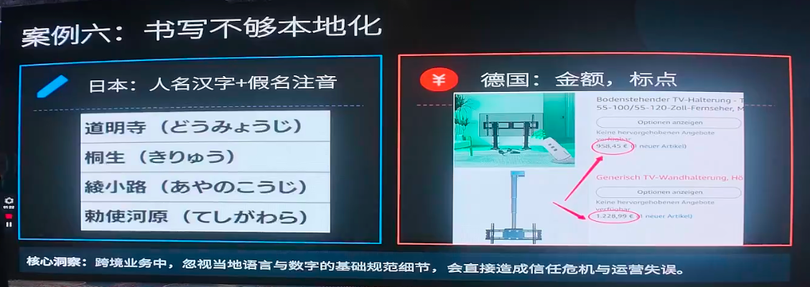

### 补充场景：越南的"本地法律实体"门槛

他还提到深圳一家做大机械（钢铁设备出口）的企业：越南流量好、询盘多，却很难成交。原因是越南人搞大工程只认在本国备案、能进本地平台的企业。**必须在本地有法律实体，对方才敢下单**——否则大工程出问题，找不到中国企业怎么办？

---

## 三、纯血版小语种的完整 SOP

讲完弊端，小平老师给出核心思想：**用马斯克的"第一性原理"，让每个站彻头彻尾地像个本地人。** 做德语站就要像德国人，做哈萨克斯坦语站就要像哈萨克斯坦本地人——网站从里到外与本地人建的没区别，所以叫"纯血版"。

以下是他在现场分享、并在哥飞社群中验证过的实战 SOP。全流程可标准化、可复制、可扩展。

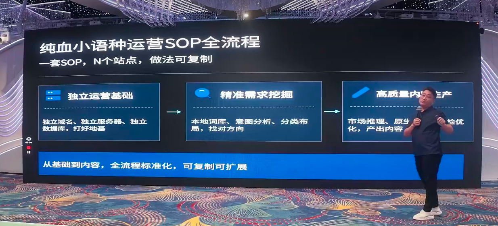

### 第 1 步：一站一语言，域名 + 服务器 + IP 全部隔离

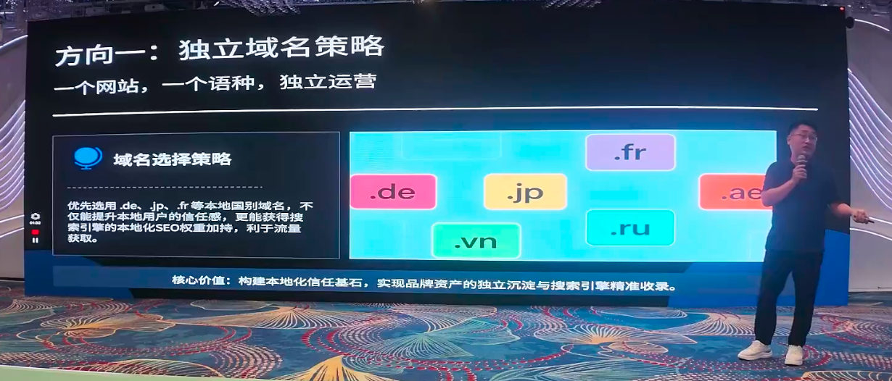

- **一个网站一种语言**（文化极相似的可适当合并，如哈萨克斯坦周边的乌兹别克、土库曼等可用翻译方式带上）；
- 优先注册**本地国家顶级域名**（`.jp`、`.de` 等），在 Namecheap、Hostinger 上便宜好注册，无需本地公司和营业执照，有张双币信用卡即可；
- **服务器和 IP 一定要隔离**。据分享，装 GTranslate、TranslatePress 这类插件的域名被处罚的非常多——流量常在 15 天内起飞后就"趴"下来，因为插件生成的内容与原语言重复；
- 域名注册商、服务器、内容都不放同一家，**风险天然分散**。18 个站里死一两个也没关系，权重积累还能复利。这正是哥飞社群常讲的"不把鸡蛋放一个篮子里"。

### 第 2 步：每个国家单独调研关键词

小平老师强调，这是**第一步、也是绝不能省的一步**。不调研只管发内容，就是傻子都会做、毫无门槛。

- 目的：找到**本地真实需求** + **词库覆盖面**；
- 工具：Ahrefs、SEMrush、谷歌广告后台，配合抓取本地论坛、问答平台、亚马逊评论等；
- **别被"通用词"骗了**：有人觉得 "API"、"PVC"、"ABS" 全球都一样、不用调研，实则大错。同一个 "OpenAI API"，巴西需求约 4000、难度较高；日本搜索量更大、竞争难度更低。**闭眼也先做日本——去捏软柿子。**

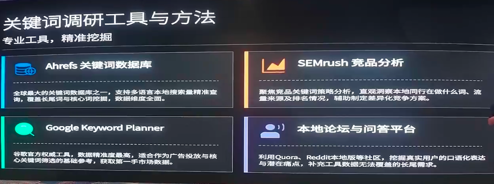

> 他点出一个 SEO 底层逻辑：排名不是自己决定的，是竞争对手决定的，竞争态势就藏在关键词难度（KD）值里。这与哥飞社群"找蓝海词"的思路完全相通。

调研完成后，再按传统 SEO 手法做关键词映射与主题集群：核心词（TOP）树立品牌认知、品类词（MID）承接业务流量、长尾词（BOTTOM）主攻转化成交。

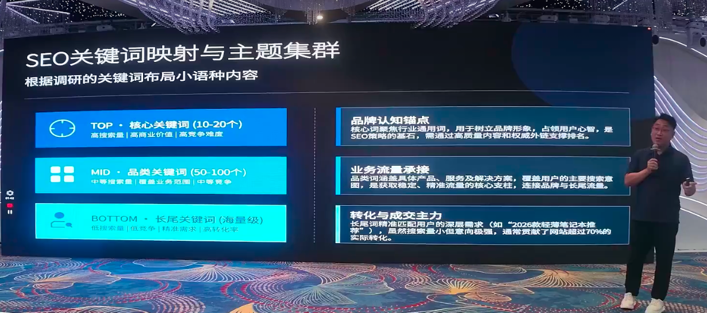

小平老师现场举了个案例：深圳一位做太阳能设施的个人（一人公司、OTC 模式），其阿拉伯语纯血版小语种站每天点击不超过 30 个，却接到一个 **350 万的行判订单**，上千万级的都不敢接。**小语种的需求就是这么旺盛。**

### 第 3 步：AI 先推理，再写作（关键中的关键）

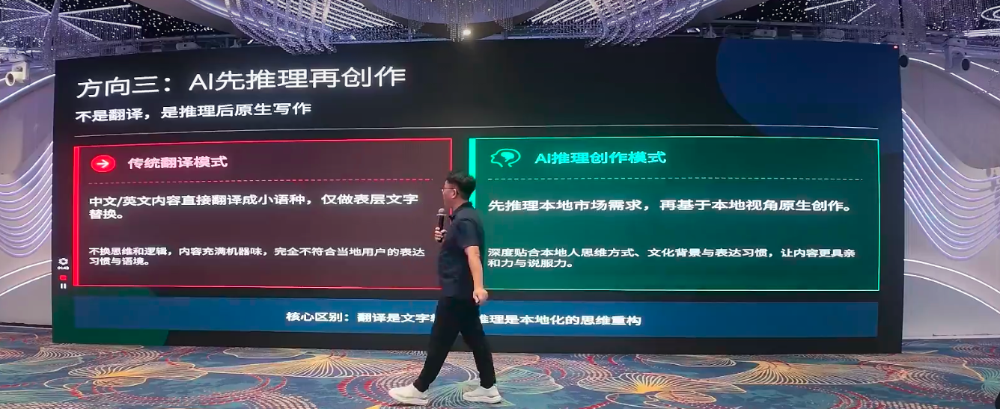

小平老师特别指出，整套流程**从头到尾都没有"翻译"两个字**——最大的机会正是用纯血小语种去干掉翻译。

**为什么是推理而不是翻译？** 他观察到，如今卖大模型的公司都在拼命宣传"推理能力"，翻译能力已不好意思提（好比雷军发布手机说"能发短信"）。可真正拿 AI 去做推理的人却很少。他自己没去过波兰、越南，就靠 **AI 推理**来了解当地文化。

**推理阶段要把模型开到最大、最高级**（Gemini 深度调研 / GPT 深度搜索 / Claude / Grok 等），开启深度思考。调研只在项目前两天集中消耗，形成 SOP 后就固定下来。

**必须推理的内容：**
1. **用户维度**：本地用户需求、痛点、购买决策关键因素、人群画像；
2. **本地表达**：语言表达、文字书写、网页设计习惯；
3. **竞品维度**：找 4~5 个本地做得好的竞品站丢给 AI 深度拆解——很多东西"浮于表面"，波兰本地钱包就是这么挖出来的。

**核心技巧：跨语言推理（中文 + 本地目标语言）**

据小平老师演示，他的提示词是"中文 + 本地语言"的混合写法，逻辑是：

- 大模型本质是"用上一个词预测下一个词"；
- 全用中文，它就去简体中文语料库找"巴西""假发"，里面没有真正的巴西料；
- 所以他会把**从 Ahrefs 调研出的、有搜索量的本地关键词**喂进去（这保证核心词 100% 正确，因为它在词库里有搜索量），让 AI 沿着本地词去预测下一个词、去当地语料库推理，从而避免语法、单词、文化错配。

现场展示的两组提示词就是典型：**推理阶段**让 AI 扮演"本土市场分析师"，围绕有搜索量的本地关键词深度推理市场与文化；**写作阶段**再让 AI 扮演"本土电商文案专家"，全程用本地语言原生创作、禁止字面直译。

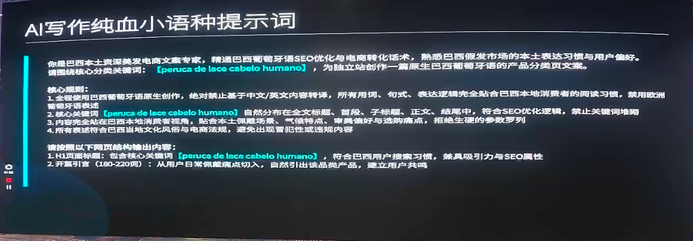

**写作要求**：沿母语者（本地土著）视角写；用地道表达；匹配阅读结构方便设计落地页；**按场景写**——比如给哈萨克斯坦写 2B 产品，就重点写"零下 40 度时产品会怎样"，而非照搬美国的"防水、耐高温"。

### 第 4 步：懂行的人工审核（这才是真正的门槛）

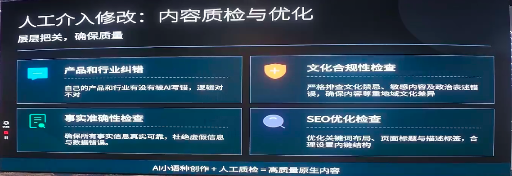

小平老师反复强调，**这一步若不做，整套东西就变成没门槛了**。

AI 再强也会"胡说八道"（幻觉），且它写的内容可能对，但公司没有那项业务的也要删。因此：

- 一定要让**懂行、有从业经验的人**去操作 AI 做小语种——这恰好符合谷歌 **E-E-A-T**（经验、专业、权威、可信）；
- 他做电子行业十几年，AI 写的内容至少翻成中文自己过一遍，看哪里胡说、哪里与业务不符；
- 真实反馈：曾有专业用户指出"你写的是 PVC，配图却明显是硅胶，你们是不是骗子？"——外行发现不了的错误，内行一眼看穿。

> 用真人 + 行业知识库去检测 AI 产出，是这套 SOP 里最不可替代的一环。

"AI 小语种创作 + 人工质检 = 高质量原生内容"，这正是纯血小语种符合谷歌 **E-E-A-T** 与"信息增益"的关键，也是与传统自动翻译插件内容拉开差距的地方。

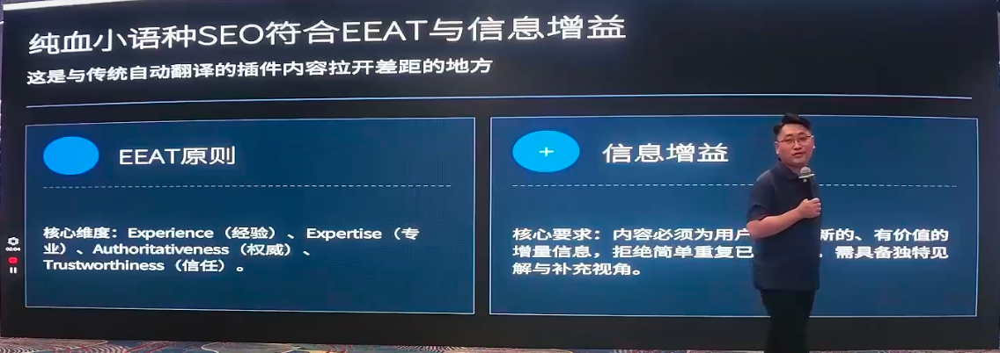

### 第 5 步：图片本地化

网页不只有文字，还有图片和视频，这些同样要本地化。

- 用 Nano Banana（Gemini 图像）等工具做本地化图片；
- 举例：公司上线"10 美金折扣"活动，日本站做成"1600 日元折扣"banner，欧洲站直接写"10 欧元"（8 欧不好看就取整）。日本用户看到本币金额的 banner，会觉得无比亲切、毫无突兀感。

### 第 6 步：视频本地化（唯一例外：直接翻译）

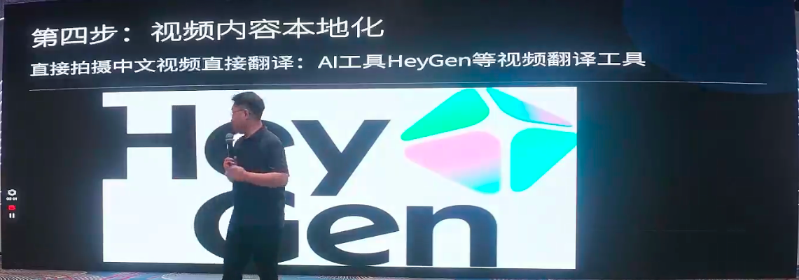

小平老师现场演示用的是 HeyGen 等工具，且特别说明——**他用的是"视频翻译"，不是"AI 生成视频"**。

- HeyGen 视频翻译能把**音色、口型**全部本地化对齐。他在街边随手录一段中文，就能翻成波兰语、西班牙语等多种语言，口型都对得上；
- **为什么视频这块反而主张直接翻译？** 因为 AI 生成视频目前还不稳定——前 10 秒是产品，后半段可能人和产品都变了。而做视频是为了让客户信任（工厂实拍、供应链、桌面拆解产品），产品必须从第一帧到最后一帧都不变；
- **有瑕疵反而更真实**：路边还有行人在走、在看，反而让客户觉得"这是真的"。做得太 perfect，客户反而觉得假、更不敢买。

---

## 四、总结：一个站一个语言，做 8 个 > 一个站做 8 个版本

小平老师把整套逻辑收敛为几个关键词：

| 原则 | 含义 |
| --- | --- |
| **独立是基础** | 每个域名、服务器、IP、内容都独立，风险分散、权重复利 |
| **调研是前提** | 单独调研关键词、用户需求、当地法律法规和文化——翻译插件永远做不到 |
| **原生是核心** | 反对翻译，让 AI 基于本地调研原生写作 |
| **本地化是终点** | 从文字到图片、视频，全链路做到"看不出你和本地人不一样" |

这套 SOP 底层完全依托谷歌 SEO 逻辑与主流 AI，无任何"偏门加速"。他也提到，无论做电商还是做 SaaS，逻辑一模一样，与哥飞社群一直分享的 SEO 方法论同源。

**其核心结论清晰而有力：每个语言做一个网站，做 8 个的收益一定大于一个网站做 8 种翻译版本。**

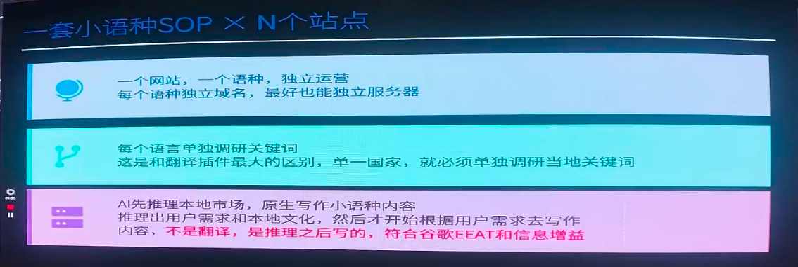

而且现在建站门槛极低——借助 Cursor、Cloud Code 等工具，即便非程序员出身的外贸业务员，一天也能建两三个站。小平老师建议哥飞社群的伙伴们**趁早用这套 SOP 铺开**，等别人 2027、2028 反应过来时，早已跑在前面。

---

> 本文根据「哥飞的朋友们·年中分享交流会·深圳站（2026.07.04~07.05，深圳御景国际酒店）」上 SEO 小平的分享《AI 助力纯血版小语种网站掘金》整理，内容仅为现场观点的转述与提炼，供哥飞社群伙伴及出海同行参考交流，不代表平台立场。如需转载或引用，请注明来源并联系原讲师授权。
