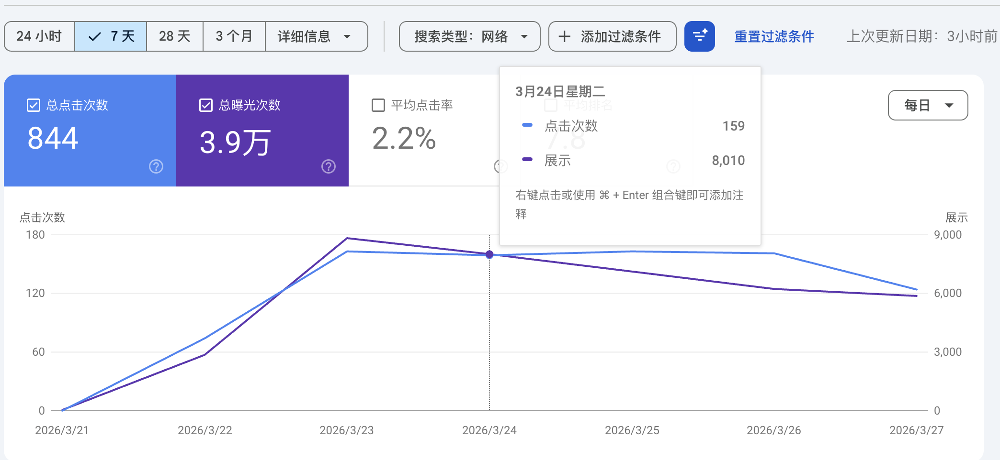
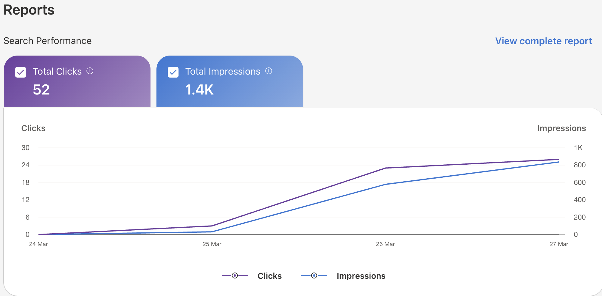

> 上周，我从 3 月 16 号开始每天看 Google Trends，发现一个游戏词搜索量很大。但是为了参加 4 月新词比赛，我还是忍到 20 号才注册域名，21 号上线网站，目前看来数据还不错。

## 一、概述

这是一个游戏工具站，Steam 是 20 号刚刚发布这个游戏。我在 20 号结合 AI 做了 UI 设计，21 号把落地页上线了，并且接入了 GSC、GA 和 Bing。后面每天让 AI 联网搜索这个游戏的内容，不断更新页面内容，不断加内页，目前看来数据还不错。

## 二、主要数据

### 2.1 GSC 数据

从 GSC 来看，网站整体表现不错。7 天内总点击 844 次，总曝光量 3.9 万次，平均点击率 2.2%。流量在 3 月 22-23 号快速爬升，23 号到达峰值后略有回落，说明新词的热度还在持续。

从设备维度来看，移动端的访问更多，点击 527 次、展示 2 万次，桌面端点击 311 次、展示 1.85 万次，平板几乎可以忽略。这提示移动端体验非常重要。

### 2.2 GA 数据

GA 过去 7 天数据：活跃用户 916，浏览次数 1533，事件数 4932。流量趋势和同类游戏中位数相比表现良好，维持在同类网站中较高水平。

从国家分布来看，还是美国地区来的比较多（337 人），其次是英国（104 人）、德国（39 人）、加拿大（36 人）、澳大利亚（29 人）。目前站点是纯英文，下个月再考虑多语言。

### 2.3 Bing 数据

Bing 接入的比较晚，21 号上线但 24 号才提交到 Bing Webmaster Tools。从数据看只有 52 次点击、1.4K 次展示，感觉 Bing 的量级整体不如 Google，仅供参考。

### 2.4 Cloudflare 数据

CF 的数据水分比较大，很多可能是爬虫。7 天内唯一访问者 6.06k，请求总数 168.91k，缓存命中率 26.94%，已提供数据 8GB。仅供参考，不作为核心指标。

## 三、总结

还是要找有搜索量的词，这样做网站才有成就感。有了正反馈，自己也能对这个网站投入更多的精力。

目前外链做的比较少，接下来一周准备怼外链了，希望 4 月比赛能拿个好的结果。
