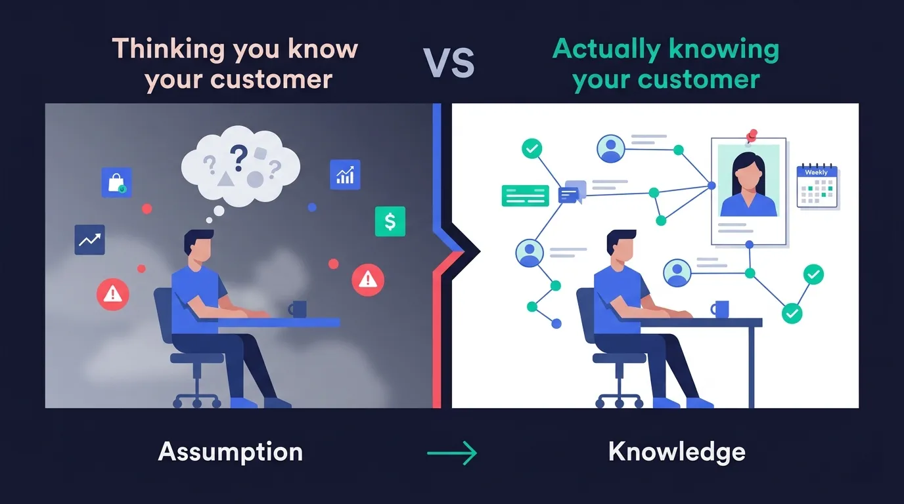
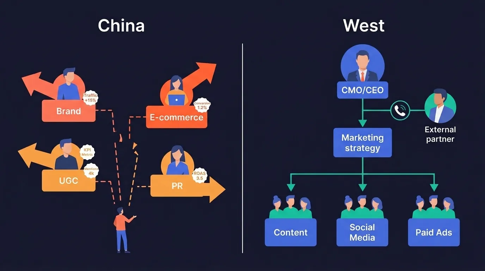
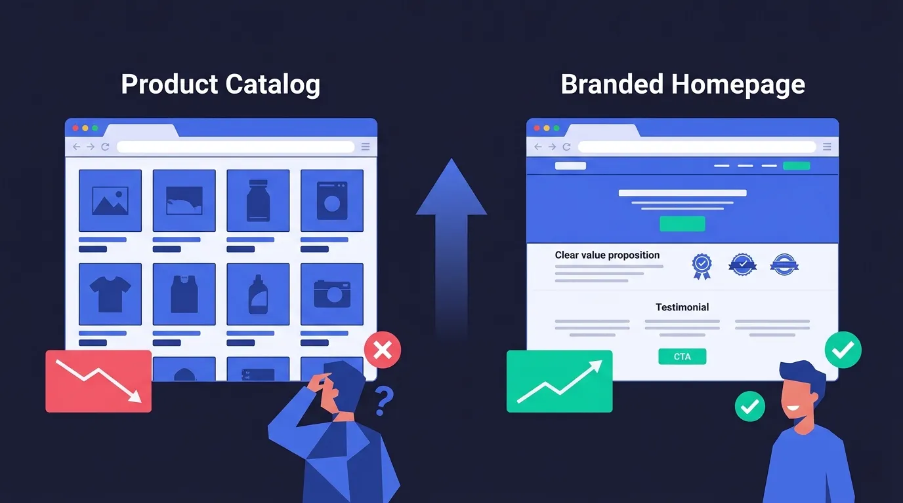
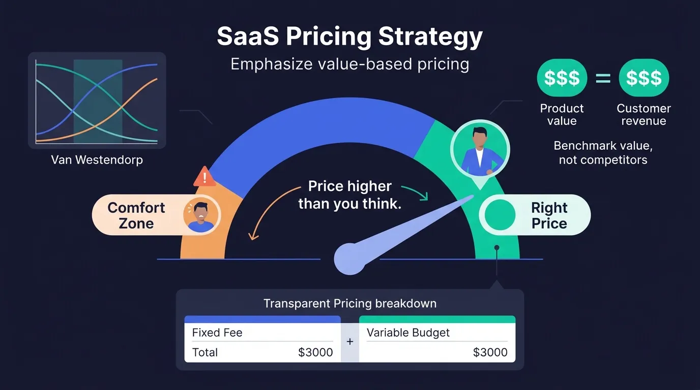
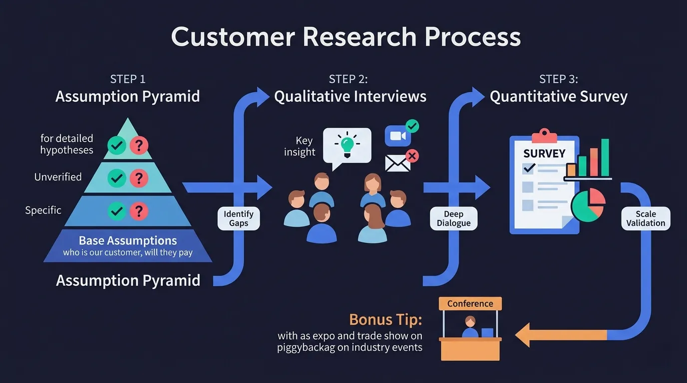

> 在深圳一场出海圆桌讨论中，4 位服务中国出海企业多年的海外营销专家，分享了他们对中国公司出海的真实观察。从客户研究到定价策略，从网站本地化到品牌建设，这些来自"另一边"的声音，或许比任何出海报告都更值得一听。

---

在深圳的一场出海主题会议上，4 位来自不同国家的海外营销专家围坐在一起，进行了一场坦诚而犀利的圆桌讨论。他们背景各异，但都有一个共同点——帮助中国企业走向海外市场，而且已经做了很多年。

* **Wolfgang**，奥地利人，常驻香港，专注为出海企业做网站建设。他最了解中国企业在网站本地化上踩过的那些坑。
* **Daniel**，英国/南非双重背景，连续创业者。经历过创业失败和成功退出后，他现在专注帮助初创公司成长，尤其擅长客户研究和产品市场匹配。
* **Jonathan**，德国人，在英国经营 SEO 和 GEO 代理公司。服务中国和欧美客户已有 12 年，每个季度飞一次深圳，对两边市场的差异有着深入的第一手观察。
* **Greg**，美国人，Jolly SEO 创始人，专注品牌营销和 Reddit 推广。从美国本土视角出发，他对中小企业如何在海外建立品牌有独到见解。

这场讨论涵盖了出海企业最关心的几个核心议题：客户研究、组织架构、品牌建设、定价策略和本地化。当主持人抛出第一个问题时，对话很快就切入了一个几乎所有出海企业都会踩的坑。

## 一、B2B SaaS 出海最大的坑：你真的了解你的客户吗？

Daniel 被问到的第一个问题是：你服务的那些北美 B2B SaaS 客户，最大的痛点是什么？

他的回答出人意料地简单：**他们不够了解自己的客户。**

> "大多数公司都会说'我们做了客户访谈'，但他们并没有把访谈中的洞察转化成可操作的认知，更没有把这些认知同步给整个团队。"

Daniel 说，他理解这背后的原因——大家都很忙，跟客户聊天似乎不能直接推动业务指标。但实际上，深入理解客户如何使用你的产品、为什么选择你，能让公司里几乎所有的决策都变得更好。

他还分享了一个让他又佩服又嫉妒的故事：他的一个朋友做了一个 Shopify 插件，从零做到被 Shopify 收购。这个朋友在自己家客厅里挂了一张客户画像，**每周都会更新**。

> "他对客户行为的理解到了一种痴迷的程度。而我以前总觉得自己比客户更懂，结果所有项目都失败了。后来我才明白，问题不在于我不够聪明，而在于我一直在用'我认为'代替'我了解'。"

主持人立刻接话说，中国公司在这方面的问题可能更严重——"我们确实不太做客户研究，连 ICP（理想客户画像）都搞不清楚，而且我们还有一个很好的借口：我们跟美国客户隔了上万公里。"

这或许是整场讨论最核心的矛盾：**距离越远，越需要深入了解客户；但距离越远，了解客户的难度也越大。** 而大多数中国出海公司选择了最省事的方式——干脆不做。

## 二、中国公司 vs 欧美公司：出海的结构性差异

Jonathan 在这个行业做了 12 年，每个季度都会飞深圳一次。他对中国公司和欧美公司的差异有着深刻的体感。

**中国公司的优势：野心和投入意愿**

> "我非常喜欢跟中国品牌合作的一点是，他们真的很有野心。他们想要增长，愿意投入资源去学习、去成长。"

他拿英国公司做了个有趣的对比："在英国，很多老板的心态是——'我一年能度两次假，每周能去酒吧吃个午餐，我挺满意的，不想再招人了。'但中国公司不是这样，他们想要做大。美国人在这方面跟中国人比较像，都有那种'我要实现梦想'的劲头。"

**中国公司的劣势：部门割裂和决策链过长**

但 Jonathan 也指出了一个结构性的问题：

> "中国公司往往会把营销切割得很碎——品牌营销团队、电商团队、UGC 团队、PR 团队……这些团队各自有不同的 KPI，有时候甚至在互相对抗。"

这意味着什么？即使每个团队都在努力工作，但因为方向不一致，整体效果可能反而在下降。品牌团队在做品牌故事，电商团队在拼价格，PR 团队在发新闻稿——三条线互不相关，甚至互相矛盾。而最终目标——让公司赚更多钱——反而被稀释了。

他举例说，在跟美国公司合作时，他通常能直接跟 CMO 甚至 CEO 对话，一个电话就能拍板。但在跟中国公司合作时，可能合作了两三年，对接的一直是一个比较基层的员工，从来没见过真正的决策者。很多好的建议因为无法到达决策层，最终石沉大海。

"这让我的工作变得困难很多。但我两边都爱，我做了 12 年，头发都白了，以后还会继续做下去。"

## 三、小型中国制造商出海的成功与失败

当话题转向中小型企业出海的实战案例时，每位嘉宾都贡献了精彩的观察。

### Greg 的双面案例

Greg 从他作为美国人的视角出发，把中国小型制造商类比为美国的小型本地服务商——体量小、资源有限，但如果方向对了，潜力巨大。他分享了两个截然相反的案例。

**失败案例：沈阳的 PCB 制造商。** 双方聊得很好，产品过硬，沟通顺畅，但最终因为预算问题没能合作——Greg 的服务价格是对方当时预算的两倍。对于很多小型制造商来说，品牌营销的投入门槛确实是一道坎。

**成功案例：一个服装品牌。** 这家公司在自己的细分领域里，几乎是唯一一家愿意投资品牌建设的中国企业。他们有预算，也有耐心做长期投入。

> "你能想象那个流量增长曲线有多夸张吗？因为在他的细分市场里，根本没有其他中国公司在做品牌。大多数中国小制造商的网站首页就是产品目录，对西方用户来说，这是一种很奇怪的体验。"

Greg 还强调了一个观点：如果他看到一个客户的网站首页就是产品目录页，他的第一反应是——"不管你的营销预算是多少，先花钱把网站改了。找一个懂西方用户的人来重做你的网站，然后再谈营销。"

### Jonathan 的战术建议

Jonathan 从另一个角度补充了实战经验。他首先指出了一个常见的误区：很多小公司的老板只盯着流量数字，要求"更多点击，更多点击"，不管流量质量。

> "这会迫使营销团队去写各种垃圾内容来凑流量。结果流量是上去了，但网站整体转化率一直在掉，因为进来的都是低质量访客。"

另外，如果产品线太窄、产品本身又没有明显差异化，做起来也会比较吃力。相反，产品线丰富的公司可以通过不同的产品组合来创建不同的着陆页，更容易获得搜索排名。

在正面经验方面，他提到了两个特别有效的策略：

**1. 工程化营销（Engineering as Marketing）**

> "我们会在客户的网站上做一些独特的工具。比如，如果是一家太阳能公司，我们可能会做一个太阳能投资回报计算器，放在他们网站上。这能吸引用户来到网站，增加停留时间，最终发现产品的价值。"

**2. 微型 KOL 策略**

> "不要去追那些大网红，而是找那些小型的 Instagram、TikTok 创作者，让他们用你的产品拍素材。然后把这些素材用在你的付费广告里。这比找专业摄影团队拍广告便宜得多，而且更真实、更有说服力。"

### Daniel 的尖锐观察

Daniel 用 30 秒总结了他看到的中国公司出海失败的两大原因：

**第一，不理解西方消费者的购买逻辑。**

> "他们的心态是：'我把产品上架了，人们就会来买。'他们不理解你需要先让人知道你的产品，教育市场，解释产品为什么重要，然后对着特定的人群说话。我跟他们说了，他们说'有道理'，然后接着说'但我们不想做这些，直接帮我们卖就行'。兄弟，你这是一个 1 万美元的消费品，没人会因为'看起来不错'就掏钱。"

**第二，创始人过度干预。**

他讲了一个 AI 领域的女性创始人的故事——博士学历，非常聪明，但因为她自己"从来没点过广告"，所以拒绝做任何付费推广。她的表弟给了她一些 SEO 建议，她就坚持按那个方向做。

> "她付我很多钱，比我之前任何客户都多。但说实话，她在浪费自己的钱。因为她对自己的公司有太深的情感投入，不愿意让专业的人来打理。"

### Wolfgang 的本地化忠告

Wolfgang 从网站建设的角度提出了一个朴素但关键的观点：**入乡随俗。**

> "我经常遇到这种情况：客户说'把支付宝接上就行了，外国人可以学着用'。我说不行，你得接 PayPal，接 Stripe，信用卡必须能用。你想想，如果一个外国公司要进中国市场，但不接支付宝和微信支付，能行吗？出海也是一样的道理。"

他补充说，域名、网站设计风格也都要做本地化。中国网站的设计风格跟西方网站差异很大，如果把中国风格的网站直接搬到海外，效果不会好。

> "你需要找到一个你信任的人，然后放手让他去做。如果不行，你随时可以改。但至少先让专业的人先试一试。"

## 四、SaaS 定价策略：你的定价，永远比你以为的要低

话题转到定价时，Daniel 给了一条极简但有力的建议：

> "定价比你以为的要高。每次我给自己的产品定价，都会低估。让价格高到你自己都觉得有点不舒服，那才差不多是对的。"

他推荐了一个叫 **Van Westendorp** 的定价研究模型，可以帮你找到合理的价格区间。核心思路是不要只看竞品定价，而要思考：**你的产品给客户创造了多少价值？**

> "如果你的产品能帮客户搭建一个每年产生几万美元收入的站群，那你的产品就可以卖很贵。永远会有人跟你说'太贵了'，但你可以忽略他们。"

Jonathan 则分享了他们代理公司的定价模型——**固定费用 + 可变预算**：

> "比如我们每月收 3000 美元的固定服务费，另外有 3000 美元的外部预算。外部预算按实际使用收费，花多少算多少。我们的原则是透明——把每一笔钱花在哪里都列清楚，因为太多营销公司在这方面做得很差。"

他也坦言，目前 AI 营销的 ROI 归因是一个大难题。从 AI 来源（比如 ChatGPT、Perplexity 等）获得的流量，归因追踪仍然非常不成熟。用户通常会经历多个触点才完成购买，所以客户和服务商必须先就归因模型达成共识——是看首次触达、最后触达还是多触点混合——否则效果评估就是一笔糊涂账。

不过 Jonathan 认为，从 AI 来源获得的流量价值通常高于传统搜索的中上层漏斗流量，因为这些用户往往带着更明确的购买意图。

## 五、客户调研实战指南：从假设金字塔到真实对话

一位在线观众向 Daniel 提了一个很好的问题：做客户研究时，应该先做定量调查还是先做定性访谈？

Daniel 的回答是：**先做定性。**

但在这之前，他建议先做一件事——**建立"假设金字塔"**。

> "列出你对业务的所有假设，按重要性排列成金字塔形。最底层是最基本的假设：'这是我们的客户'，'这是我们的产品'，'人们会为此付费'。然后往上逐层细化。接着标记：哪些假设已经被验证了？哪些只是你'觉得'是对的？"

这个方法的精妙之处在于：它能帮你快速识别出"我们以为我们知道，但其实并不知道"的盲区。很多团队以为自己对市场很了解，但当你逼他们把假设写下来并标记"已验证/未验证"时，往往会发现大部分认知都只是"感觉"。

搞清楚了哪些是未验证的假设之后，就可以针对性地设计问题，然后**去跟客户面对面聊**。不需要一上来就搞大规模问卷调查——先跟 5-10 个客户深聊，比发 500 份问卷更有价值。

关于访谈方式，Daniel 也很直接：邮件访谈可以做，但质量不如面谈。"如果给了激励，比如送帽子、给报酬，人们往往会写一些听起来不错但不太真实的回答。"

他还强调了一个关键技巧：**不要太死板地按问题清单走**。他讲了一个例子——他发现一个重要洞察（"一行代码开店"这个产品定位），并不是来自预设的问题，而是在聊天快结束时随口问了一句："你的朋友会怎么描述我们的产品？"

> "定量调查通常是第二步，因为人们的购买决策是基于情感而非逻辑。你需要先理解那个情感，才能设计出有意义的量化问题。"

Greg 也补充了一条极其实用的建议：如果你是公司里唯一一个关心客户研究的人，没有预算也没有团队支持，**搭上参加展会的那个团队**。

> "你的公司可能不会为了客户调研专门送你去海外。但如果公司本来就有人去参加行业展会、做地推，你想办法跟上去，或者至少把你的问题交给他们，让他们在展会上帮你做几个访谈。"

---

## 总结：出海成功的 5 条铁律

从这场圆桌的讨论中，可以提炼出 5 条核心建议：

**1. 深入了解客户，而不是自以为了解。** 客户研究不是一次性的任务，而是持续的习惯。建立假设金字塔，验证每一个假设，像那个 Shopify 创始人一样，每周更新你的客户画像。

**2. 放下"中国式"网站思维，本地化一切。** 支付方式、网站设计、域名、内容风格——每一个触点都要符合目标市场用户的习惯。产品目录页不能当首页用。

**3. 品牌建设是蓝海，不要只卖产品。** 大多数中国出海企业还停留在"上架即销售"的思维。愿意投资品牌的公司，在细分市场里几乎没有竞争对手。

**4. 定价要有自信，对标价值而非竞品。** 如果你的产品能为客户创造显著价值，就不要害怕定高价。用 Van Westendorp 模型做正式的定价研究，永远比"凭感觉定价"靠谱。

**5. 找到你信任的本地伙伴，放手让他们做。** 不要让创始人的个人偏好主导营销决策。找到专业的本地团队，给他们空间去执行。如果效果不好，再调整；但至少先让专业的人先做。

出海从来不是把产品搬到另一个市场那么简单。真正的挑战不在于跨越地理距离，而在于跨越认知距离——理解另一群人如何思考、如何决策、如何购买。

正如 Daniel 在讨论中反复强调的：最成功的公司，都是那些对客户理解到"痴迷"程度的公司。而最失败的公司，往往不是产品不行，而是固执地用自己的思维方式去理解一个完全不同的市场。

这 4 位外国专家在中国出海行业深耕多年，他们的观察或许带有局限性，但有一点是确定的——他们代表的恰恰是中国出海企业最需要理解的那群人：你的海外客户。
