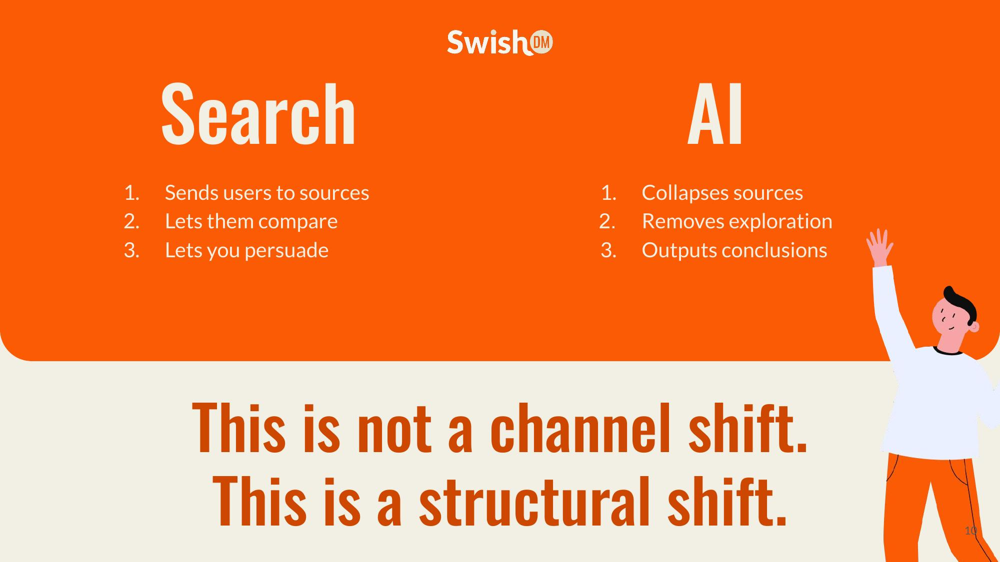
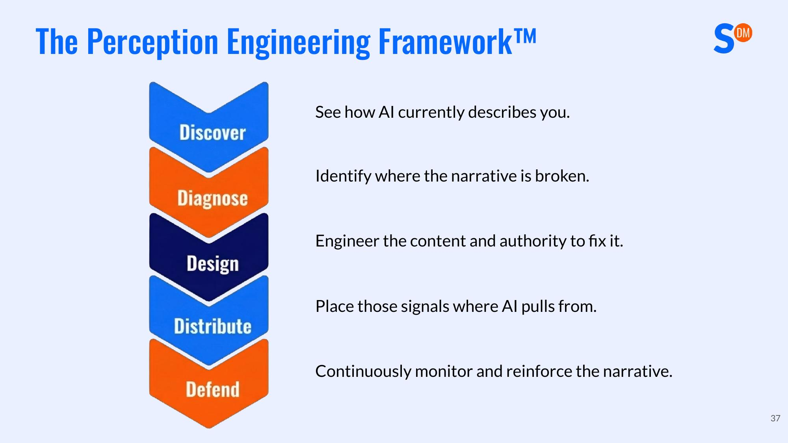

*基于Jonathan Kiekbusch演讲整理 | SwishDM*

---

> 未来五年，在座的一些公司会停止增长。不是因为你的产品变差了，不是因为竞争对手造出了更好的东西，而是因为你被一台机器悄悄地从候选名单上移除了。

这是Jonathan Kiekbusch在一场面向SaaS创始人的演讲中说出的开场白。这句话刺耳，但越来越接近现实。

Kiekbusch是SwishDM的CEO，拥有超过12年的在线零售和SaaS转型经验，曾服务于EcoFlow、Insta360、Dreame等多个中大型品牌，帮助它们通过更智能的SEO和GEO（生成式引擎优化）提升可见性和转化率。他在这次分享中提出了一个核心框架——**感知工程（Perception Engineering Framework）**，用以解释在AI重塑买家决策链路的今天，SaaS公司如何系统性地管理和优化自己在AI眼中的"形象"。

---

## 一、你已经失去了对第一印象的控制权

在过去的互联网世界里，所有的路都通向同一个目的地——你的官网。用户搜索关键词，点击链接，进入你的网站，浏览你精心设计的页面，被你的品牌故事打动，最终转化为客户。你掌控着叙事，因为你掌控着目的地。

但现在，这条路径正在被根本性地改写。

在新的漏斗中，用户输入一个提示词（Prompt），AI进行信息综合（Synthesis），然后直接在用户的心智中形成认知（Perception）。你的网站？它只是一个验证环节——如果用户还会来看的话。等到用户真正访问你的网站时，购买决策已经基本成型了。

Kiekbusch把这个变化定义得很清楚：大多数公司还以为自己控制着品牌的感知方式——你控制着首页，控制着品牌信息，控制着自有媒体。**但你不再控制第一印象了。AI在替你做这件事。**

而AI给出的第一印象，可能和你想要传达的完全不同。想象一下：你花了三个月重新设计了官网，更新了所有的产品文案，做了一段精美的品牌视频。但当一个潜在客户问ChatGPT"哪个项目管理工具最适合50人的SaaS团队"时，AI输出的那段话里，你的品牌要么没出现，要么被描述成了你两年前的样子。你所有的努力，在AI的叙事里可能完全不存在。

---

## 二、这不是渠道变化，而是结构性变革

很多人把AI搜索当作传统搜索的"升级版"来看待，认为只是换了一个渠道，原来的打法稍微调整一下就行。Kiekbusch认为这种理解是危险的。

传统搜索和AI之间存在本质差异。传统搜索把用户引导到各个信源，让他们自己比较，给你机会去说服他们。而AI直接把信源压缩合并，消除了用户的自主探索过程，直接输出结论。

这意味着什么？意味着你精心打造的品牌故事被压缩成了几个要点。你独特的市场定位变成了一句"也提供……"。如果你没有为机器可读性做优化，你就会被淹没。

更残酷的是，在AI的世界里没有"第二页"。在传统搜索中，用户通常会对比5到10个选项。但在AI综合的回答中，通常只有2到3个品牌主导了整个叙事，AI会明确推荐一个首选方案。你要么被提及，要么完全隐形——没有中间地带。

Kiekbusch总结了这个变化的本质：**旧游戏的目标是获取流量。新游戏的目标是掌控共识。** 因为在AI中介的世界里，共识决定了可见性，可见性决定了生存。

---

## 三、隐形的质量分数：AI声誉如何影响你的获客成本

你的AI声誉是一个安静的、看不见的指标，但它正在深刻地影响着买家信任——在你进入对话之前。

Kiekbusch将其称为"隐形的质量分数"（The Invisible Quality Score），运作逻辑是这样的：如果AI对你的定位不佳，或者会浮现一些历史负面信息，那么到达你面前的潜在客户一开始就是带着怀疑和价格敏感度来的。这导致转化率下降、销售周期延长，最终综合获客成本（CAC）在悄悄升高——而你甚至不知道原因。

反过来，更好的AI声誉意味着更高的被推荐概率和更低的获客成本。这是一个正向或负向的飞轮，区别在于你是否主动管理了它。

---

## 四、AI的信息从哪里来？不是你的官网

这可能是整个演讲中最反直觉的洞察之一：**大语言模型在构建关于你的叙事时，起点不是你的官网。**

LLM不会从你最新的产品发布页面开始，也不会从你刚更新的定位文案开始。它们从分布在整个互联网上的信号开始——你的官网只是全景中的一个节点，而非唯一的信源。

更关键的是，AI在综合信息时，高度依赖第三方平台的内容。评测平台、论坛讨论、对比博客、行业媒体、Reddit帖子——这些第三方来源被AI视为比自有媒体更中立的信息源。

Kiekbusch举了一个令人震惊的例子：一条获得400个赞和大量评论的Reddit负面帖子，在AI叙事中的权重可能超过你精心制作的20个案例研究。为什么？因为争议性内容会产生更多的讨论、回复、外链和重复引用，而重复强化了信号。

这就引出了一个关于"AI的权衡机制"的重要概念：AI的判断基于三个维度——权威性（Authority）、共识度（Consensus）和出现频率（Frequency）。如果两年前有人写了一篇"这个产品不适合代理商使用"的评测，而你从未用足够的权威内容去对冲这个观点，AI今天可能仍然会这样描述你。**你被历史内容定义，直到新的共识压过它。**

AI从这些地方提取信息：旧评测、Reddit帖子、对比文章、缺失的用例覆盖。这些内容被编译成一段干净的摘要——而这段摘要就成了你的第一印象。你没有写它，但它定义了你。

---

## 五、大多数SaaS公司在哪里掉了球？

Kiekbusch指出，大多数SaaS管理层从未做过以下任何一件事：从未运行过结构化的提示词审计，从未按情感倾向分类AI的输出，从未测试过AI如何描述自己的产品功能，从未检查过AI在竞品对比中怎么说自己。

然而，这些AI输出每天都在塑造买家的认知。

这就好比你的竞争对手每天都在给潜在客户发一份关于你的"报告"，而你既不知道报告里写了什么，也没有任何干预手段。这不是一个边缘问题，而是一个核心的竞争力盲区。

Kiekbusch提出了一个简单但有力的测试：去ChatGPT或Perplexity中问一下"最适合[你的目标场景]的[你的品类]工具是什么"，看看AI怎么说你。如果AI输出的那段话是潜在客户唯一读到的内容，你能赢吗？没有官网、没有演示、没有定价页——只有一段机器生成的摘要，在塑造着他们的期望、信任和支付意愿。在你进入对话之前，一切就已经定型了。

---

## 六、感知工程框架：5D方法论

Kiekbusch提出的感知工程框架（Perception Engineering Framework）不是一次性的营销活动，而是一个面向机器时代声誉管理的持续运营体系。它由五个阶段组成：发现（Discover）、诊断（Diagnose）、设计（Design）、分发（Distribute）、防御（Defend）。

### 第一步：发现（Discover）——你无法修复你看不到的问题

从提示词审计开始。大多数公司从未做过这件事。具体操作方法是：在ChatGPT中创建一个项目，将记忆设置为"仅项目内"（Project-only），以防止AI使用外部记忆，确保获得无偏见的输出。然后写下人设引导信息，把自己变成客户角色，比如"我管理一个40人的营销团队，正在国际化扩展……"。接着在同一个项目中，提出你的真实潜在客户会问的问题。

核心审计方向包括：针对特定使用场景的最佳工具推荐、你的品牌与竞品的对比、你的品牌是否适合某个细分市场、你的品牌是否支持某个功能。导出所有回复，按情感倾向分类，规律很快就会浮现。

如果要规模化执行，可以使用Scrunch AI这类提示词追踪工具，批量下载AI输出并按情感分析。你会清楚地看到叙事在哪里断裂了。

### 第二步：诊断（Diagnose）——定位叙事失控的位置

发现了问题之后，下一步是绘制你失去叙事控制权的具体位置。失控通常发生在五个维度：竞品对比中的定位、功能描述的权威性、使用场景的覆盖度、历史负面内容的残留、以及问题解决能力的可见性。

关键原则是：按管线影响优先级排序。问自己"哪些问题正在实际损害我们的转化率？"先修复那些直接影响购买决策的叙事断裂点。

### 第三步：设计（Design）——主动构建你想要的叙事

如果AI在综合对比信息，你就必须先把对比结构化。围绕以下内容进行建设：X vs Y的对比内容、"最佳替代方案"类内容、清晰的差异化定位、明确的使用场景分割。

**如果你不定义对比，AI会替你定义。** 而AI的定义可能基于两年前的过时信息。

对于每个你目前被错误标签或缺席的细分市场：创建针对性的使用场景内容，将其发布到第三方平台，鼓励来自该细分市场的用户更新评测。

评测策略尤其重要。旧评测不会消失，但可以被压过。一个持续的、主动的评测策略——让你的当前产品被真实用户描述——不是锦上添花，而是必需品。

### 第四步：分发（Distribute）——信号必须遍布AI拉取信息的地方

只发布在自己网站上是远远不够的。AI从以下地方拉取信息：你的官网、评测平台、行业媒体、Reddit和社区论坛、开发者文档和技术生态。

你的网站只是一个信号。权威是分布式的。你需要在能够积累势能的地方建立存在感：外链、讨论、引用、被提及。

Kiekbusch给出了一个清晰的判断标准：**十条高质量的分布式提及胜过五十篇平庸的博客文章。信号密度比数量重要。**

### 第五步：防御（Defend）——持续监控和强化叙事

感知是动态的。竞争对手在发布新内容，评测在更新，旧帖子会重新浮出水面，新功能会改变定位格局。

持续防御应该包含：持续的内容创建以掌控叙事、定期的提示词追踪节奏、跨平台的情感倾向监控、以及季度审计周期以捕捉新的叙事缺口。

**声誉漂移是真实存在的。你的竞争对手不会原地等待。**

---

## 七、五年展望：从AI建议到AI替你下单

Kiekbusch对AI在购买决策中的角色提出了一个四阶段预测。

我们目前处于第一阶段：AI总结选项，人类做决定。感觉还是辅助性的、咨询性的、低风险的。

但接下来会依次进入：第二阶段——AI筛选候选名单；第三阶段——AI直接推荐一个选项；第四阶段——AI执行购买（没有浏览，没有演示电话）。

这个进程不是推测，而是已经在发生。Kiekbusch举了一个生活化的例子：你对家里的AI设备说"帮我女儿组织一个下周六的公主主题生日派对"，AI订了装饰品、预约了表演、确认了餐饮。你比较了12个供应商吗？看了评测吗？浏览了网站吗？没有。AI替你选了。

在SaaS领域同样如此。一个创始人可能会说："帮我们新的营销团队搭建一个协作平台，中端价位，能和HubSpot集成，邀请所有人加入。"AI会评估工具、读取情感倾向、选择供应商、创建账户。如果你不在机器的共识之中，你根本不会被考虑。

在旧世界里，你可能输掉比赛。在新世界里，你可能根本进不了赛场。**你不会失败。你只是不存在。而且你不知道为什么。**

当AI代理（Agent）开始替人类执行购买决策时，差异化必须是机器可读的。权威必须是分布式的，声誉必须是结构化的，共识必须是工程化的。如果你的叙事含糊不清，你会被AI压平成和竞品一样的描述。如果你的叙事薄弱，你会被直接排除。

这不是遥远的未来。OpenAI的Operator已经可以代替用户浏览网页和执行操作，Google的AI Agent也在快速迭代。从"AI帮你选"到"AI替你买"的距离，可能只有一两年。

---

## 八、别忘了：SEO仍然是王者

在全面转向AI叙事之前，Kiekbusch特别提醒了一个重要的事实：SEO仍然是存在的最大流量、最高意图的渠道，每年全球有3万亿次搜索。

这不是"SEO还是AI"的二选一命题。赢家是两者都做好的公司。**赢得搜索，赢得综合。** 客户旅程现在在搜索之前就开始了。胜出的公司明白，决策发生在访问之前——而且越来越多地，决策发生在完全不需要访问的情况下。

---

## 写在最后

Kiekbusch的核心论点可以归结为一句话：**感知不再是品牌建设的一部分，它是竞争生存的基础设施。**

在AI时代，你的品牌不再是你说它是什么，而是AI编译出来的那个版本。设计消失了，情感消失了，说服力消失了。剩下的是被压平的共识。如果这个共识对你不利，你的获客成本会悄悄上升，你的管线会莫名萎缩，而你可能连原因都找不到。

但好消息是，共识是可以被工程化的。通过"发现-诊断-设计-分发-防御"这个五步框架，你可以系统性地审计AI如何描述你，找到叙事断裂的位置，构建正确的内容和权威来修复它，将信号分发到AI拉取信息的地方，然后持续监控和强化。

这不是一次性的项目，而是一个持续运营的体系。就像你不会搭建完网站就再也不更新一样，你也不能做一次AI审计就认为万事大吉。感知是动态的，竞争对手不会停下来等你。

如果你今天只能做一件事，那就是：打开ChatGPT，问一下AI怎么描述你的产品、怎么把你和竞争对手做对比、怎么评价你在特定使用场景中的适用性。把回答导出来，仔细读一遍。你可能会发现AI说的和你以为的完全不同。这个差距就是你需要开始工程化的地方。

这场变革的窗口期不会太长。当AI从"总结选项"进化到"直接下单"的那一天，你要么已经在机器的共识名单上，要么永远不会出现在上面。现在行动，还来得及。

> 去工程化你的感知。在它工程化你之前。
