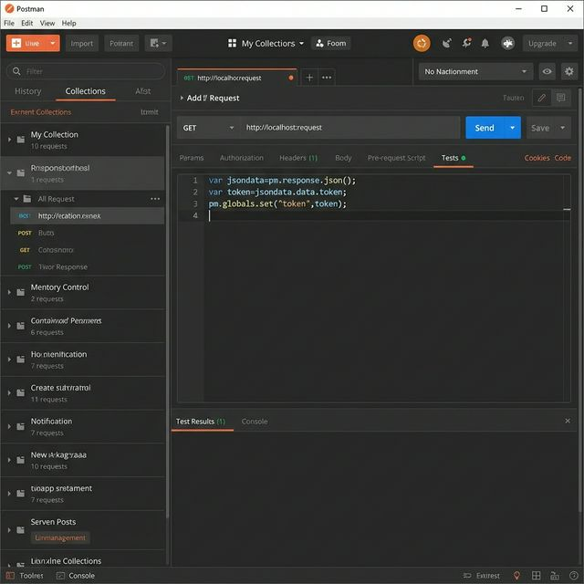
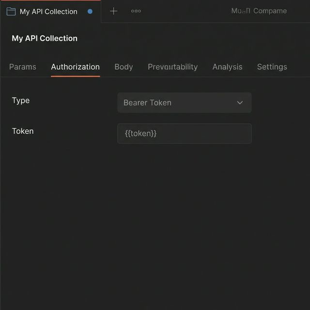
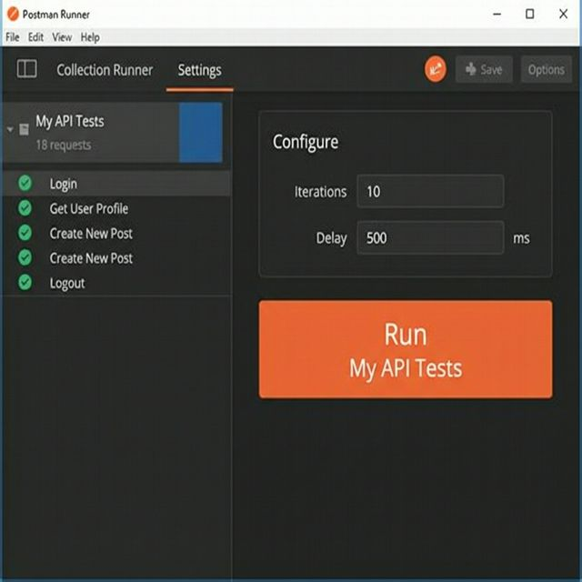

### 一、全局 Token 设置

#### 1. 登录时获取 token



```javascript
// 获取登录接口的返回数据
var jsondata=pm.response.json();
// 判断登录是否成功
if (jsondata.code === 200) {
    // 获取token并设置到环境变量token的值
    var token=jsondata.data.token
    pm.globals.set("token",token)
} else {
    console.error(jsondata.msg);
}
```

#### 2. Collection 设置 token



### 二、接口自动执行



右击 Collection，选择 "Run Collection"；

选中要执行的接口，在右侧填入执行次数和间隔时间，然后点击 "Run 测试自动执行" 即可。

