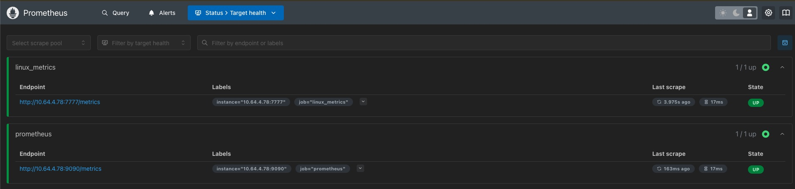
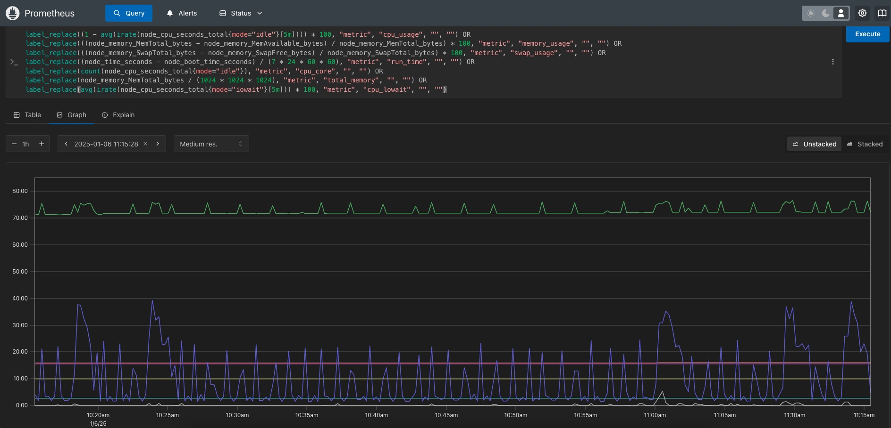
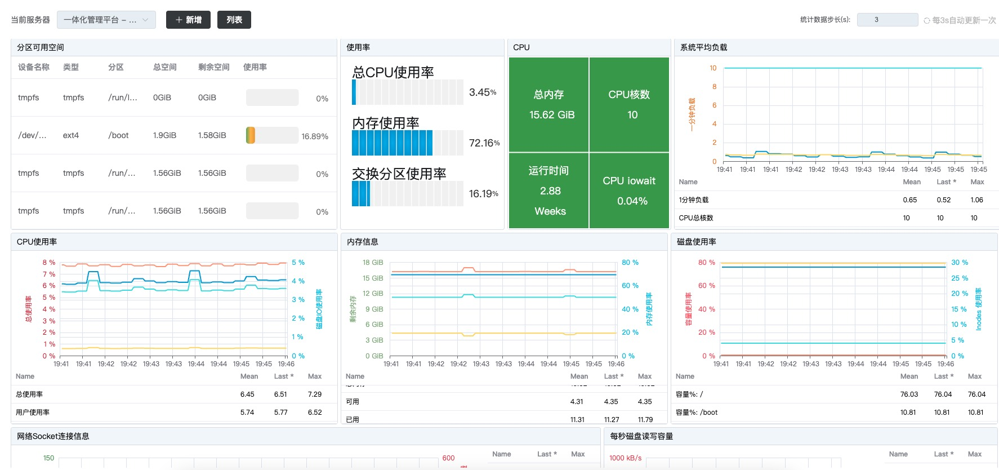
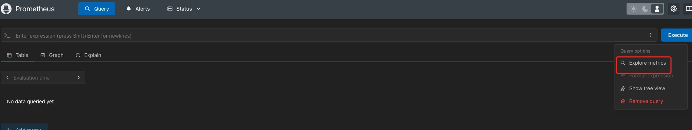
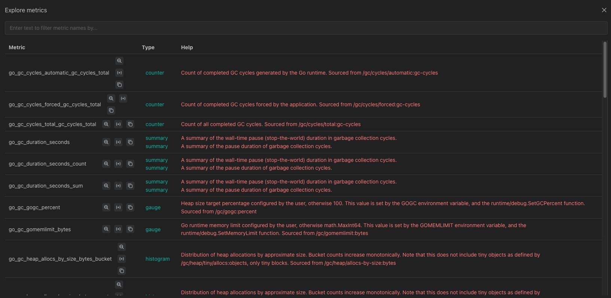

### 一、写在前面

最近项目上需要统计显示 Linux 系统指标，如 CPU、内存、磁盘使用情况等指标。虽然 Grafana 可以展示这些指标，但是将其内嵌至系统中展示可能并不友好，所以需要定制开发。

### 二、环境安装

目标服务器的 node_exporter 是直接装在系统上的。Prometheus 是通过 docker-compose 安装的。

```yml
version: '2'

networks:
  monitor:
    driver: bridge

services:
  prometheus:
    image: prom/prometheus
    container_name: prometheus
    hostname: prometheus
    restart: always
    volumes:
      - ./config/prometheus.yml:/etc/prometheus/prometheus.yml
    ports:
      - '9090:9090'
```

prometheus.yml 配置文件如下：

```yml
# my global config
global:
  scrape_interval: 15s # Set the scrape interval to every 15 seconds. Default is every 1 minute.
  evaluation_interval: 15s # Evaluate rules every 15 seconds. The default is every 1 minute.
  # scrape_timeout is set to the global default (10s).

# Alertmanager configuration
alerting:
  alertmanagers:
    - static_configs:
        - targets:
          # - alertmanager:9093

# Load rules once and periodically evaluate them according to the global 'evaluation_interval'.
rule_files:
  # - "first_rules.yml"
  # - "second_rules.yml"

# A scrape configuration containing exactly one endpoint to scrape:
# Here it's Prometheus itself.
scrape_configs:
  # The job name is added as a label `job=<job_name>` to any timeseries scraped from this config.
  - job_name: "prometheus"

    # metrics_path defaults to '/metrics'
    # scheme defaults to 'http'.

    static_configs:
      - targets: ["10.64.4.78:9090"]

  - job_name: "linux_metrics"
    static_configs:
        - targets: ["10.64.4.78:7777"]
```

job_name 为 `linux_metrics` 的是我要监听的服务器。



### 三、指标查询



如图所示，可将 PromSQL 表达式写在查询栏内（多个指标用 OR 连接），下方图标会显示对应指标。

API 的使用与此类似，参考：https://prometheus.io/docs/prometheus/latest/querying/api/

我主要用的是 `/api/v1/query` 和 `/api/v1/query_range`

#### /api/v1/query

主要用来查询指标的当前状态。参数只有 query，参数值只要把 PromSQL 放进去即可。

如下所示：


获取 CPU 使用率（多个指标可用 OR 连接），请求 URL：`http://10.64.4.78:9090/api/v1/query?query=label_replace((1 - avg(irate(node_cpu_seconds_total{mode="idle"}[5m]))) * 100, "metric", "cpu_usage", "", "")`

响应结构如下：

```json
{
    "status": "success",
    "data": {
        "resultType": "vector",
        "result": [
            {
                "metric": {
                    "metric": "cpu_usage"
                },
                "value": [
                    1736163220.039,
                    "21.499999999689557"
                ]
            }
        ]
    }
}
```

#### /api/v1/query_range

主要用来查询指标在某一时间段内的状态。除了参数 query 外，还有三个参数：

- start：开始时间
- end：结束时间
- step：步长

上述三个参数的单位都是秒，返回结果里的时间戳也是秒。

如下所示，查询一个小时内系统 1 分钟和 5 分钟的负载情况，步长为 300 秒。

请求 URL：`http://10.64.4.78:9090/api/v1/query_range?start=1735264800&end=1735268399&step=300&query=label_replace(node_load1{job='linux_metrics'}, "metric", "one_min_load", "", "") OR label_replace(node_load5{job='linux_metrics'}, "metric", "five_min_load", "", "")`

响应如下：

```json
{
    "status": "success",
    "data": {
        "resultType": "matrix",
        "result": [
            {
                "metric": {
                    "__name__": "node_load1",
                    "instance": "10.64.4.78:7777",
                    "job": "linux_metrics",
                    "metric": "one_min_load"
                },
                "values": [
                    [
                        1735264800,
                        "0.74"
                    ],
                    [
                        1735265100,
                        "0.28"
                    ],
                    [
                        1735265400,
                        "1.92"
                    ],
                    [
                        1735265700,
                        "0.7"
                    ],
                    [
                        1735266000,
                        "0.55"
                    ],
                    [
                        1735266300,
                        "0.39"
                    ],
                    [
                        1735266600,
                        "0.97"
                    ],
                    [
                        1735266900,
                        "1.18"
                    ],
                    [
                        1735267200,
                        "1.19"
                    ],
                    [
                        1735267500,
                        "0.35"
                    ],
                    [
                        1735267800,
                        "0.65"
                    ],
                    [
                        1735268100,
                        "0.98"
                    ]
                ]
            },
            {
                "metric": {
                    "__name__": "node_load5",
                    "instance": "10.64.4.78:7777",
                    "job": "linux_metrics",
                    "metric": "five_min_load"
                },
                "values": [
                    [
                        1735264800,
                        "0.68"
                    ],
                    [
                        1735265100,
                        "0.52"
                    ],
                    [
                        1735265400,
                        "1.03"
                    ],
                    [
                        1735265700,
                        "0.83"
                    ],
                    [
                        1735266000,
                        "0.71"
                    ],
                    [
                        1735266300,
                        "0.55"
                    ],
                    [
                        1735266600,
                        "0.75"
                    ],
                    [
                        1735266900,
                        "1.21"
                    ],
                    [
                        1735267200,
                        "1.03"
                    ],
                    [
                        1735267500,
                        "0.62"
                    ],
                    [
                        1735267800,
                        "0.73"
                    ],
                    [
                        1735268100,
                        "0.84"
                    ]
                ]
            }
        ]
    }
}
```

### 四、效果呈现

有了这些数据，就可以在前端用 Echarts 来展示数据了，如下所示：



### 五、指标查询



Prometheus 上有个 Query Options，里面有个 Explore metrics，可以看到每个指标的含义。



