> 本文整理自哥飞在2026中国谷歌SEO & GEO大会上的演讲"从搜索引擎底层逻辑出发，重构你的SEO思维体系"。做好了SEO，真的可以获取到免费流量，节省海量宣传费用。本文将从三个本质出发，帮你建立自己的SEO思维体系。

---

## 一、哥飞是谁

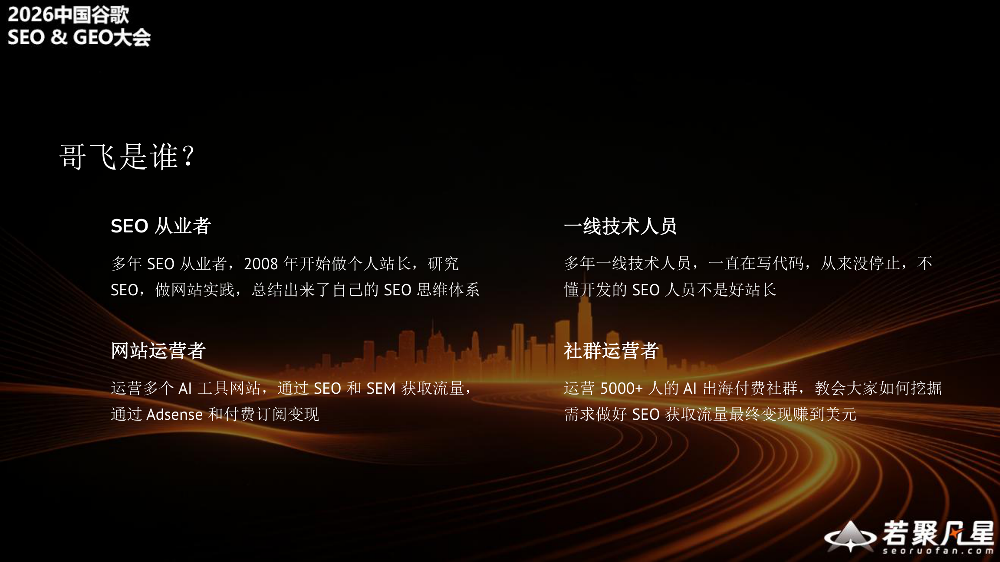

哥飞有四个身份：

- **SEO从业者**：多年SEO从业者，2008年开始做个人站长，研究SEO、做网站实践，总结出来了自己的SEO思维体系
- **一线技术人员**：多年一线技术人员，一直在写代码，从来没有停止。不懂开发的SEO人员不是好站长
- **网站运营者**：运营多个AI工具网站，通过SEO和SEM获取流量，通过Adsense和付费订阅变现
- **社群运营者**：运营5000+人的AI出海付费社群，教会大家如何挖掘需求做好SEO获取流量最终变现赚到钱

### 哥飞的部分网站GSC数据

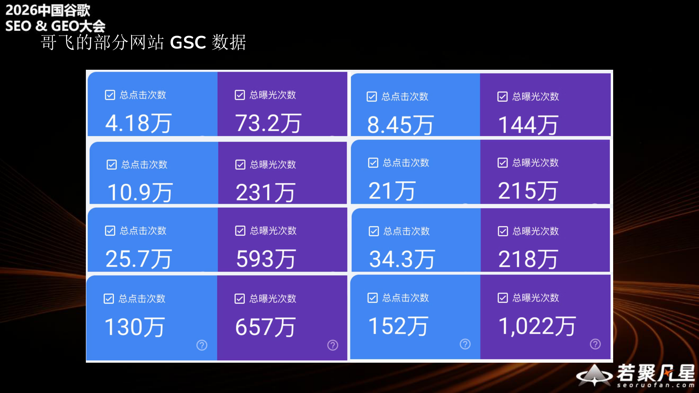

哥飞运营的多个网站在Google Search Console中展现出强劲的数据表现，多个网站实现了数十万级别的点击次数和数百万级别的曝光次数。这些数据充分说明了SEO的威力。

### 哥飞社群成员的部分网站GSC数据

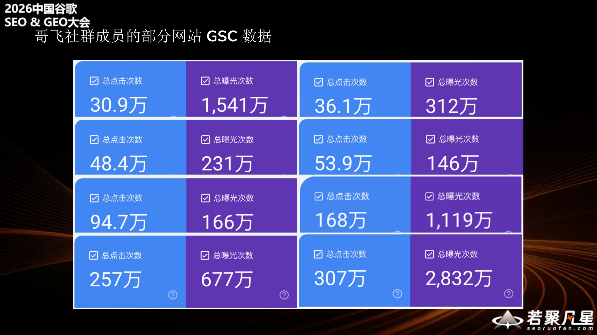

不仅哥飞自己的网站做得好，社群成员的网站同样表现出色。多个社群成员的网站实现了数十万甚至上百万级别的点击量，其中最高的单个网站达到了307万点击次数和2,832万曝光次数。

### 做好SEO到底有什么用？

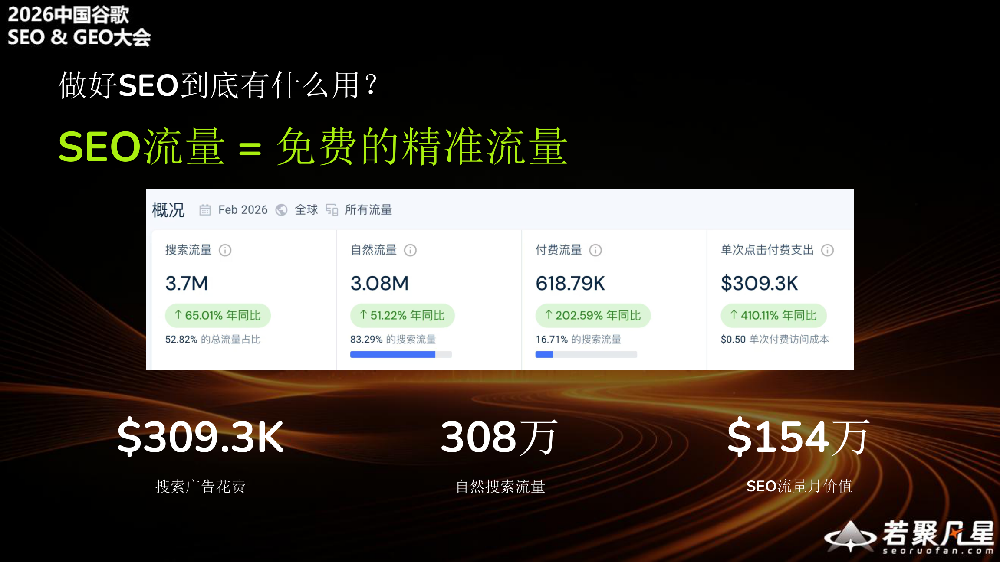

**SEO流量 = 免费的精准流量。**

以哥飞的一个网站为例（2026年2月数据）：
- 搜索流量370万，自然流量308万
- 付费流量61.879万，单次点击付费支出$309.3K
- **如果308万的自然搜索流量全部用广告来买，需要花费约154万美元**

这就是SEO的价值——省下来的广告费就是利润。

---

## 二、为什么要重构SEO思维

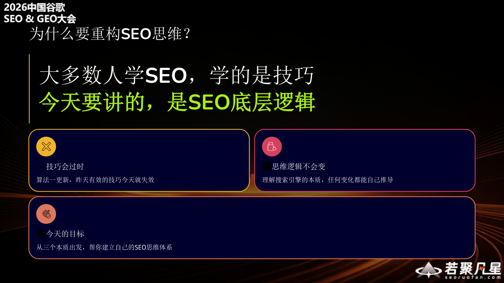

**大多数人学SEO，学的是技巧。今天要讲的，是SEO底层逻辑。**

- **技巧会过时**：算法一更新，昨天有效的技巧今天就失效
- **思维逻辑不会变**：理解搜索引擎的本质，任何变化都能自己推导
- **今天的目标**：从三个本质出发，帮你建立自己的SEO思维体系

---

## 三、理解SEO的三个本质

要理解SEO的思维，就要理解三个本质：**互联网的本质**、**搜索引擎的本质**、**SEO的本质**。

### 1. 互联网的本质

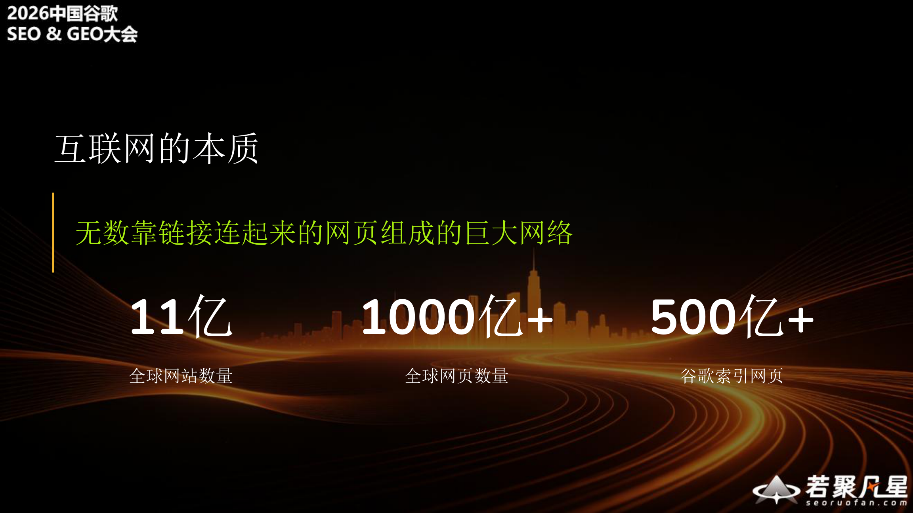

互联网的本质是**无数靠链接连起来的网页组成的巨大网络**。

几个关键数字：
- **11亿**——全球网站数量
- **1000亿+**——全球网页数量
- **500亿+**——谷歌索引网页数量

谷歌即使作为全球最大的搜索引擎，也只索引了全部网页的约一半。这说明互联网的规模远超我们的想象。

### 2. 搜索引擎的本质

搜索引擎的本质是**通过找到并收录尽可能多的网页，来满足各种稀奇古怪的搜索需求**。

**谷歌追求的目标**：
- **最新**：满足时刻出现的全新搜索需求
- **最全**：满足每个用户各种稀奇古怪需求

**全球最大的网页爬虫系统**：为了实现最新和最全，谷歌建立了全球最大的网页爬虫系统。爬虫系统的目标是抓取全网所有优质网页，但网页是否优质，在抓取之前是不知道的，所以需要让爬虫尽可能爬到全网的所有网页。

### 3. SEO的本质

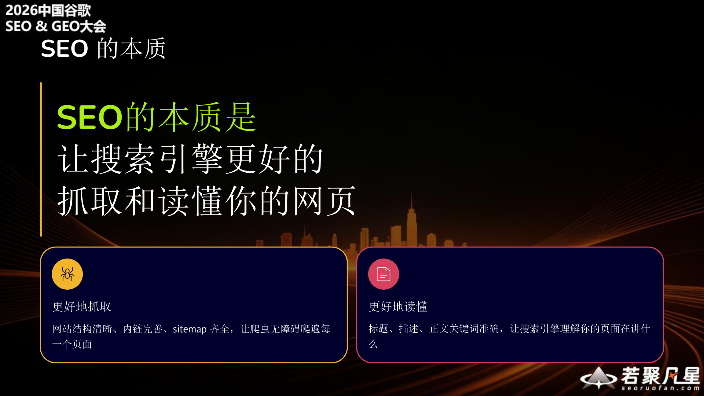

**SEO的本质是让搜索引擎更好地抓取和读懂你的网页。**

这包含两个层面：

- **更好地抓取**：网站结构清晰、内链完善、sitemap齐全，让爬虫无障碍跑遍每一个页面
- **更好地读懂**：标题、描述、正文关键词准确，让搜索引擎理解你的页面在讲什么

---

## 四、站长和搜索引擎的关系——生态互补

站长和搜索引擎是**生态互补关系**，而不是对抗关系。

- **站长需要搜索引擎**：带来长期免费流量
- **搜索引擎需要站长**：生产优质新鲜内容
- **三方共赢**：用户需求得到满足，站长免费得到流量，搜索引擎得到广告收入

**正确理解**：迎合搜索引擎，跟搜索引擎交朋友，而不是对抗。搜索引擎想要什么，我们就做什么网页去供应。

**错误理解**：SEO = 薅搜索引擎羊毛，做好SEO = 作弊、欺骗。

---

## 五、AI来了，SEO已死？

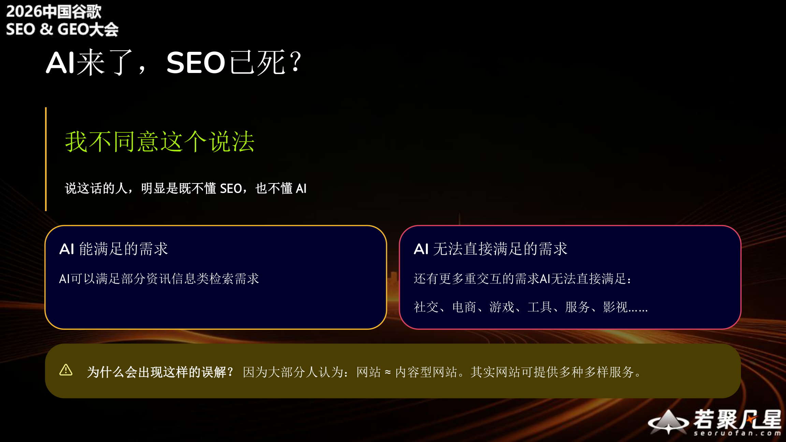

**我不同意这个说法。**

说这话的人，明显是既不懂SEO，也不懂AI。

- **AI能满足的需求**：AI可以满足部分资讯信息类检索需求
- **AI无法直接满足的需求**：还有更多重交互的需求AI无法直接满足——社交、电商、游戏、工具、服务、影视……

**为什么会出现这样的误解？** 因为大部分人认为：网站 = 内容型网站。其实网站可提供各种多样服务。

---

## 六、搜索引擎工作流程

理解搜索引擎的工作流程，对做好SEO至关重要：

1. **爬取**：爬虫发GET请求，获取HTML代码。注意，只是获取，**并不执行JavaScript**
2. **解析**：提取网页主体内容、Meta信息、页面中所有链接
3. **索引**：分词处理→提取网页主题→建立索引
   - 正排索引：某个URL有哪些关键词
   - 倒排索引：某个关键词有哪些网页
4. **排序**：用户输入搜索关键词→分词→从倒排索引找出网页→多因素排序→呈现搜索结果
5. **用户点击**：大部分人只会看第一页，甚至只点前三个结果→**排名即流量**

---

## 七、三个经典问题的解答

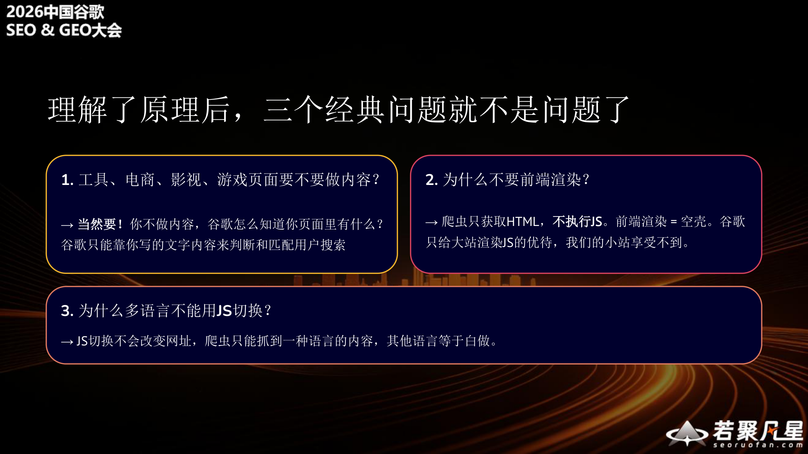

理解了搜索引擎的工作原理后，三个经典问题就迎刃而解了：

### 1. 工具、电商、影视、游戏页面要不要做内容？

→ **当然要！** 你不做内容，谷歌怎么知道你页面里有什么？谷歌只能靠你写的文字内容来判断和匹配用户搜索。

### 2. 为什么不要前端渲染？

→ 爬虫只获取HTML，**不执行JS**。前端渲染 = "空壳"。谷歌只给大站渲染JS的优待，我们的小站享受不到。

### 3. 为什么多语言不能用JS切换？

→ JS切换不会改变URL。爬虫只能抓到一种语言的内容，其他语言等于白做。

---

## 八、做网页的两个目标和三个实战经验

### 两个目标

- **目标一**：被爬虫抓取，进入索引库
- **目标二**：进入搜索结果前两页（前20名）

### 三个实战经验

1. **做好On-Page SEO**：帮助我们的网页进入搜索排名范围内
2. **做好外链**：帮助我们进入谷歌搜索结果排名前10个位置
3. **做好网站用户体验**：决定最终的排名位置

---

## 九、SEO是动态竞争

**每一个关键词的搜索结果都是一个排行榜，你和排行榜上的其他页面在PK。**

四个实践经验：

1. **链接传递权重**：任何链接都能够传递权重，不管是内链还是外链
2. **页面为最小单位**：谷歌的最小排名单位是页面，首页也是一个特殊的页面
3. **竞争力是前提**：任何页面能够到排名的前提条件都是竞争力足够
4. **搜索结果是排行榜**：任何关键词搜索结果都是一个排行榜，页面之间在相互竞争

---

## 十、做好SEO的三件事

**要想通过SEO搞到流量，做好三件事就足够：**

1. **使劲挖需求**：关键词的背后是需求，同一个需求会有不同的关键词说法
2. **不断上页面**：一个关键词主题一个页面，理解需求后为每一个有搜索量的关键词做出SEO友好的页面
3. **持续加外链**：虽说不是有了外链就一定行，但是没有外链大多数时候都拿不到排名

---

## 十一、需求关键词挖掘

### 什么是需求关键词

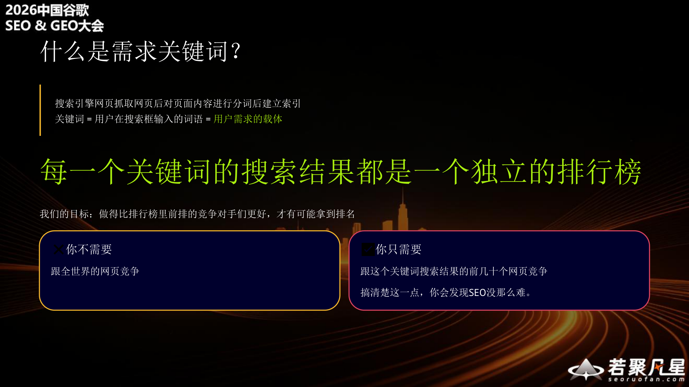

搜索引擎网页抓取网页后对页面内容进行分词后建立索引。**关键词 = 用户在搜索框输入的词语 = 用户需求的载体。**

**每一个关键词的搜索结果都是一个独立的排行榜。**

我们的目标：做到比排行榜里靠前排的竞争对手更好，才有可能拿到排名。

关键认知转变：
- **你不需要**跟全世界的网页竞争
- **你只需要**跟这个关键词搜索结果的前几十个网页竞争

搞清楚这一点，你会发现SEO没那么难。

### 需求关键词怎么挖

**免费工具**：
- 谷歌下拉搜索
- 谷歌相关搜索
- 谷歌关键词规划工具
- 谷歌趋势
- Google Search Console

**收费工具**：
- Ahrefs
- Similarweb
- Semrush

**核心逻辑12字秘诀：词找词、词找站、站找词、站找站**

- **词找词**：从一个关键词出发，找到更多相关关键词
- **词找站**：通过关键词搜索，找到排名靠前的竞争对手网站
- **站找词**：分析竞争对手网站，找到他们排名的所有关键词
- **站找站**：通过一个竞争对手，找到更多类似的竞争对手

这四步循环往复，就能挖掘出海量的需求关键词。

---

## 十二、On Page SEO

**记住大原则：一个页面一个核心关键词。**

### 页面结构要素

- **Title**：迎合需求关键词
- **Description**：吸引用户点击
- **H1**：提供聚焦、瞄准关键词
- **H2~H4**：展开拓展梳理清楚

### 关键数据指标

- 核心关键词密度 **3%~5%**
- 确保每个页面内容 **800个单词以上**

### 内部链接结构

- 页面之间做好内部链接
- 全站树状结构，从主干到枝干到枝叶
- 层级不超过3层

---

## 十三、外链怎么做

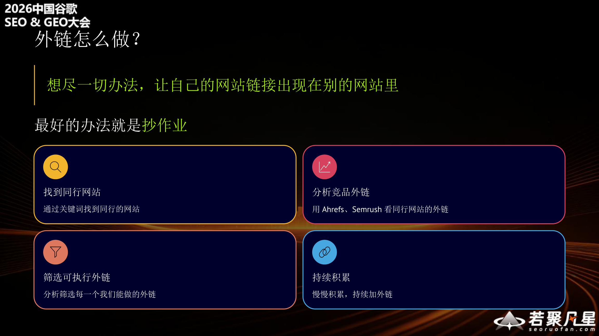

**想尽一切办法，让自己的网站链接出现在别的网站里。**

最好的办法就是"抄作业"：

1. **找到同行网站**：通过关键词找到同行的网站
2. **分析竞品外链**：用Ahrefs、Semrush看同行网站的外链
3. **筛选可执行外链**：分析筛选每一个我们能做的外链
4. **持续积累**：慢慢积累，持续加外链

---

## 十四、SEO + SEM = 最优流量策略

**SEO**：长期复利，流量免费，但是效慢。

**SEM**：立竿见影，花钱就有，但停了就没。

**最佳策略：并行。**

SEM先跑起来验证转化，用户行为数据反哺SEO排名。SEO流量起来后逐步降低广告预算。

> 流量会流向变现效率高的地方 ——杨涛名言
>
> 流量最终会流向阻力小的地方 ——哥飞定律

- **变现效率低** → 推流量过来都推不动 → 难拿到流量
- **变现效率高** → 阻力小 → 流量流转顺畅 → 拿到更多流量

---

## 十五、总结

从搜索引擎底层逻辑出发，我们可以建立起完整的SEO思维体系：

1. **理解三个本质**：互联网是网页的网络，搜索引擎要收录所有网页来满足搜索需求，SEO就是让搜索引擎更好地抓取和读懂你的页面
2. **认清关系**：站长和搜索引擎是生态互补关系，不是对抗关系
3. **掌握工作流程**：爬取→解析→索引→排序→用户点击
4. **做好三件事**：使劲挖需求、不断上页面、持续加外链
5. **SEO+SEM并行**：SEM验证转化，SEO获取长期免费流量

> 技巧会过时，但底层逻辑不会变。理解搜索引擎的本质，任何变化都能自己推导。

---

*演讲者联系方式：*
- *微信号 / Twitter：GeFei55*
- *公众号 / 即刻：哥飞*
- *社群：哥飞的朋友们*
