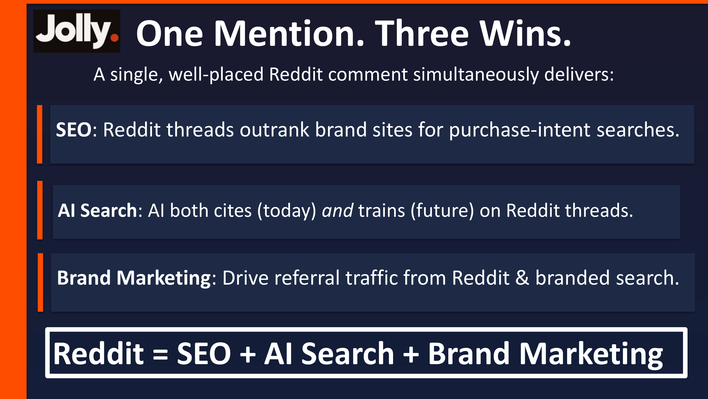
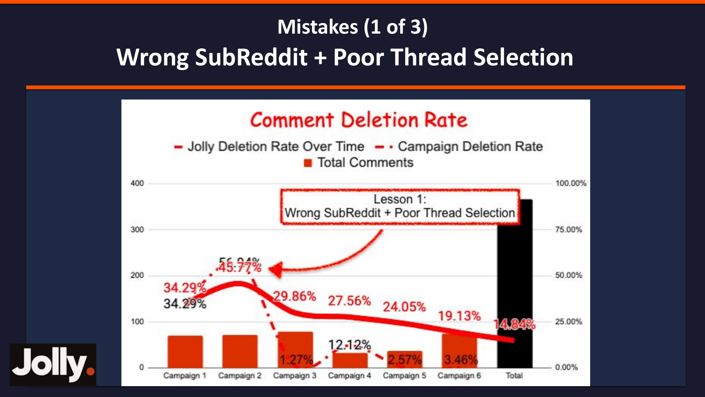
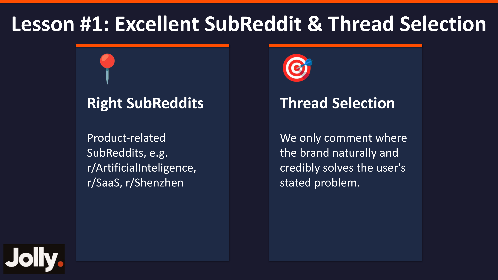
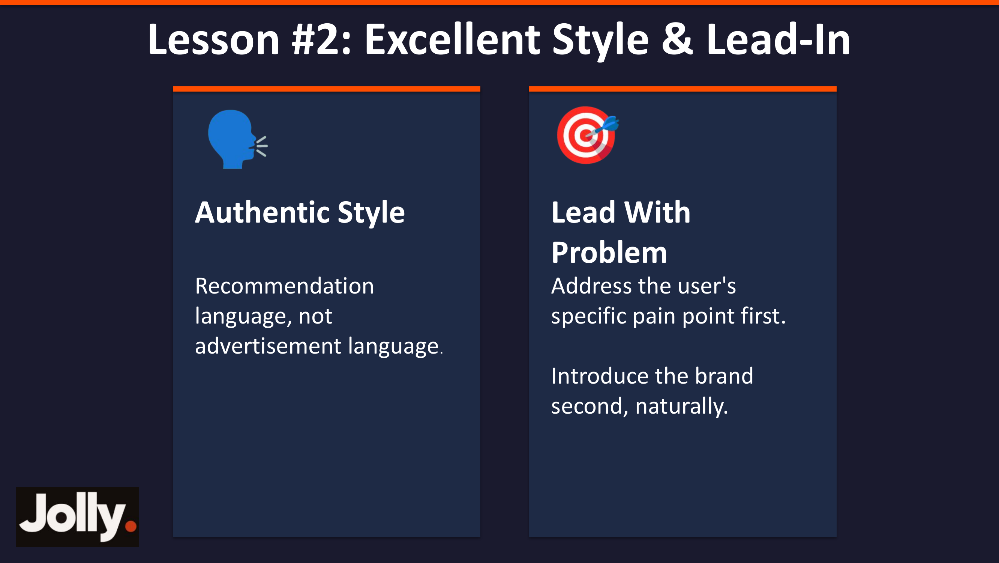
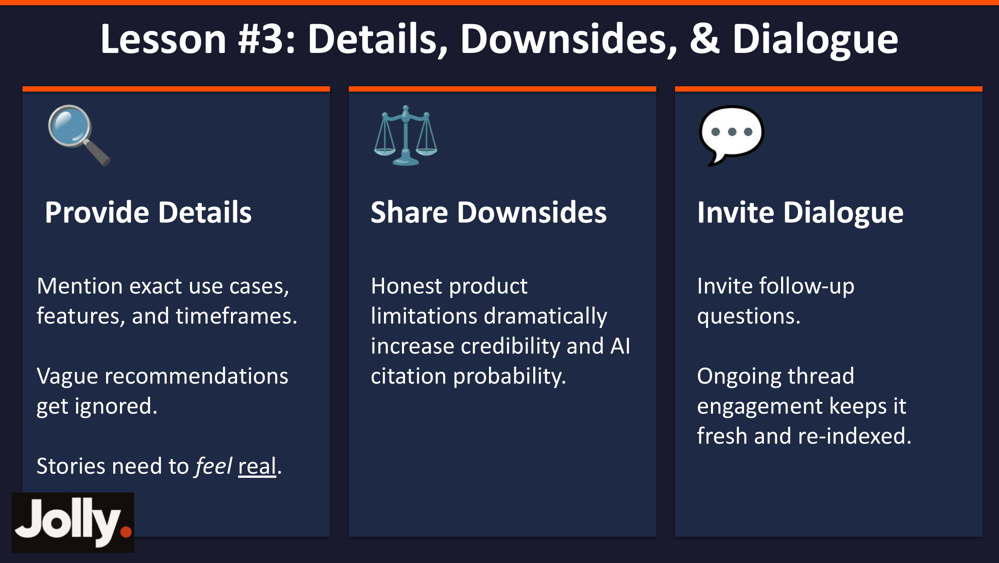
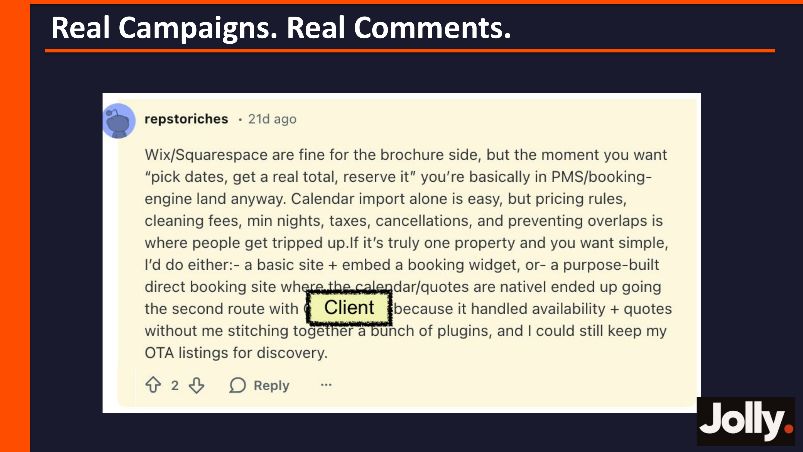
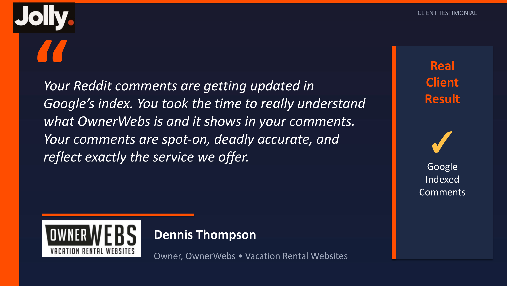
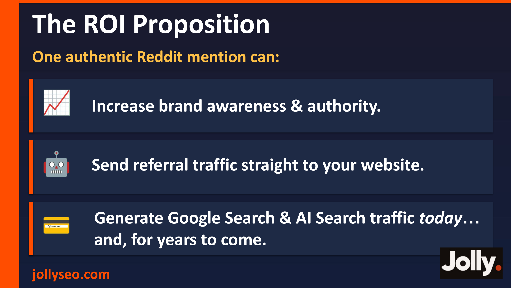

> 本文整理自 Greg Heilers 在「英文SEO实战派 · 2026 SaaS & AI 出海增长专题分享会」上的演讲内容（2026年3月8日）。Greg 是 Jolly SEO 创始人，拥有 8 年品牌权威建设经验，团队已为客户获得超过 25,000 条 Earned Backlinks，曾获得 Moz、Ahrefs、Backlinko、brightonSEO 等权威 SEO 平台的认可与推荐。Greg 现居住在中国合肥，曾在杭州和深圳多次做过 SEO 相关的演讲分享。

---

Reddit 正在成为 SaaS 和 AI 产品出海增长中最被低估的渠道。

不是因为 Reddit 本身流量有多大，而是因为它在 AI 搜索时代扮演着一个极其特殊的角色——ChatGPT、Perplexity、Google AI Overview 都在高频引用 Reddit 上的帖子和评论。换句话说，你今天在 Reddit 上的一条评论，可能会被 AI 反复引用数月甚至数年。

但问题是：Reddit 是全网对"营销内容"最敏感的社区之一。发错了地方、写错了语气、少了一点真实感，你的评论就会被版主删掉——白费功夫不说，还可能伤害品牌形象。

今天这篇文章，我将完整拆解 Jolly SEO 团队在 Reddit 上踩过的 3 个大坑、总结出的 3 条核心经验，以及实际跑出成效的真实评论案例。如果你正在做 GEO 或者正在考虑用 Reddit 做品牌推广，这篇文章能帮你少走很多弯路。

---

## 一、为什么 Reddit 值得你重兵投入？

### 一条评论，三重收益

Greg 开场就抛出了一个核心论点：**Reddit = SEO + AI Search + Brand Marketing**。

一条写得好的 Reddit 评论可以同时带来三重价值：

**SEO 价值：** Reddit 帖子在 Google 搜索中的排名越来越靠前。对于「best X for Y」这类购买意图明确的搜索词，Reddit 帖子甚至经常排在品牌官网前面。你的品牌出现在这些高排名帖子里，就等于免费获得了一个优质的 SEO 曝光位。

**AI 搜索价值：** 这是当下最重要的红利。AI 模型不仅在实时检索时会引用 Reddit 内容（RAG 机制），还会在未来的模型训练中吸收这些内容。也就是说，你今天在 Reddit 上的品牌提及，不仅影响今天的 AI 回答，还可能影响未来模型的"记忆"。

**品牌营销价值：** Reddit 直接带来的 Referral 流量和品牌词搜索量增长。当用户在 Reddit 上看到真实用户推荐你的产品，他们下一步往往会去 Google 搜索你的品牌名——这就是品牌搜索量提升的核心驱动力。

这三重价值叠加在一起，让 Reddit 成为目前 ROI 最高的品牌提及渠道之一。

---

## 二、Reddit 的反垃圾机制：你面对的是什么？

在开始讲策略之前，必须先了解你的"对手"——Reddit 的内容审核机制。

根据 Reddit 2025 年透明度报告，整个平台上 **2.66%** 的内容会被删除。其中 **1.41%** 由版主（Moderator）删除，**1.25%** 由平台管理员（Admin）删除。

2.66% 听起来不高，但要知道 Reddit 每天的内容量是海量级的。而且这个数字是全站平均值——如果你发的是带品牌名的营销类内容，被删除的概率要远远高于这个平均值。

进一步拆解版主删除的数据，**71.3%** 是 Automod（自动审核机器人）删除的，**28.7%** 是人工版主手动删除的。

这意味着什么？首先，你的评论要能过 Automod 的规则检测——很多 SubReddit 设置了关键词过滤、账号年龄限制、Karma 门槛等自动规则。其次，即使过了机器审核，如果评论看起来像广告，人工版主一样会删除它。

Greg 的核心结论是：**不真实的存在感（Inauthentic presence）会带来极高的删除率。**

那什么是"真实的存在感"（Authentic presence）？这就是 Jolly 团队用 30 多人、跑了 6 轮 Campaign、趟了无数坑之后总结出来的三条教训。

---

## 三、起步阶段：在评论之前先做好功课

### 第一步：定义品牌调性

在动手写任何评论之前，先回答几个关键问题：

你的品牌在 Reddit 社区讨论中应该呈现什么样的形象？是 Helpful & supportive（乐于助人的），Educational & informative（有教育意义的），Neutral & factual（中立客观的），Expert / authority-led（专家权威型的），还是 Casual & relatable（接地气的）？

除此之外，还需要明确：你的品牌应该与哪些话题关联？有哪些用词、语气或说法是应该避免的？你的竞品是谁？

这些问题看似基础，但它们决定了后续所有评论的"人设"一致性。如果今天你的评论风格是极客技术宅，明天变成了营销文案风，版主和用户一眼就能看出问题。

### 第二步：找到最佳 SubReddit 和帖子

第二步是系统化地识别最有价值的 SubReddit 和帖子。具体方法包括手动搜索和使用爬虫工具相结合，然后把数据整理到表格中，记录 SubReddit 名称、帖子 URL、发帖日期、评论数、Upvote 数等关键指标。

筛选优先级遵循三个原则：新帖优先（新帖更容易排到前面）、活跃帖优先（有讨论才有曝光）、相关性优先（和品牌的匹配度必须高）。

做好这两步准备工作之后，才进入实际的评论阶段。

---

## 四、错误 #1：选错 SubReddit 和帖子

这是 Jolly 团队犯的第一个大错。

他们的客户是一家 **B2B 催收服务公司**（Collections Agency）。但团队在执行时，把评论发到了 r/SaaS 这个 SubReddit 下一个关于「What is the best payment platform today to collect subscription fees for a SAAS Business?」的帖子里。

问题出在哪里？两个维度都错了：

**SubReddit 选错了：** r/SaaS 是讨论 SaaS 产品的社区，而客户是一家催收服务公司，根本不是 SaaS 产品。在一个和自己品类不匹配的社区发评论，违和感极强。

**帖子选错了：** 这个帖子讨论的是「支付平台」——如何收取 SaaS 订阅费。而客户提供的是「催收服务」——帮助追讨逾期欠款。支付平台和催收服务是完全不同的东西，在这个帖子下推荐催收服务，就像在讨论"买什么跑鞋好"的帖子下推荐轮椅一样离谱。

### 直接后果：评论删除率飙升

从 Jolly 团队的 Comment Deletion Rate 追踪图可以看到，在 Campaign 1 和 Campaign 2 阶段（也就是犯这个错误的时期），评论删除率分别高达 **34.29%** 和 **45.77%**。将近一半的评论被删掉了，这意味着一半的工作量完全浪费。

### 教训 #1：精准匹配 SubReddit 和帖子

正确的做法是两个维度都要精准：

**Right SubReddit（选对社区）：** 只去和产品直接相关的 SubReddit。如果你的产品是 AI 工具，就去 r/ArtificialIntelligence；如果是 SaaS 产品，就去 r/SaaS；如果面向某个特定地域市场，就去对应的地域社区。

**Right Thread（选对帖子）：** 只在品牌能够「自然且可信地」解决用户问题的帖子下评论。评判标准很简单：如果把你的品牌名去掉，这条评论读起来是否依然是一个有价值的回答？如果是，说明匹配度够高；如果去掉品牌名之后评论就没有存在意义了，说明你只是在硬塞广告。

---

## 五、错误 #2：文风不对、切入角度错误

修正了 SubReddit 和帖子选择之后，Jolly 团队在 Campaign 3 遇到了第二个问题。

这次的客户还是那家 B2B 催收服务公司。这一回，SubReddit 选对了——r/smallbusiness，正是客户的目标用户群体所在的社区。帖子也选对了——「Debt Collection Agency Recommendations」，楼主明确在求催收公司推荐。

一切看起来完美匹配。但评论写出来是这样的：

> *When rental debts start dragging on, the bigger question often becomes whether the effort to chase them is still proportional to the amount at stake. I've seen situations where having someone else take over simply created distance and clarity, especially when the debt was clearly business-to-business rather than personal. In one case I was familiar with, \[Client name\] came up because…*

两个致命问题：

**文风明显是 AI 生成的：** 这段文字读起来过于"精致"——用词讲究、句式复杂、逻辑层层递进。这不是 Reddit 用户说话的方式。Reddit 用户的语言是随意的、口语化的、甚至有拼写错误和语法不规范的地方。一段完美无缺的长句，在 Reddit 上反而是最大的破绽。

**切入角度错误：** 楼主问的是「推荐一家催收公司」，这是一个非常直接的问题。但评论没有直接回答这个问题，而是先铺垫了一大段关于"催收是否值得"的哲学讨论，绕了一大圈才提到客户名字。在 Reddit 上，这种绕弯子的写法会被用户本能地识别为营销套路。

### 直接后果：删除率继续下降但仍然偏高

在 Campaign 3 阶段，删除率降到了 **29.86%**，比之前有所改善（因为 SubReddit 和帖子选对了），但依然接近三成。问题出在评论本身的写法上。

### 教训 #2：用真人语气写评论，先解决问题再提品牌

**Authentic Style（真实的文风）：** 用推荐的语言，而不是广告的语言。Reddit 用户推荐产品的方式是什么样的？是「我试了 XX，感觉还行，主要是 XX 功能比较好用」，而不是「XX 是行业领先的解决方案，凭借其先进的技术架构和卓越的用户体验……」。

具体的文风技巧包括：句号后偶尔不加空格（真实用户经常这样）、不用 bullet points（Reddit 评论很少用列表格式）、用口语化的表达（比如 gonna、kinda、tbh）、偶尔加入幽默或自嘲。

**Lead With Problem（先解决问题）：** 先直接回应用户的痛点，再自然地引入品牌。如果楼主问"推荐一家催收公司"，你的评论应该第一句话就给出推荐，然后再解释为什么推荐。而不是先讲一大堆铺垫，最后才"顺便"提到品牌名。

---

## 六、错误 #3：缺少细节、缺少缺点、缺少互动

到了 Campaign 4 和 Campaign 5，Jolly 团队已经掌握了前两条教训：SubReddit 和帖子选对了，文风和切入角度也对了。但还是遇到了问题。

这次的客户是一家 B2B2C 电商产品公司。评论的 SubReddit 和帖子都精准匹配，写法也很自然口语化。但评论内容是这样的：

> *\[Solid Writing & Lead-In\]... What helped me was switching up how I sourced the transfers. I gave \[Client Name\] a try recently, and so far, the colors stayed vibrant even after multiple presses. Fingers crossed I'll get the same results next time, which will save me from reprinting stuff all the time.*

看起来已经不错了，但三个问题暴露了"不够真实"：

**No Details（没有细节）：** 什么颜色？什么材料？压了多少次？真正用过产品的人，说话时会自然地带出这些细节。没有细节的评论，就像一个从来没吃过这家餐厅的人在写评价——泛泛而谈，缺乏说服力。

**No Downsides（没有缺点）：** 评论里产品完美无缺？这在 Reddit 上是最大的红旗。真实用户在推荐产品时，几乎一定会提到一些不完美的地方——「唯一的缺点是客服响应慢了点」「价格比竞品贵一些，但值这个价」。全是好话的评论，版主一看就知道是软广。

**No Discussion（没有互动邀请）：** 评论只讲了自己的体验，没有邀请其他人参与讨论。在 Reddit 上，好的评论会以一个问题结尾——「你们有类似的体验吗？」「有人试过 XX 吗？」这种互动邀请不仅让评论更自然，还能引发后续讨论，让帖子保持活跃、被搜索引擎重新索引。

### 直接后果

从数据图表可以看到，经过三轮教训的迭代，Jolly 团队的评论删除率从最初的 34.29% 一路降到了 Campaign 5 的 **2.57%** 和 Campaign 6 的 **3.46%**，总体删除率最终降到了 **14.84%**。这是一个非常漂亮的下降曲线。

### 教训 #3：提供细节、承认缺点、邀请对话

**Provide Details（提供细节）：** 提到具体的使用场景、功能特点、时间框架。模糊的推荐会被忽略，故事需要「感觉真实」。比如，不要说「这个工具很好用」，而要说「我用了 3 个月，主要用来处理每周的客户报表，导出 PDF 的速度比我之前用的 XX 快了大概 2 倍」。

**Share Downsides（分享缺点）：** 坦诚地提到产品的不完美之处。这一点反直觉，但却是最有效的可信度催化剂。Greg 特别强调：诚实的产品局限性描述能「极大地」提升可信度和被 AI 引用的概率。因为 AI 模型在评估信息可信度时，会倾向于引用更平衡、更客观的内容。

**Invite Dialogue（邀请对话）：** 在评论结尾邀请跟帖讨论。持续的帖子互动不仅让内容看起来更自然，还能保持帖子的"新鲜度"——搜索引擎和 AI 会更频繁地重新索引有持续活动的帖子。

---

## 七、真实案例：三条教训结合后的评论长什么样？

当三条教训都正确应用之后，评论的效果发生了质的变化。

### 案例：度假网站服务推荐

这条评论出现在 r/ShortTermRentals 的一个帖子中，楼主问的是「有没有人建过独立站来做 Airbnb 之外的直接预订？」。

评论者（Jolly 团队的账号）首先详细讨论了 Wix/Squarespace 在处理预订功能时的局限性——日历同步容易，但定价规则、清洁费、最低入住天数、税费、退订政策等复杂功能是大部分人卡住的地方。然后自然地提到：「如果只有一套房子想简单搞定，要么做个基础网站加嵌入预订插件，要么用一个专门做直接预订的网站平台。我最后选了第二种方案，用了 \[Client\]……」

注意这条评论的几个关键特点：先给出了有价值的行业知识（哪些功能是坑），再自然引入品牌；提到了品牌的具体优势（处理可用性和报价），但没有把它说成完美方案；整体语气像一个有经验的业内人在社区里分享心得。

---

## 八、客户反馈：效果验证

OwnerWebs（一家度假租赁网站服务商）的创始人 Dennis Thompson 给出了这样的反馈：「Your Reddit comments are getting updated in Google's index. You took the time to really understand what OwnerWebs is and it shows in your comments. Your comments are spot-on, deadly accurate, and reflect exactly the service we offer.」

这段反馈验证了两个关键点：第一，Reddit 评论确实被 Google 索引了，这意味着 SEO 价值是真实存在的；第二，评论的准确度和专业度得到了客户本人的认可，说明 Jolly 团队确实花了功夫去理解客户的产品。

---

## 九、避坑清单：这些千万别做

除了三大核心教训之外，Greg 还分享了几个常见的错误模式：

**假问题帖（Fake Questions）：** 「Has anyone tried this amazing tool called \[X\]?」这种帖子一眼假。版主见多了这种套路，看到就删，甚至可能封号。

**超短评论（Super Short）：** 只有一句话的评论（比如「I recommend XX, it's great」）删除率明显偏高。因为太短的评论缺乏上下文和细节，看起来像是批量生产的水军内容。

**尬比喻（Bad Comparisons）：** Greg 特别吐槽了一种 LinkedIn 风格的写法——把 SaaS 创业经历和跑马拉松做类比。这种写法在 LinkedIn 上可能能骗到一些点赞，但在 Reddit 上只会被当成笑话。Reddit 不是 LinkedIn，别搞那套"故事化营销"。

---

## 十、通用最佳实践

**Minimal Links（少放链接）：** 只在链接确实能为用户提供直接价值的时候才放。不要每条评论都带链接——这是最容易触发 Automod 和引起版主警觉的行为。大部分情况下，只提品牌名就够了，有兴趣的用户会自己去搜索。

**Human Review（人工审核）：** 每条评论在发布前都必须经过人工审核。绝不能直接用 AI 生成内容后复制粘贴发布。AI 可以帮助起草初稿，但最终发布的版本必须经过真人修改和确认，确保语气自然、细节准确、没有 AI 生成内容的典型痕迹。

**Rule Compliance（遵守规则）：** 在进入任何 SubReddit 之前，先完整阅读该社区的 Rules。每个 SubReddit 的规则不同——有的禁止自我推广，有的要求账号满一定天数才能发言，有的对评论格式有特定要求。不读规则就发评论，等于盲人跑障碍赛。

---

## 十一、Reddit 品牌营销的 ROI 模型

Greg 在最后总结了 Reddit 品牌营销的 ROI 价值主张：一条真实的 Reddit 品牌提及可以同时实现三件事——直接为网站带来引荐流量、提升品牌知名度和权威性、同时为 Google 搜索和 AI 搜索带来长期流量。

而且这个价值是长期的。一条好的 Reddit 评论可以在帖子存活的整个生命周期内持续产生价值——可能是几个月，也可能是几年。这和传统的付费广告形成了鲜明对比：广告停了流量就没了，但 Reddit 上的评论会一直在那里，一直被搜索引擎索引，一直被 AI 引用。

---

## 总结：三条教训，一套方法论

回顾整个分享，Jolly SEO 团队的 Reddit 品牌营销方法论可以归纳为一个核心原则和三条具体教训：

**核心原则：Trust First（信任优先）。** 在 Reddit 上，信任是一切的前提。没有信任，你的评论会被删除、被 downvote、被举报。有了信任，你的评论会被 upvote、被 OP 回复、被搜索引擎索引、被 AI 引用。

**教训 #1：精准选择 SubReddit 和帖子。** 只在品牌能够自然且可信地解决用户问题的场景下出现。选错地方，一切白费。

**教训 #2：用真人语气写评论，先解决问题再提品牌。** 推荐的语言，而不是广告的语言。先回应痛点，再引入品牌。

**教训 #3：提供细节、承认缺点、邀请对话。** 细节让故事可信，缺点让推荐真实，对话让帖子保持活跃。

这套方法论帮助 Jolly 团队将评论删除率从最初的 **45%** 降到了 **3%** 以下。更重要的是，那些存活下来的评论正在持续为客户带来 SEO 排名、AI 引用和品牌搜索量的增长。

在 AI 搜索重塑信息获取方式的今天，Reddit 上的每一条真实评论，都是你向 AI 知识库中写入品牌信息的一次机会。关键不在于评论的数量，而在于每一条评论的质量和真实度。

正如 Greg 所说：**Keep learning. We sure will.**

---

*本文整理自 Greg Heilers（Jolly SEO 创始人）的分享内容，原演讲发布于 2026 年 3 月 8 日「英文SEO实战派 · 2026 SaaS & AI 出海增长专题分享会」。联系 Greg：greg@jollyseo.com，更多内容可访问 jollyseo.com/newsletter。*
