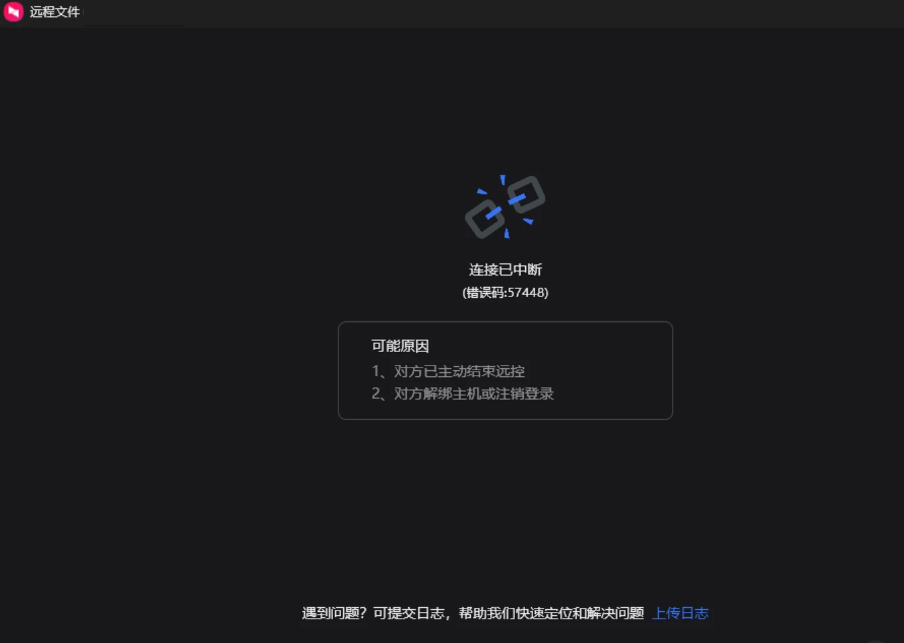
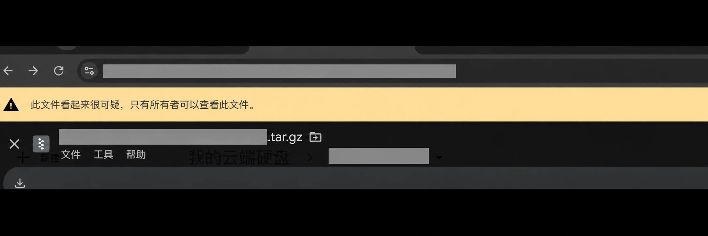

最近在给印尼客户的环境升级系统。本来想着把升级包传过去，再继续部署，没想到先卡在了文件传输这一步。

远程桌面能连上，文件却不一定能顺利传完；文件上传成功，也不代表对方就能下载。这次折腾下来，对这两句话有了切身体会。

## 向日葵：桌面能连，文件传输却中断了

最开始用的是向日葵国际版。远程桌面使用起来没什么问题，但传大文件时，网络一波动，传输就可能失败。

截图里显示“连接已中断”，错误码是 `57448`，界面列出的可能原因包括对方结束远控、解绑主机或注销登录。仅凭这个提示，无法确定具体原因；对我来说，当时最直接的问题是：文件没能顺利传过去。

既然远控里的文件传输不顺，就换网盘试试。

## Google Drive：传上去了，却分享不了

之前在闲鱼花十几块钱买过 Google One，这次就用配套的 Google Drive 上传文件。

部分文件可以正常传输。升级文件里有小的 ZIP 包，也有比较大的镜像压缩包，其中一个接近 900 MB。

但大压缩包又遇到了新的问题：文件被标记，无法正常分享给对方。打开后，页面提示：

> 此文件看起来很可疑，只有所有者可以查看此文件。

这张提示只能说明当时文件的访问受到了限制，不能据此判断一定是文件太大，或者某种压缩格式导致的。对这次交付而言，结果很明确：我这边能看到文件，客户那边却拿不到。

## Wormhole：这次慢一点，但最终传完了

最后试了 ChatGPT 推荐的 [Wormhole](https://wormhole.app/)。

它的用法很直接：选择文件，生成分享链接，再让对方打开链接下载。[官网](https://wormhole.app/)介绍，它支持端到端加密，分享链接会自动过期。

在这次网络环境下，我感觉 Wormhole 比 Google Drive 慢一些。不过，最后文件确实成功传过去了，后续升级也终于可以继续。

截图记录的是传输中的状态，进度为 30%；最终传输成功是这次实际使用的结果。

## 给远程交付多留一个选择

这次没有做严格测速，也没有逐项对比各个工具的功能，只是想把文件顺利送到客户手里。

我的体会是：远程桌面、网盘和临时文件分享，可以各自准备一个选择。某条路走不通时，换个工具，有时比一直重试更省时间。

如果你也遇到远程传大文件反复中断，或者网盘上传后对方无法获取的问题，可以把 [Wormhole](https://wormhole.app/)放进备选工具列表。这次它帮我解决了问题，至于速度和稳定性，还是要看双方当时的网络环境。

*文中截图已遮挡项目文件名和分享地址。*
