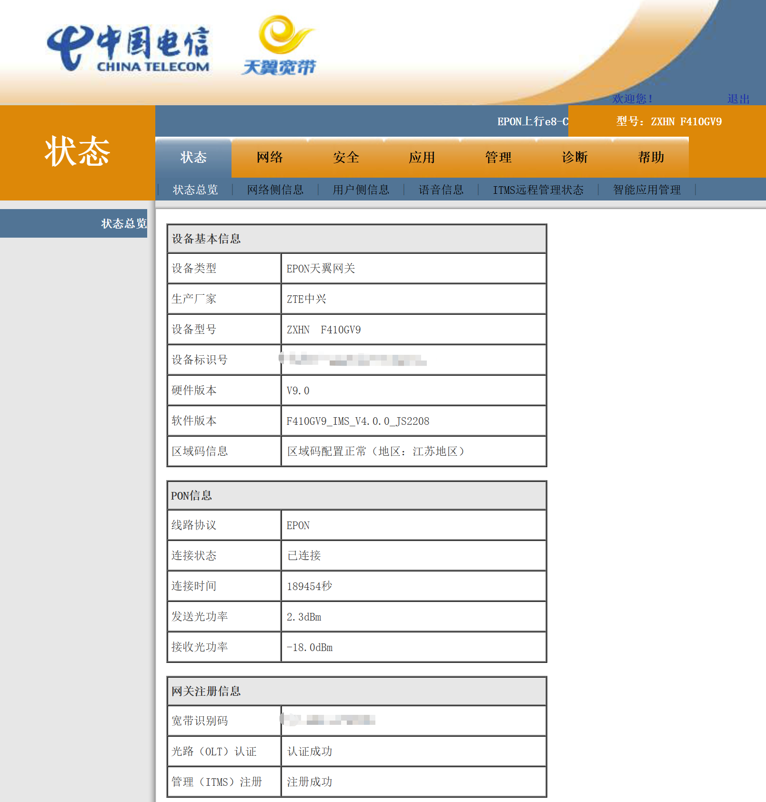
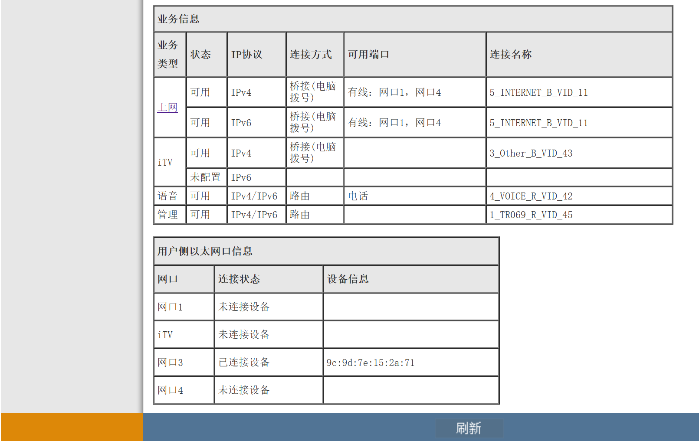
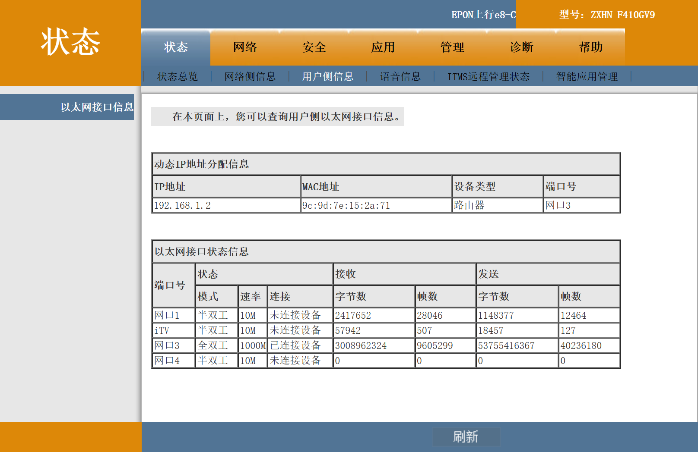
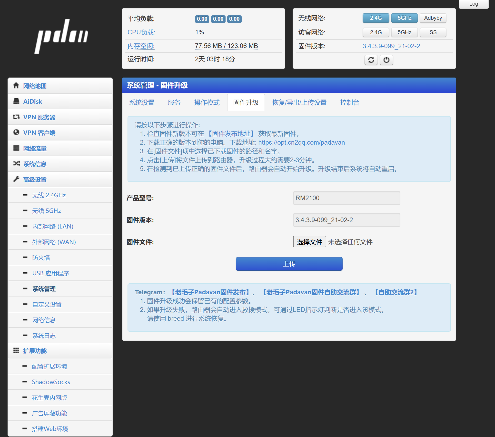
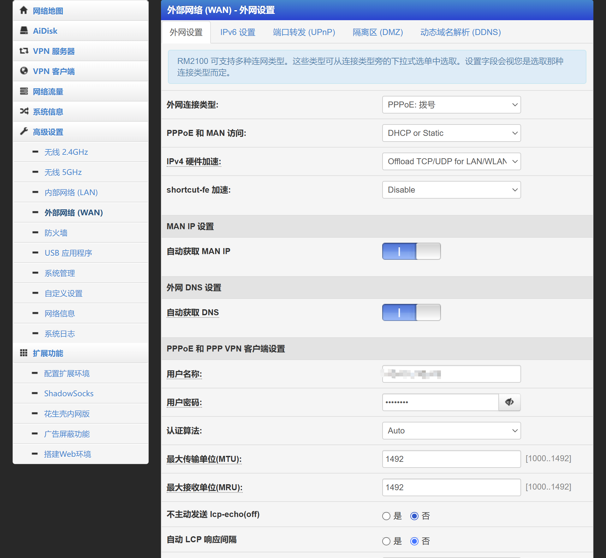
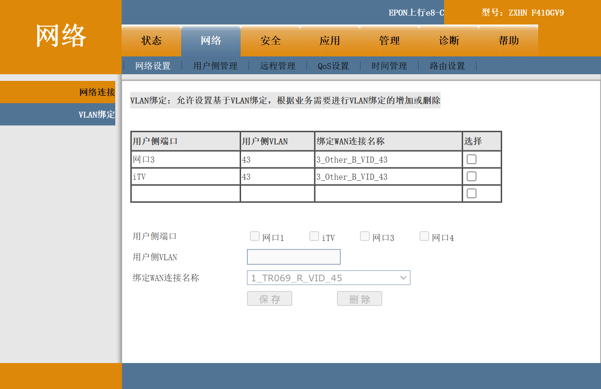
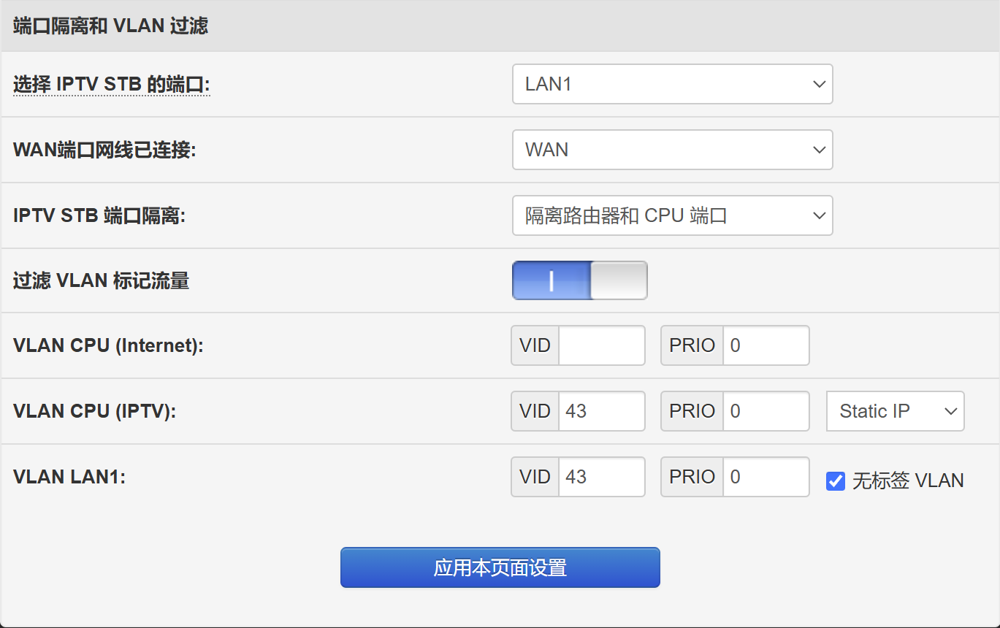
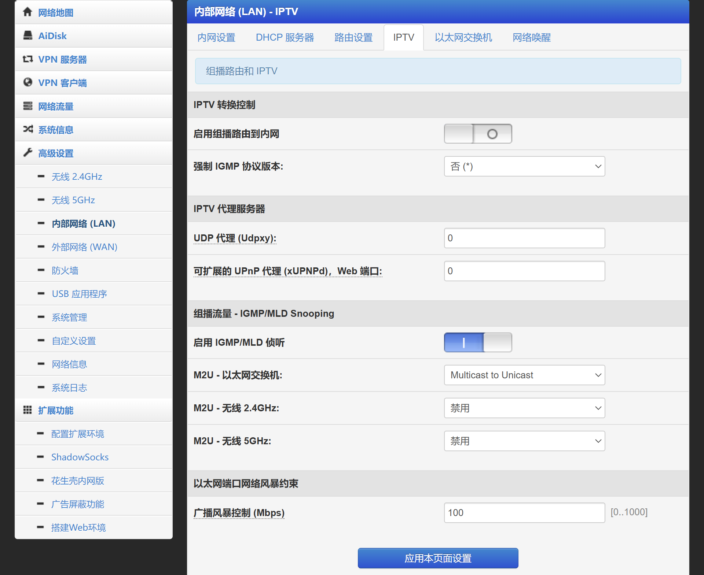

> 最近用 Apple TV 的时候感觉卡顿严重（无线连接），便想着修改下网络。由于客厅电视机下只有一个网口，要同时给 IPTV 和 Apple TV 同时使用，只能考虑将光猫改成桥接模式。

### 一、路由模式改成桥接模式

#### 1.1 光猫设置

家里的宽带是电信的，500MB 下行带宽。跟宽带师傅要了超级管理员的密码，在浏览器输入 192.168.1.1，输入帐号和密码，就能进入如下界面：

光猫默认是路由模式，即是由光猫完成拨号上网的。

在网络设置里，选择上网的连接，将连接模式改为桥接，同时勾选 iTV 选项，方便下一步进行 iTV 设置。

设置成功后，光猫上可以看到连接方式已改为桥接。

我使用的是网口 3，如图所示：

#### 1.2 路由器设置

我使用的路由器是 Redmi AC2100，同时刷了老毛子固件，在浏览器输入 192.168.123.1，输入帐号和密码，进入如下界面：

在 高级设置 -> 外部网络 -> 外部设置里，将外网连接类型改为 PPPoE 拨号，在下方输入宽带帐号和密码即可。

### 二、IPTV 设置

#### 2.1 光猫设置

绑定 VLAN

从网络连接这里可以看到，IPTV 的 VlanId 是 43。

由于上一步操作我用的是网口 3，所以这里绑定 IPTV 还是网口 3。

#### 2.2 路由器设置

外部网络设置，我这里用的是 LAN1，即第一个网口，同时在 VLAN CPU 和 VLAN LAN1 绑定 VLAN ID 43。

内部网络设置，转到 IPTV 设置，在组播流量中启用 IGMP/MLD 侦听，M2U – 以太网交换机选择 Multicast to Unicast。

