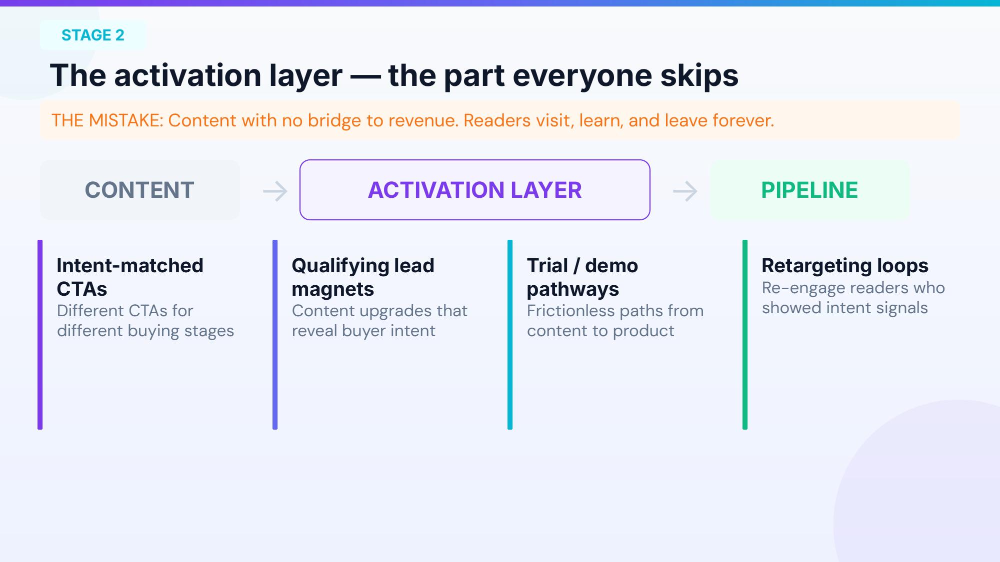
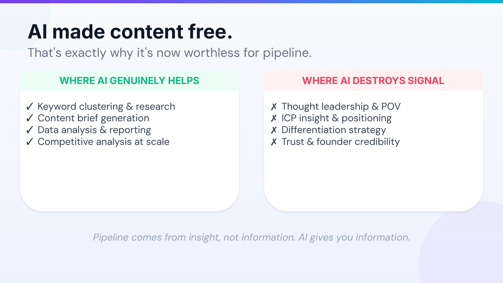

*基于Daniel Johnson演讲整理 | We Scale Startups*

---

> 去年你发布的内容比前年多吗？你的管线也跟着增长了吗？如果答案是否定的，你并不孤单。

在SaaS增长领域，有一个令人不安的真相正在被越来越多的团队验证：更多的内容并不等于更多的管线（pipeline）。许多公司投入了大量资源做内容营销，博客文章越写越多，社交媒体越发越频繁，SEO关键词覆盖面越来越广，但销售管线却纹丝不动。问题出在哪里？

这不是个别现象。在一场面向SaaS创始人和增长负责人的分享中，Daniel Johnson提出了一个尖锐的问题：你们当中有多少人去年发布了比前年更多的内容？几乎所有人举手了。然后他追问：你们的管线也跟着增长了吗？大部分人的手放了下来。这个简单的互动揭示了一个行业性的盲区。

Daniel Johnson是We Scale Startups的创始人，同时担任多家AI和B2B SaaS公司的Fractional CMO。他曾帮助超过70家初创公司——从种子轮到B轮——建立系统化的增长体系。在他看来，绝大多数SaaS团队面临的并非流量问题，而是**系统问题**。他提出了一套"与营收对齐的增长引擎"框架，核心只有四个步骤，简单到可以画在一张餐巾纸上，但足以从根本上改变内容营销的ROI。

---

## 一、为什么你的内容营销不产生管线？

先来做一个思想实验。假设你的公司是一家CRM SaaS，你的内容团队花了大量时间优化一篇关于"best CRM software"的文章。这个关键词月搜索量高达4万，看起来是一个巨大的流量机会。但实际上，搜索这个词的人大多处于信息浏览阶段，竞争极其激烈，而且他们离购买决策还很远——这些流量几乎不可能转化为管线。

再看另一个场景：你的团队围绕"CRM for 50-person sales teams migrating from Salesforce"创建了一篇深度内容。月搜索量只有800，但搜索这个词的人正处于购买决策阶段，竞争很低，而且他们的需求与你的产品高度匹配——这些流量直接推动管线。

这就是**关键词优先**与**ICP（理想客户画像）优先**的本质区别。绝大多数团队犯的第一个错误，就是从关键词搜索量出发做内容规划，而不是从买家出发。他们追逐的是虚荣流量（vanity traffic），而不是能转化为营收的精准流量。

Johnson反复强调：你的ICP定义越精确，你的竞争优势就越大。这对于那些从中国出发面向美国和欧洲市场的SaaS公司来说尤其如此——在全球化竞争中，ICP的精准度就是你最大的差异化武器。

---

## 二、四阶段增长引擎：从流量到营收的系统

Johnson提出的"与营收对齐的增长引擎"由四个紧密相连的阶段组成，每一个阶段都不可或缺。

### 阶段一：ICP定义——从买家出发

这是整个系统的地基。如果你不能用一句话清晰地定义你的理想客户画像，那你的内容策略从一开始就建在了沙滩上。ICP定义不是一个宽泛的行业标签（如"中型企业"或"科技公司"），而是要具体到可以画出一个真实人物的程度：他们在什么规模的公司，担任什么角色，面临什么具体痛点，正在考虑从什么解决方案迁移。

只有当ICP足够精确，你才能做出正确的内容决策——写什么、不写什么、在哪里分发、用什么语气。ICP是过滤器，不是扩音器。

### 阶段二：意图匹配内容——为购买旅程而写

定义了ICP之后，下一步不是"尽可能多地生产内容"，而是围绕ICP的购买意图来规划内容。什么是购买意图？简单说，就是搜索者是在"了解问题"还是"寻找解决方案"，是在"比较选项"还是在"准备下单"。

高意图内容的特征是：它回答的问题直接关联到购买决策。比如"如何从Salesforce迁移到[你的产品]"就是典型的高意图内容，而"什么是CRM"则是低意图的信息类内容。两者都有价值，但如果你的目标是管线增长，资源应该优先投入前者。

一个残酷的事实是：许多团队发布了大量内容，但其中90%可能都不关联任何商业意图。读者来了、学到了、离开了——永远不会成为你的客户。

### 阶段三：激活层——大多数团队跳过的关键环节

这是Johnson框架中最被忽视的部分。**激活层（Activation Layer）** 是内容和管线之间的桥梁。没有这座桥，再好的内容也只是在为别人做嫁衣。

激活层包含四个核心要素。第一是意图匹配的CTA：不同购买阶段的读者需要不同的行动号召，早期阶段可能是下载白皮书，中期是参加线上研讨会，后期是预约演示。一刀切的CTA会严重损害转化率。第二是可筛选意向的内容升级：比如提供一个"迁移成本计算器"作为内容升级，下载它的人很可能正在认真考虑切换产品——这就自动筛选出了高意向线索。

第三是无摩擦的试用和演示路径：从内容到产品体验之间不应该有任何不必要的障碍，每一步都应该是自然且顺畅的。第四是再营销循环：对那些展现过意向信号但没有立即转化的读者进行持续触达，保持品牌在他们心智中的存在感。

激活层的存在意味着你不再是"发布内容然后祈祷"，而是为每一篇内容设计了一条通往管线的明确路径。

### 阶段四：收入反馈循环——让系统自我进化

最后一个阶段解决的是一个普遍存在的组织问题：营销和销售团队各看各的数据，互不通气。这种脱节直接导致内容策略与实际销售需求脱轨。

闭环反馈有三个维度。第一，销售数据驱动内容优先级：销售团队每天面对客户，他们知道客户最常提出什么异议、最关心什么问题。这些来自前线的信息就是你的内容日历。第二，转化数据优化ICP定位：哪些内容带来了演示预约？哪些线索最终成交了？答案会帮你不断校准ICP定义和内容策略。第三，客户洞察催生新内容：每一次赢单和丢单都包含着宝贵的信息——为什么他们选择了你，或者没有选择你。这些真实的买家信号才是最好的内容素材。

Johnson说得很直白：**这就是把零散的战术变成一个完整系统的关键。** 没有反馈循环，你的增长引擎就像一辆没有方向盘的车——可能在动，但不知道往哪里去。

---

## 三、AI的角色：辩证地看待这把双刃剑

AI让内容生产的边际成本趋近于零，这听起来是好事，但Johnson指出了一个深刻的悖论：**正因为AI让内容变得免费，内容对管线的价值也归零了。**

AI擅长的领域主要在执行层面：关键词聚类与研究、内容简报生成、数据分析与报告、竞品分析等。这些是AI可以大幅提升效率的地方，团队应该积极利用。

但AI在以下领域会摧毁你的信号：思想领导力和独特观点、ICP洞察与定位策略、差异化战略、创始人信任度和品牌可信度。这些恰恰是驱动管线增长的核心要素。当你的竞争对手也在用同样的AI工具生成同样的内容时，区分度趋近于零。你的潜在客户看到的是一片千篇一律的内容海洋，没有任何一篇能让他们觉得"这个公司真的懂我的问题"。

> 管线来自洞察（insight），不是信息（information）。AI能给你信息，但洞察必须来自对客户的深度理解和独特的行业视角。

换句话说，AI是增长引擎的燃料添加剂，但不是引擎本身。如果你用AI来替代思考和洞察，你得到的只是更多的噪音，而不是更多的管线。

---

## 四、真实案例：数据说话

### 案例一：B2B SaaS，40人团队，$2M ARR

这家面向美国中型市场的公司，改造前月均有8万次有机访问，但内容带来的管线为零——流量很大，转化为零。他们做了什么？首先重新定义了ICP，从泛泛的"中型企业"收窄到了具体的行业、规模和痛点。然后将所有内容重新按商业意图分级，砍掉了大量只引来信息浏览者的文章。接着为剩余的高意图内容构建了完整的激活层，最后打通了营销和销售之间的数据反馈。实施6个月后，有机访问降至3.2万次（减少了60%），但内容驱动的管线价值达到了84万美元。

流量砍掉了六成，管线却从零飙升到84万美元。这完美诠释了"正确的流量比更多的流量重要一万倍"这个道理。很多创始人看到流量下降会恐慌，但这恰恰说明你之前吸引来的大部分流量都是无效的——淘汰它们是好事。

### 案例二：AI SaaS，12人团队，Pre-A轮

这家面向欧洲企业市场的AI SaaS公司，改造前发布了200篇博客文章，但只带来了3个演示预约——平均每67篇文章才产生一个演示，效率惊人地低。4个月后，他们砍掉了90%的内容，只保留并重建了18个围绕ICP购买意图的精准页面，每个页面都配置了演示CTA。结果：演示预约从3个飙升到41个，提高了将近13倍。

这个案例给出了一个反直觉的启示：有时候"少即是多"不是一句鸡汤，而是一个可验证的增长策略。

---

## 五、自诊：你的增长引擎健康吗？

Johnson提供了一个简洁的5分制诊断工具。给自己打分，每个"是"得1分：

第一，你能用一句话定义你的ICP吗？第二，你的头部内容是否瞄准了商业意图而非单纯追求流量？第三，从内容到激活（如演示预约、试用注册）之间是否有清晰的路径？第四，销售团队的反馈是否在驱动你的内容日历？第五，你能衡量从内容到管线的转化（而不只是流量数据）吗？

如果你的得分在2分或以下，**你有的只是战术，而非系统。** 别担心，这是大多数团队的起点——重要的是意识到差距并开始行动。

这个诊断工具的价值不在于分数本身，而在于它帮你快速定位系统中最薄弱的环节。得分低的维度就是你最应该优先修复的地方。不要试图同时改善所有五个维度，选择一个最能产生杠杆效应的点，集中资源突破。

---

## 六、三个关键转变

Johnson总结了从"有战术"到"有系统"之间的三个关键心态转变。

**转变一：从优化流量到优化ICP意图。** 不再追问"怎么获得更多流量"，而是追问"怎么获得更多对的流量"。指标从页面浏览量切换到管线贡献值。

**转变二：从无桥梁的内容到构建激活中间层。** 每一篇内容都必须有一条通往产品的路径，否则它就只是一篇文章，而非一个增长资产。

**转变三：从各自为战的实验到闭环反馈系统。** 营销和销售不再是两个独立运作的部门，而是一个共享数据、互相喂养的有机体。当这个反馈循环运转起来，你的增长系统就具备了自我学习和自我优化的能力——它会随着时间推移变得越来越精准。

---

## 七、常见异议与回应

**"我们的流量还不够大，不能挑剔。"** ——你不需要更多流量，你需要对的流量。500个ICP访客胜过5万个随机访客。与其在红海中争抢注意力，不如在蓝海中精准捕获。

**"我们的销售团队不愿意配合营销。"** ——从小处开始。每月一次30分钟的同步会，让销售分享他们听到的客户异议和问题。当他们看到这些信息变成了真正有用的内容、带来了更好的线索时，信任自然建立。

**"我们试过内容营销了，没用。"** ——你试过的可能只是内容生产（content production），而非内容系统（content system）。区别在于：系统把内容连接到管线，而单纯的生产只是把文字放到互联网上。

---

## 八、周一早上就能做的三件事

最后，Johnson给出了三个具体的、下周一回到办公室就能执行的行动。

**行动一：审计你的前10个页面。** 按商业意图而非流量重新排序。那些吸引了错误受众的页面？果断砍掉或重定向。你要的不是流量最大的页面，而是管线贡献最大的页面。

**行动二：为你最高意图的内容添加一条激活路径。** 选出一篇最接近购买决策的文章，添加一个具体的、与内容语境相关的CTA。不是通用的"联系我们"，而是"预约15分钟迁移咨询"之类的精准行动号召。

**行动三：建立每月反馈同步会。** 30分钟，销售告诉营销他们听到了哪些异议和问题。就这么简单。这一步的ROI可能超过你花在任何营销工具上的投入。

---

## 写在最后

这套框架的美妙之处在于它的普适性——不管你是12人的Pre-A团队还是百人规模的B轮公司，不管你面向的是中小企业还是企业级客户，底层逻辑都是一样的：从ICP出发、匹配购买意图、建立激活桥梁、闭环反馈迭代。

这个系统唯一的前提条件，不是预算、不是团队规模、不是流量基数，而是对ICP的清晰认知。如果你现在对自己的理想客户画像还说不清楚，那就从这里开始。和你的销售团队坐下来，聊一聊过去半年成交的客户都是什么样的人、来自什么样的公司、面临什么具体的痛点。这些信息就是你整个增长系统的起点。

在AI让内容变得廉价的今天，真正稀缺的不是内容本身，而是将内容转化为营收的系统能力。你的竞争对手可以用AI生产和你一样多的文章，但他们复制不了你对客户的深度洞察，也复制不了一个运转良好的增长引擎。内容的战场已经从数量转向了质量和系统性。

> 你不是缺流量，你缺的是系统。好消息是，系统可以搭建。从这个周一开始。
