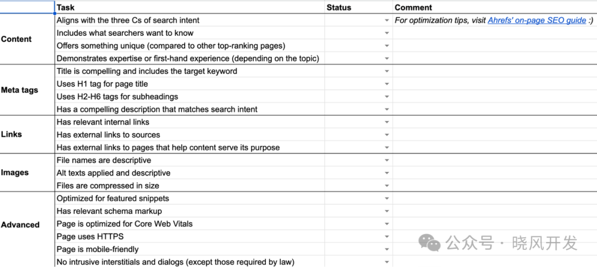

## 页面SEO优化基础

### 什么是页面优化

页面优化（或站内优化）是指在页面上进行的一切操作，为了提高其排名。它的重点是帮助谷歌和搜索者更好地理解和消化内容。

### 为什么页面优化很重要

Google 会检查页面的内容，以确定它是否是相关的搜索结果。如果 Google 认为你的内容比竞争对手的内容不相关，他们会把你的排名降低。

## 如何进行页面优化

### 页面SEO清单预览

### 与搜索意图对齐

搜索意图是用户进行搜索的原因。了解搜索意图可以帮助你知道用户想要找什么，以及你需要在内容中提供什么。

### 全面涵盖你的主题

如果你的内容涵盖了相关的子主题，那么它更有可能符合搜索者的期望。此外，它还可以排名更多相关的关键词，从而获得更多的流量。
一个寻找线索的好地方是排名靠前的页面。你可以手动查找它们之间的共同点，比如标题、常见问题、视觉辅助以及对主题的深入探讨程度等等。

### 让你的内容独一无二

如果你想要在排名中取得成功，就不能仅仅只是重复其他页面的内容，你需要为搜索引擎结果页面带来新的东西。
这样可以增加吸引链接的机会，进而帮助你的页面提升排名。
要做到这一点，你需要发挥创造力，因为"独特性"取决于搜索引擎结果页面上已有的内容。可以考虑以下方向：

- 原始研究 — 新的知识、洞察或发现。例如，与公司客户进行的行业调查。
- 对一个话题的独特观点或看法 — 新鲜的视角，挑战传统思维，强烈的观点。例如，来自行业资深专家的 SEO 技巧。
- 解决一个特定问题或实现某事的更快或更简单的方法 — 例如，在 30 岁之前变得富有的技巧。
- 一个有用的、免费的资源 — 例如，模板、备忘单等等。

### 使用H1-H6标签创建视觉层次结构

标题标签（H1、H2 等）不仅有助于 Google 理解你网页上的内容，还可以帮助读者理解内容并提高可读性。
在使用 H1 标签时，最佳实践是每个页面只使用一个，并且与页面标题相匹配。
至于 H2 到 H6 标签，只需将它们用于内容的副标题即可。

### 写一个引人注目的标题标签

标题标签通常是决定点击哪个结果的主要信息，因此你需要让它们具有吸引力。以下是一些建议：

- 保持简短 — 不超过 70 个字符最好，以避免截断。
- 匹配搜索意图 — 告诉搜索者你拥有他们想要的。
- 要有描述性 — 不要含糊或泛泛而谈。
- 不要使用点击诱饵标题 — 确保它们与你的内容一致。
- 包括关键词 — 如果更合理，可以使用近似变体。
- 包括年份 — 适用于需要新鲜度的话题。

请在每个可索引的页面上设置标题标签。

### 撰写一个引人注目的元描述

元描述并非 Google 的排名因素，但可以带来更多的点击量和流量。这是因为 Google 经常将它们用作搜索结果中的描述性片段。以下是撰写元描述的几个提示：

- 保持简短 — 不超过 160 个字符最好，以避免截断。
- 扩展标题标签 — 包括你无法在其中放置的独特卖点。
- 匹配搜索意图 — 加倍关注搜索者想要的内容。
- 使用主动语态 — 直接与搜索者对话。
- 包括你的关键字 — 在搜索结果中，Google 通常会将关键词加粗显示。

### 设置用户友好的URL

Google 建议在页面 URL 中使用与内容相关的词语，通常最简单的方法是将目标关键词设置在 URL 的 slug 部分。
如果 URL 结构中已经包含了一些目标关键词的单词，你可以缩短 slug。

### 优化你的图片

页面中的图片可以在Google图片搜索中排名，并为你带来更多的流量。
图像优化基本上涉及以下三项任务。

- 使用描述性的文件名：Google 表示，文件名可以为其提供有关图像主题的线索。命名提示：详细描述、简洁明了、不要堆砌关键词、使用破折号将单词连接起来。
- 使用描述性的替代文本：Google 也使用 alt 文本（替代文本）来理解图像的主题。这是一个用于描述图像的 HTML 属性。替代文本的主要目的是为了提高使用屏幕阅读器的访客的可访问性。最佳建议：详细描述、简洁明了、不要堆砌关键词、不要说它是一张图片。
- 压缩图片：压缩图像可以减小文件大小，从而提高加载速度。有许多工具可以实现这一功能，其中 ShortPixel 是一个很好的选择。

### 添加内部链接

内部链接是指来自网站其他页面的链接。它们有助于 Google 了解页面的主题，并提升其权威性，从而可能带来更高的排名。
考虑到添加内部链接只需要一秒钟，这是一种简单且快速的页面优化方法。

### 使用外部链接

Google 表示，链接到其他网站是为用户提供价值的好方法。因此，在合适的情况下，请不要害怕这样做。只需要小心，不要链接到质量低劣或垃圾信息的网站。
在链接到外部网站时，请记住以下几点：

- 引用并链接到它们的来源
- 读者可能会发现有用的资源链接
- 请使用 nofollow 或 sponsored 标记任何赞助或付费链接

## 展示在该主题上的经验或专业知识

Google 更重视来自专家或拥有第一手/亲身经历的人的内容，哪个因素对 Google 更重要取决于主题。
以下是 Google 建议展示专业知识的几种方式。你应该：

- 展示你对主题的了解。根据你的专业知识，演示如何解决问题或实现目标。
- 提供清晰的信息来源（并链接到它们）。
- 引用专家观点以增加内容的可信度。
- 提供关于作者的背景信息，例如链接到一个"作者"页面。不要隐藏自己的资质。
- 确保内容没有容易核实的事实错误。

当涉及到可能需要第一手或亲身经历的话题时，Google 建议你：

- 请说明你是如何创作内容的。例如，提供一些关于产品评审过程的过程见解。
- 提供相关工作的证据，包括图片或视频。
- 提供作者的背景信息 — 就像专业知识一样。

## 高级页面优化技巧

### 优化特色片段

### 使用模式标记获取富媒体片段

### 优化页面体验

为了对页面进行排名，Google 还将考虑一系列的"页面体验信号"，这些信号包括但不限于：

- Core Web Vitals (CWV)（换句话说，页面是否足够快速和稳定）。
- 安全性（页面是否通过 HTTPS 连接）。
- 移动友好性（Google 使用你网页的移动版本进行索引和排名）。
- 避免冗长的插页广告和对话框。

页面体验信号通常是针对整个网站进行改进，而不是逐个页面进行改进。但是，你也需要确保所有新的页面设计都经过了优化。
安全问题和插页广告是最容易解决的：获取 SSL/TSL 证书并关闭可能会让用户感到烦恼的弹窗。而 CWV 和移动友好性可能需要更多时间来解决。

### 监控并更新内容

页面优化是一项可以重复进行的工作，如果你对自己在 Google 的排名不满意，可以通过改进和重新发布内容来提升排名。

原文链接：https://ahrefs.com/blog/zh/on-page-seo/
