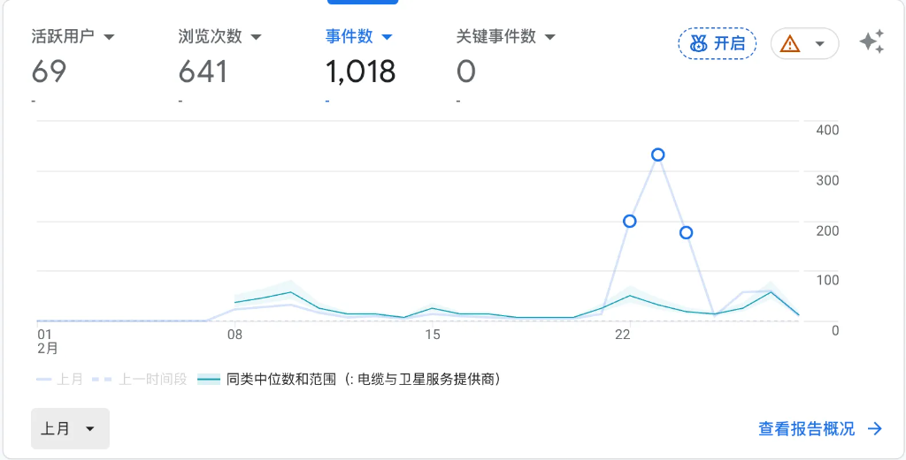
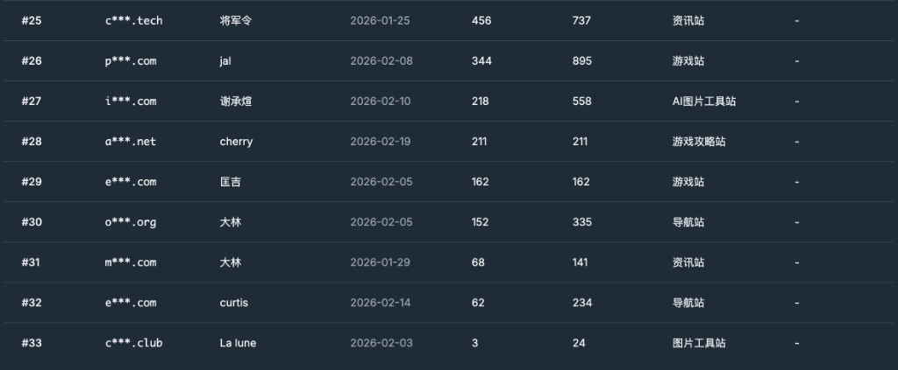

做事情需要正反馈，有了正反馈，能够更好地坚持下去。

## 迟到的二月报名

前几天哥飞2月新词比赛，我应该报名的，可是我老是觉得自己没做好，就从来没报过月度的比赛。去年度的比赛是因为哥飞说只要有流量就给66块我才报名的。

我是3月7号上午想起来要报名的，但是恰好过了二月的比赛时间。

---

## 二月做了什么

我做的网站是一个比较冷门的知识库类型网站，根本没有什么搜索量。

而且我到现在也一个外链没发，每天只是让 ChatGPT 和 Claude Code 来生成3篇 SEO 文章，没想到也有了一些活跃用户和浏览次数。

这个结果不算好，但是好歹也看到了内页的作用。上个月报名的也不多，我看了一下，我应该不是倒数第一名。

---

## 马上报名三月比赛

所以上周六，我马上想到必须参加三月的比赛。

上周六上午开始找词，先通过小游戏站的 sitemap.xml 来找词，筛选了几十个。挨个去 Semrush 和 Ahrefs 上查看关键词难度和搜索量，再去 Google Trends 上看最近的搜索趋势。

因为三月比赛的流量统计是到月底，所以**当天必须上站**，这导致我选词的时间不多。

当天上午选了一个搜索量 2000 左右、难度低于 30 的小游戏站的词，考虑到我是新手，这个难度练手适中。

下午用 Google 的 Stitch 画好了落地页设计图，晚上直接让 Claude Code 结合设计图和 HTML 代码生成了第一版。

落地页跟 Claude Code 反复改了十几轮，最后还是在当天晚上上线了，并且接入了 Google Search Console 和 Google Analytics。

---

## 最近几天的进展

最近这几天在不断加内页，同时在 ChatGPT 和 Semrush 的辅助下发了几条外链，目前看还是有点数据的。

**我的感觉是：内页和外链要同步进行。** 准备下周开始怼量试试。

---

## 写在最后

SEO 是实践的艺术，还是得动手练。

去年看的多、做的少，但是长期的耳濡目染会让自己相信 SEO 是有效的。

**因为相信，所以看见。**

今年上半年我还是要多练习，希望在参加6月份的哥飞年中线下分享前，先把游戏工具站跑通。
