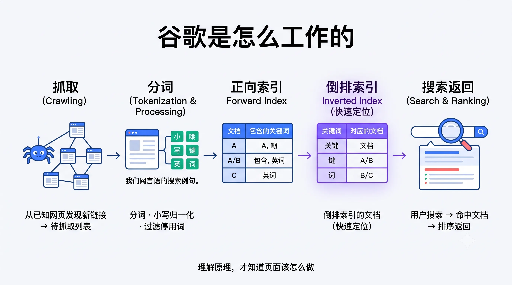
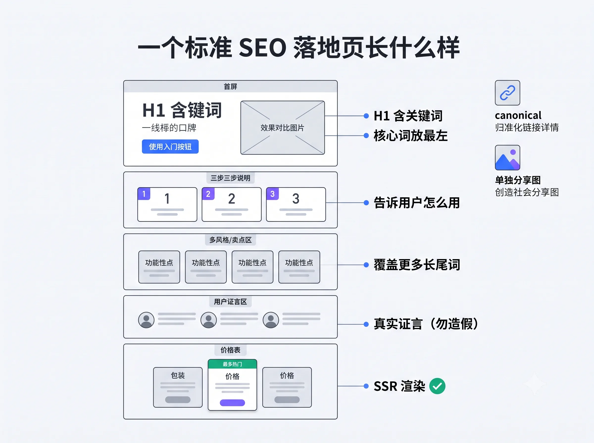
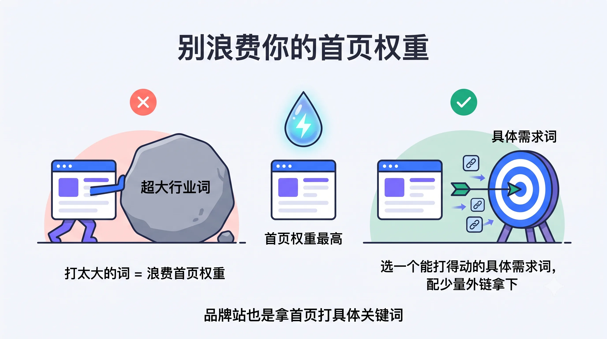
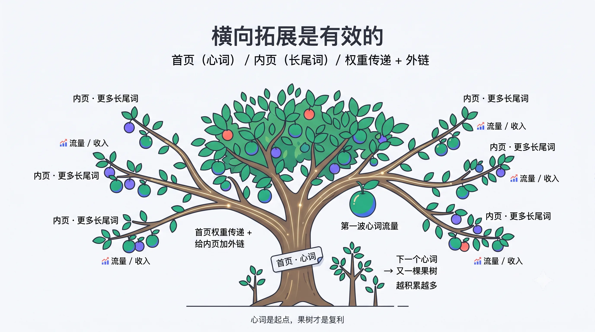

# 把 SEO 拆到底层：哥飞社群主理人的工具箱与出海方法论

> 在「**哥飞的朋友们·年中分享交流会·深圳站**」的压轴环节，哥飞社群主理人（也是 ATK/AITDK 插件与一系列 SEO 工具的作者）带来了一场信息量极大的分享。
>
> 和其他"照着几步做就行"的教程不同，这场分享的关键词是**原理**——从谷歌爬虫怎么工作、倒排索引怎么建，到 GSC 数据怎么排查、竞品落地页怎么拆，再到自己真实站点的盈亏复盘。用他的话说：**"别的地方告诉你照着做就行，我们会告诉你为什么这样做、原理是什么。"**

---

## 一、先领福利：ATK 插件与哥飞社群平台

分享开场，主理人先给现场发了一波福利：**凡是购买了本次交流会门票（账户里至少有一张票）的伙伴，都可以免费兑换一个月的 ATK 插件 Blue 会员，价值 20 美金。**（注意：已经是付费会员的当月无法重复兑换，可等到期后再兑。）

**ATK（AITDK）是入群必备的浏览器插件**，看任何一个网页（别人的或自己的）都能用：

- **Pic 功能**：看流量曲线、流量来源、来自 AI 的流量、关键词分布；
- **外链查询**（Blue 会员功能，赠 2000 积分，看一个站外链消耗少量积分）；
- **AdSense 关联**：一个网站放了谷歌广告，可查出同属一个 AdSense 账户的其他网站，即"扒作者网站矩阵"；
- **关键词密度、H 标签**等基础但高频的检查。

除了插件，他还展示了**哥飞社群自建的平台**，功能相当扎实：

- **每日群总结**：每天自动生成一篇前一天的群聊总结（今日概览 / 重点话题 / 答疑回顾等），每条都能跳回原始群消息。过去三年、十几个群的记录都能查；
- **我的收藏**：支持多个收藏夹，每个可选"列表 / 导航站 / 阅读"三种展示样式。边学边收藏，最后就能沉淀出自己的知识导航站；
- **精选文章 / 群聊记录**：把两三年积累的分享、讨论按时间线全部归档。

> 他特别强调：**凡是被"置顶精选"的文章，一定是他认为有必要大家去学的。**比如那篇"找需求的方法"，文章写于 5 月，但这个方法社群里过去两年反复分享过好多次——只是时间久了，有些群友慢慢忘了，所以又重新讲一遍。

---

## 二、让新手"看见"SEO：几个模拟器

主理人发现很多问题是共性的：**光看教程，就像只听别人说"猪肉很好吃"，自己没见过猪跑，很难想象。**于是他做了几个模拟器，让大家先"跑一遍"。

### 1. SEO 经营模拟器

一个"经营模拟精英游戏"：从理解搜索引擎底层原理开始学 SEO。给你 **365 天时间、5000 块启动资金**，第一步找关键词 → 买域名 → 选长尾词 → 提升权重 → 做优化 → 买外链 → 买 API……每一步都告诉你**为什么要做**、**怎么做**，还能真实操作。目标是走到最后收入达到几十万甚至上百万（虚拟）。

### 2. 关键词分析工具与"AI 版关键词难度"

- **关键词分析工具**：输入 index 数量、月搜索量、关键词难度（KD），算出 KGR；他还把 KD 纳入，做了个 **eKGR** 公式，并计算 **KGRI（投资回报率）**，综合判断一个词是否值得做；
- **AI 版关键词难度**：基于某工具免费公开的 DR（域名权重）接口，综合前十结果判断难度——有多少是首页 / 内页、标题或流量里是否命中关键词、域名注册时间多长。

> 一个判断诀窍：如果前排里有**注册才五个月、十个月的新站**就能拿到第三名，说明这个词的竞争其实并不激烈，可以做。

### 3. GSC 模拟器

看懂 Google Search Console 的数据是怎么来的：90 天可视化模拟、16 步实战教学，让你**亲眼看到每一次用户搜索行为如何影响你网站的曝光、点击数据**。走完 16 步再点"开始"，就能看到网站真正做好后数据会怎么变化。

---

## 三、科学使用 GSC：一个千万级网站的排查实录

主理人分享了一个真实案例：一位群友做开源软件，靠授权模式年收入超千万。因为开源、外链多、网站权重高，之前一些错误操作没暴露；直到最近 GSC 里**曝光、点击持续下降**才引起警觉。

**排查方法（值得记下来）：**

1. GSC 里最多只能看 1000 个页面，页面多的站，要**一天一天往前回溯，至少回溯最近 30 天**，每天导出数据；
2. 定一个指标（比如每页至少 10 次曝光 + 1 次点击），把 30 个文件里"有点击有曝光"的网址合并、排序，作为**白名单**；
3. 用自己的数据库导出全部内页，与白名单对比：在白名单里的，是谷歌眼里的好页面；不在的，再做分类聚合。

**最终真相**：他们网站每发一个小版本都会生成一个版本介绍页，**没设 noindex、内容大量重复**；更糟的是最近做了多语言，每个页面又被自动翻译成近十种语言——于是产生了海量垃圾页面，被谷歌爬虫不停抓取、白白消耗算力。

> 这就是"**GSC 四级信号**"（社群里专门有一篇文章）：谷歌会在不同情况下给你不同程度的提示或警告。这个站因为权重高，还没被惩罚，只到了"流量降低"这一步。

**解法**：把这些页面全部设为 noindex，并在 robots.txt 里 disallow。

> 核心认知：**网页至少分两种**——一种是**为拿关键词排名做的排名页**（要做好 SEO）；另一种是内部用途的页面，就要放进单独目录、用 robots.txt + noindex 明确告诉谷歌"别来爬"，别浪费你的权重。

---

## 四、谷歌到底怎么工作：从爬虫到倒排索引

主理人用"谷歌搜索模拟器"把搜索引擎的底层拆开演示，这是哥飞社群教程和别处最不一样的地方——**讲原理**。

- **爬虫怎么发现你**：所谓爬虫，就是抓取已知网页、从中分析出新链接，放进"待抓取列表"再继续抓。**如果你的新页面既没在 GSC 提交，也没在别的网站发链接，谷歌其实很难知道你上线了。**
- **怎么快速被收录**：去谷歌爬虫**经常抓、更新频繁**的网页上发你的网址。爬虫抓对方页面时就会发现你的新链接。
- **V2EX 技巧**：用 `site:` 看某站"最近一小时 / 一周"的收录情况，就能判断爬虫多久来一次——如果 16 分钟前爬虫刚来过，在这里发链接就会被很快抓到。反过来，**如果一个卖外链的站爬虫一个月才来一次，你还买吗？**
- **建索引**：谷歌把每个网页当作一个 document，分词 → 小写归一化 → 过滤停用词，先建**正向索引**（每个文档有哪些词），再建**倒排索引**（每个词对应哪些文档），用户搜索时才能快速定位。

> 理解了爬虫和索引怎么运作，你才真正知道**页面该怎么做**。

此外他还做了 YouTube 红人报价评估器、文本长度计算器、**收入目标拆解器**（输入目标月收入、网站数、关键词数，倒推所需排名、点击率、UV），以及一个"打级卡"——从"赚到第一美元"到"Level 10 日入一万"（他笑说当时觉得日入一万已是巅峰，后来突破了才发现网页做得不够大胆）。

---

## 五、追踪 SEO 收入榜：从数据里读懂趋势

从 2024 年 1 月起，主理人**坚持每月下载接入 SEO 收入榜（收音台）的网站数据**，两年多从未间断。回看这些数据能读出很多趋势：

- 某老牌站近两年在走下坡路，增长不如以前猛；
- 某新站前几个月才出现，排名从 74 → 16 → 28 → 16，属于飞速前进型；
- 从支付占比能看出 **PayPal 在这些站里的使用比例在上升**；
- 做 AI 语音 / 文本转语音的 ElevenLabs 一直稳定在第 2~6 名。

> 提醒新手：面对做得特别大的站，**不要全盘照抄**（即便你是团队也别抄）——它起来是天时地利人和、社区自发产生玩法。正确做法是**分析它最主要的卖点或某个有热度的玩法，专门做个站去拦截那部分流量**。

---

## 六、从大站偷师：索引页、排名页与"提示词频道"

主理人以某 AI 品牌站为例，拆解了它这一两年的增长逻辑（除品牌建设外的"薅流量"打法）：

一个新图片模型去年 8 月出来后，**一定会有人搜"模型名称 + 提示词"**——这就是新词。这家站最初只是给创作者做了一个该模型的提示词页面，后来发现不仅社媒在传播、搜索引擎也能带流量，于是拓展：**每个模型的提示词都做一个页面，再聚合成"提示词频道"**（按生成方向、按使用场景分别聚合），直接放进首页导航。

由此引出三类页面的概念：

- **排名页**：为拿具体关键词排名而做，要做好 SEO；
- **索引页**：把一批内页聚合展示、给爬虫抓取（首页、频道页都是索引页）；
- **既是索引页又是排名页**：比如那个"提示词大全"聚合页，既聚合内页，本身又想拿"AI 提示词仓库"这类大词的排名。

---

## 七、一个竞品落地页能拆出多少细节

主理人现场用 ATK 把一个"换脸"工具的落地页拆了个底朝天，这些都是可直接抄的**硬性 SEO 指标 + 软性布局**：

**硬性指标：**
- **title 把核心关键词放最左边**（越靠左权重越高）；想突出品牌就把品牌放最左；
- **H1 一定包含目标关键词**，配一句概括核心功能的 slogan；
- 结构化数据、社交分享图**单独为每个页面做**（而不是全站共用首页图）；
- canonical 设置规范；单词量控制在合理范围；
- **干扰词处理**：价格表里重复出现的词（如某套餐名）会干扰当前页关键词，可用 `css content` 之类的方式处理，或单独做后端 SSR 渲染；
- 用 ATK 验证发现，这家站的价格表是**后端 SSR 渲染**（绿色）而非前端渲染（红色）——有专业 SEO 团队的大站基本不会犯这种细节错误。

**价格页设计（软性，但直接影响付费）：**
- 月度 / 年度切换，一般 3~4 档（入门 / Plus / Pro / 团队版）；
- **用具体模型举例"能生成多少次"**——它这么大体量还拿某图片模型举例，说明该模型**有付费号召力**；某视频模型只给高档套餐用，也是同理（像明星有"票房号召力"）；
- **"7 天 / 365 天无限使用"放出来**，说明这个文案有号召力，值得学；
- 想方设法用优惠、勾选、席位引导用户买更高级套餐；
- **在每个功能页都放一个前端渲染的价格表**很重要：用户从某个小功能进来（付费意愿本不高），看到"原来花 15 刀能用这么多模型"，就可能顺手付费。

> 他还顺手给 ATK 开发者"喊话"：这种前端渲染的价格表内容不该计入关键词密度统计，会干扰判断，建议改进。

---

## 八、主理人的真实站点复盘（含没做起来的）

难得的是，他把自己几个站的真实数据（含盈亏）都摊开讲：

- **两个音乐游戏站**（关键词由群友提供）：同一个游戏，流量和单价却各不相同，加起来赚了约 13 万。还讲了 **type 词**（用户记错拼写的词）和**商标被抢注**导致同类站被迫改名的坑；
- **某 .org 游戏站分析**：峰值曾达 900 万流量，排版布局、外链打法都是社群跟它学的——**它有大量博客评论外链，所以证明博客评论外链真的有用**，别轻信"没用"的说法；
- **一个工具站**（2 万刀从群友手里买来）：围绕"X 转 Y"横向拓展了 PDF、URL、论文等多个页面；神奇的是**广告收入是付费收入的约 3 倍**（因为定价便宜 + 每天送 30 积分免费额度但需登录）。也坦承算上时间和外链成本，"其实没赚多少"；
- **一个小说目录站**（提前一个多月专为讲案例而做）：只做章节目录、严格规避盗版，**只有 1 个自己发的博客评论外链**也能慢慢起量，还做了繁体页面一键翻译拦截台湾流量。

> 关于外链他补了一句：这个站被别人加了 200 多个垃圾 spam 外链，**完全不用管，谷歌足够聪明能识别**，不会让这些链接干扰排名。

> 这个小说站还诠释了一个道理：**耐得住前期的寂寞**——新站上线初期曝光会冲高再回落（供给不足时被顶上去，谷歌抓到更多页面后被挤下来），只要词的热度持久、持续更新和加外链，流量后面会慢慢回来。

---

## 九、明日黑客松：新赛制

主理人预告了第二天的黑客松改版。**过去两届请评委从"页面好不好看、功能是否完整"打分，但这些恰恰没体现社群教的"挖掘关键词、做好 SEO"。**

所以新赛制改为：**找关键词（限定词根）→ 针对关键词做页面 → 注册域名上线 → 提交作品 → 全员互评打分**。好处是省了评委费用，更重要的是**让大家真正打开彼此的网站，去看别人的关键词、页面、交互、TDK、关键词密度和 SEO 逻辑**。

> 奖金池共 14000 美金：特奖 1 名 2000 刀、一等奖 5 名各 1000 刀、二等奖 10 名各 500 刀、三等奖 20 名各 100 刀。用他的话说：**"门票钱都拿来发奖了。"**

---

## 十、Q&A 精华

**品牌站怎么做？**
> 不要浪费首页权重。首页是全站权重最高的，**应该拿它去打"能打得动的具体需求关键词"**，而不是放一个巨大的行业大词。品牌名是你自选的、没人竞争，出现几次即可；首页真正要瞄准的是一个具体需求词。所以品牌站和关键词站，本质都是"用首页打具体关键词"。

**为什么只分析游戏和 AI 类新词？**
> 其实各类新词都能做（新闻资讯 + 地图工具、历史主题等群友都做过），只要符合"三元数量"标准就行。只是游戏和 AI**更容易源源不断地产生新词**。

**心词只有一波流怎么办？**
> **横向拓展**。首页留着打心词，同时做更多内页去打更多别的词，把首页权重传递给内页、再给内页加外链。这是社群两三年验证过的有效方法——**"横向拓展是有效的"**。心词只是一个"取巧快速拿到积累"的起点，靠这个有积累的网站再搭更多页面，就像一棵**每年都能结果的果树**。

**流量拿不住怎么办？**
> 分几种：① 全球大热点会被大站跟进挤下（看热度是否持久 + 持续加外链）；② 资讯类是"过桥页"天然留不住用户，工具/游戏能留住；③ 用了 StreamAd、Monetag 这类"流氓"广告联盟会偷量、乱跳转，导致谷歌眼里体验下降。**但对新手来说，先拿到第一刀甚至第一千刀，比长期流量更实在。**

**怎么找其他领域的工具站？怎么持续挖需求？**
> 靠**词根挖掘**（社群总结的 51 个词根，如 Generator、Creator 等）多管齐下；以及去开发者爱炫耀的地方看（Reddit、Hacker News、X）——**程序员忍不住分享"我做了个什么站、拿到多少流量"**，你就能嗅到新需求。核心是"站得早、吃得早"。

**外链发到什么时候是个头？**
> 有正反馈就停不下来——"我只要多花五分钟上一个页面，后面就能多赚钱"。**这是个无限游戏，没有头**，除非你赚够了钱、招人帮你上页面，自己去滑雪。

**找到关键词具体怎么上？**
> 别想一步登天，**从做一个单页网站开始**，从零练起。

---

> 本文根据「哥飞的朋友们·年中分享交流会·深圳站（2026.07.04~07.05，深圳御景国际酒店）」上哥飞社群主理人的压轴分享整理，内容为现场观点、工具演示与案例的转述与提炼，供哥飞社群伙伴及出海同行参考交流，不代表平台立场。文中涉及外链、竞品拆解等具体操作，请自行判断合规与风险；如需转载或引用，请注明来源并联系原作者授权。
