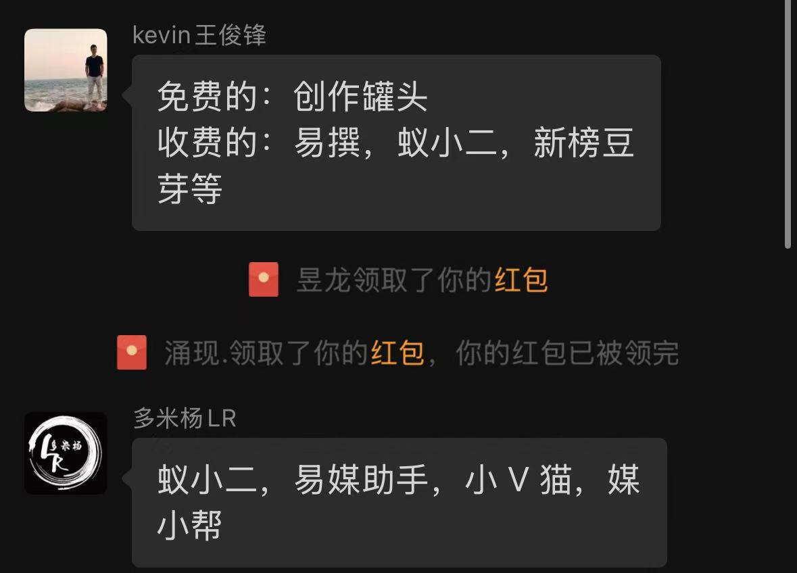

> 好久没参加线下活动了。最近看到有个 AI 产品交流的线下组局，便发给庄周，没想到他这次居然想去了，因此这次线下才能成行。

## 一、概述

这次线下活动的地点在上海，组局官是生财传术师，也是刘小排深海圈的学员。其他成员以程序员、产品经理为主，还有一些小老板。

分享的主要内容还是 Web 出海产品，包括找需求、找流量和一些自媒体运营经验。

## 二、主题分享

### 2.1 小北

小北是组局官，主要分享的是找需求、写代码和找流量。

#### 找需求

小北推荐了几个找需求的方法，分别是观察海外兼职平台、对手投流、创业播客和海外社媒等渠道。

我最近也在搬运和整理一些海外的内容，感觉下面几个 YouTube 博主值得关注：

- [Greg Isenberg](https://www.youtube.com/@GregIsenberg)
- [Liam Ottley](https://www.youtube.com/@LiamOttley)
- [Lenny's Podcast](https://www.youtube.com/@LennysPodcast)
- [Starter Story](https://www.youtube.com/@starterstory)

#### 写代码

这里小北推荐了一些 API 平台，可以收藏一下：

- [Replicate](https://replicate.com/)
- [Fal](https://fal.ai/)
- [OpenRouter](https://openrouter.ai/)
- 火山引擎
- 硅基流动
- [APICore](https://api.apicore.ai/)
- [Evolink](https://evolink.ai/)

#### 找流量

分享中提到了一个很有意思的“废话工业复合体”模型：真正付诸行动、创造产品并分享一手经验的人是第一组；清晰整理这些经验的人是第二组；再往后，则是不断聚合、转述前一组内容的人。

它提醒我们：与其停留在层层转述的信息里，不如更靠近一手实践者，最好自己也成为真正动手的那一组。

### 2.2 勺子

勺子老师在上海开了两家火锅店，会上大家都叫他“火锅哥”。他的分享是我觉得最有价值的部分。

火锅哥在 Sora 2 刚发布时就搭建了邀请码售卖平台，并通过社交媒体宣传，实现了月入 10 万元以上。

邀请码收款平台用的是[独角数卡发卡平台](https://github.com/assimon/dujiaoka)。个人用户无法直接绑定支付渠道，可能需要通过平台提现并支付手续费；个体工商户则可以绑定。

关于自媒体运营，火锅哥推荐了几个多平台分发软件。这很实用，每天在多个平台逐个发布确实很浪费时间。

### 2.3 其他分享

现场也有朋友分享了自媒体运营经验，包括如何接商单等信息。

还有一位朋友做了二手交易平台和 AI 视频软件，也很有意思。

## 三、总结

线下交流本来应该分享自己的过程，可是我这次没有准备。下次参加这种活动，还是应该好好准备：输出才能倒逼输入。

这倒不是为了吹嘘自己或者寻找机会。更重要的是，持续分享自己的实践，会让自己成长得更好。

