> 本文整理自Wolfgang Geiger（小狼）的演讲"The Small & Rich Strategy"，通过Pinhok Languages的真实案例，揭示了一个被大多数SaaS公司忽视的增长机会——瞄准人口少、人均GDP高、拥有自己语言的欧洲小国市场。

---

## 一、关于演讲者

Wolfgang "Wolf" Geiger，中文名"小狼"，出生于奥地利，曾在英国和北京求学，目前定居香港。他是Pinhok Languages的创始人，这是一家专注于语言学习内容的公司。

Pinhok Languages的起步非常朴素——大约在2012年，Wolf为了自己学习HSK（汉语水平考试）和粤语，整理了一系列词汇表。到了2014年左右，他开始将这些词汇表自助出版成书，并同步上线了Pinhok.com网站，支持13种语言。

发展到今天，Pinhok已经出版了超过1000本书，覆盖50种语言，通过书籍版税获得收入。网站上还提供了大量免费的SEO内容——部分词汇表被制作成在线学习页面，供用户免费使用，同时也为网站带来大量自然搜索流量。

## 二、先看数据：GSC和Bing的流量表现

在讲策略之前，先看一组真实数据。

### Google Search Console 2025年总览

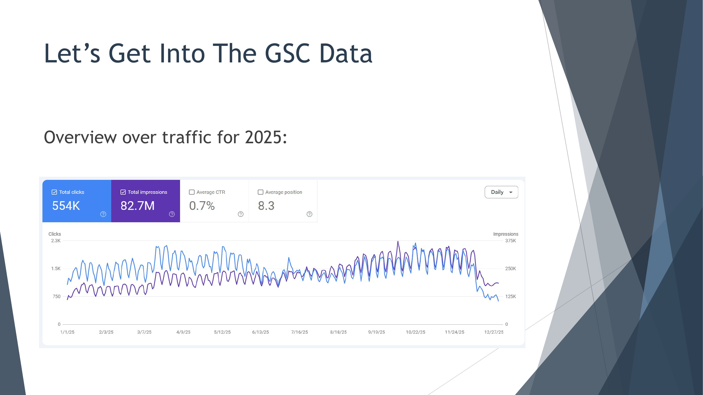

Pinhok.com在2025年全年通过Google获得了**55.4万次点击**和**8270万次展示**，平均点击率0.7%，平均排名8.3。从趋势图可以看出，流量全年相对稳定，有一定的周期性波动。

### Bing 2025年总览

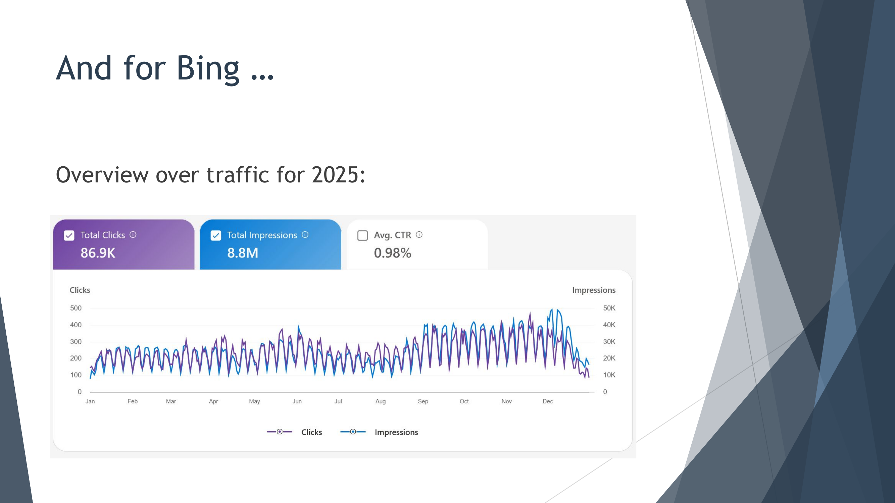

在Bing上，全年获得了**8.69万次点击**和**880万次展示**，平均点击率0.98%。虽然Bing的体量比Google小很多，但也是不可忽视的流量来源。

### 按国家分布的GSC数据——重点来了

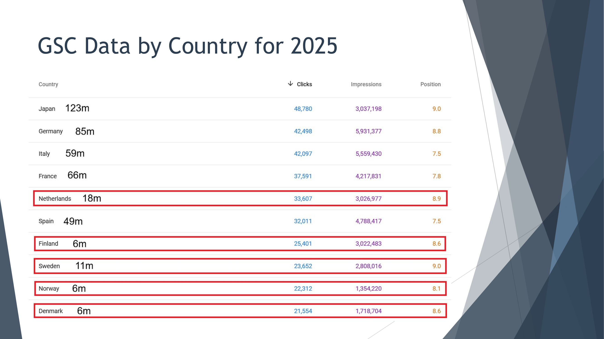

这张表是整个策略的核心所在。按点击量排名的前10个国家中，我们看到了几个非常有意思的现象：

日本（1.23亿人口）排第一，48,780次点击；德国（8500万人口）排第二，42,498次点击；意大利（5900万人口）排第三，42,097次点击。这些都是大国，排名靠前并不意外。

但请注意红框标出的国家：

- **荷兰**（1800万人口）：33,607次点击
- **芬兰**（600万人口）：25,401次点击
- **瑞典**（1100万人口）：23,652次点击
- **挪威**（600万人口）：22,312次点击
- **丹麦**（600万人口）：21,554次点击

一个只有600万人口的国家——大约相当于一个深圳——竟然在点击量上超过了印度这样的人口大国。这是怎么做到的？

## 三、什么是"小而富"国家？

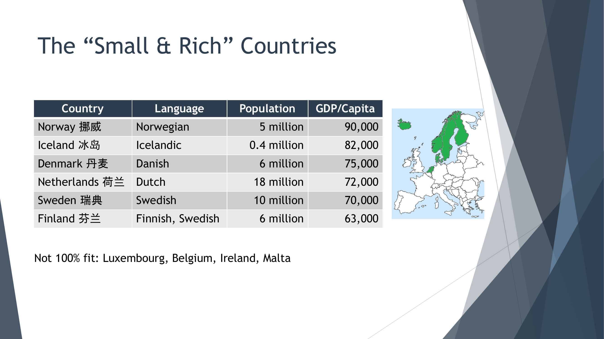

Wolf定义的"小而富"国家需要满足以下特征：

1. **人口规模小**（少于2000万，大约相当于一个深圳）
2. **拥有自己独立的语言**
3. **人均GDP高**
4. **教育水平好**
5. **英语能力强**

核心的六个国家是：

| 国家 | 语言 | 人口 | 人均GDP（美元） |
|------|------|------|----------------|
| 挪威 | 挪威语 | 500万 | 90,000 |
| 冰岛 | 冰岛语 | 40万 | 82,000 |
| 丹麦 | 丹麦语 | 600万 | 75,000 |
| 荷兰 | 荷兰语 | 1800万 | 72,000 |
| 瑞典 | 瑞典语 | 1000万 | 70,000 |
| 芬兰 | 芬兰语/瑞典语 | 600万 | 63,000 |

需要注意的是，卢森堡、比利时、爱尔兰、马耳他等国也有一定的相似特征，但不完全契合——要么是使用其他大语种（如法语、英语），要么有其他特殊情况。

## 四、为什么"小而富"策略能奏效？

回到那个核心问题：为什么600万人口的国家能产出超过大国的流量？Wolf给出了三个可能的原因：

**第一，目标关键词排名更高。** 由于竞争少，在这些小语种市场中更容易获得好排名。

**第二，广泛关键词也能获得排名。** 这是一个非常关键的发现。

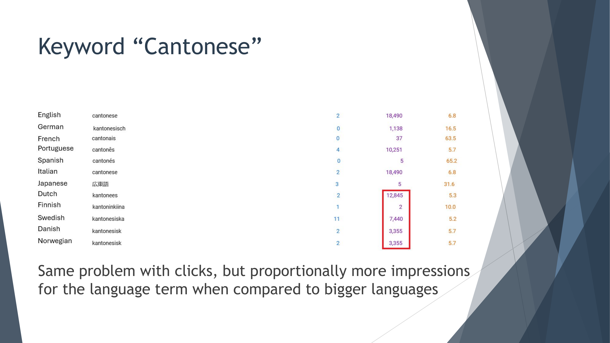

以"粤语"这个关键词为例（对应各语言的翻译），我们可以看到：英语的"cantonese"有18,490次展示，荷兰语的"kantonees"有12,845次展示，瑞典语的"kantonesiska"有7,440次展示，丹麦语和挪威语的"kantonesisk"各有3,355次展示。

相对于人口规模而言，这些小国的展示量是不成比例地高。

更重要的是，来看看各国用户搜索的关键词有什么不同：

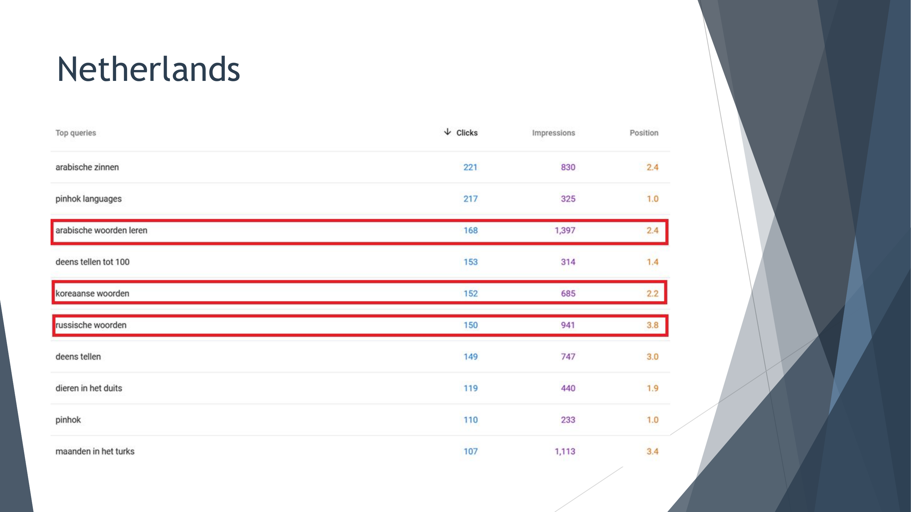

在荷兰市场，排名靠前的搜索词包括"arabische zinnen"（阿拉伯语句子）、"arabische woorden leren"（学习阿拉伯语词汇）、"koreaanse woorden"（韩语词汇）、"russische woorden"（俄语词汇）等。

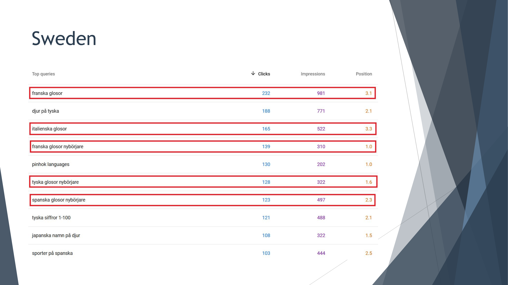

瑞典市场也是类似的模式，排名靠前的有"franska glosor"（法语词汇）、"italienska glosor"（意大利语词汇）、"franska glosor nybörjare"（法语初学者词汇）等。

"woorden"和"glosor"在荷兰语和瑞典语中都是"词汇"或"单词"的意思。这意味着，Pinhok在"小而富"国家中不仅能获得长尾关键词的排名（如"法语数字"），还能获得更广泛的品类级关键词的排名（如"法语词汇"）。

而在美国或德国这样的大市场中，你只能获得具体的长尾关键词排名，品类级的广泛关键词竞争太激烈了。

**第三，品牌搜索的占比更高。**

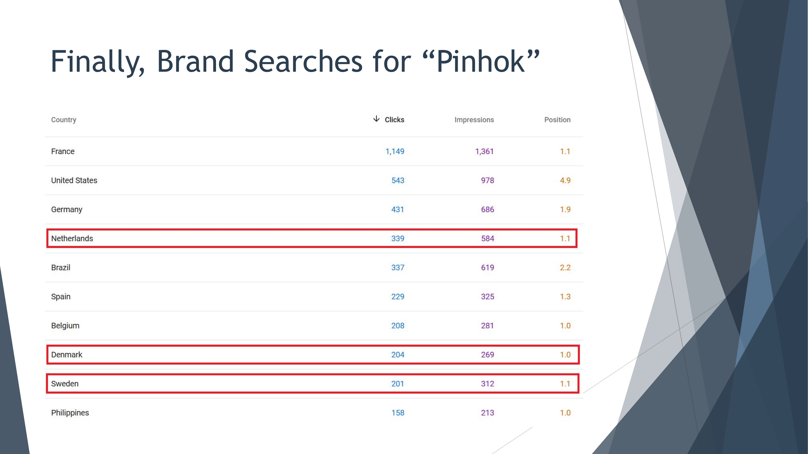

从品牌关键词"Pinhok"的搜索数据来看，荷兰（339次点击）、丹麦（204次点击）、瑞典（201次点击）等小国的品牌搜索量与美国（543次）、德国（431次）相比，考虑到人口差距，比例高出很多。这说明在这些小市场中，用户与品牌之间建立了更强的关联。

### 数据小结

"小而富"国家策略确实在发挥作用：人口只有1000万级别的国家，在流量上超过了美国、英国甚至印度；广泛关键词在小市场有排名但在大市场没有；品牌搜索在小市场中的占比更高且排名更好。

## 五、更多"潜力国家"

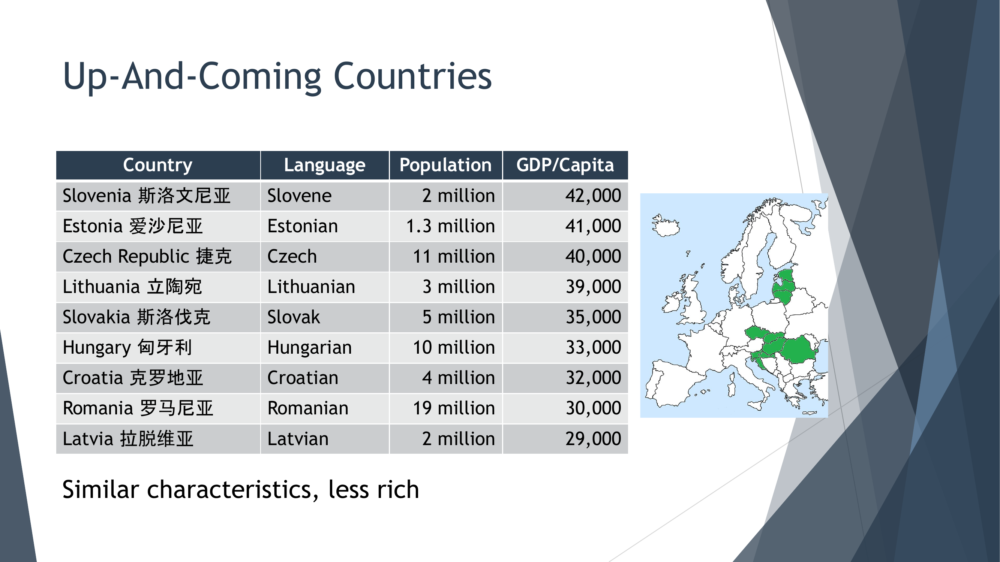

除了原始的六个"小而富"国家外，Wolf还列出了一批"上升中的国家"，它们有着类似的特征，只是目前还没那么富裕：

| 国家 | 语言 | 人口 | 人均GDP（美元） |
|------|------|------|----------------|
| 斯洛文尼亚 | 斯洛文尼亚语 | 200万 | 42,000 |
| 爱沙尼亚 | 爱沙尼亚语 | 130万 | 41,000 |
| 捷克 | 捷克语 | 1100万 | 40,000 |
| 立陶宛 | 立陶宛语 | 300万 | 39,000 |
| 斯洛伐克 | 斯洛伐克语 | 500万 | 35,000 |
| 匈牙利 | 匈牙利语 | 1000万 | 33,000 |
| 克罗地亚 | 克罗地亚语 | 400万 | 32,000 |
| 罗马尼亚 | 罗马尼亚语 | 1900万 | 30,000 |
| 拉脱维亚 | 拉脱维亚语 | 200万 | 29,000 |

这些中东欧国家随着经济发展，未来有可能成为新的增长引擎。

## 六、对SaaS公司的启示

### 大多数SaaS公司的国际化路径

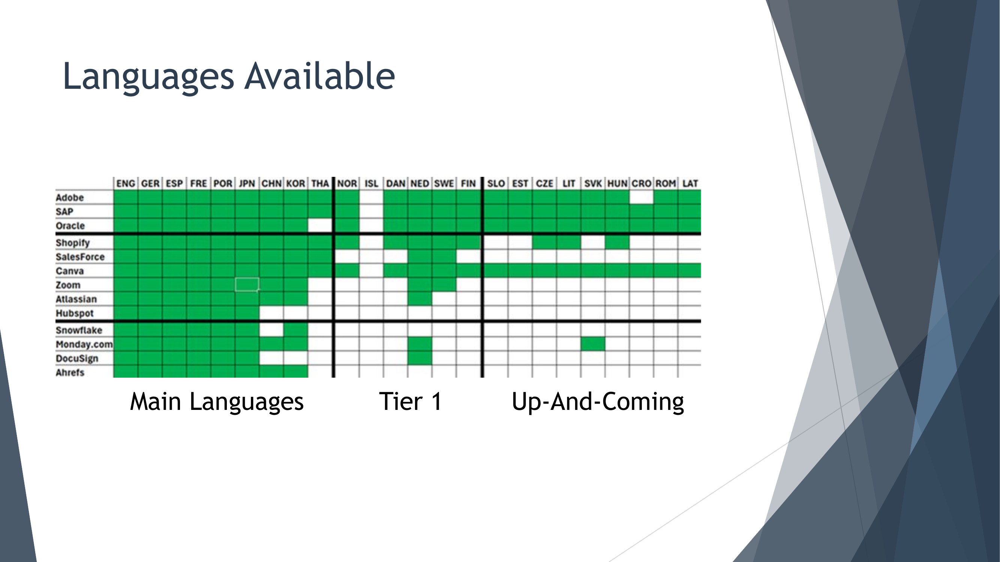

Wolf调研了一批西方SaaS公司的语言支持情况，从老牌企业（SAP、Oracle、Adobe）到成熟公司（Salesforce、Shopify、Canva）再到新兴公司（Snowflake、Monday.com、DocuSign），发现了一个共同的国际化模式：

大部分SaaS公司的国际化扩展顺序是：先做英语市场，然后是德语、法语、葡萄牙语和西班牙语，接着可能做中文、日语和韩语，再之后是意大利、波兰、土耳其或俄罗斯等大国，最后才考虑小市场。

从表中可以清楚地看到，"小而富"国家和"上升中的国家"在大多数SaaS公司的语言支持中还是大片空白。只有像Adobe和SAP这样的老牌巨头才做了比较全面的覆盖。

### "小而富"策略的SaaS版本

Wolf建议的做法是：按人均GDP而不是人口规模来排列优先级。

- 英语仍然是第一位
- 然后是德语、法语和西班牙语
- 但接下来，不是跳到中文或日语，而是考虑**尽早将荷兰语、瑞典语、挪威语和丹麦语加入支持**

理由很简单：这些国家的用户购买力强、竞争对手少，而且由于人口规模小、语言独特，很少有公司愿意做本地化——这恰恰是你的机会。

## 七、如何落地执行

### 确定从哪个"小而富"国家开始

本地化一个网站或SaaS产品是一项重大投资。Wolf提出了四种获取数据来指导决策的方法：

**方法一：利用现有客户。** 这可能是最好的方法，因为已有客户说明需求存在且没有不可预见的障碍。你可以联系这些客户，了解他们需要什么本地化改进——比如与当地工具的集成（会计、支付等），以及他们使用你产品的原因。从客户最多的国家开始。

**方法二：利用GSC或网站分析数据。** 你的网站可能已经在你没有特意优化的国家获得了排名和流量。检查Google Search Console的"国家"标签，看看哪些国家在搜索你的产品。

**方法三：先翻译2-3个页面测试。** 当你在做英语、德语、西班牙语和法语版本的时候，顺带为其他小语种也翻译2-3个重要的着陆页。让它们静置一段时间，等你完成主要语言的工作后，就有了第一手数据来判断哪些语言已经有了吸引力。

**方法四：创建免费工具。** 创建一个很多人都需要的免费工具（Ahrefs就做得很好，提供了大量免费SEO工具），然后把这个工具翻译成尽可能多的语言。成功的话，这些工具会告诉你哪些国家在使用，为你提供可以访谈的潜在用户，并在你完成某个国家的本地化时成为免费的发布平台。

### 翻译怎么做

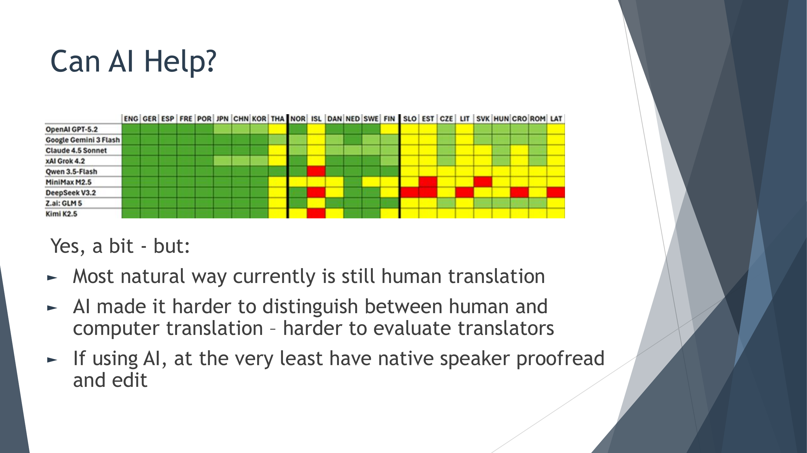

Wolf坦言，翻译看似简单，实则不然。核心难题是：你不懂目标语言，所以必须找到能做好翻译的人。而AI的出现，一方面确实有帮助，另一方面也让事情变得更复杂了——因为现在更难区分人工翻译和机器翻译，评估翻译人员变得更难。

从上面的AI翻译质量对比图可以看到，主流AI模型在大语种上表现不错（绿色），但在小语种上质量参差不齐（黄色和红色）。

**AI之前的翻译流程：**
1. 至少找3个母语者翻译词汇表
2. 同时使用Google和Bing翻译
3. 手动比对4-5个数据集
4. 对翻译不一致的地方，使用Google图片搜索、Wiktionary等工具确认
5. 再找1-2个母语者校对
6. 整合反馈后发布

**AI之后的翻译流程：**
1. 找至少3个母语者翻译前500个词
2. 同时让3个AI也翻译同样的500个词
3. 对比人工和AI翻译（如果人工翻译之间差异太小，说明翻译人员可能也在用AI）
4. 用AI分析不一致之处，选出最佳翻译
5. 让最好的翻译人员完成全部词汇表翻译
6. 用AI检查潜在问题
7. 修正后发布

关于关键词翻译，Wolf的建议是：用AI将英语关键词翻译成目标语言，让AI给出3-5个选项，然后在Google上检查哪个选项搜索结果最好，最后选用那个。

## 八、销售数据验证

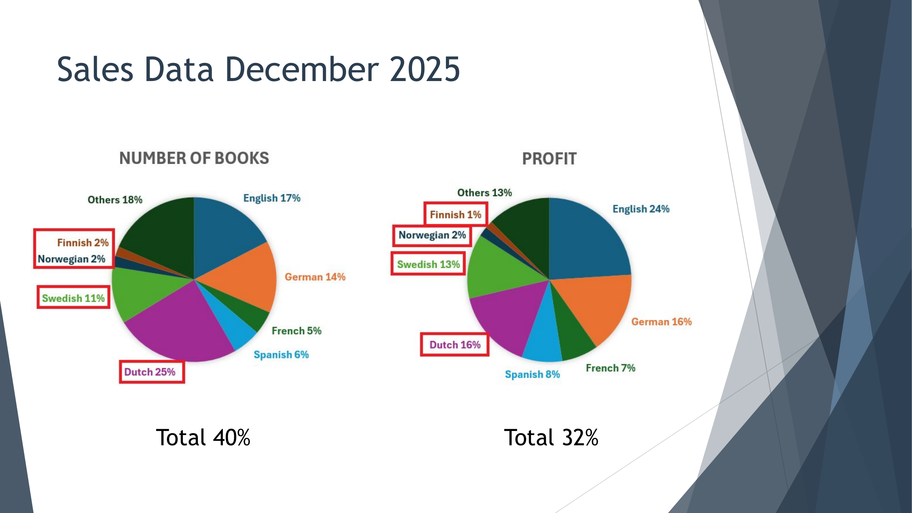

最终的销售数据是对这个策略最有力的验证。以2025年12月为例：

**按销售册数计算：** "小而富"国家（荷兰25%、瑞典11%、芬兰2%、挪威2%）合计贡献了**40%**的销量。

**按利润计算：** "小而富"国家（荷兰16%、瑞典13%、挪威2%、芬兰1%）合计贡献了**32%**的利润。

作为对比，英语市场贡献了17%的销量和24%的利润，德语市场贡献了14%的销量和16%的利润。也就是说，几个人口加起来不到4000万的小国，在销售和利润上都超过了英语和德语市场。

其中荷兰表现尤其突出，Wolf解释了原因：他与荷兰当地的一家公司合作，确保书籍进入了所有荷兰本地的在线书店。此外，荷兰人喜欢学语言，也喜欢"不花哨"的实用产品。

另一个有趣的故事是瑞典市场。瑞典原本和挪威、丹麦差不多，但在2020年Amazon.se上线后，多了一个本地销售渠道，销量翻了5倍。类似的情况也发生在波兰（Amazon.pl）和荷兰/比利时（Amazon.nl和Amazon.be）。

## 九、超越语言翻译的本地化

Wolf强调，真正的本地化不仅仅是翻译语言。

对于Pinhok来说，关键是进入本地在线书店（如Amazon.se、Bol.com等）。

对于SaaS公司来说，需要考虑的包括：集成当地支付提供商和会计工具、获取当地认证（如SGS、TÜV等）、在当地信任平台上建立口碑（Trustpilot、G2等）。

Wolf还特别提到，阿里巴巴、京东、腾讯、拼多多等中国公司都在积极向欧洲扩张。如果你的SaaS可以与这些平台合作——比如当Alipay在某个市场上线时与之对接，或者集成到京东的履约网络中——那将是一个独特的竞争优势。

## 十、额外的增长策略

### 1. 用PDF获取搜索流量

Wolf在研究Bing数据时发现了一个有趣的现象：很多用户在搜索关键词时会加上"filetype:pdf"。这可能是用户习惯，也可能与AI爬虫有关。

他的做法是：在每个免费内容页面的底部提供PDF下载链接。关键细节包括：直接链接到PDF文件、将PDF放在自己的服务器上（而不是CDN）、用目标关键词作为PDF文件名、在PDF内加入网站URL。

### 2. 提供免费功能

Pinhok的做法是提供免费学习材料（网站、PDF、YouTube等），完全免费、无需注册、无需提供邮箱，然后从免费内容中进行升级销售。

对SaaS公司来说，可以提供一个小功能的免费版本，或者创建小型的独立平台。

### 3. Niche Down——往更细分的方向走

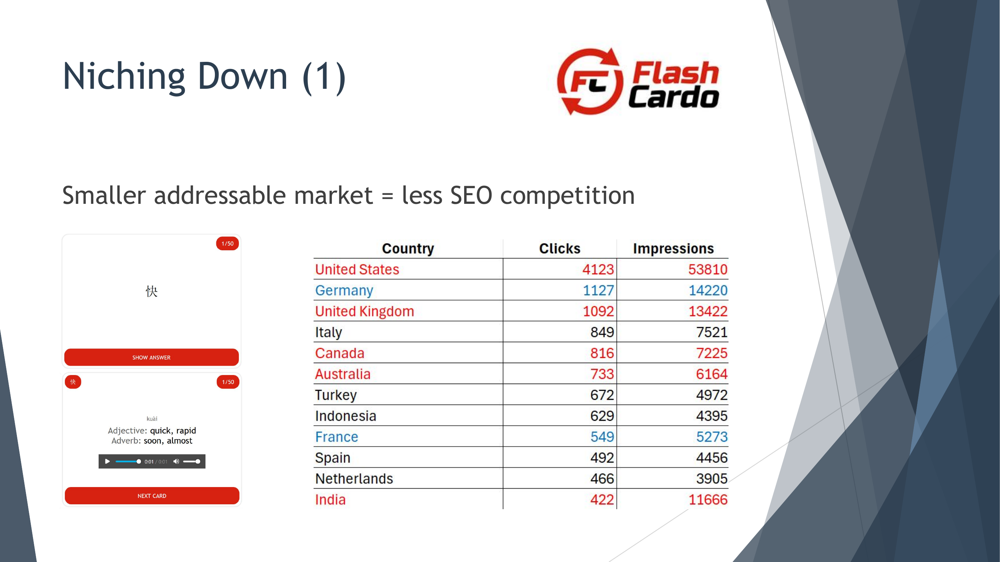

更小的可寻址市场意味着更少的SEO竞争。Wolf发现部分用户喜欢使用闪卡学习，于是创建了Flashcardo.com。搜索闪卡的用户大约只有搜索词汇表的十分之一，但正因为竞争少，Flashcardo在美国、英国、澳大利亚等英语市场都获得了不错的排名，反过来也带动了英语书籍的销售。

这个思路对SaaS同样适用：如果你在一个大品类中竞争不过，那就找到一个更细分的角度切入。

## 十一、总结

"小而富"策略的核心思想可以总结为：

**瞄准那些人口规模小、拥有自己语言、人均GDP高的国家。** 这些市场有巨大的SEO潜力，因为竞争极少。大多数SaaS公司仍在按传统路径——先做大语种大市场——来扩展国际业务，完全忽视了这些"小而富"的蓝海。

对于Pinhok Languages来说，四个"小而富"国家贡献了**40%的销量和32%的利润**。这个数字本身就是最有力的证明。

如果你正在做国际化SaaS或跨境业务，不妨重新审视你的市场优先级排列。也许，那些你从未认真考虑过的北欧和西欧小国，正是你下一个增长突破口。

---

*演讲者联系方式：*
- *网站（英文）：wolfweb.hk*
- *网站（中文）：langzhan.net*
- *邮箱：contact@wohok-solutions.com*
- *微信：xiaolangAUT*
