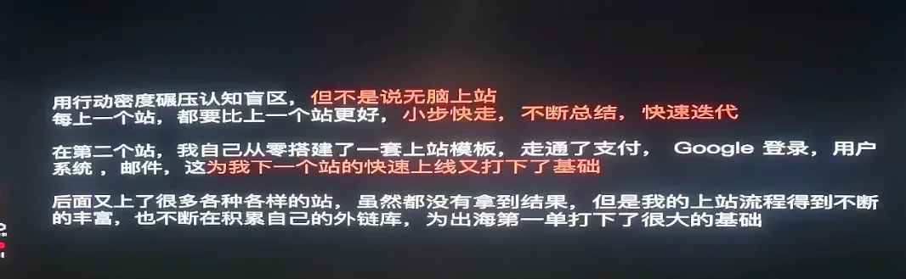
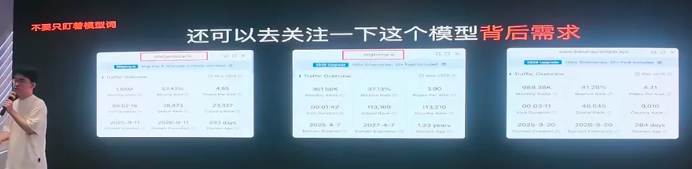
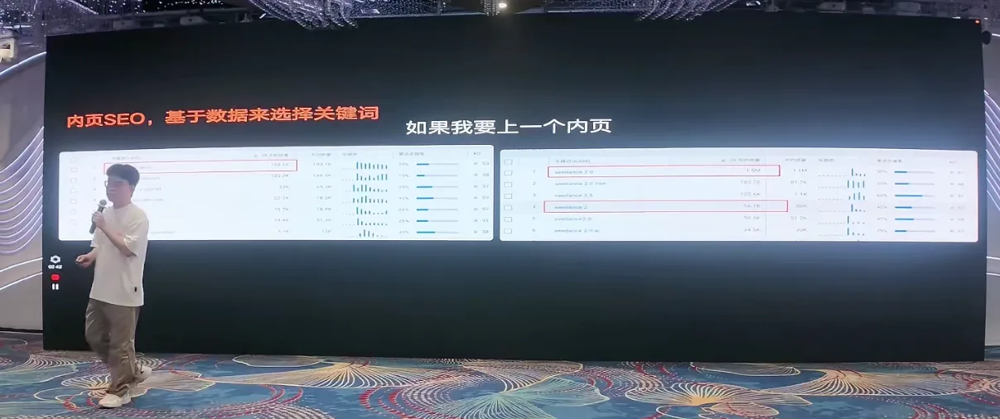

# 从穷学生到月入过万：一位 00 后的 AI 出海新手历程

> 在「**哥飞的朋友们·年中分享交流会·深圳站**」上，一位 00 后独立开发者（社群及小红书同名账号 asnull）带来了一场"接地气"的分享。
>
> 相比前面几位嘉宾满满的干货方法论，他的分享更像一份**新手成长实录**——2025 年 4 月才加入哥飞社群、从零研究 AI 出海，同年 9 月就实现了月入过万。他把自己的路径总结成一句话：**普通背景 + 强执行 + 一点运气。**

---

## 一、他是谁：一个"十年老码农"新兵

先交代背景：他是 00 后、2025 届本科毕业生，专业其实是**自动化**（不是计算机）。2025 年 4 月加入哥飞社群开始研究 AI 出海，由认识十年的老友"蛋壳"引荐入门；毕业后也是经蛋壳推荐进了一家公司上班。到 2025 年 9 月，他实现了月入过万，并一直持续到现在。

> 他反复强调蛋壳是自己的"恩人"——正是这位老友把他领进了出海这条赛道。

别看他刚毕业一年，从初中接触编程算起，其实也是个"十年老码农"了（他自嘲"十年码龄但还是很菜"）。这段折腾史，后来都变成了他做出海的底层能力。

---

## 二、从"折腾"到"产品"：看似没用的经历，都成了底层能力

他把自己做过的产品串了一遍，每一个当时都没赚到什么钱，却一点点喂出了"产品感觉"：

- **起点是折腾**：小学爱打游戏但打得菜，就去找外挂、脚本、游戏修改器、破解版、影视解析，泡各种破解论坛（如吾爱破解一类社区）。
- **走上不归路**：某天在论坛看到有人分享"用手机就能开发 App 的软件"，而他当时家里连电脑都没有——原来自己也能"造"东西，从此入坑。
- **第一个软件**：一个工具箱，界面最初"上个世纪风格"，抄着抄着对 UI 设计有了感觉。没有用户，纯做着玩；把安装包发给同学，打开弹窗显示"开发者是谁"，觉得特别酷。
- **第二个软件（FBS）**：影视解析工具，开始涉及网络、API 这些更复杂的东西。
- **第三个软件**：圈子里流行做"教程 / 手册"，他也做了一款，**积累了约 2 万用户**——但当时完全不懂商业变现，"纯做慈善"，只赚了一千多块。
- **大学 + 蛋壳的创业项目**：系统学了前端；蛋壳创业时拉他负责一个文案生成小程序和网页版。原理极简单：输入标题，用模板 + 段落随机组合就能出内容。2023 年他们较早接入了 ChatGPT，随着 AI 普及，这类产品价值逐渐被稀释。

> 他的总结很实在：这些产品都没赚到钱，但**锻炼了做产品的感觉**，也为后来做出海站帮了大忙。

**金句：不关心你用什么技术，只关心能不能解决问题。产品不是技术的堆砌，产品是需求的承接。**

---

## 三、为什么选择出海：在焦虑里找到自己的路

这条路不是突然出现的，而是"在焦虑中找出来"的：

- **考研失败**：大四去考研（自动化专业，图书馆里啃高数），没考上。其实早在 2024 年蛋壳就给他推过哥飞的公众号，但当时他的认知还停留在"只有考研进更好的环境才能改变自己"，没当回事。
- **疯狂找路**：考研失利后很焦虑，各种"搞钱路子"（包括 Web3 之类）都去试过。直到 2025 年 2 月与蛋壳深聊，才正式确定走出海这条路。
- **兴趣与能力匹配**：本来就会做网站、App，对产品工具类熟悉；对 AI 感兴趣（自动化专业时做过把 AI 接入桌面机器人的项目）。
- **最关键：零成本**。出海几乎没有资金门槛，对穷学生太友好。他记得刚入职时月薪几千，**发第一个月工资后就立刻加入了哥飞社群**。
- 再加上 AI 大幅提升开发效率，这条路就顺理成章了。

---

## 四、新手历程：用行动密度碾压认知盲区

他把自己的成长方法总结为一句话：**大力出奇迹，用行动密度碾压认知盲区，小步快走、不断迭代。**

### 1. 先把社群"秘籍"过三遍

刚入社群时，哥飞会发一大串入门资料，第一遍看多半会懵（外链、内页等陌生名词一堆），这很正常。他的方法是：

- **第一遍**：全部大致过一遍，建立整体框架；
- **第二遍**：回头细看，因为有了整体把握，很多概念会"突然就通了"；
- **第三遍**：跟着实践。

### 2. 跟着"养站防老"系列上了第一个站

他跟着哥飞社群的"养站防老"系列，一步步完成了人生第一个站：

- 用**词根**去找关键词（如 generator 类），特意选**流量低、难度低**的词来练手；
- 注册域名优先 `.com` / `.org`，**别用 `.xyz`、`.top`** 这类容易被灰产滥用、搜索引擎不易信任的后缀；
- 跟着教程接入数据平台、学会看数据。

> **核心心态：第一个站不为赚钱，先把全流程跑通。** 很多人恰恰卡在"没行动"——总想着第一个站就赚钱，结果迟迟不动手；不动手就没有正反馈，越没反馈越不想动。所以"先做了再说"。

第一个站几乎没什么流量，但看到有几个真实用户，他就已经很兴奋，立刻想做第二个。

### 3. 第二个站：一个小时上线，第一次感受到"金钱的力量"

第二个站是在 Google 上输入 AI 相关词时，从热搜 / 衍生榜里发现了一个新词。因为第一个站已经把流程全跑通，他**马上注册域名、一小时就上线**，没上外链、没做任何推广。

结果第二天一起床就有十几个在线用户，一周就到了几千用户。**2025 年 6 月 12 日，他实现了出海的第一笔收益。**（这个站后来就放着没管，一年下来赚了 71 美金。）

### 4. 让网站更容易"过审"

关于怎么让网站更容易通过（如 AdSense）审核，他的经验和其他嘉宾一致——**把网站做得"像一个网站"**：

- 别一眼看过去就是"vibe coding"半成品风格；
- 补齐隐私政策、服务条款等；
- 如果页面太单一，可以加个 FAQ，再放几篇博客充实内容。

### 5. 行动密度 ≠ 无脑上站

他特别提醒：行动密度重要，但**不是无脑上站**（他见过有人一个月上 500 个站，其实没用）。要有依据地做——**每个站都比上一个做得更好，不断总结、快速迭代**。

> 一个复盘：第二个站他自己从零搭建了一套上站模板，走通了支付、Google 登录、用户系统、邮件——这为他下一个站的快速上线打下了基础。后面又上了很多站，虽然没都拿到结果，但上站流程不断丰富，外链库也在积累，为出海第一单打下了很大基础。回头看，他建议**新手直接用现成模板**（比如把用户系统、积分、支付逻辑都封装好的开源模板），把精力只花在最核心的地方：**功能、工具、转化——也就是你真正的业务**。

后面他又上了图站等，虽然没都拿到结果，但上站流程在每次行动中持续优化，为后来的付费单打下了基础。**8 月 18 日出了第一笔付费单**，他激动到整晚没睡着。

---

## 五、上站经验与技巧

### 外链怎么发

先抄同行作业，免费、付费的都去发。他认为**免费的谷歌外链依然有价值**，可以用来做关键词建设。

> 他打了个比方：哥飞本来不知道你是谁，但如果台下所有人都说"他是做 XX 的"，哥飞大概率就信了。外部网站就相当于"台下的人"，谷歌就是"哥飞"——**当足够多的外站都说你的站是做某个方向的，谷歌就会相信你就是。**

这类似 SEO 的灰帽手法（外链操纵），做过头可能被判定操纵，但他实测确实有效：3 月拿一个站测试，持续发免费博客外链，一个月后点击从个位数涨到 60 多（期间没更新网站，纯发链）；到 5 月谷歌算法更新后又突然起飞一波。

### 多语言：农村包围城市

哥飞、小平都讲过"每个语言单独做一个站"，但对独立开发者来说精力有限。他的选择是**做子目录**：

- 子目录首页可以单独提升域名权重；
- 大家都在抢英语大词、竞争激烈，而**小语种竞争小**；
- 单独给子语言目录发外链更容易拿到排名；
- 小语种、小国家先拿到排名后，再把权重进一步传递回首页。

> 一句话概括：**农村包围城市**——先把小地方的排名提上去，整体首页也会跟着受益。

### 一个免费外链值不值得发，看五点

1. **有流量**：至少流量 > 1000，没流量的没价值；
2. **趋势向上**：近 3 个月流量呈上升趋势（下降可能是没需求，或已被谷歌惩罚——别在被罚的站上发，会连累自己）；
3. **有自然收录的真实关键词**：是真实用户在搜，而不是抓来的假流量；
4. **DR 至少大于 20**；
5. **别太新**：域名年龄最好半年以上。别拿新站去给新站发外链，作用不大，甚至可能一起被罚。

### 别只盯模型词，关注模型背后的需求

做 AI 工具站时，不要只盯着"模型词"本身。还可以去看这个模型**背后真实存在的需求**——比如某个图片编辑模型火了，就去研究 photoeditor.ai、imgtoimg.ai 这类站拿到了多少流量，用户到底在搜什么、用什么。

### 内页 SEO：基于数据选关键词

如果要上一个内页，别凭感觉选词。打开数据工具，看哪些关键词有搜索量、竞争相对可控，再决定做哪个页面。

### 定价策略

- **别设太多档**，三档就够：入门版 / 专业版 / 高级版。档太多用户会选择困难，直接关页面走人；
- **入门版**：价格不高，但性价比故意做得很差（比如 9.9 刀只生成几张图）；
- **专业版**：只比入门版贵一点点，但性价比拉满——**这就是主推、要引导用户成交的档位**；
- **高级版**：可以定得贵一些（500、700 刀对土豪没区别），权益拉满、"用都用不完"；
- **默认显示年费**：很多用户会优先买年费，而一份年费约等于十几个月的月费。

### 专业设计带来信任感

统一的设计元素、统一风格、专业的 Logo，这些细节都在影响转化。别做成"红一块紫一块、一看就想跑路"的网站——**页面越专业，用户越相信你付款后不会跑路、会长期维护**，转化率自然更高。

---

> 本文根据「哥飞的朋友们·年中分享交流会·深圳站（2026.07.04~07.05，深圳御景国际酒店）」上一位 00 后社群成员的分享整理，内容为其个人经历、观点与经验的转述与提炼，供哥飞社群伙伴及出海同行参考交流，不代表平台立场。文中涉及外链操作、定价等具体做法，请自行判断合规与风险；如需转载或引用，请注明来源并联系原作者授权。
