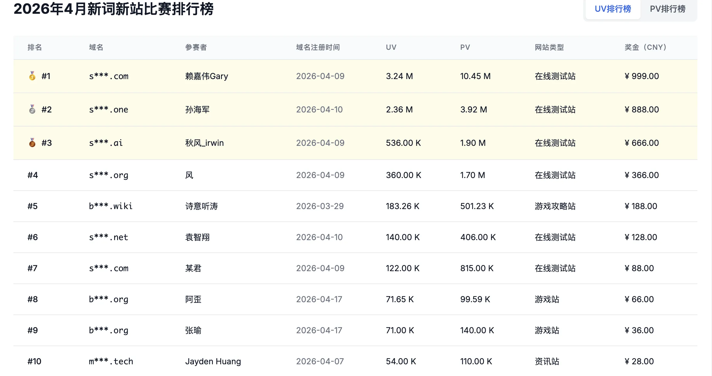
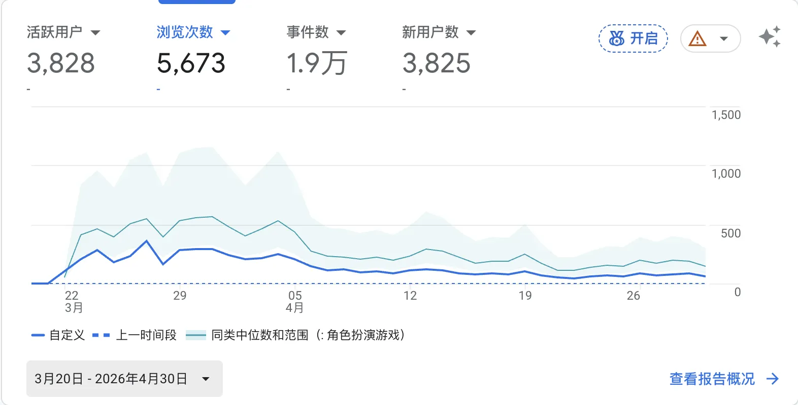

import GrowthSimulator from "@/components/GrowthSimulator.astro";

> 这不是一篇"几天涨多少粉"的爽文。这是一份对自己的复盘——技术上我做对了 80% 的事，但流量曲线还是塌了。同期 Top 3 做对了哪些我没做的事，以及为什么那些事在数学上就比我赢。

## 起点：一次失败的微型 SEO 实验

在独立开发和出海路上，技术是工程师的底气，但**"流量嗅觉"和"增长机制"**才是决定产品天花板的东西。

上个月我用一套高度自动化的技术栈参与了一场新站排名实验——目标是一个**游戏攻略站**。首发期单日曝光冲到近万，紧接着就是断崖式下跌。而同期排名前三的选手做的是 **SBTI 心理测试站**，在 24 小时内拿到了百万级流量。

这次全流程闭环 + 对头部选手的拆解，让我对**传统内容 SEO** 和**增长黑客**这两套打法的底层数学和工程实现有了完全不一样的认知。下面是复盘。


## 一、我的工程实践：自动化内容 SEO 管道

我的后端背景比较扎实，这期项目的核心目标其实不是"赚钱"，而是验证一条**"数据发现 → 自动建站 → 边缘部署 → AI 内容管道"**的全链路。

### 技术栈与架构

为了极致敏捷，我直接放弃了 WordPress 这类重量级 CMS，全套基于边缘计算：

- **前端 & 脚手架**：基于 `mksaas` 模板模块化构建，用 `Claude Code` 快速生成并微调 UI，砍掉一切非必要 JS，保 LCP。
- **部署 & 网络**：全量 `Cloudflare Pages`，吃满 CF 全球边缘节点，Serverless 零服务器成本。
- **存储重构**：项目中期攻略图文打包后静态包体积顶到上限，果断把所有大图和封面迁移到 `Cloudflare R2`，边缘端配强缓存，主包体积压回正常。
- **自动化内容管道**：内容更新完全脱离手写。脚本调用 `Codex` 和 `Claude Code` 的联网搜索抓 Steam 玩家动态和关卡数据，结构化输出标准 Markdown 攻略页。

### 选词流水线

选词机制是一套可复刻的流程：

```
Google Trends 监控 → Semrush / Ahrefs 漏斗 → LLM 难度与潜力研判 → 域名抢注与上线
```

- **发现期**：3 月中旬开始用 `Google Trends` 高频监控，捕捉 48 小时内出现明显拐点的长尾词。
- **验证期**：捕获词扔进 `Semrush` 和 `Ahrefs`，交叉验证搜索量（Search Volume）和关键词难度（KD）。
- **决策期**：多维竞争度数据喂给 LLM 算 ROI。最终锁定某款 3 月 20 日在 Steam 首发的潜力游戏。

### 数据复盘：出道即巅峰

前期执行力没问题：3 月 20 日游戏首发当天抢注域名，21 日落地页全量上线并提交索引。

游戏发售的黄金前三天，网站瞬间吃到首发红利。GSC 的数据：

- **3 月 23 日**：单日曝光飙到 **8600+**，点击逼近 **200**，平均排名卡在 **8.6**。


我本来以为流量会随内页铺设持续滚雪球（后续高频更新了 200+ 个页面，平均 4 天发布 4–10 篇攻略），但现实是流量一路阴跌，最后 UV 和 PV 沦落到两位数。

### 我踩了什么，又漏了什么

- **重设计，轻迭代**。前期视觉阶段为了所谓"完美体验"让 AI 改了 7、8 版设计图，白白烧掉了首发前最黄金的几个小时——也就是新站权重积累的起跑窗口。
- **单向消耗，零留存**。攻略站本质就是"阅后即焚"的工具。没有任何留存或互动机制，用户基本一轮游，次日留存接近零。
- **内容和外链都断了**。中后期工作变忙，网站完全断粮。初期只做了不到 10 个外链，后期没有持续的反向链接支撑，竞争对手一涌入，前期建立的权重被迅速稀释。

## 二、降维打击：拆解 Top 3 测试站的增长黑客模型

对比我这套传统 SEO 漏斗，本次实验排名前三的选手（全是 SBTI 相关的在线测试站）展示了另一个维度的打法。其中排名第二的选手在爆火窗口期内做到了**24 小时破百万 UV、实时在线 6000+、最终 236 万 UV / 392 万 PV**。



拆解他们的操作，底层是一套**非常精密的社交自传播数学模型**。

### 速度即产品力：MVP 推到极致

4 月 9 日深夜 23:59，同行的群聊和朋友圈先捕获到第一个信号，B 站验证了某条测试视频已经几百万播放。他没有花一个小时纠结 UI。

- **凌晨决策**：注册域名，用 `Claude Code` 极速克隆基础题库。
- **一小时上线**：粗糙但可用的 MVP 版本直接丢到 `Cloudflare Pages`。

脉冲式热点面前，**上线速度的权重远大于产品体验的完美度**。

### 把自传播闭环写进产品基因

测试站能跑出指数级增长，根本原因是他们成功触发了**病毒系数 K（Viral Coefficient）**。

他们做对了一个价值百万的小细节：**在测试结果生成的长图底部，强行嵌入带网站域名的二维码，并把"一键保存 / 分享卡片"做得足够顺手。**

- **心理学基础**：心理测试天然满足自我表达、寻求共鸣、社交炫耀（Vanity）三件套。
- **增长闭环**：用户测完 → 产生情绪波动 → 保存带二维码的结果图 → 发朋友圈 / 小红书 → 新用户扫码流入。

这个机制让每一个涌入的流量都变成一个**自带高信任背书的分发节点**。

### 凶悍的冷启动与流量截流

新站上线、搜索引擎还没反应过来的前 24 小时，初始流量根本不靠爬虫，而是靠精准的"流量截流"：

- **社区借势**：在小红书、微博等平台主动检索热点词，在所有"求测试链接"的高赞评论区，人肉贴上自家的免费体验链接。
- **生态承接**：4 月 10 日中午，该热点的原始官方开源站因高并发 + 未备案被国内边缘节点墙了。此时高手前期铺好的自媒体圈层和评论区，让他的站完美沦为"第一顺位的备胎承接者"，把全网瞬间溢出的搜索和点击全部吃下来。

### 动态演进与长尾 SEO 收割

如果以为他们只做一波流，那就小看了。在流量爆发的第 2、3 天，他们展现了相当扎实的动态架构能力：



- **跨地域多语种复制**：GA 实时分析发现大量流量来自新马 + 港台，连夜把题库扩成海外语境版本，多语言支持，激活第二波社交裂变（马来西亚单点贡献了 2.5K 实时活跃）。
- **JSON 结构化批量生成（Programmatic SEO）**：第三天观察到社交媒体上开始衍生"SBTI × 星座""SBTI × MBTI"这类交叉解读玩法。他们立刻把数据结构化，JSON 脚本自动渲染出 2000+ 个细分单页。这批页面停留时间极长（平均参与 4 分 01 秒），没有被 Google 惩罚的同时，霸占了大量长尾词排名。

## 三、底层认知对撞：两套模型的本质差异

这次实验给所有独立开发者上了一节非常生动的流量课。一张表说清两种思维：

| 维度 | 我的传统内容 SEO（游戏攻略站） | Top 3 的增长黑客（SBTI 测试站） |
| --- | --- | --- |
| **底层增长函数** | **线性**：Tₙ = T₀ × (1 + r × n) | **指数**：Tₙ = T₀ × Kⁿ |
| **首发流量来源** | Google 卡位，被动等爬虫 | 朋友圈 / 大 V 圈层 / 小红书评论截流 / GEO（豆包等 AI 问答生态） |
| **用户行为路径** | 单向、一次性的内容消耗 | 双向、带社交货币的交互（二维码裂变） |
| **商业化取舍** | 追求完美视觉与站内结构，延误首发 | 极度克制，为高峰期稳定性放弃短期广告收益 |
| **GSC 提交时机** | 第一时间提交，依赖搜索蜘蛛速度 | 前两天完全放弃传统 SEO，第三天流量下滑后才提交，仅作余量承接 |

两个值得记下来的洞察：

1. **重新定义 SEO 的生态位**：在脉冲式热点中，传统搜索不一定是第一驱动力。前 24 小时把网站推到巅峰的，是社交网络、AI 问答（GEO）和截图裂变。**SEO 应该是下半场承接溢出搜索的"高网捕鱼"工具，而不是引爆点。**
2. **产品机制 > 运营堆砌**：工程师容易陷入"勤奋陷阱"——写脚本、铺 200 页、找 10 个外链。但在产品自身设计精妙的"带二维码分享图"这个自增长机制面前，缺乏自乘效应的劳动密度，效率会被彻底降维打击。

## 四、结语：在正反馈中完成进化

虽然攻略站止步中游，且流量在短暂爆发后归于平静，但那几天刷 Google Analytics 看实时数字跳动的正反馈是真实且震撼的，让我切身感受到了"追新词"这件事的商业魅力。

作为程序员，我那套底层硬核基建（边缘计算、R2 管道、大模型全自动抓取）在工程效率上已经没什么压力，甚至比许多纯运营选手更顺手。

下一步要做的是彻底打破"正规军 SEO"的刻板思维。在未来的独立开发或 MicroSaaS 项目里，**把过硬的工程架构，和增长黑客的"病毒系数机制"+ Programmatic SEO 批量生成做一次深度的基因重组。**

这只是出海路上的一场遭遇战。看清了高手的底牌，下一次，换我们来降维打击。

---

## 附：流量增长模型交互式模拟器

为了直观看懂这两种模型在数学上的差距，下面这个小工具用 30 天的时间轴对比线性 SEO 和病毒裂变两条曲线。可以拖动三个滑块：初始种子用户、SEO 每日线性增长率、病毒系数 K 值。

注意 K 穿过 1.0 那条线时发生了什么。

<GrowthSimulator lang="zh-cn" />
