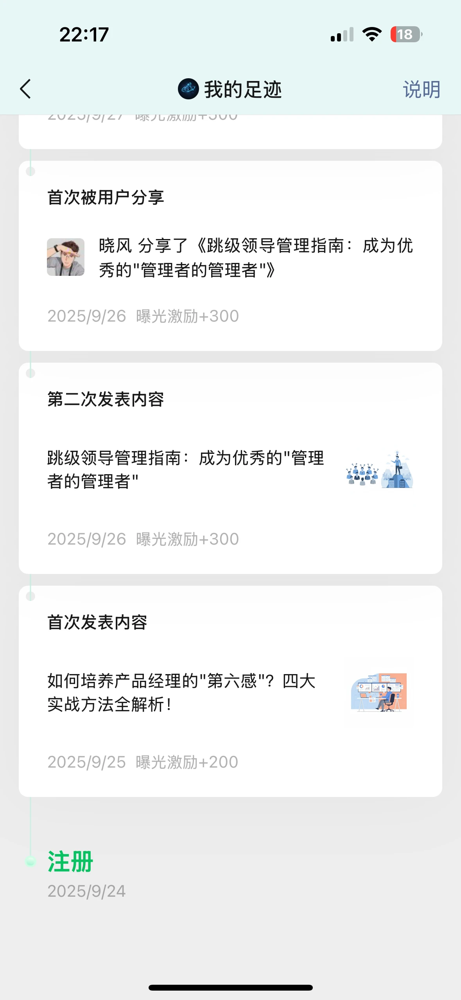
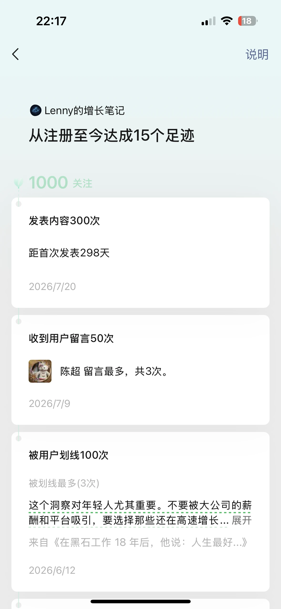
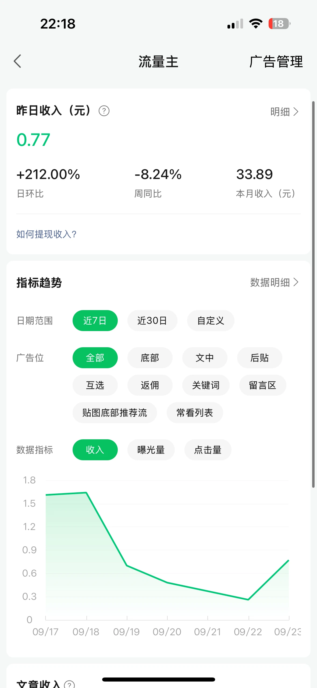

不知不觉，「Lenny 的增长笔记」这个公众号已经运营整整一年了，而且一直在日更。

今天翻了翻后台的「我的足迹」：2025 年 9 月 24 日注册，9 月 25 日发布第一篇内容。到今天，刚好是注册一周年。

账号主要分享产品管理、用户增长和职业发展相关的内容。整理和发布主要靠 AI 辅助，我没有投入特别多的精力，但还是把这件事慢慢做了下来。

## 915 个关注，离 1000 还差一点

截至这次截图，公众号有 **915 位关注者**，距离 1000 还差 85 位。

看起来不算多，但考虑到自己投入的时间，我觉得也还可以。至少一年过去，这个号还在更新，也有一些人愿意持续看。

截图里，昨日阅读是 112，分享是 16。这些都是当时后台显示的数据，谈不上多亮眼，却是实实在在的小反馈。

翻到足迹页，还能看到一个记录：**2026 年 7 月 20 日，发布内容达到 300 次，距离首次发布 298 天。**

平时只觉得每天发一点，回头看才发现，原来也积累了这么多。

## 最难熬的，是前面三个月

这个号最难坚持的阶段，是刚开始的那三个月。

内容在发，关注却涨得慢。日更到大约 110 天时，终于攒到了 100 个关注。这个过程不算快，但对当时的我来说，已经是一个挺重要的节点。

后来开通了流量主，做这件事的动力更足了，也开始更认真地把它当作一件持续做的事情。

收入并不高，但能看到一点回报，感觉确实不一样。

## 一个月三十多块，也能带来一点快乐

变现这件事，我从一开始就没有抱太大的期待。现在一个月能有三十块左右，就已经挺满足了。

截至 9 月 24 日截图时，流量主后台显示：

- **本月收入：33.89 元**，这是当月截至截图时的累计收入。
- **昨日收入：0.77 元**。

另外，推广合作之前接过两次，第三次也正在进行中。这和流量主后台显示的广告收入是两回事，就分开记录。

这些数字当然还称不上什么可观的副业收入，但我也没有指望它一下子带来多大的收益。工作之余，有个自己愿意做、又能收到一点反馈的小项目，就挺好。

## AI 帮我省力，日更成了习惯

这一年能持续更新，AI 帮了不少忙。内容整理和发布有了辅助，不用每次都投入很多时间，也就更容易把更新维持下去。

对我来说，这种节奏比较合适：不需要把所有业余时间都压上去，也不用因为短期收入少，就觉得这件事没有意义。

一年了，915 个关注，每月三十多块的流量主收入，还有偶尔的推广合作。成绩不算多大，但我自己还挺开心。

继续慢慢做吧。下一个小目标，就是 1000 关注。

**没指望靠它赚多少钱，工作之余，图一乐～**
