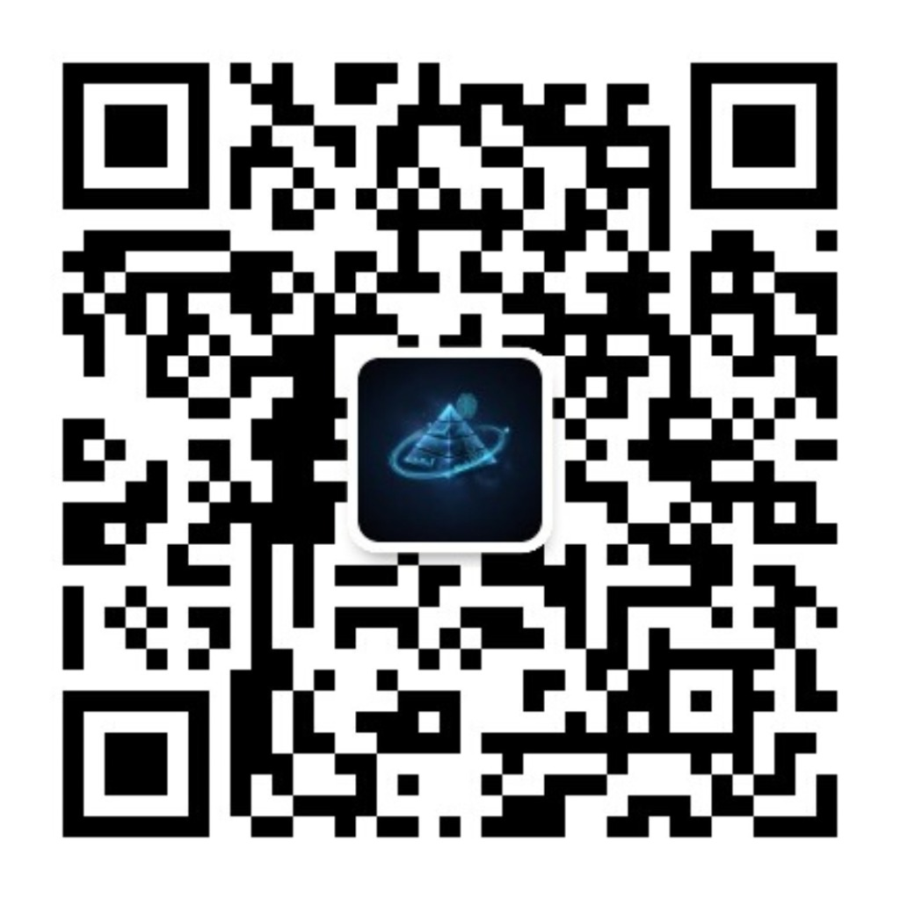

> 去年下半年，亦仁在生财有术发了多个超级标，其中就有垂直小号。当时的我就蠢蠢欲动了，以为能像大佬们那样哐哐赚钱，发了五个多月了，我才知道自媒体真不好做。

## 一、概述

去年418加入了生财有术，同月跟朋友合订了 Lenny's Newsletter。当时是本着 Cursor 等 AI 工具去的，后来我发现它的订阅文章和视频质量非常高，便尝试学习，但是由于自身英语很差，也没学下来。

下半年的时候，垂直小号火了。我便想着让 AI 翻译解读 Lenny's Newsletter 的订阅文章，然后发到微信公众号，方便自己学习，顺便做做自媒体。

但是涨粉真的难，2025年9月25号发了第一篇，一直到今年1月19号才涨到100粉。

但是上个月有两篇文章像是入池了，然后每天都有涨粉，到今天刚好超过200粉。

---

## 二、主要内容

### 素材来源

主要是 Lenny's Newsletter 的相关内容，后续也加入了 a16z、Y Combinator、Every、硅谷101等知名播客，还有一些海外的个人 YouTube 博主，当然大部分都是关于 AI 的，还是以个人兴趣为导向的。

此外，还有宝玉老师推荐的各种文章和视频。

### 整理方式

刚开始还是纯手动，把视频或音频先转文字稿，然后把文字稿发给 Gemini Web 来生成文章，然后根据文章生成封面和配图的提示词，再通过 Nanobanana 生成图片。最后把 markdown 文稿转成微信公众号格式，还要手动选择图片插入位置。一套流程下来，半个多小时过去了，我都不知道自己怎么坚持下来的。

中间尝试过用 N8N 来自动化，但是效果不好，只能自动化一部分。

直到宝玉老师开源了他的 skills（[baoyu-skills](https://github.com/JimLiu/baoyu-skills)），加上 Claude Code 的狂飙模式，才让我现在只要投入10分钟就能完成上述步骤。

具体参考：[Claude Skills 自动化发布公众号](https://mp.weixin.qq.com/s/O2Xv7m8EdYz0OwRhZZ9ThQ)

### 流量主

1月20号开通的流量主，但是因为粉丝比较少，所以平均每天才几毛钱，都不到一块钱。

### 公众号

公众号名称为：**Lenny的增长笔记**

公众号介绍：精选、翻译并深度解读硅谷顶级产品通讯。每天分享关于产品管理、用户增长和职业跃迁的实战干货。

如果你也喜欢 AI、产品及用户增长相关资讯，可以关注下。

---

## 三、总结

今天曹大（caoz）发了一篇文章，标题是《分享即学习 - AI时代》，在分享的过程中，作者本人也能不断更新认知。

这个公众号我注册两年多了，一直写的是自己的碎碎念，没想到最近居然也在涨粉。这种正向反馈激励了我更多的分享欲，先定个小目标，每周至少两次分享，同时同步到博客上（[xiaofeng.show](https://www.xiaofeng.show)）。
